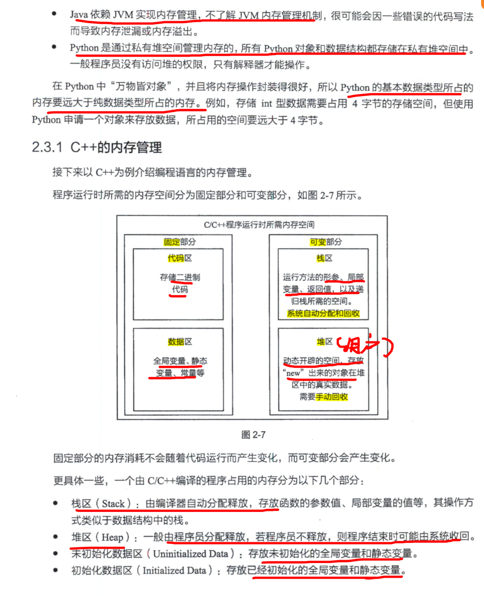

# 编程语言

## 代码规范

### 变量命名

我就采用小驼峰大驼峰命名法即可了

| 命名法 | 举例               | 一般适用语言    |
| ------ | ------------------ | --------------- |
| 小驼峰 | int myAge          | Java、Go、C++   |
| 大驼峰 | public class MyAge | C++函数和结构体 |

### 代码留白


# 程序性能

## 时间复杂度

时间复杂度就是**对一个算法所用的时间的一个函数的表示，用于预估程序的运行时间**。

时间复杂度一般只保留最高位，如同泰勒公式展开一样。如O(n^2^ + n) == O(n^2^)


时间复杂度并不一定就是越低越好，如O(n^2^)在数据规模大的情况下，低于O(n)，但是在数据规模小的情况下，能够反超后者

**O（l）常数阶＜O（log n）对数阶＜O（n）线性阶＜O（n^2^）平万阶＜O（n^3^）立万阶＜O（2^n^）指数阶**  

> **log n == log~10~ n ==  log~2~ n** 
>
> 所以统一就用 log n


- 计算递归算法的时间复杂度：

  **递归算法的时间复杂度 == 递归次数 x 每次递归所需要的时间**

## C++内存管理

C／C＋＋的内存堆空间的申请和释放完全靠自己管理




## 64位的编译器指针占8个字节


也就是说 CPU 可以访问 2^64^ 个内存地址

## 内存对齐

CPU 读取内存是按照块来读取的，而一个块可以包含2、4、8、16字节。现在64位的操作系统对应的一块也就是8个字节，也就是cpu一次性能处理64位的数据


就浪费了资源，所以一定需要内存对齐，好处是：


## 空间复杂度

主要是指算法在运行的过程中需要用到的内存空间的大小，一般是创建各种存储结构时开辟的空间。

**递归算法的空间复杂度 == 递归的层数（深度） x  每次递归的空间复杂度**

# 数组

## 子数组（滑动窗口）

一般的思路就是【滑动窗口】，有时需要配合哈希表来实现。

滑动窗口有两种，分别是最小滑动窗口和最大滑动窗口，具体实现细节如下：

1. 最小滑动窗口

   ```cpp
   while (high < nums.size()) {
       判断[low, high]是否满足条件
   	while 满足条件的话 {
           更新最小数量结果min_num
           low++;
       }
   }
   ```

   

2. 最大滑动窗口

```
while (high < nums.size()) {
    判断[low, high]是否不满足条件
	while 不满足条件的话 {
        low++;
    }
    更新最大数量结果max_num
}
```

> 注意这里更新结果是在while的外面的

- **子排列数组的题目：固定滑动窗口的大小，使其窗口大小和子排列数组一致长**

- 通用模板

  ```cpp
  // 滑动窗口算法伪码框架
  void slidingWindow(string s) {
      // 用合适的数据结构记录窗口中的数据，根据具体场景变通
      // 比如说，我想记录窗口中元素出现的次数，就用 map
      // 如果我想记录窗口中的元素和，就可以只用一个 int
      auto window = ...
  
      int left = 0, right = 0;
      while (right < s.size()) {
          // c 是将移入窗口的字符
          char c = s[right];
          window.add(c);
          // 增大窗口
          right++;
  
          // 进行窗口内数据的一系列更新
          ...
  
          // *** debug 输出的位置 ***
          printf("window: [%d, %d)\n", left, right);
          // 注意在最终的解法代码中不要 print
          // 因为 IO 操作很耗时，可能导致超时
  
          // 判断左侧窗口是否要收缩
          while (window needs shrink) {
              // d 是将移出窗口的字符
              char d = s[left];
              window.remove(d);
              // 缩小窗口
              left++;
  
              // 进行窗口内数据的一系列更新
              ...
          }
      }
  }
  ```

- 滑动窗口的变体

  


# 二叉树

回溯算法的框架：

```
result = []
def backtrack(路径, 选择列表):
    if 满足结束条件:
        result.add(路径)
        return
    
    for 选择 in 选择列表:
        做选择
        backtrack(路径, 选择列表)
        撤销选择
```


