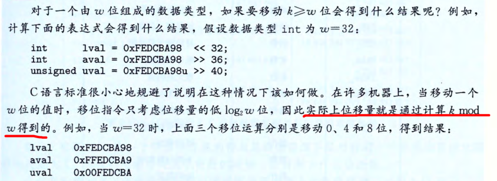

# 重点内容

对于《深入理解计算机系统》（CSAPP）这本书，它被广泛认为是计算机科学领域的经典之作。因此，**如果时间和精力允许，通读全书无疑是最佳选择**。这本书的每一章都为你理解计算机系统搭建了坚实的基础，并且章节之间层层递进，相互关联。

然而，如果你希望在有限的时间内抓住核心，或者想在通读的过程中有所侧重，那么以下是一些通常被认为是**必读或非常重要**的内容。我会尽量精确到三级标题，但请注意，不同版本和翻译的CSAPP在标题细节上可能略有差异。这里的推荐是基于CSAPP第三版（英文版）的常见结构，中文版通常会做对应翻译。

**推荐的学习模式：**

建议你**先快速通读一遍**，对全书内容有一个整体的印象。然后，**针对以下列出的重点章节和主题进行精读和深入理解**，包括完成相关的练习题（Labs）。其他章节可以作为辅助阅读或在需要时查阅。这种模式既能保证你掌握核心知识，又能对整个计算机系统有全面的认识。

**必读/重点内容（精确到三级标题）：**

以下内容是CSAPP中的核心，对于理解计算机系统的工作原理至关重要：

**第一部分：程序结构和执行 (Program Structure and Execution)**

- **第1章：计算机系统漫游 (A Tour of Computer Systems)**
  - 1.1 信息就是位 + 上下文 (Information is Bits + Context)
  - 1.2 程序被其他程序翻译成不同格式 (Programs Are Translated by Other Programs into Different Forms)
  - 1.3 了解编译系统如何工作是大有益处的 (It Pays to Understand How Compilation Systems Work)
  - 1.4 处理器读并解释存储在存储器中的指令 (Processors Read and Interpret Instructions Stored in Memory)
    - 1.4.1 系统的硬件组成 (Hardware Organization of a System)
    - 1.4.2 运行 Hello 程序 (Running the hello Program)
  - 1.5 高速缓存至关重要 (Caches Matter)
  - 1.6 存储设备形成层次结构 (Storage Devices Form a Hierarchy)
  - 1.7 操作系统管理硬件 (The Operating System Manages the Hardware)
    - 1.7.1 进程 (Processes)
    - 1.7.2 线程 (Threads)
    - 1.7.3 虚拟内存 (Virtual Memory)
    - 1.7.4 文件 (Files)
  - 1.9 并发和并行 (Concurrency and Parallelism)
    - 1.9.1 线程级并发 (Thread-Level Concurrency)
    - 1.9.2 指令级并行 (Instruction-Level Parallelism)
    - 1.9.3 单指令、多数据并行 (Single-Instruction, Multiple-Data (SIMD) Parallelism)
  - 1.10 计算机系统中抽象的重要性 (The Importance of Abstractions in Computer Systems)
- **第2章：信息的表示和处理 (Representing and Manipulating Information)**
  - 2.1 信息存储 (Information Storage)
    - 2.1.1 十六进制表示法 (Hexadecimal Notation)
    - 2.1.2 字 (Words)
    - 2.1.3 数据大小 (Data Sizes)
    - 2.1.4 寻址和字节顺序 (Addressing and Byte Ordering) (重点理解大端和小端)
    - 2.1.7 C语言中的位级运算 (Bit-Level Operations in C)
    - 2.1.8 C语言中的逻辑运算 (Logical Operations in C)
    - 2.1.9 C语言中的移位运算 (Shift Operations in C)
  - 2.2 整数表示 (Integer Representations)
    - 2.2.1 整型数据类型 (Integral Data Types)
    - 2.2.2 无符号编码 (Unsigned Encodings)
    - 2.2.3 补码编码 (Two’s-Complement Encodings)
    - 2.2.4 有符号数和无符号数之间的转换 (Conversions Between Signed and Unsigned)
    - 2.2.5 C语言中的有符号数与无符号数 (Signed vs. Unsigned in C)
    - 2.2.6 扩展一个数字的位表示 (Expanding the Bit Representation of a Number)
    - 2.2.7 截断数字 (Truncating Numbers)
    - 2.2.8 关于有符号数和无符号数的建议 (Advice on Signed vs. Unsigned)
  - 2.3 整数运算 (Integer Arithmetic)
    - 2.3.1 无符号加法 (Unsigned Addition)
    - 2.3.2 补码加法 (Two’s-Complement Addition)
    - 2.3.3 补码的非 (Two’s-Complement Negation)
    - 2.3.4 无符号乘法 (Unsigned Multiplication)
    - 2.3.5 补码乘法 (Two’s-Complement Multiplication)
    - 2.3.6 乘以常数 (Multiplying by Constants)
    - 2.3.7 除以2的幂 (Dividing by Powers of 2)
    - 2.3.8 关于整数运算的最后思考 (Final Thoughts on Integer Arithmetic)
  - 2.4 浮点数 (Floating Point)
    - 2.4.1 二进制小数 (Fractional Binary Numbers)
    - 2.4.2 IEEE浮点表示 (IEEE Floating-Point Representation)
    - 2.4.3 数字示例 (Example Numbers)
    - 2.4.4舍入 (Rounding)
    - 2.4.5 浮点运算 (Floating-Point Operations)
    - 2.4.6 C语言中的浮点数 (Floating Point in C)
- **第3章：程序的机器级表示 (Machine-Level Representation of Programs)** (这一章极为重要)
  - 3.1 历史观点 (A Historical Perspective)
  - 3.2 程序编码 (Program Encodings)
    - 3.2.1 机器级代码 (Machine-Level Code)
    - 3.2.2 代码示例 (Code Examples)
    - 3.2.3 关于格式的注解 (Notes on Formatting)
  - 3.3 数据格式 (Data Formats)
  - 3.4 访问信息 (Accessing Information)
    - 3.4.1 操作数指示符 (Operand Specifiers)
    - 3.4.2 数据传送指令 (Data Movement Instructions) (MOV类指令)
    - 3.4.3 数据传送示例 (Data Movement Examples)
    - 3.4.4 压入和弹出栈数据 (Pushing and Popping Stack Data)
  - 3.5 算术和逻辑操作 (Arithmetic and Logical Operations)
    - 3.5.1 加载有效地址 (Load Effective Address) (leaq指令)
    - 3.5.2 一元和二元操作 (Unary and Binary Operations)
    - 3.5.3 移位操作 (Shift Operations)
    - 3.5.4 特殊的算术操作 (Special Arithmetic Operations)
  - 3.6 控制 (Control) (理解汇编如何实现if/else, switch, loop)
    - 3.6.1 条件码 (Condition Codes)
    - 3.6.2 访问条件码 (Accessing the Condition Codes)
    - 3.6.3 跳转指令及其编码 (Jump Instructions and their Encodings)
    - 3.6.4 跳转指令的实现 (Implementing Conditional Branches with Jumps)
    - 3.6.5 循环 (Loops) (do-while, while, for)
    - 3.6.6 条件传送指令 (Conditional Move Instructions)
    - 3.6.7 Switch语句 (Switch Statements)
  - 3.7 过程 (Procedures) (函数调用栈帧结构是核心)
    - 3.7.1 栈帧结构 (Stack Frame Structure)
    - 3.7.2 转移控制 (Transferring Control) (call, ret)
    - 3.7.3 寄存器使用惯例 (Register Usage Conventions)
    - 3.7.4 过程示例 (Procedure Example)
    - 3.7.5 递归过程 (Recursive Procedures)
  - 3.8 数组分配和访问 (Array Allocation and Access)
    - 3.8.1 基本原则 (Basic Principles)
    - 3.8.2 指针运算 (Pointer Arithmetic)
    - 3.8.3 嵌套的数组 (Nested Arrays)
    - 3.8.4 定长数组 (Fixed-Size Arrays)
    - 3.8.5 变长数组 (Variable-Size Arrays)
  - 3.9 异构数据结构 (Heterogeneous Data Structures) (结构体和联合体)
    - 3.9.1 结构 (Structures)
    - 3.9.2 联合 (Unions)
    - 3.9.3 数据对齐 (Data Alignment)
  - 3.10 将控制流与数据流结合起来以避免过程调用开销 (Combining Control with Data Flow to Avoid Procedure Call Overhead) (如循环展开)
  - 3.11 浮点代码 (Floating-Point Code) (了解即可，优先级稍低)
  - 3.12 x86-64中的IA32兼容性 (IA32 Compatibility in x86-64) (了解即可)

**第二部分：在系统中运行代码 (Running Code on a System)**

- **第5章：优化程序性能 (Optimizing Program Performance)**
  - 5.1 优化编译器的能力和局限性 (Capabilities and Limitations of Optimizing Compilers)
  - 5.2 程序性能的表示 (Expressing Program Performance)
  - 5.3 程序示例 (Program Example)
  - 5.4 消除循环的低效率 (Eliminating Loop Inefficiencies) (代码移动)
  - 5.5 减少过程调用 (Reducing Procedure Calls)
  - 5.6 消除不必要的存储器引用 (Eliminating Unneeded Memory References) (使用临时变量)
  - 5.7 理解现代处理器 (Understanding Modern Processors) (重点理解流水线和超标量)
    - 5.7.1 整体操作 (Overall Operation)
    - 5.7.2 功能单元的性能 (Functional Unit Performance)
    - 5.7.3 处理器操作的抽象模型 (An Abstract Model of Processor Operation)
  - 5.8 循环展开 (Loop Unrolling)
  - 5.9 增强并行性 (Enhancing Parallelism)
    - 5.9.1 多重累积 (Multiple Accumulators)
    - 5.9.2 重新结合变换 (Reassociation Transformation)
  - 5.11 理解存储器性能 (Understanding Memory Performance)
    - 5.11.1 加载的延迟 (Load Latency)
    - 5.11.2 存储操作的延迟 (Store Latency)
  - 5.13 应用：性能改进技术 (Applying: Performance Improvement Techniques)
  - 5.14 确认和消除性能瓶颈 (Identifying and Eliminating Performance Bottlenecks) (Amdahl定律)
    - 5.14.1 程序剖析 (Program Profiling)
    - 5.14.2 使用剖析程序来指导优化 (Using a Profiler to Guide Optimization)
    - 5.14.3 Amdahl定律 (Amdahl’s Law)
- **第6章：存储器层次结构 (The Memory Hierarchy)** (这一章极为重要)
  - 6.1 存储技术 (Storage Technologies)
    - 6.1.1 随机访问存储器 (Random-Access Memory) (SRAM, DRAM)
    - 6.1.2 磁盘存储 (Disk Storage)
    - 6.1.3 固态硬盘 (Solid-State Disks)
    - 6.1.4 存储技术趋势 (Storage Technology Trends)
  - 6.2 局部性 (Locality) (时间局部性和空间局部性是核心概念)
    - 6.2.1 对程序数据引用的局部性 (Locality of References to Program Data)
    - 6.2.2 取指令的局部性 (Locality of Instruction Fetches)
    - 6.2.3 局部性小结 (Summary of Locality)
  - 6.3 存储器层次结构 (The Memory Hierarchy)
    - 6.3.1 存储器层次结构的中心思想 (Central Idea of a Memory Hierarchy)
    - 6.3.2 存储器层次结构概念小结 (Summary of Memory Hierarchy Concepts)
  - 6.4 高速缓存存储器 (Cache Memories) (核心中的核心)
    - 6.4.1 通用高速缓存组织结构 (Generic Cache Memory Organization)
    - 6.4.2 直接映射高速缓存 (Direct-Mapped Caches)
    - 6.4.3 组相联高速缓存 (Set Associative Caches)
    - 6.4.4 全相联高速缓存 (Fully Associative Caches)
    - 6.4.5 有关写的问题 (Issues with Writes) (写直通，写回)
    - 6.4.6 真实的高速缓存层次结构剖析 (Anatomy of a Real Cache Hierarchy)
    - 6.4.7 高速缓存参数的性能影响 (Performance Impact of Cache Parameters)
  - 6.5 编写高速缓存友好的代码 (Writing Cache-friendly Code)
  - 6.6 综合：高速缓存对程序性能的影响 (Putting It Together: The Impact of Caches on Program Performance)
    - 6.6.1 存储器山 (The Memory Mountain)
    - 6.6.2 重新排列循环以提高空间局部性 (Rearranging Loops to Increase Spatial Locality)
    - 6.6.3 在程序中利用局部性 (Exploiting Locality in Your Programs)

**第三部分：程序间的交互和通信 (Interaction and Communication Between Programs)**

- **第7章：链接 (Linking)** (理解链接过程对理解大型项目和解决链接错误至关重要)
  - 7.1 编译器驱动程序 (Compiler Drivers)
  - 7.2 静态链接 (Static Linking)
  - 7.3 目标文件 (Object Files)
  - 7.4 可重定位目标文件 (Relocatable Object Files)
  - 7.5 符号和符号表 (Symbols and Symbol Tables)
  - 7.6 符号解析 (Symbol Resolution) (理解符号如何被解析是重点)
    - 7.6.1 链接器如何解析多重定义的全局符号 (How Linkers Resolve Multiply Defined Global Symbols)
    - 7.6.2 与静态库链接 (Linking with Static Libraries)
    - 7.6.3 链接器如何使用静态库来解析引用 (How Linkers Use Static Libraries to Resolve References)
  - 7.7 重定位 (Relocation)
    - 7.7.1 重定位条目 (Relocation Entries)
    - 7.7.2 重定位符号引用 (Relocating Symbol References)
  - 7.8 可执行目标文件 (Executable Object Files)
  - 7.9 加载可执行目标文件 (Loading Executable Object Files)
  - 7.10 动态链接共享库 (Dynamic Linking with Shared Libraries)
  - 7.11 从应用程序中加载和链接共享库 (Loading and Linking Shared Libraries from Applications)
  - 7.12 位置无关代码 (Position-Independent Code (PIC))
  - 7.13 处理目标文件的工具 (Tools for Manipulating Object Files)
- **第8章：异常控制流 (Exceptional Control Flow)** (理解ECF是理解操作系统和高级程序行为的基础)
  - 8.1 异常 (Exceptions)
    - 8.1.1 异常处理 (Exception Handling)
    - 8.1.2 异常的类别 (Classes of Exceptions) (中断、陷阱、故障、终止)
    - 8.1.3 Linux/x86-64系统中的异常 (Exceptions in Linux/x86-64 Systems)
  - 8.2 进程 (Processes)
    - 8.2.1 逻辑控制流 (Logical Control Flow)
    - 8.2.2 并发流 (Concurrent Flows)
    - 8.2.3 用户模式和内核模式 (User Mode and Kernel Mode)
    - 8.2.4 上下文切换 (Context Switches)
  - 8.3 系统调用错误处理 (System Call Error Handling)
  - 8.4 进程控制 (Process Control)
    - 8.4.1 获取进程ID (Obtaining Process IDs)
    - 8.4.2 创建和终止进程 (Creating and Terminating Processes) (fork, exit, wait, waitpid)
    - 8.4.3 回收子进程 (Reaping Child Processes)
    - 8.4.4 让进程休眠 (Putting Processes to Sleep) (sleep, pause)
    - 8.4.5 加载并运行程序 (Loading and Running Programs) (execve)
    - 8.4.6 利用fork和execve运行程序 (Using fork and execve to Run Programs)
  - 8.5 信号 (Signals)
    - 8.5.1 信号术语 (Signal Terminology)
    - 8.5.2 发送信号 (Sending Signals) (kill, alarm)
    - 8.5.3 接收信号 (Receiving Signals) (signal函数)
    - 8.5.4 信号处理问题 (Signal Handling Issues) (避免竞争条件)
    - 8.5.5 可移植的信号处理 (Portable Signal Handling)
  - 8.6 非本地跳转 (Nonlocal Jumps) (setjmp, longjmp，了解即可)
  - 8.7 操作进程的工具 (Tools for Manipulating Processes)
- **第9章：虚拟内存 (Virtual Memory)** (这一章极为重要)
  - 9.1 物理和虚拟寻址 (Physical and Virtual Addressing)
  - 9.2 地址空间 (Address Spaces)
  - 9.3 虚拟内存作为缓存的工具 (VM as a Tool for Caching) (理解VM如何使用DRAM作为SRAM的缓存)
    - 9.3.1 为什么使用虚拟内存？ (Why Virtual Memory?)
    - 9.3.2 DRAM缓存的组织结构 (Organization of a DRAM Cache)
    - 9.3.3 页表 (Page Tables)
    - 9.3.4 页命中 (Page Hits)
    - 9.3.5 缺页 (Page Faults)
    - 9.3.6 分配页面 (Allocating Pages)
    - 9.3.7 又是局部性 (Locality to the Rescue Again)
  - 9.4 虚拟内存作为内存管理的工具 (VM as a Tool for Memory Management) (每个进程独立的地址空间)
    - 9.4.1 简化链接 (Simplifying Linking)
    - 9.4.2 简化共享 (Simplifying Sharing)
    - 9.4.3 简化内存分配 (Simplifying Memory Allocation)
    - 9.4.4 简化加载 (Simplifying Loading)
  - 9.5 虚拟内存作为内存保护的工具 (VM as a Tool for Memory Protection)
  - 9.6 地址翻译 (Address Translation) (核心机制，理解MMU和页表如何工作)
    - 9.6.1 地址翻译概览 (Overview of Address Translation)
    - 9.6.2 集成高速缓存和虚拟内存 (Integrating Caches and VM)
    - 9.6.3 利用TLB加速地址翻译 (Speeding up Address Translation with a TLB)
    - 9.6.4 多级页表 (Multi-Level Page Tables)
    - 9.6.5 端到端的地址翻译：一个案例研究 (End-to-end Address Translation: A Case Study)
  - 9.7 案例研究：Intel Core i7内存系统 (Case Study: The Intel Core i7 Memory System)
    - 9.7.1 Core i7地址翻译 (Core i7 Address Translation)
    - 9.7.2 Core i7页表条目 (Core i7 Page Table Entries)
    - 9.7.3 Core i7 TLB 操作 (Core i7 TLB Operation)
    - 9.7.4 Core i7 缓存操作 (Core i7 Cache Operation)
  - 9.8 Linux虚拟内存系统 (Linux Virtual Memory System)
    - 9.8.1 Linux虚拟内存区域 (Linux Virtual Memory Areas)
    - 9.8.2 Linux缺页异常处理 (Linux Page Fault Handling)
  - 9.9 内存映射 (Memory Mapping) (mmap函数是重点)
    - 9.9.1 再谈共享对象 (Shared Objects Revisited)
    - 9.9.2 fork函数如何工作 (How the fork Function Works)
    - 9.9.3 execve函数如何工作 (How the execve Function Works)
    - 9.9.4 使用mmap函数的用户级内存映射 (User-Level Memory Mapping with the mmap Function)
  - 9.10 动态内存分配 (Dynamic Memory Allocation) (理解malloc和free的内部机制)
    - 9.10.1 malloc和free函数 (The malloc and free Functions)
    - 9.10.2 为什么要使用动态内存分配 (Why Dynamic Memory Allocation?)
    - 9.10.3 分配器的需求和目标 (Allocator Requirements and Goals)
    - 9.10.4 碎片 (Fragmentation) (内部碎片和外部碎片)
    - 9.10.5 实现问题 (Implementation Issues)
    - 9.10.6 隐式空闲链表 (Implicit Free Lists)
    - 9.10.7 放置已分配的块 (Placing Allocated Blocks)
    - 9.10.8 分割空闲块 (Splitting Free Blocks)
    - 9.10.9 获取额外的堆内存 (Getting Additional Heap Memory)
    - 9.10.10 合并空闲块 (Coalescing Free Blocks)
    - 9.10.11 带边界标记的合并 (Coalescing with Boundary Tags)
    - 9.10.13 显式空闲链表 (Explicit Free Lists)
    - 9.10.14 分离的空闲链表 (Segregated Free Lists)
  - 9.11 C程序中常见的与内存有关的错误 (Common Memory-Related Bugs in C Programs)
    - 9.11.1 解引用坏指针 (Dereferencing Bad Pointers)
    - 9.11.2 读未初始化的内存 (Reading Uninitialized Memory)
    - 9.11.3 允许栈缓冲区溢出 (Allowing Stack Buffer Overflows)
    - 9.11.4 假设指针和它们指向的对象是相同大小的 (Assuming that Pointers and the Objects They Point to Are the Same Size)
    - 9.11.5 造成错位错误 (Making Off-by-One Errors)
    - 9.11.6 引用指针，而不是它所指向的对象 (Referencing a Pointer Instead of the Object It Points To)
    - 9.11.7 误解指针运算 (Misunderstanding Pointer Arithmetic)
    - 9.11.8 引用不存在的变量 (Referencing Nonexistent Variables)
    - 9.11.9 引用空闲堆块中的数据 (Referencing Data in Free Heap Blocks)
    - 9.11.10 引起内存泄漏 (Introducing Memory Leaks)

**第四部分：并发编程 (Concurrent Programming)**

- 第12章：并发编程 (Concurrent Programming)

   (对现代多核编程非常重要)

  - 12.1 基于进程的并发编程 (Process-Based Concurrent Programming)
  - 12.2 基于I/O多路复用的并发编程 (Event-Based Concurrent Programming) (select, epoll)
    - 12.2.1 基本思想 (Basic Idea)
    - 12.2.2 I/O多路复用 (I/O Multiplexing)
    - 12.2.3 基于I/O多路复用的并发事件驱动服务器 (A Concurrent Event-Driven Server Based on I/O Multiplexing)
    - 12.2.5 优缺点 (Pros and Cons)
  - 12.3 基于线程的并发编程 (Thread-Based Concurrent Programming)
    - 12.3.1 线程执行模型 (Thread Execution Model)
    - 12.3.2 Posix线程 (Posix Threads)
    - 12.3.3 创建线程 (Creating Threads)
    - 12.3.4 终止线程 (Terminating Threads)
    - 12.3.5 回收已终止线程的资源 (Reaping Terminated Threads)
    - 12.3.6 分离线程 (Detaching Threads)
    - 12.3.7 初始化线程 (Initializing Threads)
    - 12.3.8 基于线程的并发服务器 (A Thread-Based Concurrent Server)
  - 12.4 多线程程序中的共享变量 (Shared Variables in Multithreaded Programs)
    - 12.4.1 线程内存模型 (Threads Memory Model)
    - 12.4.2 将变量映射到内存 (Mapping Variables to Memory)
    - 12.4.3 共享变量 (Shared Variables)
  - 12.5 用信号量同步线程 (Synchronizing Threads with Semaphores) (理解信号量PV操作)
    - 12.5.1 进度图 (Progress Graphs)
    - 12.5.2 信号量 (Semaphores)
    - 12.5.3 使用信号量来实现互斥 (Using Semaphores for Mutual Exclusion)
    - 12.5.4 利用信号量来调度共享资源 (Using Semaphores to Schedule Shared Resources) (生产者-消费者问题，读者-写者问题)
    - 12.5.5 基于预线程化的并发服务器 (A Prethreaded Concurrent Server)
  - 12.6 使用线程提高并行性 (Using Threads for Parallelism)
  - 12.7 其他并发问题 (Other Concurrency Issues) (线程安全，可重入性，死锁)
    - 12.7.1 线程安全 (Thread Safety)
    - 12.7.2 可重入性 (Reentrancy)
    - 12.7.3 在线程化的程序中使用已存在的库函数 (Using Existing Library Functions in Threaded Programs)
    - 12.7.4 竞争 (Races)
    - 12.7.5 死锁 (Deadlocks)

**其他章节的重要性：**

- **第4章：处理器体系结构 (Processor Architecture)**：如果你对计算机组成原理有浓厚兴趣，或者想深入理解CPU如何执行指令，这一章值得细读。但对于大多数应用层开发者，了解第3章的机器级表示可能已经足够。

- 第10章：系统级I/O (System-Level I/O)

  ：对于网络编程和系统编程非常重要，特别是文件I/O和Unix I/O的部分。

  - 10.1 Unix I/O (Unix I/O)
  - 10.2 打开和关闭文件 (Opening and Closing Files) (open, close)
  - 10.3 读和写文件 (Reading and Writing Files) (read, write)
  - 10.4 用RIO包健壮地读写 (Robust Reading and Writing with the RIO Package)
  - 10.5 读取文件元数据 (Reading File Metadata)
  - 10.6 共享文件 (Sharing Files)
  - 10.7 I/O重定向 (I/O Redirection)
  - 10.8 标准I/O (Standard I/O)
  - 10.9 综合：我应该使用哪些I/O函数？ (Putting It Together: Which I/O Functions Should I Use?)

- 第11章：网络编程 (Network Programming)

  ：如果你要进行网络相关的开发，这一章是必读的。

  - 11.1 客户端-服务器编程模型 (The Client-Server Programming Model)
  - 11.2 网络 (Networks)
  - 11.3 全球IP因特网 (The Global IP Internet)
    - 11.3.1 IP地址 (IP Addresses)
    - 11.3.2 因特网域名 (Internet Domain Names)
    - 11.3.3 因特网连接 (Internet Connections)
  - 11.4 Sockets接口 (The Sockets Interface) (socket, connect, bind, listen, accept是核心)
    - 11.4.1 socket地址结构 (Socket Address Structures)
    - 11.4.2 socket函数 (The socket Function)
    - 11.4.3 connect函数 (The connect Function)
    - 11.4.4 bind函数 (The bind Function)
    - 11.4.5 listen函数 (The listen Function)
    - 11.4.6 accept函数 (The accept Function)
    - 11.4.7 主机和服务的转换 (Host and Service Conversion)
    - 11.4.8 套接字接口的辅助函数 (Helper Functions for the Sockets Interface)
    - 11.4.9 示例：Echo客户端和服务器 (Example Echo Client and Server)
  - 11.5 Web服务器 (Web Servers)
    - 11.5.1 Web基础 (Web Basics)
    - 11.5.2 Web内容 (Web Content)
    - 11.5.3 HTTP事务 (HTTP Transactions)
    - 11.5.4 服务动态内容 (Serving Dynamic Content)

**总结一下：**

1. 绝对核心，必须精读并做实验：
   - 第2章 (信息表示)
   - 第3章 (机器级表示)
   - 第5章 (程序性能优化基础)
   - 第6章 (存储器层次结构)
   - 第8章 (异常控制流)
   - 第9章 (虚拟内存)
2. 非常重要，强烈建议精读：
   - 第1章 (系统漫游，建立整体概念)
   - 第7章 (链接)
   - 第12章 (并发编程)
3. 根据你的方向和兴趣选择性精读或作为后续学习：
   - 第4章 (处理器体系结构)
   - 第10章 (系统级I/O)
   - 第11章 (网络编程)

请记住，即使是“不太重要”的章节，也包含了有价值的信息。CSAPP的魅力在于它的全面性和深度。祝你学习愉快！

# 计算机系统漫游

## 程序的编译过程

就全面的讲，从编译再到运行的整个编译系统可以概括为：


1. 预处理器用来**处理#开头的注释或者头文件**
2. 编译器用来翻译成文本文件，是一个**汇编语言**程序（用符号和助记符）来表示原本的文本文件，主要是做一些基本的语法分析，如**定义的类型有无错误**
3. 汇编器：将汇编语言文件翻译成**机器语言**指令，生成**二进制的.o文件。包括一些地址分配**
4. 链接器：将hello程序中调用的一些库函数，如printf，找到其printf.o的位置，使某种方式合并*链接）到我们源程序中

## shell

就是linux系统终端中的命令行：它一直在等待我们的输入，我们的命令。输入一个单词，先判断是不是shell内置命令，不是的话，就认为是一个可执行文件名

## 系统硬件组成


1. 总线Bus
   贯穿整个系统的是一组电子管道，称作总线，它携带信息字节并负责在各个部件间传递。通常总线被设计成传送定长的字节块，也就是字 (word) 。  就目前的计算机基本都是8个字节64位为一个字作为基本单位的
   - **数据总线（Data Bus）**：用于传输数据。
   - **地址总线（Address Bus）**：用于传输内存地址或设备地址。
   - **控制总线（Control Bus）**：用于传输控制信号，如读写信号、中断信号等。
   - **系统总线（System Bus）**：连接CPU、内存和I/O设备的总线，是**计算机内部的主要通信通道。**

2. 1/0 设备
   I/0( 输入／输出）设备是系统与外部世界的联系通道。  每个 I/0 设备都通过一个控制器或适配器与 I/0 总线（总线的一种）相连。控制器和适配器之间的区别主要在于它们的封装方式。**控制器是 1/0 设备本身或者系统的主印制电路板（通常称作主板）上的芯片组**。而**适配器则是一块插在主板插槽上的卡**。无论如何，它们的功能都是在 1/0 总线和 1/0 设备之间传递信息。  

   - **PCI总线（Peripheral Component Interconnect）**：用于连接高速外设，如显卡、声卡等。
   - **USB总线（Universal Serial Bus）**：用于连接各种低速和中速外设，如键盘、鼠标、U盘等。
   - **SATA总线（Serial ATA）**：用于连接硬盘等存储设备。
   - **SPI总线（Serial Peripheral Interface）**：用于连接低速的串行外设，如传感器、存储芯片等。

3. 主存 

   就像计算机的一个临时的草稿纸，这张草稿纸是由动态随机存取存储器（DRAM）芯片组成的，也就是说DRAM是主存的子集。这张草稿纸上的每一个位置当然对应着其唯一的数组。主存的特性是断电后数据丢失，正如是一个ipad上的草稿纸一样，没电且没保存到硬盘中，草稿纸就没了

4. CPU

   之所以说是64位的CPU是因为**处理器的核心是大小一个字（64位）的存储设备（寄存器），也叫做程序计数器（PC)**。程序计数器充当类似指针的作用，指向主存中的某个指令的地址。CPU不断的根据程序计数器指向的指令来执行相应的指令，并使PC指向下一个指令（不一定相邻按顺序）

   一些常见的指令操作会涉及到主存、寄存器文件、**算术/逻辑单元（ALU）**。寄存器文件就是寄存器的集合，其中寄存器名字是唯一的。例如算术运算：两个寄存器充当算数，ALU充当算术运算符，得到的结果作为一个新的寄存器覆盖原来寄存器的内容。

## 程序在硬件中的工作流程

第一步：通过键盘这个输入设备输入文件名经过IO总线（未回车），文件名会通过系统总线读入寄存器中，之后通过内存总线存到内存中


第二步：回车后，通过IO总线，将磁盘中的数据复制到主存（通过直接存储器存取DMA，不经过处理器，处理器只是发送根据指令执行命令的）


第三步：主存有内容后通过内存中下和系统总线，为寄存器文件提供相应的数据，同时把对应的信息输出到显示器上


## 高速缓存cashe

由于cpu和主存之间的运行速度有着巨大的差异，也就诞生了cache技术来解决这类问题。

cache分为L1、L2、L3，其中1-2是有一种静态随机访问存储器（SRAM）的硬件组成的。

## 存储设备的层次结构


相邻的存储器，高的一层称为低的一层的高速缓存

## 操作系统管理硬件


### 进程

**进程是程序在操作系统中运行时的基本单位**，包含了程序代码、执行信息等

操作系统使用**了“上下文”的机制来实现并发运行**（CPU同时处理多个任务，但每次只能处理一个；区别于并行：同时运行多个任务，一起推进任务）

- 并发：一个人同时吃三个馒头。
- 并行：三个人同时吃三个馒头。

**上下文**，包括PC和寄存器文件的值，主存内容，为操作系统提供了保持跟踪进程运行所需的**“所有运行信息”**

而实际的进行进程之间的切换是由**系统内核（Kernel）来完成**和管理的。每一次的进程切换后，会根据其他进程中保存起来的上下文信息，回复到中断的地方继续执行

#### 进程切换的步骤

以下是进程切换的典型步骤，由内核完成：

1. **选择下一个进程**：内核的调度器Kernel根据调度算法选择下一个要运行的进程。
2. **保存当前进程的上下文**：内核保存当前进程的寄存器状态、栈状态、内存映射信息等。
3. **恢复下一个进程的上下文**：内核恢复下一个进程的寄存器状态、栈状态等，使其能够从中断的地方继续执行。
4. **切换进程**：内核将控制权交给下一个进程，使其开始运行。

### 线程

**线程是进程中的一个执行单元**，线程运行在某一个进程中的上下文中，共同享有代码和数据

线程比进程的资源消耗更小，开辟和实现多线程也就比多进程更容易

### 虚拟内存

==以进程虚拟内存的形式寄生在磁盘上，并以此利用主存作为磁盘的高速缓存来减少之间的消耗

虚拟内存的核心就在于虚拟，“假象”，欺骗进程，让进程以为当前是内存，真面目却是在硬盘上的。由于“假象”的作用，导致每个进程看到的内存都是一致的，确保了“一致性”。


毕竟肯定先要有相应的程序，的地址，那才有调用堆、栈这些的地址，一直传递到内核虚拟内存，也就是与kernel相关的

1. **代码（二进制）和数据（全局变量、静态变量、常量）在程序运行时占用的内存空间是固定部分**
2. **而可变部分包括：用户栈（用户运行时产生的形参、局部变量、返回值、递归空间，由系统自动回收）和运行堆区（包括动态开辟的空间，如malloc或new，需要手动回收）**
3. **固定区所占用的空间非常小，运行时消耗的内存主要取决于可变部分。**
4. 由于堆区系统不会自动回收，所以很容易出现内存泄漏的问题，但是java、python中不需要考虑


### 文件

文件是以字节为单位的，因此也是一个字节序列。IO设备**包括网络**都算做文件体系

### 为什么说网络也是IO设备


### 并发和并行

1. 线程级并发

   一个进程中多个线程同时执行，也就是多个控制流

   操作系统的并发本质是操作系统中多个进程（资源分配的基本单位）间的快速切换。就好像人类多任务处理一样，吃饭和看手机，看似是两个同时执行，其实也是并发的概念：在吃饭和手机中快速来回切换。

   我现在的电脑是将多个CPU（也叫“核”）集成到一个集成电路芯片上的一个多核处理器

   其中的每个核都有自己独立的L1（包括数据和指令）高速缓存和L2高速缓存，但是只有一个所有核共享的L3高速缓存

   

   普通的一核心就是一线程，但是**超线程**就可以两线程

2. 指令集并行

   当代的先进的cpu使用流水线来同时执行多条指令，使处理器能够在一个周期的时间内，执行比一个周期还多的指令数，并且这称之为超标量处理器

3. 单指令、多数据并行

   如同字面意思，一条指令可以并行多条数据那么称之为SIMD

   

   > **控制部分==指令，处理器=\=数据，主存=\=任一指令或数据的个数（一个/多个）**

# 信息的表示和处理

显然，信息的表示是用0、1的数字表示的，称之为位

没想到**有符号整数**的最常见的表示方式竟然是**补码编码**

可以了解到整数的数值表示的范围是很小的，但是却是一个很精确的数值；相对于浮点数而言，浮点数的数值范围很大，但相应的失去了精度，也就代表了浮点数的值的近似的

## 信息存储

在内存或的任意的存储设备之中，作为**最小的可寻址的内存单位**，那首先想到的就是**字节**了，也就是8位

那么，以字节为最小的可寻址内存单位的**内存**中的，每一个字节，都可以**用一个唯一的数字来表示，这个数字就是该字节的地址，地址的集合也就构成了虚拟内存空间。**

> **注意区别虚拟地址**

那么同理，在C语言当中，每个指针的值，都指向着对应的存储块的第一个字节的虚拟地址，例如指向字符数组的指针一样，是只指向 a[0] 的地址的

**程序**是很多字节组成的**字节序列**，而**程序对象**就只是这些序列中的一个**字节块**

### 字（字长）数据大小

用来**指明指针数据的指标的大小**为一个**字长（位）**，存在与每一台计算机当中。

而**虚拟地址是以每一位来编码的，所以字节决定了字长（位），也就决定了虚拟地址空间的大小**

> **虚拟地址空间并不直接等同于内存，内存更像是物理地址空间，而虚拟地址空间决定了内存理论上的上限，而内存是真实的实现**。
>
> 而虚拟地址空间和物理地址空间直接的转换一般是，虚拟地址空间通过页表映射成为物理地址。而具体的映射技术（虚拟内存管理）技术包括分页、分段的方式，毕竟，肯定不能一一映射啦，那效率太低了~

对于**一个字节为 w 位的机器，对应的虚拟地址范围总共有 2^w 个字节： 0 ~ 2^w - 1**

> 之所以这里指数函数的底是2，是因为**信息以位为单位的表示只有 0 和 1 两种**

那么，32 位字长的虚拟地址空间为4GB，而 64 位字长的虚拟地址空间有 16EB，因此，内存是完全够用的，大概也就不会出现 128 位的系统了~

### 寻址和字节顺序（大端法与小端法）

一个程序对象，不可能说只占用一个字节，那么在占用多个字节的程序对象中，它的存储肯定是一个**连续的字节序列**，并且该**程序对象的地址为该连续的字节序列中的最小地址，也就是第一个地址**（因为这些地址是按顺序排列的）。例如一个 4 字节的 int 的变量 x 的地址为 Ox100， 那么其对应的字节序列就是相应的四个地址，即Ox100、Ox101、Ox102、Ox103

字节排列顺序分为**小端法和大端法：**


> 一个字节（8 位二进制）对应的是 2 个十六进制数

然鹅遗憾的是，**目前inter处理器是用的小段法的**，有点没想到。而且在ARM架构中，只能运行小端模式

也就是说，**一般而言，书写字节序列的方式是：低位的字节 代表的数据放在左边，而高位的字节 代表的数据放在右边**

> 然而，这个字节序列的排列方式只针对二进制数据生效，对于文本数据也就是ASCII数据来说，都是一致的，不存在不同系统不同的情况，也就是说文本数据中就没有排列这个概念了

### 编码问题

以字符编码为代表的**ASCII编码，其每个字符占用一个字节**，但是它的**局限性是没办法支持中文以及对很多符号都不支持，表示的范围还太小了。**不过，中国制定了`GB2312`编码，用来把中文编进去。

为了解决这个问题，推出了**Unicode编码（统一字符集），可以完美的适用于中文之中，它用16位来表示字符，也就是说每个字符都要占用2个字节来表示。它最常用的是UCS-16编码，用两个字节表示一个字符（如果要用到非常偏僻的字符，就需要4个字节）**。Unicode是固定为字符分配码点的标准，也可以理解为一般是定长了的，要动只能在2字节或4字节中动

为了更好的优化，推出了可变长的utf-8编码，它可以完美适配ASCII，一个文本数据它只分配1个字节，而如果一个汉字的话它可以分配到4个字节，它是动态调整的。

> 在某系统或某编译器上的二进制代码（机器语言），并不能适用于每个系统或编译器中，即使都是二进制代码，即**二进制代码是不兼容的**
>
> 二进制不兼容不代表着就是不可移植或者可移植性差的，可移植性好指的是源代码可移植性好，并非是编译后生成的二进制文件。

### 布尔代数

**二进制值是计算机编码、存储和操作信息的核心**  


> **注意and里的命题逻辑是倒写的大V，而异或是倒写的小v**

#### 位移运算

1. 左移

   就是丢弃最高位k位，右侧填充0

2. **右移：分为逻辑右移和算术右移**

   1. **逻辑右移**：同左移一样，适用于**无符号数**
   2. **算术右移**：左侧**填充时，根据原值x的最高位，如果最高位是1就填充1**，否则0。例如1000 >>  2 == 1110，这里用了最高位1填充了左侧。**适用于有符号数**

> **如果没有告知有无符号，则默认1开头的（负数）为有符号数，此时右移就是算数右移**
>
> 无符号数只能逻辑右移
>
> **位移量k = 移动n位 % w位的数据**
>
> 

#### 加法逆元（异或运算）

例如**任意整数x都有一个加法逆元“-x”，使x + （-x）= 0**。而在布尔代数中，我们**用"^"，也就是异或来表示加法逆元**

**如x ^ x = 0**

满足以下性质的一个数**-~w~^u/t^x**，称之为加法逆元：

**(x + -~w~^u/t^x) % 2^w^ == 0**


**异或运算的性质**：

- 交换律：调整运算顺序不影响结果。如x ^ (x ^ y) == (x ^ x) ^ y == 0 ^ y == y
- 异或操作针对每个二进制位，结果是一个完整的二进制数。如4位的运算 0 ^ y == 0000 ^ xxxx == xxxx == y

## 整数表示

包括有无符号数的char、int、long

> 本章中用到的缩写的意思：
>
> 1. T——补码
> 2. B——原码
> 3. U——无符号数

### 无符号数的编码

无符号数和它的编码关系是双射的关系。即无符号数可以唯一确认一个二进制编码，而一个二进制编码也能唯一确认一个无符号数。

> 无符号数的第一位不是符号位

### 有符号数的编码

#### 原码和反码（Ones' complement）

> 原码、反码、补码是针对有符号数而言的


#### 补码（Two's complement）

> **补码是用来表示一个有符号（负数）数的**


如图中所示，原码1011的补码为1101，即-5，就是上面求得的结果。

所以**负数原码计算其真实值（最高位为1的补码）有两种方式：**

1. 将原码**最高位的位权取负**，其他位权为正，**相加的结果就是该值**
2. 将**原码除最高位外取反，之后加1**

> 因此补码的**最小值为100...0即只有最高位的负值，即-2^w-1^**
>
> 最大值为011...1，去除了最高位的权值，即
>
> 因此，只用记下面特殊的数据类型表示的大致范围：
>
> | 数据类型               | 范围                                    |
> | ---------------------- | --------------------------------------- |
> | Char                   | **-127** - **128**                      |
> | Int（有符号）2字节16位 | **-32768 - 32767 = -2^15^ - 2^15^ - 1** |
> | Int（无符号）2字节16位 | 0 - **65535（2^16^ - 1）**              |

### 无符号数和补码的关系

1. **| TMin | = | TMax | + 1**  （因为正数里还包括了0）

2. **16位**位模式的情况下，有：**| 补码 | + | 无符号数表示 | = 2^16^**

   如

   或者也可以表示为：

   

   和

   

3. **1 + UMax~w~ = 2^w^  |  UMax~w~ = 2^w^ - 1**

这三条公式具体例子可以参考下图：


总之这两者的转换可以理解为：


### C语言中的无符号数

C语言中只有特别的给定u或U指定为无符号数，否则**默认都是认为是一个有符号数**，如123U

C语言的运算中，**一个有符号数与一个无符号数进行运算，则系统会隐式的将有符号数变为无符号数，这就有可能导致错误的结果**，如 -1 < 0U，结果应该是1，但是有符号数-1自动转换为无符号数xxx，导致得出错误的结果0


> **系统对有符号数和无符号数之间的运算时会隐式的将有符号数变为无符号数**

### 位扩展

**从一个较小的位数扩展到一个较大的位数是就会触发位扩展，目的是为了保持原始的值不变**。例如从16位的数据类型扩展到32位的数据类型，即short扩展到int

分为两种位扩展：

1. **无符号数用0扩展**

   如16->32多出来的两个字节全部用0来存放

2. **有符号数用符号位扩展**

   多出的两个字节用最高位1或者0来存放


**位扩展保持原始的值不变的例子：**


> **转换类型中的隐式的位扩展**
>
> 

### 截断位

既然有位扩展，那相应的也就有截断位或者说减少位。然而遗憾的是，**截断后的数值和原来的数值不一定相同**

有两种截断的方式，设**截断为k位**的结果，**截断都是从最高位开始截断的**：

1. 截断无符号数

   **截断后的值 = x mod 2^k^**

2. 截断有符号数（补码）

   **截断后的值 = U2T~k~ (x mod 2^k^)**


## 整数运算

### 无符号数加法（运算溢出）

若两个4位的数值相加，其值最大会有30，也就是需要用5位来表示，这就导致了溢出现象。即w位的数字x、y时，x + y 结果实际为：

- x + y   ——x + y < 2^w^（**正常情况**）
- **x + y - 2^w^ ——2^w^ < x + y < 2^w+1^**（**溢出**）


例如，9 + 12 = 21，此时需要用5位来表示，那么丢掉最高位，结果为5，也就是 9 + 12 最终的值为5（当然，是在只有4位表示的情况下）

> 由此可得：**没溢出时满足条件：x + y >= x**

### 无符号数的加法逆元


### 补码加法（运算溢出）

无符号数就只有正溢出这个概念，轮到补码这，就可能出现正溢出、负溢出的概念了。


案例如下图所示：


**在代码中检测补码加法是否溢出的情况：**

```cpp
// 如果参数x和y相加不会产生溢出，这这个函数返回1
int tadd_ok(int x, int y) {
    int s = x + y;
    if (x > 0 && y > 0 && s <= 0) {
        return 0; // 正数相加溢出
    } else if (x < 0 && y < 0 && s >= 0) {
        return 2; // 负数相加溢出
    }
    return 1;
}
```

### 补码的加法逆元

也称之为**补码的非**

- **方法一：**


例如：


- **方法二（位级表示）：**

  **对补码的包括符号位的每一位取反，后加1**。即**-x == ~x + 1**

  

  > **注意这里是求补码的非（加法逆元或相反数）时，是包括符号位都取反；而一个负数的原码转换成补码时，是不包括符号位进行取反的，注意区分！**

- **方法三（位级表示）：**

  找到**补码x中最右边的1，接下来，将这个1左边的包括符号位的所有位取反**。**例如[1010] = -6，那么结果就是[0110] = 6**

  

### 无符号乘法

因为无符号数的表示范围有限，所以两个无符号数的乘积如果超过了w位，则超过w位的部分需要截断处理，而截断处理就是直接取2^w^的模，即：


> 注意，w位的x和y相乘后，得到的是一个2w位的表示

### 补码乘法

**补码乘法就是将无符号乘法的结果转换成补码形式即可，即运用一次U2T**，如下所示：


> 无符号和补码乘法，截断后的每一位数值相同，但是各自表示的值是不同的，因为补码第一位是0或负值表示。

### 乘常数

由于乘法指令很慢，往往需要10+个时钟周期，而加法、减法、位移只需要1个时钟周期，这也就导致了编译器为了更好的优化，而采用位移的方式来表示乘法。如乘2的幂，就只需要左移k位即可


### 除2的幂

除法比乘法的运算速度会更慢，需要30个时钟周期左右

除法同样是用右移来表示，这样的优化才能加速计算速度

**x / y 的结果向下取整；当 x < 0时，x / y 的结果，向上取整**

- 向下取整的情况：

  

- 向上取整的情况，通过添加偏置值来修复无法向上取整的错误：

  

在C语言中，用来表示这两种情况的表达式表示：

**(x < 0 ? x + (1 << k) - 1 : x) >> k**


