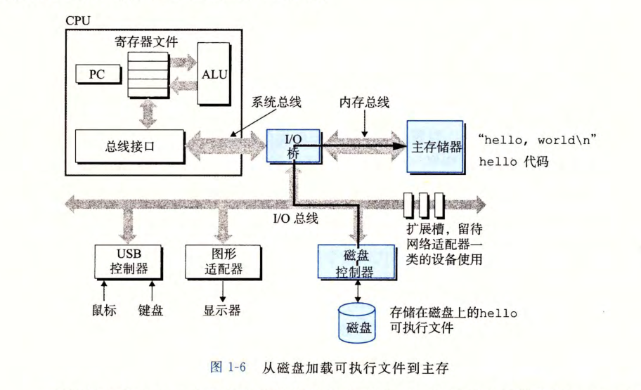

# 计算机系统漫游

## 程序的编译过程

就全面的讲，从编译再到运行的整个编译系统可以概括为：

1. 预处理器用来**处理#开头的注释或者头文件**
2. 编译器用来翻译成文本文件，是一个**汇编语言**程序（用符号和助记符）来表示原本的文本文件，主要是做一些基本的语法分析，如**定义的类型有无错误**
3. 汇编器：将汇编语言文件翻译成**机器语言**指令，生成**二进制的.o文件。包括一些地址分配**
4. 链接器：将hello程序中调用的一些库函数，如printf，找到其printf.o的位置，使某种方式合并*链接）到我们源程序中

## shell

就是linux系统终端中的命令行：它一直在等待我们的输入，我们的命令。输入一个单词，先判断是不是shell内置命令，不是的话，就认为是一个可执行文件名

## 系统硬件组成

1. 总线Bus
   贯穿整个系统的是一组电子管道，称作总线，它携带信息字节并负责在各个部件间传递。通常总线被设计成传送定长的字节块，也就是字 (word) 。  就目前的计算机基本都是8个字节64位为一个字作为基本单位的
   - **数据总线（Data Bus）**：用于传输数据。
   - **地址总线（Address Bus）**：用于传输内存地址或设备地址。
   - **控制总线（Control Bus）**：用于传输控制信号，如读写信号、中断信号等。
   - **系统总线（System Bus）**：连接CPU、内存和I/O设备的总线，是**计算机内部的主要通信通道。**

2. 1/0 设备
   I/0( 输入／输出）设备是系统与外部世界的联系通道。  每个 I/0 设备都通过一个控制器或适配器与 I/0 总线（总线的一种）相连。控制器和适配器之间的区别主要在于它们的封装方式。**控制器是 1/0 设备本身或者系统的主印制电路板（通常称作主板）上的芯片组**。而**适配器则是一块插在主板插槽上的卡**。无论如何，它们的功能都是在 1/0 总线和 1/0 设备之间传递信息。  

   - **PCI总线（Peripheral Component Interconnect）**：用于连接高速外设，如显卡、声卡等。
   - **USB总线（Universal Serial Bus）**：用于连接各种低速和中速外设，如键盘、鼠标、U盘等。
   - **SATA总线（Serial ATA）**：用于连接硬盘等存储设备。
   - **SPI总线（Serial Peripheral Interface）**：用于连接低速的串行外设，如传感器、存储芯片等。

3. 主存 

   就像计算机的一个临时的草稿纸，这张草稿纸是由动态随机存取存储器（DRAM）芯片组成的，也就是说DRAM是主存的子集。这张草稿纸上的每一个位置当然对应着其唯一的数组。主存的特性是断电后数据丢失，正如是一个ipad上的草稿纸一样，没电且没保存到硬盘中，草稿纸就没了

4. CPU

   之所以说是64位的CPU是因为**处理器的核心是大小一个字（64位）的存储设备（寄存器），也叫做程序计数器（PC)**。程序计数器充当类似指针的作用，指向主存中的某个指令的地址。CPU不断的根据程序计数器指向的指令来执行相应的指令，并使PC指向下一个指令（不一定相邻按顺序）

   一些常见的指令操作会涉及到主存、寄存器文件、**算术/逻辑单元（ALU）**。寄存器文件就是寄存器的集合，其中寄存器名字是唯一的。例如算术运算：两个寄存器充当算数，ALU充当算术运算符，得到的结果作为一个新的寄存器覆盖原来寄存器的内容。

## 程序在硬件中的工作流程

第一步：通过键盘这个输入设备输入文件名经过IO总线（未回车），文件名会通过系统总线读入寄存器中，之后通过内存总线存到内存中

第二步：回车后，通过IO总线，将磁盘中的数据复制到主存（通过直接存储器存取DMA，不经过处理器，处理器只是发送根据指令执行命令的）

第三步：主存有内容后通过内存中下和系统总线，为寄存器文件提供相应的数据，同时把对应的信息输出到显示器上

## 高速缓存cashe

由于cpu和主存之间的运行速度有着巨大的差异，也就诞生了cache技术来解决这类问题。

cache分为L1、L2、L3，其中1-2是有一种静态随机访问存储器（SRAM）的硬件组成的。

## 存储设备的层次结构

相邻的存储器，高的一层称为低的一层的高速缓存

## 操作系统管理硬件

### 进程

**进程是程序在操作系统中运行时的基本单位**，包含了程序代码、执行信息等

操作系统使用**了“上下文”的机制来实现并发运行**（CPU同时处理多个任务，但每次只能处理一个；区别于并行：同时运行多个任务，一起推进任务）

- 并发：一个人同时吃三个馒头。
- 并行：三个人同时吃三个馒头。

**上下文**，包括PC和寄存器文件的值，主存内容，为操作系统提供了保持跟踪进程运行所需的**“所有运行信息”**

而实际的进行进程之间的切换是由**系统内核（Kernel）来完成**和管理的。每一次的进程切换后，会根据其他进程中保存起来的上下文信息，回复到中断的地方继续执行

#### 进程切换的步骤

以下是进程切换的典型步骤，由内核完成：

1. **选择下一个进程**：内核的调度器Kernel根据调度算法选择下一个要运行的进程。
2. **保存当前进程的上下文**：内核保存当前进程的寄存器状态、栈状态、内存映射信息等。
3. **恢复下一个进程的上下文**：内核恢复下一个进程的寄存器状态、栈状态等，使其能够从中断的地方继续执行。
4. **切换进程**：内核将控制权交给下一个进程，使其开始运行。

### 线程

**线程是进程中的一个执行单元**，线程运行在某一个进程中的上下文中，共同享有代码和数据

线程比进程的资源消耗更小，开辟和实现多线程也就比多进程更容易

### 虚拟内存

==以进程虚拟内存的形式寄生在磁盘上，并以此利用主存作为磁盘的高速缓存来减少之间的消耗

虚拟内存的核心就在于虚拟，“假象”，欺骗进程，让进程以为当前是内存，真面目却是在硬盘上的。由于“假象”的作用，导致每个进程看到的内存都是一致的，确保了“一致性”。

毕竟肯定先要有相应的程序，的地址，那才有调用堆、栈这些的地址，一直传递到内核虚拟内存，也就是与kernel相关的

1. **代码（二进制）和数据（全局变量、静态变量、常量）在程序运行时占用的内存空间是固定部分**
2. **而可变部分包括：用户栈（用户运行时产生的形参、局部变量、返回值、递归空间，由系统自动回收）和运行堆区（包括动态开辟的空间，如malloc或new，需要手动回收）**
3. **固定区所占用的空间非常小，运行时消耗的内存主要取决于可变部分。**
4. 由于堆区系统不会自动回收，所以很容易出现内存泄漏的问题，但是java、python中不需要考虑

### 文件

文件是以字节为单位的，因此也是一个字节序列。IO设备**包括网络**都算做文件体系

### 为什么说网络也是IO设备

### 并发和并行

1. 线程级并发

   一个进程中多个线程同时执行，也就是多个控制流

   操作系统的并发本质是操作系统中多个进程（资源分配的基本单位）间的快速切换。就好像人类多任务处理一样，吃饭和看手机，看似是两个同时执行，其实也是并发的概念：在吃饭和手机中快速来回切换。

   我现在的电脑是将多个CPU（也叫“核”）集成到一个集成电路芯片上的一个多核处理器

   其中的每个核都有自己独立的L1（包括数据和指令）高速缓存和L2高速缓存，但是只有一个所有核共享的L3高速缓存

   

   普通的一核心就是一线程，但是**超线程**就可以两线程

2. 指令集并行

   当代的先进的cpu使用流水线来同时执行多条指令，使处理器能够在一个周期的时间内，执行比一个周期还多的指令数，并且这称之为超标量处理器

3. 单指令、多数据并行

   如同字面意思，一条指令可以并行多条数据那么称之为SIMD

   

   > **控制部分==指令，处理器=\=数据，主存=\=任一指令或数据的个数（一个/多个）**

# 信息的表示和处理

显然，信息的表示是用0、1的数字表示的，称之为位

没想到**有符号整数**的最常见的表示方式竟然是**补码编码**

可以了解到整数的数值表示的范围是很小的，但是却是一个很精确的数值；相对于浮点数而言，浮点数的数值范围很大，但相应的失去了精度，也就代表了浮点数的值的近似的

## 信息存储

在内存或的任意的存储设备之中，作为**最小的可寻址的内存单位**，那首先想到的就是**字节**了，也就是8位

那么，以字节为最小的可寻址内存单位的**内存**中的，每一个字节，都可以**用一个唯一的数字来表示，这个数字就是该字节的地址，地址的集合也就构成了虚拟内存空间。**

> **注意区别虚拟地址**

那么同理，在C语言当中，每个指针的值，都指向着对应的存储块的第一个字节的虚拟地址，例如指向字符数组的指针一样，是只指向 a[0] 的地址的

**程序**是很多字节组成的**字节序列**，而**程序对象**就只是这些序列中的一个**字节块**

## 字（字长）数据大小

用来**指明指针数据的标称大小**为一个**字长（位）**，存在与每一台计算机当中。

而**虚拟地址是以每一位来编码的，所以字节决定了字长（位），也就决定了虚拟地址空间的大小**

> **虚拟地址空间并不直接等同于内存，内存更像是物理地址空间，而虚拟地址空间决定了内存理论上的上限，而内存是真实的实现**。
>
> 而虚拟地址空间和物理地址空间直接的转换一般是，虚拟地址空间通过页表映射成为物理地址。而具体的映射技术（虚拟内存管理）技术包括分页、分段的方式，毕竟，肯定不能一一映射啦，那效率太低了~

对于**一个字节为 w 位的机器，对应的虚拟地址范围总共有 2^w 个字节： 0 ~ 2^w - 1**

> 之所以这里指数函数的底是2，是因为**信息以位为单位的表示只有 0 和 1 两种**

那么，32 位字长的虚拟地址空间为4GB，而 64 位字长的虚拟地址空间有 16EB，因此，内存是完全够用的，大概也就不会出现 128 位的系统了~

## 寻址和字节顺序

一个程序对象，不可能说只占用一个字节，那么在占用多个字节的程序对象中，它的存储肯定是一个**连续的字节序列**，并且该**程序对象的地址为该连续的字节序列中的最小地址，也就是第一个地址**（因为这些地址是按顺序排列的）。例如一个 4 字节的 int 的变量 x 的地址为 Ox100， 那么其对应的字节序列就是相应的四个地址，即Ox100、Ox101、Ox102、Ox103

字节排列顺序分为小端法和大端法：

一个字节（8 位二进制）对应的是 2 个十六进制数

