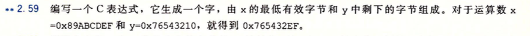
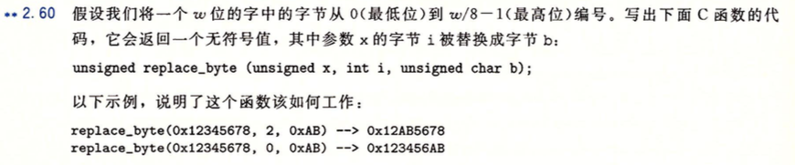

# CSAPP lab环境配置

## 安装

打开Linux终端（我用的是Ubuntu），安装：

```ubuntu
sudo apt-get install build-essential
sudo apt-get install gcc-multilib
sudo apt-get install gdb
```

## labs下载地址

https://github.com/houliabc/c-Data-Structure/releases

可以通过Ubuntu中的git命令下载，也可以Windows下载使用类似“FileZilla Client”的软件上传到命令行中，具体的使用可能需要查一下


# CSAPP lab第二章datalab

您的目标是修改bits.c的文件，使其通过btest中的所有测试，而不违反任何编码准则。

## 评分脚本

为了达到bits.c文件的得分评比和报错情况或者违反编码准则的情况，我编写了一个方便的脚本：

先进入到datalab-handout目录，输入命令

```
vim run.sh
```

之后**按下i键，粘贴内容**：

```shell
#/bin/bash
make clean
make
./btest
echo "--------------------------------------------------------------------------------"
./dlc -e bits.c
```

**按下esc键，之后按两次大写字母Z保存退出**，接着，你就可以通过一行命令来实现检测了

```shell
bash ./run.sh
```

- 建议：每写完一道题，就保存退出执行一下上述命令，这样可以检查你这道题做对没有，不要全部做完再来（踩坑的我）！

## bitXor

这是第一道题，但对于新人还是不那么友好的：**用位表示异或运算：“^”**


首先要明白什么是异或，口诀是：**不同为1，相同为0。**

例如：0b1011 ^ 0b0001 = 0b1010

这道题我是自己通过在草稿纸反复推链推出的，可能花了有半个小时到一个小时，我压根就不会本题的“徳摩根定理”，纯粹用题目要求的“~”和“&”，来想办法得出结果，所以我也讲不了什么，暂时不会可以跳过下一道题。

```c
/* 
* bitXor - x^y using only ~ and & 
 *   Example: bitXor(4, 5) = 1
 *   Legal ops: ~ &
 *   Max ops: 14
 *   Rating: 1
 */
int bitXor(int x, int y) {
  return ~(~(x & ~y) & ~(y & ~x));
}
```

## tmin

**求最小的补码**


这是本章lab最简单的一道题，纯粹是从补码定义和补码表示出发

```c
/* 
 * tmin - return minimum two's complement integer 
 *   Legal ops: ! ~ & ^ | + << >>
 *   Max ops: 4
 *   Rating: 1
 */
int tmin(void) {
  return 1 << 31;
}
```

## isTmax

**如果x是补码的最大值则返回1，否则0**


我们**先假定x是最大值**的情况，最大值是形如：0b01111..1 的形式，当x + 1 时，就为0b100..0

我们**一般用异或操作来判断两个值是否相等**，那么**如果x是最大值，那 ~(x + 1)的值就应该是他本身**，再通过异或运算和逻辑非，即可得到是否是最大值的情况。

但是我们发现x为 0b11...1 也就是 -1 时， ~(x + 1)也等于它本身，那么我们考虑想办法去掉该值。

也同样是运用异或的办法，最后通过**两次非操作来“格式化”结果，即转换成只有1或0**的情况

```c
//2
/*
 * isTmax - returns 1 if x is the maximum, two's complement number,
 *     and 0 otherwise 
 *   Legal ops: ! ~ & ^ | +
 *   Max ops: 10
 *   Rating: 1
 */
int isTmax(int x) {
  // 左边是判断是否是TMAX，右边是排除11111..的情况
  // !!是一个格式化的操作，对于非0值会返回1，而0值就返回0
  return (!(~(x + 1) ^ x) & !!((x + 1) ^ 0x0));
}
```

## allOddBits

```c
/* 
 * allOddBits - return 1 if all odd-numbered bits in word set to 1
 *   where bits are numbered from 0 (least significant) to 31 (most significant)
 *   Examples allOddBits(0xFFFFFFFD) = 0, allOddBits(0xAAAAAAAA) = 1
 *   Legal ops: ! ~ & ^ | + << >>
 *   Max ops: 12
 *   Rating: 2
 */
int allOddBits(int x) {
  int one = 0xAA, two = one | (one << 8), three = two | (two << 8), mask = three | (three << 8);
  return !(mask ^ (x & mask));
//  return !(0xAAAAAAAA ^ (x & 0xAAAAAAAA));
}
```

## negate

```c
/* 
 * negate - return -x 
 *   Example: negate(1) = -1.
 *   Legal ops: ! ~ & ^ | + << >>
 *   Max ops: 5
 *   Rating: 2
 */
int negate(int x) {
  return ~x + 1;
}
```

## isAsciiDigit

```c
//3
/* 
 * isAsciiDigit - return 1 if 0x30 <= x <= 0x39 (ASCII codes for characters '0' to '9')
 *   Example: isAsciiDigit(0x35) = 1.
 *            isAsciiDigit(0x3a) = 0.
 *            isAsciiDigit(0x05) = 0.
 *   Legal ops: ! ~ & ^ | + << >>
 *   Max ops: 15
 *   Rating: 3
 */
int isAsciiDigit(int x) {
  // 如何表示范围呢？不用大于小于的话
  // Assume x is 0xMN
  // check1: check whether or not the M is 3
  // check1: check whether or not the N is between 0 and 9
  // 还需要使高26位清除掉
  int zero = x >> 6;
  int first = 0x30 ^ (x & 0xf0);  // 相同则为0
  // I can use 0xF minus
  int second = (x & 0xf);  // 截取低4位
  int minus = (second + ~0x9) >> 31;   // 该第四位满足条件：second - 'a' < 0成立，否则就不符合
  return (!zero & !first & !!minus);
}
```

## conditional

```c
/* 
 * conditional - same as x ? y : z 
 *   Example: conditional(2,4,5) = 4
 *   Legal ops: ! ~ & ^ | + << >>
 *   Max ops: 16
 *   Rating: 3
 */
int conditional(int x, int y, int z) {
//   思路：
// 用倒推的思路，返回值二选一，return结果一定是用 | 连接
// 而一个返回y，一个返回z，返回原值可以用补码全1（即-1）和&来实现，返回0可用0和&来实现
// 定义中间量condition=-1或0，condition需要与x相关联，则可以用!!x和取相反数的操作来实现
// 当 x!=0时，!!x=1, condition=~(!!x)+1=-1
// 当 x= 0时，!!x=0, condition=~(!!x)+1= 0
  int condition = ~(!!x) + 1;
  // condition = (!!x << 31) >> 31  //也可以这样，如果是1左移后再右移会触发算数右移，1会填充左边，最后的结果是-1；0的话最终结果是0，和上一个式子等价
  return (condition & y) | (~condition & z);
}
```

## isLessOrEqual

```c
/* 
 * isLessOrEqual - if x <= y  then return 1, else return 0 
 *   Example: isLessOrEqual(4,5) = 1.
 *   Legal ops: ! ~ & ^ | + << >>
 *   Max ops: 24
 *   Rating: 3
 */
int isLessOrEqual(int x, int y) {
  // 思路是用减法，y - x，之后再看符号位，符号位0 表示正值，也就是返回1；符号位1表示负值，返回0
  int condition = y + (~x + 1);
  int top = condition >> 31; // 记录最高位，0表示y大与等于，返回1；1表示x大，返回0
  return !top;	
}
```

## logicalNeg

```c
//4
/* 
 * logicalNeg - implement the ! operator, using all of 
 *              the legal operators except !
 *   Examples: logicalNeg(3) = 0, logicalNeg(0) = 1
 *   Legal ops: ~ & ^ | + << >>
 *   Max ops: 12
 *   Rating: 4 
 */
int logicalNeg(int x) {
//   思路：
// 运用0的性质，0的相反数还是0，按位或得到的值还是0（最高位也为0）
// 其他值与相反数按位或得到的最高位为1（值与相反数总有一个是负数），但如果右移后就是-1
  int first = x >> 31;
  int two = (~x + 1) >> 31;  // 如果符号位为0，那这里会触发算数右移，结果是-1
  return 1 + (first | two);  // 加1是为了使原本的值域【-1，0】转变为【0，1】，才能符合题目
}
```

## howManyBits

```c
// 使用补码时最少需要多少比特位
/* howManyBits - return the minimum number of bits required to represent x in
 *             two's complement
 *  Examples: howManyBits(12) = 5
 *            howManyBits(298) = 10
 *            howManyBits(-5) = 4
 *            howManyBits(0)  = 1
 *            howManyBits(-1) = 1
 *            howManyBits(0x80000000) = 32
 *  Legal ops: ! ~ & ^ | + << >>
 *  Max ops: 90
 *  Rating: 4
 */
int howManyBits(int x) {
// 首先要理解题目对位数的定义，负数可以就按正常补码的理解，而正数则要在正常的基础上加上一个符号位0，例如
// howManyBits(12) = 5—>0 1 1 0 0,为五位，而非四位。

// 为了便于处理，我们将负数统一取反，之所以可以这么做是因为，为了确定负数用补码表示最少需要几位，则需要找到负数中从高位开始第一个为零的位，取反后则需要找到第一个为1 的位，实现的效果其实相一致 （实在不明白可以在纸上画一画）。

// 就像上面说的，我们需要找到第一个 1 的位置，得出从该位置算起有多少位，再加上一个符号位，就可以得出一个数用补码表示最少需要几位。
// 但难点在于我怎么去确定二进制数列中第一个1的位置。大佬写的是一种放缩的思维，首先我要假设一下一系列操作均成立：
// 假设1在高16位中，然后将x右移16位，则该补码至少需要16位。
// 假设1在高8位中，然后将x右移8位，则该补码至少需要16+8位。
// 假设1在高4位中，然后将x右移4位，则该补码至少需要16+8+4位。
// 假设1在高2位中，然后将x右移2位，则该补码至少需要16+8+4+2位。
// 假设1在高1位中，然后将x右移1位，则该补码至少需要16+8+4+2+1位。
// 假设1在高1位中，则x=1,则该补码至少需要16+8+4+2+1+1位。
// 最后不要忘记符号位，再加上1。

  int sign = x >> 31;  // 取符号位
  // 如果x为正则不变，否则按位取反（这样好找最高位为1的，原来是最高位为0的，这样也将符号位去掉了）
  x = (sign & ~x) | (~sign & x);

  // 放缩来不断地缩小范围
  // 判断高十六位是否有1
  int b16 = !!(x >> 16) << 4;
  // 若有这至少需要16位，则将原数右移16位
  x >>= b16;
  // 接着判断16位后的高8位是否有1，有则继续位移8位
  int b8 = !!(x >> 8) << 3;
  x >>= b8;
  int b4 = !!(x >> 4) << 2;
  x >>= b4;
  int b2 = !!(x >> 2) << 1;
  x >>= b2;
  int b1 = !!(x >> 1);
  x >>= b1;
  int b0 = x;

  return b16 + b8 + b4 + b2 + b1 + b0 + 1;  // 加一位是符号位
}
```

## floatScale2

```c
//float
/* 
 * floatScale2 - Return bit-level equivalent of expression 2*f for
 *   floating point argument f.
 *   Both the argument and result are passed as unsigned int's, but
 *   they are to be interpreted as the bit-level representation of
 *   single-precision floating point values.
 *   When argument is NaN, return argument
 *   Legal ops: Any integer/unsigned operations incl. ||, &&. also if, while
 *   Max ops: 30
 *   Rating: 4
 */
unsigned floatScale2(unsigned uf) {
  int exp = (uf & 0x7f800000) >> 23;  // 尾数有23位
  int sign = uf & (1 << 31);
  int frac = uf & 0x7fffff;
  // 先处理一些特殊的情况

  // 0
  if (frac == 0 && exp == 0)
    return uf;

  // 非规格化
  if (exp == 0)
    // << 1 表示乘2，正是题目要求的2*f
    return frac << 1 | sign;

  // 无穷大直接返回
  if (exp == 0xff) return uf;

  // 规格化的情况
  exp++;  // 这里是通过指数加1的方式来实现*2的效果
  // 如果指数+1之后，指数为255则返回原符号无穷大，否则返回指数+1之后的原符号数。
  return sign | exp << 23 | frac;
}
```

## floatFloat2Int

```c
/* 
 * floatFloat2Int - Return bit-level equivalent of expression (int) f
 *   for floating point argument f.
 *   Argument is passed as unsigned int, but
 *   it is to be interpreted as the bit-level representation of a
 *   single-precision floating point value.
 *   Anything out of range (including NaN and infinity) should return
 *   0x80000000u.
 *   Legal ops: Any integer/unsigned operations incl. ||, &&. also if, while
 *   Max ops: 30
 *   Rating: 4
 */
int floatFloat2Int(unsigned uf) {
  unsigned frac = uf & 0x7fffff;
  unsigned exp = (uf >> 23) & 0xff;
  unsigned sign = uf & (1 << 31);

  // 0，包括非规格化的情况
  if (exp == 0)
	return 0;
  // 无穷大
  else if (exp == 0xff)
  	return 1 << 31;
  // 规格化的情况
  // 阶码E的计算
  int E = exp + ~(126); 
  frac = frac | 1 << 23;

  // 判断超出范围的情况
  if (E > 31)
	return 1 << 31;  // 这就是题目要求的0x80000000u
  // 表示无穷小			   
  else if (E < 0)
	return 0;

  // M * 2^E
  if (E >= 23) // 超过frac所能表示的位数
	frac <<= (E - 23);
  else
	frac >>= (23 - E);

  // 判断符号位
  if (!!sign) // 负值
	return  ~frac + 1;
  return frac;
}
```

## floatPower2

```c
/* 
 * floatPower2 - Return bit-level equivalent of the expression 2.0^x
 *   (2.0 raised to the power x) for any 32-bit integer x.
 *
 *   The unsigned value that is returned should have the identical bit
 *   representation as the single-precision floating-point number 2.0^x.
 *   If the result is too small to be represented as a denorm, return
 *   0. If too large, return +INF.
 * 
 *   Legal ops: Any integer/unsigned operations incl. ||, &&. Also if, while 
 *   Max ops: 30 
 *   Rating: 4
 */
unsigned floatPower2(int x) {
    // 这里的x应该是E，所以x = exp - bias
    // x的范围：(-126-23) - 127+
    // denormalize：阶码全为0，此时x<=-126，frac可以是最小的-2^23，也可以是最大的2^22 + 2^21 + 2^20 .. + 2^0
    // 最小的情况
    if (x <-149)
	    return 0;
    // 因为有2^0所以取最大的阶数也是2^-126
    else if (x < -126){
    	    int exp = x + 126;
	    return 1 << (23 + exp);
    }

    // normalize	   
    else if (x <= 127) {
	    int exp = x + 127;
	    return exp << 23;
    }
    else  //无穷大
	    return 0xff << 23;
    return 2;
}
```

# CSAPP homework第二章

正确的刷题顺序应该是先做完homework，接着才是labs，不然直接做labs难度会更难（我踩过的坑），很多labs题可以在homework中找到类似的思路

有些没啥用的题我就没有做了，我挑了自己认为值得做的，如果需要完整的可以参考以下别人的链接：

https://www.cnblogs.com/machao/p/8397961.html

## 2。58 is_little_endian

编写过程is_little_endian，在小端法机器运行返回1，大端法返回0，无论机器字长


通过对1（0x0001）强制转成char类型的方式，看剩下的那一个字节是多少，因为十进制 1 的左侧（十六进制）是0，右侧是1，所以可以由此判断是大端法还是小段法

```c
typedef unsigned char *byte_pointer;
int is_little_endian() {
	short s = 1;
	byte_pointer p = (byte_pointer) &s;
	return *p;
}

int main() {
    if (is_little_endian()) {
        cout << "小端字节序" << endl;
    } else {
        cout << "大端字节序" << endl;
    }
    return 0;
}
```

## 2.59



左边取x的低1字节，右边取y的高3字节（通过取反低1字节）

```cpp
int main() {
    int x = 0x89ABCDEF; 
    int y = 0x76543210; 
    cout << hex << showbase << uppercase << ((x & 0xFF)|(y & ~0xFF));  // 输出结果为0x765432EF
    cout << '\n';
    return 0;
}
```

## 2.60



```cpp
#include <iostream>
using namespace std;

// 从x中抽取最高有效字节
int get_msb(int x) {
    // shitf_val是一个整数，表示要将x右移多少位以获取最高有效字节
    int shift_val = (sizeof(int) - 1) << 3;
    int shift_x = x >> shift_val;  // 将x右移到最高有效字节的位置
    return shift_x & 0xFF;  // 取出最高有效字节
}

unsigned replace_byte(unsigned x, int i, unsigned char b) {
    int shift = i << 3;          // 计算字节i的移位量（8位/字节，左移3位即乘8）
    unsigned mask = ~(0xFF << shift);  // 构造掩码：除第i字节外全为1（清除第i字节的位）
    unsigned byte_b = (unsigned)b << shift;  // 将b移到第i字节的位置
    return (x & mask) | byte_b;  // 清除x的第i字节，再与b的字节进行或运算
}

int main() {
    int x = 0x12345678;
    int msb = get_msb(x);
    cout << "最高有效字节: " << hex << showbase << msb << endl;
    // cout << (0xFF<<1<<1<<1<<1);
    unsigned result = replace_byte(x, 2, 0xAB);
    cout << "替换后的结果: " << hex << showbase << uppercase << result << endl;  // 输出结果为0x89AB12EF    
    return 0;
}
```

## 2.61

```c

```

## 2.62

```c

```

## 2.63

```c

```

## 2.64

```c

```

## 2.65

```c

```

## 2.66

```c

```

## 2.67

```c

```

## 2.68

```c

```

## 2.69

```c
// 2. 69 写出具有如下原型的函数的代码：
/*
* Do rotating left shift. Assume O <= n < w
* Examples when x = Ox12345678 and w = 32:
* n=4 -> Ox23456781, n=20 -> Ox67812345
*/
unsigned rotate_left(unsigned x, int n) {
    // 思路大概是分两部分处理，1是提取左边的，2是提取右边的，之后把右边放左边，左边放右边
    unsigned left = x << n;  // 右端会为0
    // 注意看这题给的是unsigned的x，这就表明我们的右移都是逻辑右移，左边是用0填充的，这就不用担心了
    unsigned right = x >> (32 - n);
    return right | left;
}
```

## 2.70

```c
// 2. 70 写出具有如下原型的函数的代码：
/*
* Return 1 when x can be represented as an n-bit, 2's-complement
* number; 0 otherwise
* Assume 1 <= n <= w
*/
int fits_bits(int x, int n) {
    // 当x可以被表示为一个n位（n可能比W小）的二进制补码时，返回1 ，否则0
    int w = sizeof(x) << 3;
    int offSet = w - n;
    return !((x << offSet >> offSet) ^ x);
}
```

## 2.71

```cpp
#include <iostream>
#include <cassert>
using namespace std;

//2.71
typedef unsigned packet_t;
// 该函数的作用是取出一个字中的某个字节，然后把该字节扩展为有符号整数
// 难点在于如何利用算数右移填充前边的位
// 核心思想就是先把目前字节左移到最高位，然后再利用算数右移
int xbyte(packet_t word, int bytenum) {
    int size = sizeof(unsigned);
    int shift_left_val = (size - 1 - bytenum) << 3;
    int shift_right_val = (size - 1) << 3;
    return (int)word << shift_left_val >> shift_right_val;
}

int main(void) {
    cout << (xbyte(0x00112233, 2) == 0x11) << endl;
    cout << (xbyte(0x00112233, 0) == 0x33) << endl;
    cout << (xbyte(0x00112233, 1) == 0x22) << endl;
    cout << (xbyte(0x00112233, 3) == 0x00) << endl;

    cout << (xbyte(0xAABBCCDD, 0) == 0xFFFFFFDD) << endl;
    cout << (xbyte(0xAABBCCDD, 1) == 0xFFFFFFCC) << endl;
    cout << (xbyte(0xAABBCCDD, 2) == 0xFFFFFFBB) << endl;
    cout << (xbyte(0xAABBCCDD, 3) == 0xFFFFFFAA) << endl;
    cout << (xbyte(0xAABBCCDD, 3) == 0xFFFFFFAA);
    return 0;
}
```

## 2.73

```c
// 2. 73 写出具有如下原型的函数的代码：
//  Addition that saturates to TMin or TMax•I
// 编写饱和加法，同正常的补码加法溢出的方式不同，当正溢出时，饱和加法返回TMAX，负溢出时，返回TMIN，饱和运算常常用于在执行数字信号处理的程序中。
int saturating_add(int x, int y) {
    int sum = x + y;

    // 得到x 和 y 的符号位右移而成的掩码，0xff..f 表示的是负值，0x0 表示的是正值
    int x_sign_mask = x >> ((sizeof(int) << 3) - 1);
    int y_sign_mask = y >> ((sizeof(int) << 3) - 1);
    int sum_sign_mask = sum >> ((sizeof(int) << 3) - 1);

    // 接下来讨论正溢出和负溢出的情况：
    // 正溢出：当x > 0, y > 0时, sum < 0，即 x + y > sum
    // 当 x_sign_mask 和 y_sign_mask 都为 0x0(正值) ，sum_sign_mask 为 0xff.. （负值）的时候，此时必然是正溢出
    int pos_ovf = !x_sign_mask && !y_sign_mask && sum_sign_mask;   

    // 负溢出：当x < 0, y < 0时, sum > 0，即 x + y < sum
    // 当 x_sign_mask 和 y_sign_mask 都为 0xff..(负值) ，sum_sign_mask 为0（正值）的时候，此时必然是负溢出
    int neg_ovf = x_sign_mask && y_sign_mask && !sum_sign_mask;  
    
    // int positive_overflow = ~x_sign_mask & ~y_sign_mask & sum_sign_mask;
    // int negative_overflow = x_sign_mask & y_sign_mask & ~sum_sign_mask;

    // 构造选择掩码：溢出时为1，否则为0
    int ovf = pos_ovf | neg_ovf;

    // 正确选择结果：溢出时返回边界值，否则返回sum
    return ovf ? (pos_ovf ? INT_MAX : INT_MIN) : sum;
}

int main(void) {
    // 正常加法（无溢出）
    cout << "1 + 5 = " << saturating_add(1, 5) << endl;            // 输出: 6
    // 正溢出场景
    cout << "INT_MAX + 1 = " << saturating_add(INT_MAX, 1) << endl; // 输出: 2147483647 (INT_MAX)
    // 负溢出场景
    cout << "INT_MIN + (-1) = " 
         << saturating_add(INT_MIN, -1) << endl;                     // 输出: -2147483648 (INT_MIN)

    return 0;
}
```

## 

```cpp

```

## 

```c

```

## 

```c

```

## 

```c

```

## 

```c

```

## 

```c

```

## 

```c

```

## 

```c

```

## 

```c

```

## 

```c

```

## 

```c

```

## 

```c

```

## 

```c

```

## 

```c

```

## 

```c

```

## 

```c

```

## 

```c

```

## 

```c

```

## 

```c

```

## 

```c

```

## 

```c

```

## 

```c

```

## 

```c

```

## 

```c

```

## 

```c

```

## 

```c

```

## 

```c

```

## 

```c

```

## 

```c

```

## 

```c

```

