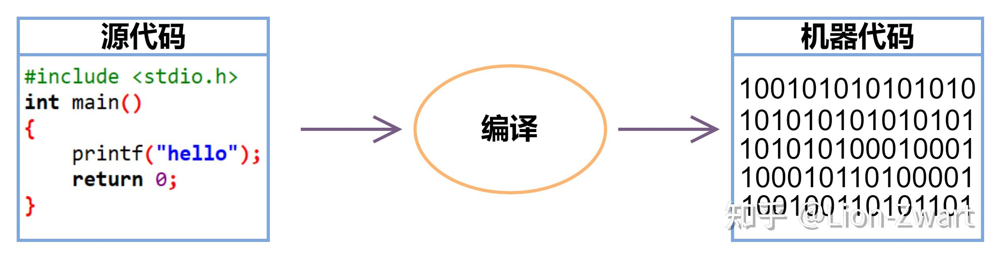
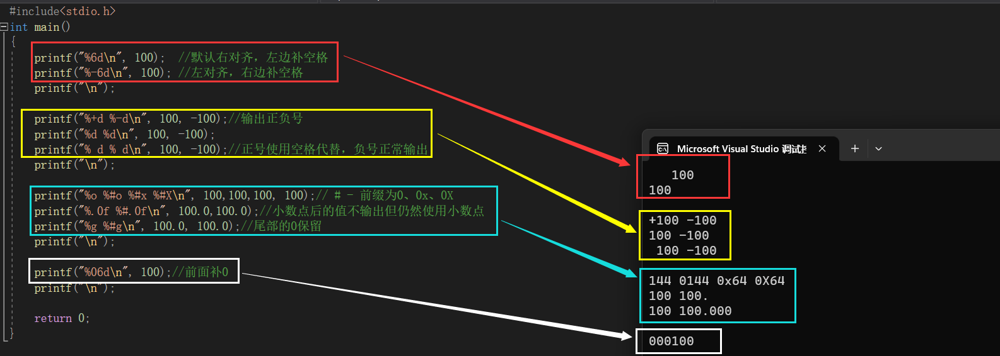
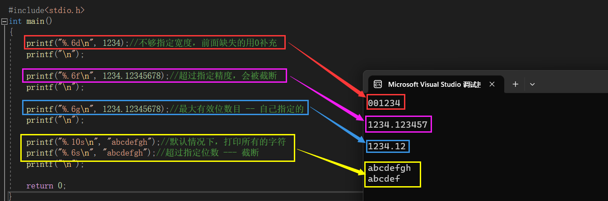
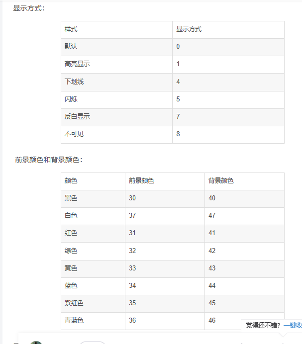
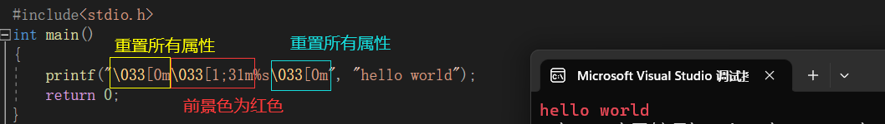
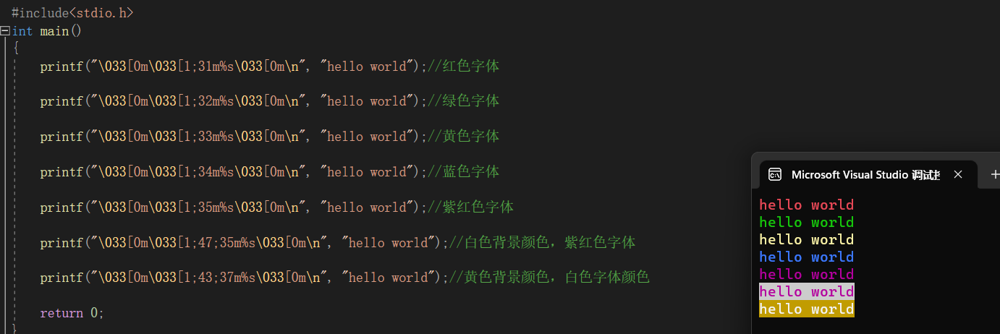

[toc]

# 引言

## 结构

1. main为主函数，每个c程序必须有一个main()函数

2. {}为函数的范围

3. printf是库函数

4. 每个语句后面都要有一个分号;

5. //：注释一行

6. /* 多行语句 */：注释多行

   >快捷键：ctrl+/

7. 语句以return 0;结尾

8. **头文件**：#include <stdio.h>、**<stdlib.h>、<math.h>、<string.h>**

   > **区分不同的搜索路径（尖括号和引号的区别）：**
   >
   > 1. **<stdio.h>：表示先到系统的默认路径去找该文件，一般情况使用这种即可**
   > 2. **"stdio.h"：表示先到当前路径**，也就是当前.c源程序的位置，如果没有该文件，才到系统的路径去找
   >
   > **stdlib.h用于feof（）**

10. 导入：include语句＋要导入的.h文件名

11. void：空类型

## 图表

1. 流程图

   |    符号    |    名称     |         含义         |
   | :--------: | :---------: | :------------------: |
   |    椭圆    |   起止符    |   算法的开始和结束   |
   | 平行四边形 | 输入/输出框 |    输入/输出操作     |
   |    矩形    |   处理框    | 对框内的内容进行处理 |
   |    菱形    |   判断框    | 对框内的条件进行判断 |
   |    箭头    |   流程线    |    表示流程的方向    |

2. N-S图

## 编译软件

- Dev-Cpp.6.7.5
- Visual Studio Code

## 设计特征

自顶向下的规划、**结构化**编程和模块化设计

> c语言具有**高效、可移植性、强大灵活**的特点
>
> c语言是**高级编程语言，也是编译型语言，比python速度快（python是解释型语言）**，c语言更接近底层，需要处理的东西很多，而python属于更高级别的编程语言，有许多内置函数
>
> 优点是，许多任务用C来处理都非常简洁（如，转换数据的格式）；缺点是，你可能会犯一些莫名其妙的错误，这些错误不可能在其他语言中出现，比如指针错误

## 程序的基本结构

顺序、选择和循环

以上三种基本结构的4个共同特点：

1. 只有一个入口
2. 只有一个出口
3. 结构内的每一部分都有机会被执行到
4. 结构内不存在“死循环”

这三种基本结构组成的程序称为**“结构化程序”**。凡是**能提供这三种基本结构的语言都称为结构化语言，C语言就是一个结构化语言**

## 计算机工作原理

​	现代的计算机由多种部件构成。中央处理单元（CPU）承担绝大部分的运算工作。**随机存取内存（RAM）**是存储程序和文件的工作区；而永久内存存储设备（过去一般指机械硬盘，现在还包括固态硬盘）即使在关闭计算机后，也不会丢失之前储存的程序和文件。另外，还有各种外围设备（如，键盘、鼠标、触摸屏、监视器）提供人与计算机之间的交互。CPU负责处理程序，接下来我们重点讨论它的工作原理。

​	CPU  的工作非常简单，至少从以下简短的描述中看是这样。**CPU从内存中获取并执行一条指令，然后再从内存中获取并执行下一条指令**，诸如此类（一个几赫兹的CPU一秒钟能重复这样的操作大约十亿次，因此，CPU 能以惊人的速度从事枯燥的工作）。CPU  有自己的小工作区——由若干个寄存器组成，每个寄存器都可以储存一个数字。一个寄存器储存下一条指令的内存地址，CPU 使用该地址来获取和更新下一条指令。在获取指令后，CPU在另一个寄存器中储存该指令，并更新第1个寄存器储存下一条指令的地址。CPU能理解的指令有限（这些指令的集合叫作指令集）。而且，这些指令相当具体，其中的许多指令都是用于请求计算机把一个数字从一个位置移动到另一个位置。例如，从内存移动到寄存器。

​	下面介绍两个有趣的知识。其一，**储存在计算机中的所有内容都是数字。计算机以数字形式储存数字和字符（如，在文本文档中使用的字母）。每个字符都有一个数字码。**计算机载入寄存器的指令也以数字形式储存，指令集中的每条指令都有一个数字码。其二，**计算机程序最终必须以数字指令码（即，机器语言）来表示。**
​	简而言之，计算机的工作原理是：如果希望计算机做某些事，就必须为其提供特殊的指令列表（程序），确切地告诉计算机要做的事以及如何做。
​	你必须用计算机能直接明白的语言（机器语言）创建程序。这是一项繁琐、乏味、费力的任务。计算机要完成诸如两数相加这样简单的事，就得分成类似以下几个步骤。
1.从内存位置2000上把一个数字拷贝到寄存器1。
2.从内存位置2004上把另一个数字拷贝到寄存器2。
3.把寄存器2中的内容与寄存器1中的内容相加，把结果储存在寄存器1
中。
4.把寄存器1中的内容拷贝到内存位置2008。
而你要做的是，必须用数字码来表示以上的每个步骤！

## 编译流程

1. **预处理**

   编译过程的第一步预就是预处理，与处理结束后会产生一个后缀为(.i)的临时文件，这一步由预处理器完成。预处理器主要完成以下任务。

   - 删除所有的注释
   - 宏扩展
   - 文件包含

   预处理器会在编译过程中删除所有注释，因为注释不属于程序代码，它们对程序的运行没有特别作用。

   宏是使用 **#define** 指令定义的一些常量值或表达式。宏调用会导致宏扩展。预处理器创建一个中间文件，其中一些预先编写的汇编级指令替换定义的表达式或常量（基本上是匹配的标记）。为了区分原始指令和宏扩展产生的程序集指令，在每个宏展开语句中添加了一个“+”号。

   文件包含
   C语言中的文件包含是在预处理期间*将另一*个包含一些预写代码的文件添加到我们的C程序中。它是使用**#include**指令完成的。在预处理期间包含文件会导致在源代码中添加**文件名**的全部内容，从而替换**#include<文件名>**指令，从而创建新的中间文件。

2. **编译**
   C 中的编译阶段使用内置*编译器软件*将 （.i） 临时文件转换为具有汇编级指令（低级代码）的汇编**文件** （.s）。为了提高程序的性能，编译器将中间文件转换为程序集文件。
   汇编代码是一种简单的英文语言，用于编写低级指令（在微控制器程序中，我们使用汇编语言）。整个程序代码由编译器软件一次性解析（语法分析），并通过终端窗口告诉我们源代码中存在的任何**语法错误**或**警告**。

<<<<<<< HEAD
   
=======
   
>>>>>>> origin/master

3. **汇编**
   使用汇编*程序*将程序集级代码（.s 文件）转换为机器可理解的代码（二进制/十六进制形式）。汇编程序是一个预先编写的程序，它将汇编代码转换为机器代码。它从程序集代码文件中获取基本指令，并将其转换为特定于计算机类型（称为目标代码）的二进制/十六进制代码。
   生成的文件与程序集文件同名，在 DOS 中称为扩展名为 **.obj** **的对象文件**，在 UNIX 操作系统中扩展名为 **.o**。
   下图显示了组装阶段如何工作的示例。程序集文件 hello.s 将转换为具有相同名称但扩展名不同的对象文件 hello.o。

4. **链接**
   链接是将库文件包含在我们的程序中的过程。*库文件*是一些预定义的文件，其中包含机器语言中的函数定义，这些文件的扩展名为.lib。一些未知语句写入我们的操作系统无法理解的对象 （.o/.obj） 文件中。你可以把它理解为一本书，里面有一些你不知道的单词，你会用字典来找到这些单词的含义。同样，我们使用*库文件*来为对象文件中的一些未知语句赋予意义。链接过程会生成一个**可执行文件**，其扩展名为 **.exe** 在 DOS 中为 .out，在 UNIX 操作系统中为 **.out**。
   下图显示了链接阶段如何工作的示例，我们有一个具有机器级代码的对象文件，它通过链接器传递，链接器将库文件与对象文件链接以生成可执行文件。

## 计算机与程序

计算机的“自动”工作是由程序控制的。**程序就是一组计算机能识别和执行的指令，每一条指令使计算机执行特定的操作。**

## 程序设计语言发展阶段

计算机语言分为**机器语言、汇编语言、高级语言三个阶段**

> **机器语言和汇编语言**统称为**低级语言**

### 机器语言

**是由0、1二进制代码组成的能被机器直接理解、执行的指令集合。机器语言是计算机唯一能够直接执行的语言。**

优点：编程质量高，所占空间少，执行速度快

### 汇编语言

又称**符号语言**。**它采用一定的助记符来代替机器语言中的指令和数据。必须经过汇编程序翻译成目标程序后才能被计算机执行**

优点：编程质量高】占用空间少、执行速度快

> **汇编：将汇编语言源程序转换为等价的目标程序的过程**

### 高级语言

需要通过高级语言翻译程序将源程序翻译成目标程序，翻译程序包括：

1. **解释：对源程序一边翻译、一遍执行，不产生目标程序**

2. **编译：将源程序翻译成等价的机器语言表示的目标程序**

   > **c语言编译和运行过程的步骤：**
   >
   > 1. **编辑‘.c’**源程序
   > 2. **编译**源程序，得到**目标程序‘.obj’，该文件是一个二进制文件**
   > 3. 将目标程序‘.obj’**与库函数进行链接**，得到可执行程序**‘.exe’**
   > 4. 执行\运行‘.exe’文件

> **常见的高级语言**
>
> 1. **面向过程**：**FORTRAN、BASIC、COBOL、Pascal**、c
> 2. **面向对象**：c++、**visual、basic**、java

# 数据的存储和机器码

字节**B是计算机存储信息的基本单位，度量存储容量的基本单位也是字节**。一个字节为8位，而一个位表示一个二进制数（0、1）

> 各种数据在计算机中表示的形式称为**机器数**，**0开头表示正号，1开头表示负号**，**小数点隐含表示且不占位置**。**机器数对应的实际数据称为真值**。机器数分为无符号数（unsigned)和有符号数（正和负数）。无符号数表示正数。

- 原码：真值，**0开头正，1开头负，默认是8位**，没有添0

- **反码：原码为负数，则反码为原码取反（开头1不动），正数相同**

- **补码：正数相同，负数原码，则补码为反码+1**

  > 即**负数的补码=原码取反+1；负数的原码同样=补码取反+1**
  >
  > 补码是为了消除+0和-0
  >
  > 常用于加减法

- 移码：=补码，但是开头符号位取反

  > 常用于浮点数的阶码

| 机器码   | 能够表示的不同的有符号整数（定点小数）个数 |
| -------- | ------------------------------------------ |
| 原码     | **2^n - 1** = 2^(n-1) + 2^(n-1) + 1        |
| 反码     | **2^n - 1**                                |
| **补码** | **2^n**                                    |
| 移码     | **2^n**                                    |

> **例：用8位二进制表示**
>
> - **原码**：-127-127共有254+相同的两个0=**255个数 = 2^n - 1**
> - **反码**：-127-127共有254+相同的两个0=**255个数 = 2^n - 1**
> - **补码**：-128-127共有255+两个0=**256个数 = 2^n**

# 顺序结构设计

## 标识符与关键字

1. **标识符（变量名|函数名|各种名字）规则**：

   - **只能由字母、数字、下划线组成**（不能有特殊字符）
   - **以字母或下划线开头**（不能以数字开头）
   - 前8位字符有效，超过就舍去
   - 关键字不能用作标识符

2. 关键字

   有：auto、break、case、char、continue、default、do、else、float、for、if、int、void、while、switch等32个

## 常量

> **五大常量**
>
> 1. 数字
> 2. 浮点
> 3. 字符
> 4. 字符串
> 5. 符号常量

### 数字常量

- 八进制**0开头，数字范围0-7**：0350

  > **0789表示的是八进制7和十进制89两个数**
  >
  > 用**%o**

- 十六进制**0x或0X开头，数字范围0-9，字母范围a-fA-F**：0x12

  > 用**%x**

> **以下是整形常量的特殊表示**
>
> 1. 在整形变量后面加一个字母**l或L表示long int**==long型，如28l、027**LU**、0xA1**L**
> 2. 在整形变量后面加一个字母**u或U表示unsigned int**无符号整数型，如0xA1F**U**、**UL**、0xA1**LU**

### 实型常量

即float

> **实型常量的特殊表示**
>
> **在常量末尾加上专用字符，强制制定常量的类型**。如**float a =1.124355343f**  表示按**照单精度处理**，因此编译时不会出现对损失精度的警告。
>
> 实数的运算如2.5*3，此时的类型是double型，占8个字节；但**如果赋值给一个float型的变量，则是4个字节。例如float x=2.5\*3就是把原来的double型转变为float型**

#### 小数形式

规则：

1. **小数点“.”的左右一侧至少一侧有数**
2. 小数**点后的数不能带负号“-”**

例如：**.2**、**-.3**、**-9**.、**6.**

#### 指数形式

规则：

**e是指10的xx次方，而不是数学的e或10^3**

1. **e或E前e后必有数（正负+-）**
2. **e前可以是正负小数；e后必须为正负（+-）整数**

例如：12.3e3、-1.43e-2、**-0.2E-9**、**.7E-2**、**-.2e+9**、**6.e0**

#### 标准化指数形式

**标准化指数形式：“0.非0e数字”**、如20.15按照标准化指数形式就是**0.2**015x10^2

例如：**0.1e-4**、**-.3e0**

**在计算机的存储器中，实数是以标准化指数形式存放的。一个实数（float）一般用4个字节，其中3个字节存放数值副本，一个字节存放指数部分**

| 数值部分 |               | 指数部分 |      |
| -------- | ------------- | -------- | ---- |
| +        | .2015（占3B） | +        | 2    |

> **一个实数只有一种标准化指数形式**

### 字符常量

#### 普通字符

一般采用**ASCII代码存储，只能存放一个字符，本质上就是一个字节的整形变量，通常可以与整形相互转换**

**ASCII范围是0-127**

> **字符之间或字符和数字的相加**
>
> **都表示两者对应的ASCII码相加**，需要先转成ASCII后再相加再按照ASCII码显示
>
> **如printf("%c",'B'+' ')**
>
> **结果为66+32=98='b'**

#### 常用ASCII码

|    符号     | 十进制  |
| :---------: | :-----: |
| **(space)** | **032** |
|    **0**    | **048** |
|    **A**    | **065** |
|      Z      | **090** |
|    **a**    | **097** |
|      z      | **122** |
|    '\n'     |   10    |

> 同一个小写字母与大写字母差32位

####  转义字符(是反斜杠\)

|             形式              |               含义                | 例子                    |
| :---------------------------: | :-------------------------------: | ----------------------- |
|            **\n**             |      换行，光标到下一行开头       |                         |
|            **\t**             |              制表符               |                         |
|            **\b**             |            **退格符**             | **重点，容易当成字母b** |
|            **\a**             |       **警告，会产生声音**        | **重点，容易当成字母a** |
|            **\r**             |      回车符，光标到本行开头       | **重点，容易当成字母r** |
|            **\f**             |             **换页**              | **重点，容易当成字母f** |
|            **\v**             |          **垂直制表符**           | **重点，容易当成字母v** |
|              \\\              |                 \                 |                         |
|              \\'              |                 '                 |                         |
|    **\数、\数数、\数数数**    | 将该1-3位的八进制数转化成一个字符 | \0、**\00、\000**       |
| **\x数、\x数数、\x数数数...** |  将1-2位十六进制数转化为一个字符  | **\x0、\x00、\x000**    |

```c
printf("\x73");  //十六进制
printf("\a3F");  //就是字符串警告后3F
```

### 字符串常量

**字符串的本质：结尾带有“\0”这个ASCII为0的字符的char类型的数组。**其中，**数组名代表的是数组首元素的地址，即数组名==数组名[0]**

> 因此测试字符串长度时，往往会比实际的字符多出一个，就是因为“\0”的存在

### 宏常量或符号常量

**宏常量或者符号常量的定义方式：define 标识符 数值**

宏定义就表示该标识符和数值是等价的，其中**标识符可以使用类似函数的方式**：**#define A(x,y) x>y?x:y**，如此情况调用时就应该是A(x的值,y的值)这样的方式。

> **程序编译后，有标识符的地方就会自动变成数值，相当于你用的不是一个变量，而是直接是值了，要注意不是像变量那样**
>
> **终止宏定义：#undef 宏名**
>
> **符号常量只是一个符号，不占存储单元**，就好像一个值没有赋给任何的变量来说它是不占存储空间的一样

### 常变量

即const变量

**const 类型 变量名=xx**

> **常变量是有名字的不变量，而常量是没有名字的不变量**
>
> **常变量是有类型的，占用存储空间**
>
> 与符号常量的区别：**符号常量不占存储空间**

### 枚举类型enum

```c
enum [枚举名] {枚举元素列表}  //定义枚举类型
enum Weekday {mon,sun,tue,wed,thu,fri,sat}  //mon,sun...称为枚举元素或枚举常量
enum [枚举名] [枚举变量名]  //定义枚举变量
enum Weekday workday,week_end
    
//不声明枚举类型名字的情况
enum {mon,sun,tue,wed,thu,fri,sat} workday,week_end
```

> 这些**枚举常量的值默认从0开始依次递增**，即：
>
> - `Monday` 的值为 0
> - `Tuesday` 的值为 1
> - `Wednesday` 的值为 2
> - `Thursday` 的值为 3
> - `Friday` 的值为 4
> - `Saturday` 的值为 5
> - `Sunday` 的值为 6
>
> **等价于**
>
> ```
> enum DayOfWeek {
>     Monday = 0,
>     Tuesday = 1,
>     Wednesday = 2,
>     Thursday = 3,
>     Friday = 4,
>     Saturday = 5,
>     Sunday = 6
> };
> ```

## 变量(数据类型)

| 数据类型           | 表示                               | 字节               | 数值范围                                                     | 格式化  |
| ------------------ | ---------------------------------- | ------------------ | ------------------------------------------------------------ | ------- |
| 整形               | int                                | 4B，除非特别说明2B | **-2^31-2^31-1**                                             |         |
| 短整型             | short int==short                   | 2B                 | -2^15-2^15-1                                                 | **%hd** |
| 长整型             | long int==long                     | 4B                 | -2^31-2^31-1                                                 | **%ld** |
| 双长整形           | long long ing==long long           | 8B                 | -2^63-2^63-1                                                 | **%ld** |
| **字符型**         | char==short short==short short int | 1B                 | **-128-127**                                                 |         |
| 布尔型             | bool                               | 1B                 | 0、1                                                         |         |
| 单精度浮点型       | float                              | 4B                 | 前6-7位准确数字，后面数字不准确                              |         |
| **双精度浮点型**   | **double**                         | 8B                 | 15-16位准确数字，**c语言中实数一律是用double定义的**         |         |
| 长双精度浮点型     | long double                        | 8B                 | 同上                                                         |         |
| 复数浮点型         | float_complex,double_complex       | 用不到             | 用不到                                                       |         |
| 枚举类型           | enum                               | 4B                 | 例如**enum** Week {    Mon, *//默认从0开始依次递增*    Tues,   *// 1*    Wed,    *// 2*    Thurs,  *// 3*    Fri,    *// 4*    Sat,    *// 5*    Sun     *// 6* }; |         |
| 以上都称为算数类型 |                                    |                    |                                                              |         |
| 空类型             | void                               |                    |                                                              |         |
| 指针类型           | *                                  |                    |                                                              |         |
| 数组类型           | []                                 |                    |                                                              |         |
| 结构体类型         | struct                             |                    |                                                              |         |
| 共同体类型         | union                              |                    |                                                              |         |
| 函数类型           |                                    |                    |                                                              |         |
| 无符号类型         | 以unsigned开头                     |                    | **表示只有正数（只能用在整数）**，所以返回会去掉负值而正值次方会翻一倍 | **%u**  |
| 有符号类型         | 以signed开头                       |                    | 默认以signed开头，默认就是有符号类型                         |         |

> 算术类型和指针类型统称为纯量类型

```c
//常用数据类型
int i=10,*pi; 
float f=1.0;
char c='2';
long l=1;
double d=2;
struct student{}
union student{}
```

## 变量溢出

### 溢出环绕

有符号整数溢出导致的“二进制环绕”可以被想象成一个循环队列，其中最大值和最小值是相连的。这种环绕可以被看作是一个“环形缓冲区”，当你到达缓冲区的末端时，就会环绕到开始。

    INT_MIN <--+                   +-- INT_MAX
              |                   |
              +--------------------+
    eg char类型的一个字节：
    -128 -127 <--+                   +-- 126 127
                 |                   |
                 +--------------------+

> `INT_MIN`（有符号整数的**最小值**）和`INT_MAX`（有符号整数的**最大值**）通过一个箭头连接，表示**当你从`INT_MAX`增加1时，你会环绕到`INT_MIN`。同样，如果你从`INT_MIN`减少1，你也会环绕到`INT_MAX`**。

### 计算溢出后的值

在C语言中，如果你需要计算溢出后的值，可以使用模运算符`%`来实现。例如，如果你有一个整数`n`，你想要计算`n + k`在有符号整数范围内的结果，可以这样做：

c

```c
int result = (n + k) % (INT_MAX - INT_MIN + 1);

eg:
printf('%c',-666) 
```

> **-666=-666+256（该类型的范围周期）*3（使原值在-128-127的范围内）=102='f'**
>
> **353=353-256（该类型的范围周期）*1（使原值在-128-127的范围内）=97='a'**
>
> 这里`(INT_MAX - INT_MIN + 1)`是整数范围的周期，即有符号整数可以表示的总数值数量。模运算将确保结果在这个范围内。

## 进制转换

### 进制概念

- **数制：r进制**
- **数码**：该r进制**可以使用的符号，如十进制就是0-9这十个符号**
- **基数**：就是**每一位的数码可以有多少个数字来表示**。其实就是所谓的进制，十进制，基数为十，数码可以取的值有10个，分别是0~9。
- 数位：个位十位百位
- **位权（权值）**：个位数上的2 的权值为 2*10^0，十位数上的3 的权值为 3\*10^1 ，百位数上的1 的权值为 1\*10^2 。

> 好的！我用最简单的方式来解释这些概念，就像给一个完全不懂的小白讲一样。
>
> **1. 数制（进制）**
>
> 数制就是我们用来数数的方法。不同的数制有不同的规则。比如：
>
> - **十进制**：是我们平时最常用的数数方法，用0到9这十个数字来表示数。
> - **二进制**：计算机用的数数方法，只有0和1两个数字。
> - **八进制**：用0到7这八个数字来表示数。
> - **十六进制**：用0到9和A到F这十六个符号来表示数。
>
> **2. 数码**
>
> 数码就是用来表示数的符号。比如：
>
> - **十进制**的数码是0、1、2、3、4、5、6、7、8、9。
> - **二进制**的数码只有0和1。
> - **十六进制**的数码是0到9，再加上A（10）、B（11）、C（12）、D（13）、E（14）、F（15）。
>
> **3. 基数**
>
> 基数就是每种进制可以使用的数码的数量。比如：
>
> - **十进制**的基数是10，因为可以用0到9这10个数码。
> - **二进制**的基数是2，因为只有0和1。
> - **十六进制**的基数是16，因为可以用0到9和A到F这16个符号。
>
> **4. 数位**
>
> 数位就是数字的位置。比如一个数123：
>
> - **个位**：最右边的数字，这里是3。
> - **十位**：中间的数字，这里是2。
> - **百位**：最左边的数字，这里是1。
>
> **5. 位权（权值）**
>
> 位权就是每个位置上的数字代表的“价值”。比如十进制数123：
>
> - **个位**的3，它的位权是3 × 10⁰（10的0次方等于1），所以3的“价值”是3 × 1 = 3。
> - **十位**的2，它的位权是2 × 10¹（10的1次方等于10），所以2的“价值”是2 × 10 = 20。
> - **百位**的1，它的位权是1 × 10²（10的2次方等于100），所以1的“价值”是1 × 100 = 100。
>
> **总结一下：**
>
> - **数制**：数数的方法，比如十进制、二进制。
> - **数码**：用来表示数的符号，比如十进制的0-9。
> - **基数**：每种进制可以用多少个符号，比如十进制有10个符号。
> - **数位**：数字的位置，比如个位、十位、百位。
> - **位权**：每个位置上的数字代表的价值，比如123中的2代表20。
>
> **举个例子：**
>
> 假设我们有一个十进制数123，它可以用位权来表示为：
>
> ```
> 1 × 100 + 2 × 10 + 3 × 1 = 123
> ```
>
> 这就是位权的作用啦！


### 进制转换方法

#### R进制转十进制

按照‘位权展开求和’

#### 十进制转R进制

- **整数部分：除r取余法，即除以r取余，倒着取**
- **小数部分：乘r取整法，即用小数部分*r取乘积的整数部分，正着取**

> 如十进制0.6：
>
> 1. 0.6\*2=1.2	这里取1，剩下0.2
> 2. 0.2\*2=0.4	这里取0，剩下0.4
> 3. 0.4\*2=0.8	这里取0，剩下0.8
> 4. 0.8\*2=1.6	这里取1，剩下0.6
> 5. .....
>
> 所以十进制0.6转换成二进制为0.1001...

#### 二进制与八进制和十六进制相互转换

- 二转八：3位一组
- 二转十六：4位一组

## 数据格式化输出与输入

### 格式化输出pinrtf函数

#### 语法

printf("**%\[标志] \[输出最少宽度] \[.精度] \[长度] 类型**"  ,变量或值1,2,3...)

> - 标志：   "％-md" ：左对齐m位
>
> - 最小宽度： "%m.ns"：**输出m位**，**取字符串(左起)n位**，**左补空格**，当n>m or m省略时 m=n
>
> - .精度：   "%m.nf"：输出浮点数，m为宽度，n为小数点右边数位
>
> - 类型长度：ｈ短整形量,ｌ为长整形量
>
> - 类型/指示符/**说明符**/分类符：
>
>   说明符是最重要的组成成分，因为它**定义了相应参数的类型**和解释。

#### 说明符

| 数据类型         | 格式符        | 描述                                                         | 示例                                                  |
| ---------------- | ------------- | ------------------------------------------------------------ | ----------------------------------------------------- |
| int型            | %d或%**i**    | 整数                                                         |                                                       |
|                  | **%md(%-md)** | **右对齐与左对齐**                                           |                                                       |
|                  | %ld           | long型数据                                                   |                                                       |
|                  | %lld          | long long型数据                                              |                                                       |
|                  | %hd           | short型数据                                                  |                                                       |
|                  | %hhd          | short short型数据，即char                                    |                                                       |
|                  | **%o**        | **以八进制**输出整数                                         | printf("%o",1234);  <br />输出 2322                   |
|                  | **%x**        | **以十六进制输出整数**                                       | printf("%x",1234);  <br />输出 4d2                    |
|                  | **%e**        | **科学计数法（尾数/指数）小写**                              | printf("%e",0.0000001234);<br/><br/>输出 1.234000e-07 |
|                  | %E            | 大写                                                         |                                                       |
|                  | %g            | 使用最短表示法：%e 或 % f                                    |                                                       |
|                  | %G            | 大写                                                         | printf("%G",0.0000001234);<br/><br/>输出 1.234E-07    |
| char型           | %c            | 单个字符                                                     | printf("%c\n",65);<br/><br/>输出 A                    |
|                  | **%s**        | **字符串**                                                   | printf("%s","abcdefg");<br/><br/>输出 abcdefg         |
| float,double     | %f            | 小数输出实数，**默认6位小数**                                |                                                       |
|                  | **%m.nf**     | **输出的数据占m列，小数占n列**                               |                                                       |
| unsigned无符号型 | **%u**        | 无符号十进制**整数**                                         |                                                       |
| 其他类型         | **%%**        | 一个%后面跟着另一个%字符将写入一个%                          | **printf("%%");<br/><br/>输出 %**                     |
|                  | **%p**        | **字符指针地址**                                             | printf("%p","a");<br/><br/>输出 00907BD8              |
|                  | **%n**        | **什么也不打印**，对应的实参必须是指向有符号int型的指针。到目前为止写入的字符数存储在指向的位置中 |                                                       |

```c
printf("%.2f",f);  //表示保留两位小数
```

#### 标志

| 字符      | 说明                                                         |
| --------- | ------------------------------------------------------------ |
| -         | 在给定的字段宽度内**左对齐**（默认为右对齐）                 |
| +         | 结果为正数，需要在结**果前加上正号**（默认情况下，只有负数前面有-号） |
| （space） | 如果不写入任何符号，则**在值之前插入一个空格** (输出为+加空格） |
| #         | 说明符是o、x、X时，增加前缀0、0x、0X。说明符是a、A、e、E、f、g、G时，一定使用小数点。默认的，如果使用.0控制不输出小数部分，则不输出小数点。flags是g、G时，尾部的0保留。 |
| 0         | 当**指定填充时，用0而不是空格左填充**数字                    |

```c
printf("%6d\n", 100);  //默认右对齐，左边补空格
printf("%-6d\n", 100); //左对齐，右边补空格
printf("\n");

printf("%+d %-d\n", 100, -100);//输出正负号
printf("%d %d\n", 100, -100);
printf("% d % d\n", 100, -100);//正号使用空格代替，负号正常输出
printf("\n");

printf("%o %#o %#x %#X\n", 100,100,100, 100);// # - 前缀为0、0x、0X
printf("%.0f %#.0f\n", 100.0,100.0);//小数点后的值不输出但仍然使用小数点
printf("%g %#g\n", 100.0, 100.0);//尾部的0保留
printf("\n");

printf("%06d\n", 100);//前面补0
printf("\n");
```

<<<<<<< HEAD

=======

>>>>>>> origin/master

> **对于小数，这个限定符会限制所有数字的最小显示宽度。**
>
> #include <stdio.h>
> int main()
> {
> 	printf(**"%12f\n", 123.45**);	
> 	return 0;	
> }
>
> //结果输出为“  **123.450000**”
> 上面示例中，**%12f表示输出的浮点数最少要占据12位**。由于**小数的默认显示精度是小数点后6位**，所以123.45输出结果的头部会添加2个空格（小数点也占位哦）。

#### 最小宽度

**如果实际位数小于最小宽度应填补空格或者0；若实际位数大于最小宽度，则按实际位数输出。**

| 最小宽度 | 描述                                                         | 示例                                                  |
| -------- | ------------------------------------------------------------ | ----------------------------------------------------- |
| 数值     | 十进制                                                       | printf("%**06**d\n", 100);<br/><br/>输出 000100       |
| *        | 星号。不显示指明输出最小宽度，而是以星号代替，在printf的输出参数列表中给出 | printf("%**0***d\n", **6**,100);<br/><br/>输出 000100 |

#### 精度

| 精度     | 描述                                                         |
| -------- | ------------------------------------------------------------ |
| .n精度符 | 对于整数说明符(d, i, o, u, x, x): 精度**指定要写入的最小位数**。如果要写入的值比这个数字短，结果将用前导零填充。即使结果较长，该值也不会被截断。精度为0表示不为值0写入任何字符。<br/><br/>数量**对于a, A, e, E, f和F说明符:这是小数点后要打印的位数(默认情况下，为6位**)。<br/><br/>对于g和G说明符:这是**要打印的有效位数的最大数目**。<br/><br/>对于**s :这是要打印的最大字符数**。默认情况下，将打印所有字符，直到遇到结尾的null字符。如果指定的句点没有明确的精度值，则假定为0。 |
| .*       | 精度没有在格式字符串中指定，而是作为必须格式化的参数之前的附加整数值参数指定。 |

```c
printf("%.6d\n", 1234);//不够指定宽度，前面缺失的用0补充
printf("\n");

printf("%.6f\n", 1234.12345678);//超过指定精度，会被截断
printf("\n");

printf("%.6g\n", 1234.12345678);//最大有效位数目 -- 自己指定的
printf("\n");

printf("%.10s\n", "abcdefgh");//默认情况下，打印所有的字符
printf("%.6s\n", "abcdefgh");//超过指定位数 --- 截断
```

<<<<<<< HEAD

=======

>>>>>>> origin/master

#### 彩色输出

printf("**\033[显示方式；字背景颜色;字体颜色m…\033[0m**","格式符",变量...)

> 控制命令以 \033[ 开头，以m结尾，而中间则是属性码，属性代码之间使用 ; 分隔，如\033[1;34;42m ，最后以默认颜色 \033[0m 结尾，以避免影响后面正常打印！

<<<<<<< HEAD


=======





>>>>>>> origin/master

#### 返回值

- 如果 `printf` **成功，它返回输出的字符数**，包括用于字符串的双引号字符。
- 如果发生输出**错误**（如输出到文件时遇到错误），它**返回一个负数**。

### 格式化输入scanf函数

```c
scanf("%f%d",&ifloat,&id);
```

scanf()处理用户输入的原理是，**用户的输入先放入缓存，等到按下回车键后，按照占位符对缓存进行解读。解读用户输入时，会从上一次解读遗留的第一个字符开始，直到读完缓存，或者遇到第一个不符合条件的字符为止。**

```c
//用户输入“ -13.45e12# 0"	
	scanf("%d",&x);		
	scanf("%f",&y);	
```

上面示例中，scanf()读取用户输入时，**%d**占位符会忽略起首的空格，从-处开始获取数据，**读取到 -13 停下来**，因为后面的，不属于整数的有效字符。这就是说，占位符%d 会读到-13。第二次调用scanf( )时，就会从上一次停止解读的地方，继续往下读取。这一次读取的首字符是.，由于对应的占位符是**%f** ，会**读取到.45e12**，这是采用科学计数法的浮点数格式。后面的# 不属于浮点数的有效字符，所以会停在这里。

> **scanf各类型的结束符号**
>
> 1. **字符串（%s）**：当使用`%s`占位符读取字符串时，`scanf()`会读取连续的非空白字符直到遇到第一个**空白字符（空格、制表符或换行符）。空白字符会被视为字符串的结。读取到第一个空白字符（空格、制表符或换行符）时停止**。
> 2. **字符（%c）**：当使用`%c`占位符读取字符时，`scanf()`会读取下一个可用的字符，无论它是不是空白字符。如果用户在输入时按下了空格或制表符，这些也会被读取（因此后面跟字符串%s时，可能会出现问题，具体参考下面的解决方法）。**读取到下一个非空白字符。如果前面是空白字符，它将读取第一个非空白字符。**
> 3. **整数（%d 或 %i）**：对于整数，`scanf()`会**跳过任何空白字符，直到找到非空白字符序列，然后开始读取整数**。读取到**非数字字符（通常是空白字符，如空格、制表符或换行符）时停止**。
> 4. **浮点数（%f, %e, %g）**：对于浮点数，`scanf()`也会**跳过空白字符，直到找到可能表示数字的字符序列**。**读取到非数字或非小数点字符（通常是空白字符）时停止。**
> 5. **其他格式**：对于其他类型的数据，如`%x`（十六进制数）、`%o`（八进制数）等，`scanf()`同样会跳过空白字符。
>
> 因此在处理连续的数值或连续的字符型有如下结论：
>
> 1. 连续数值：**要插入空格**或其他分隔符作为区分
> 2. 连续字符：**不需要插入空格**或其他分隔符作为区分


> **%c字符数据可能出现的问题**
>
> **输入单字符数据时，要回车才能结束。而回车字符数据也能识别，但是因为放不下所以先放在缓冲区中，如果你下一个是%s字符串，那么这个字符串将不会有任何内容，因为字符串读取的是现在缓冲区中的回车字符**。所以如果是循环的话while(getchar())，你输入一个数，但会循环两次。下面是屏蔽回车符的方法
>
> 1. 在scanf中使用‘\n’屏蔽回车符号：scanf("%c\n",&n);
> 2. **在scanf格式符前加‘ ’空格屏蔽回车符号：scanf(" %c",&c);**
> 3. **在接受字符后使用getchar()读取回车符：scanf("%c",&n);getchar()**
> 4. 用fflush()清空输入流缓冲区的内容，相对的就能清掉回车符：scanf("%c\n",&n);fflush(stdin);        //**需要头文件<stdlib.h>**

| 数据类型 | 格式符     | 描述                                                         |
| -------- | ---------- | ------------------------------------------------------------ |
| 整型     | %d或%ld    | 带符号十进制整形或长整型                                     |
|          | %i         | 带符号的十六进制                                             |
|          | %o         | 无符号八进制输出整数                                         |
|          | %x         | 无符号十六进制输出整数                                       |
|          | %u         | 无符号十进制                                                 |
|          | %md(%-md)  | 右对齐与左对齐                                               |
|          | %[]        | **在方括号中指定一组匹配的字符(比如%[0-9])，遇到不在集合之中的字符，匹配将会停止**。 |
|          | **%*类型** | 表示该占位符就**不会返回值**，解析后将被丢弃。可以用于你不知道中间占位符是啥的情况 |
| 实型     | %f         | 实数                                                         |
| 字符型   | %c         | 单个字符，**除了%c 以外，都会自动忽略起首的空白字符**        |
|          | **%s**     | **将字符串存在一个字符数组中，输入以空白字符结束，输出最后一个字符是'\c'，并且此时不需要加地址符&** |

> **scanf的返回值**
>
> 1. 成功匹配的输入项数：如果格式字符串中有三个 % 格式说明符，并且 scanf 成功地从输入中读取并匹配了三个值，那么它将**返回 3。**
> 2. 遇到不匹配或非法输入：如果输入与格式字符串不匹配，或者输入了非法字符（比如对于 %d 期望一个整数，但输入了一个字符），scanf 可能会停止读取并返回已经成功匹配的输入项数。例如，如果格式字符串是 "%d %d" 但输入是 "123abc"，scanf 只会读取 123 并**返回 1。**
> 3. 到达文件结束或输入结束：如果 scanf 在读取任何输入之前就遇到了文件结束（EOF）或输入结束（比如在命令行中输入了 Ctrl+D（在 Unix/Linux/macOS 上）或 Ctrl+Z（在 Windows 上）），它将**返回 EOF（通常是 -1）。**
> 4. 没有匹配任何输入项：如果 scanf 的格式字符串与输入完全不匹配，它将**返回 0。**

### 输出单个字符

```c
putchar(ch);
```

> 只能输出字符，虽然**可以用整形，但是输出的还是字符**

### 单个字符输入

```c
ch=getchar();
getchar()
```

> 输入单字符数据时，要回车才能结束，并且回车也会算进缓冲区里。
> **在接受字符后使用getchar()读取回车符：scanf("%d\n",&n);getchar()**

### 字符串输入

```c
scanf("%S",cstring);//遇到空格回车结束输入
//或
gets(cstring);//遇到回车符结束输入,且在末尾自动加'\0'
```

### 字符串输出

```c
puts(cstring);
printf("%s",cstring);
```

> **其中**
>
> - `getchar()` 函数从标准输入（通常是键盘）读取一个字符，并将其返回。它不需要指定输入流，默认从标准输入读取。
> - `getc`：get character 的缩写，用于从指定的输入流中读取一个字符。函数则需要指定一个输入流（如文件指针），并从该输入流中读取一个字符。它可以用于从任意输入流中读取字符，不仅仅是标准输入。
> - `gets`：get string 的缩写，用于从标准输入（通常是键盘）读取一行字符串，并将其存储在指定的字符数组中。需要注意的是，由于 `gets` 函数无法限制输入的长度，容易导致缓冲区溢出，因此在现代的 C 语言编程中已经不推荐使用，建议使用 `fgets` 函数代替。
> - `putc`：put character 的缩写，用于将指定的字符写入到指定的输出流中。
> - `puts`：put string 的缩写，用于将指定的字符串写入到标准输出（通常是屏幕）中，并在末尾自动添加一个换行符。

## 运算符与表达式

### 基本算数运算符

- **%必须都是整数，可以是负数**

  > 余数的符号和被除数符号相同

- 5/2=2

### 强制类型转换

**优先级为2**

```c
(类型名) <变量名>
(float) f;
```

### 逗号运算符

```c
表达式1,2,3,...n;
//其中整个表达式的值为n的值，其余的表达式只有赋值能生效，产生影响
```

### 位运算符

将操作数先转换为二进制单位再进行运算

| 符号 | 描述    | 优先级 | 运算规则                                        |
| :--- | :------ | ------ | :---------------------------------------------- |
| ~    | 取反    | **2**  | 0变1，1变0                                      |
| <<   | 左移n位 | **5**  | 各二进位全部左移若干位，高位丢弃，**低位补0**   |
| >>   | 右移n位 | 5      | 各二进位全部右移若干位，**高位补0**或符号位补齐 |
| &    | 与      | **8**  | 两个位都为1时，结果才为1                        |
| ^    | 异或    | **9**  | 两个位相同为0，相异为1                          |
| \|   | 或      | **10** | 两个位都为0时，结果才为0                        |

### 不同数据类型的混合运算

1. **any 运算符 float/double = double型数据**
2. **char 运算符 short = int**

### 运算符优先级

| 优先级 | 运算符 |      名称或含义      |  结合方向  |
| :----: | :----: | :------------------: | :--------: |
|   1    |   []   |     **数组下标**     |   左到右   |
|        |   ()   |        圆括号        |            |
|        |   .    | **成员选择（对象）** |            |
|        |   ->   |   成员选择（指针）   |            |
|   2    | **-**  |    **负号运算符**    | **右到左** |
|        | (类型) |     强制类型转换     |            |
|        |   ++   |    **自增**运算符    | 单目运算符 |
|        |   --   |    **自减**运算符    | 单目运算符 |
|        |   *    |      取值运算符      | 单目运算符 |
|        |   &    |     取地址运算符     | 单目运算符 |
|        |   !    |     逻辑非运算符     | 单目运算符 |
|        |   ~    |    按位取反运算符    | 单目运算符 |
|        | sizeof |      长度运算符      |            |
|   3    |   /    |          除          |   左到右   |
|        |   *    |          乘          | 双目运算符 |
|        |   %    |     余数（取模）     | 双目运算符 |
| **4**  | **+**  |        **加**        | **左到右** |
|        | **-**  |        **减**        | 双目运算符 |
|   5    |   <<   |         左移         |   左到右   |
|        |   >>   |         右移         | 双目运算符 |
| **6**  |   >    |         大于         |   左到右   |
|        |   >=   |       大于等于       | 双目运算符 |
|        |   <    |         小于         | 双目运算符 |
|        |   <=   |       小于等于       | 双目运算符 |
| **7**  |   ==   |         等于         |   左到右   |
|        |   !=   |        不等于        | 双目运算符 |
| **8**  | **&**  |      按位**与**      |   左到右   |
| **9**  | **^**  |     按位**异或**     |   左到右   |
| **10** | **\|** |      按位**或**      |   左到右   |
|   11   |   &&   |        逻辑与        |   左到右   |
|   12   |  \|\|  |        逻辑或        |   左到右   |
|   13   |   ?:   |      条件运算符      | **右到左** |
|   14   |   =    |      赋值运算符      | **右到左** |
|        |   /=   |       除后赋值       |            |
|        |   *=   |       乘后赋值       |            |
|        |   %=   |      取模后赋值      |            |
|        |   +=   |       加后赋值       |            |
|        |   -=   |       减后赋值       |            |
|        |  <<=   |      左移后赋值      |            |
|        |  >>=   |      右移后赋值      |            |
|        |   &=   |     按位与后赋值     |            |
|        |   ^=   |    按位异或后赋值    |            |
|        |  \|=   |     按位或后赋值     |            |
|   15   |   ,    |      逗号运算符      |   左到右   |

## typedef的使用

`typedef`是C语言中的一个**关键字**，它用于为**已存在的类型定义一个新的名称**。使用`typedef`可以简化代码，提高可读性和可维护性。

```c
typedef int my_int;   // 将 int 类型定义为 my_int 
my_int i=10;

typedef float my_float;   // 将 float 类型定义为 my_float
my_float f=10.2;

typedef struct {  
    int x;  
    int y  
} Point;   // 将结构体类型定义为 Point
Point stu1,stu2;  //等价于struct Point stu1,stu2;

typedef int* my_int_ptr;   // 将 int 指针类型定义为 my_int_ptr
my_int_ptr *i=&10;

typedef int my_array[5];   // 将 int 数组类型定义为 my_array
my_array my={1,2}

typedef void (*my_func_ptr)(int);   // 将函数指针类型定义为 my_func_ptr
my_func_ptr(*i);
```

> `typedef`定义的类型仅仅是一个别名，它不会改变原有类型的本质。同时，`typedef`定义的变量**没有内存空间，只是一个符号而已**。

# 选择结构结构

## 逻辑运算符

| 运算符 | 名称   | 优先级 |
| ------ | ------ | ------ |
| !      | 逻辑非 | 第一   |
| &&     | 逻辑与 | 第二   |
| \|\|   | 逻辑或 | 第三   |

> 先非后与后或

**注：在多个与中，第一个为假，则整个肯定为假，即短路，后面不运行**

**在多个或中，第一个为真，则整个肯定为真，则断路，后面不运行**

## 选择结构

### if-else if-else语句

```c
if(条件)
{
    语句1;
    语句2;
    ...
}

else if(条件)
{
    语句1;
    语句2;
    ...
}

else
{
    语句1;
    语句2;
    ...
}
```

> 注：其中**如果语句中只有语句1，则可以省略{}，因为这种属于简单语句，比较明确，不会产生歧义**
>
> 其中如果小if-else语句里面都只有一条语句，那么在大if中，这个小if就算作是一条一句，即是简单语句，可以省略{}

> **else总是与它前面最接近它且没配对的if语句相配对**

### 条件（三元）运算符

```c
表达式1 ? 表达式2 : 表达式3
//如果1为真则结果是变量2的值，否则是变量3的值
imax=i1>i2 ? i1 : i2;
```

> 多条条件表达式的结合性为“从右到左”

### switch语句

```c
switch(表达式)  //只能是int、char、枚举类型
{
    case 常量表达式1:
        语句1
        [break;]    
        //如果不break，那么该条件后的所有case都会执行
    case 常量表达式2:
        语句2
        [break;]
    case 3:
    case 4:
        语句3
    ...
    case n
        
    [default:语句块n+1] //一个case都没有成立时执行
}

//可以case0:case1:case2:语句体   这样子使用，满足其中一个条件就执行
```

> **每个case的值必须不相同**

# 循环结构结构

循环的两个条件：

1. **循环体**：即需要重复执行的操作
2. **循环结束的条件**：即在什么情况下停止重复

## while语句

```c
while(表达式=循环结束的条件)
{
    语句体==循环体;
    [break;]
    [continue;]
}
```

## do-while语句

```c
do
{
    语句体;
}while(表达式);  //;不能省略
//至少执行语句体一次，如果为真则继续执行
```

> 所以while是先判断再执行循环，do-while是先循环在判断

> **while后的;不能省略**

## for循环

```c
for(初始表达式;循环条件;变量增值)
{
    循环语句
}
```

> for里的三个表达式都可以省略，但是中间的;不能省略
>
> **第一个表达式和第三个表达式可以为**多个变量设置初值和多个增值的**逗号表达式**
>
> 形如：for(**int i=0,j=100**;**i++**<=100;**i++,j++**)
>
> **甚至可以将循环体的操作全部放到表达式3中，如for (int i = 1; i <= 10; i++, sum += i)**


# 数组应用

> **因为数组本身就是一个地址，如果输出整个数组，那么结果就是数组的地址**
>
> **itest是itest[0]的地址，而itest+1是itest[1]的地址，以此类推**
>
> **所以*itest=itest[0],     \*(itest+1)=itest[1]**

## 一维数组

1. 定义

   数据类型 数组名[**常量表达式**]={初始值1,初始值2...};

   > **常量表达式不能包含变量**，可以有常量和符号常量

   ```c
   int itest[4+6]={1,2...};
   
   //如果有初始化，则常量表达式可以省略，如：
   int itest[]={1,2,3};
   ```

   > 注：此时**数组名也要符合标识符的定义**
   >
   > 要求数组的**每一个元素都必须是相同的类型**
   >
   > **数组的本质就是数组第一个元素的地址**，即**数组名==&数组名[0]**
   >
   > 如果给数组进行了**部分初始化**，则：
   >
   > 1. **数值型**：未初始化的元素会默认设为**0**
   > 2. **字符型**：未初始化的元素会默认设为**'\0'**
   >
   > 如果**未**对数组进行了**初始化**，则：
   >
   > 1. **动态数组(auto)：元素值是不可预料的**
   > 2. **静态数组（static）**：**数值型数组自动赋值为0；字符数组自动赋值为'\0'；实型float数组自动赋值为0.0000000**

2. 引用

   ```c
   数值名[下标数字];
   itest[0-9];
   ```

   > **下标存在越界行为但是不会报错**

## 二维数组

类型 数组名\[行数][列数]={(),()};  

> **行数（第一个）可以不写，但列数（第二个）必须写,且花括号里可以不使用括号**

```c
int iscore[3][3] //三个同学，每个同学三科成绩
```

```c
数组名[行数][列数];
iscore[1][2];  //访问第二个同学的第三科成绩
```

## 字符数组与字符串数组

- **初始化字符数组（字符串）的方法**：

  1. char a[10]=**{**"abc"**}**;
  2. char a[10]="abc";
  3. char a[10]={'a','b','c'};
  4. **char *a;a="abc";**
  5. **char *a="abc";**
  
  > **错误的初始化操作**
  >
  > 1. char a[10];a=**{**"abc"**}**;
  > 2. char a[10];a="abc";
  > 3. **char *a;a={"abc"};**
  >
  > **因为a是数组名，数组名是常量，不能被修改（指的是初始定义时的地址，你可以指向一个字符串地址，但如果你没有指定，之后它作为常量的地址就应该是不可以被改变的，而对应的各元素的值是可以改变的，因为改变的不是地址）**

> **数组和字符串本质就是一个地址(代表的是初始地址，即数组名[0]）**，如果输出整个数组，那么结果就是数组的地址，且形参的值改变，实参也会接着变
>
> **字符串本质上就是数组，所以也能用指针直接定义，不用指定数组大小**
>
> **itest是itest[0]的地址，而itest+1是itest[1]的地址，以此类推**
>
> **所以*itest=itest[0],     \*(itest+1)=itest[1]**
>
> - 同理：字符串中*s是第一个字符，+1往后一位，以此类推
> - *s+1与s+1是不同的。间接引用只是一个项，而s+1是整个字符串，但是+1后起始位置向右移了一位，因此是左边第二个到最后的字符串

- **字符数组与字符串数组的区别**

```c
/*字符数组赋初值*/
char p[6] = {'I'，'L'，'O'，'V'，'E'，'C'};
/*字符串赋初值*/
char *p="ILOVEC";  //等价于char p[] = "ILOVEC";  

printf("%s\n",p+1); //='LOVEC'，少了I
printf("%c\n",*p);  //='I'
printf("%c\n",*p+1);  //='J'
printf("%c\n",*(p+1));  //='L'
```

> **对于字符数组不能用printf的%s打印，若末尾加个'\0'，则是字符串，可以使用%s打印**
>
> **字符串数组因为字符串末尾有'\0'，所以多一位**
>
> **c语言没有字符串数据类型，只是结尾有'\0'的字符数组叫做字符串数组，字符串数组用来存储字符串**
>
> **若字符数组全部进行了初始化，则自动没有'\0'，所以不算字符数组**

- **字符串数组输入**

```c
char cstring[100];
scanf("%s",cstring);
//遇到空格回车结束输入，且因为不是单个字符而是字符串，所以不用地址符&

gets(cstring);//遇到回车符结束输入,且在末尾自动加'\0'
```

- **字符串输出**

```c
puts(cstring);
printf("%s",cstring);
```

- **常用字符串处理函数**

  > 这些函数都在头文件**<string.h>**里

  | 函数名 |                          功能                           |       格式        |                    返回                     |
  | :----: | :-----------------------------------------------------: | :---------------: | :-----------------------------------------: |
  |  gets  |               输入一个字符串到字符数组中                |     gets(str)     |               字符串起始地址                |
  |  puts  |                 将一个字符串输出到终端                  |                   |                                             |
  | strlen |          测试字符串长度，**不包括结束符'\0'**           |     strlen(s)     |                     有                      |
  | strcpy | 将**第二个参数的n个字符（默认全部）复制到第一个参数**里 | strcpy(s1,s2[,n]) |                  s1的地址                   |
  | strcat |           将**第二个参数接到第一个参数后面**            |   strcat(s1,s2)   |                     无                      |
  | strcmp |         逐个比较两字符串的字符，直到不同或'\0'          |   strcmp(s1,s2)   | s1**>**s2则返回值**＞0**，**<则<0，=0则=0** |
  | strlwr |                 将字符串大写变小写字母                  |    strlwr(str)    |                                             |
  | strupr |                       小写变大写                        |    strupr(str)    |                                             |

> **其中**
>
> **一个字符串复制到另一个字符数组中，必须使用strcpy**
>
> - `strlen`：string length 的缩写，用于计算指定字符串的长度（不包括结尾的空字符 '\0'）。
> - `strcpy`：string copy 的缩写，用于将源字符串复制到目标字符串中。
> - `strcat`：string concatenate 的缩写，用于将源字符串连接到目标字符串的末尾。
> - `strcmp`：string compare 的缩写，用于比较两个字符串的大小。

## 高级用法

### 指定索引（初始化器）

```c
#include <stdio.h>
// 定义枚举类型
enum DayOfWeek {
    Monday = 1,  //
    Tuesday = 2,
    Wednesday = 3,
    Thursday = 4,
    Friday = 5,
    Saturday = 6,
    Sunday = 7
};

// 定义字符串数组，使用指定初始化器
const char* dayNames[] = {
    ['m'] = "Monday",   //定义一个'm'的下标，此时0和1下标都访问不到了
    [Tuesday] = "Tuesday",   //该下标为2
    [Wednesday] = "Wednesday",
    [Thursday] = "Thursday",
    [Friday] = "Friday",
    [Saturday] = "Saturday",
    [7 ... 10] = "Sunday"   //该下标为2
};

int main() {
    // 声明一个枚举变量
    enum DayOfWeek today;
    // 给枚举变量赋值
    today = Wednesday;

    // 使用字符串数组获取枚举常量对应的字符串
    printf("Today is %s\n", dayNames[2]);
    return 0;
}
```

> **指定下标时，可以用[a ... b]表示该元素通过访问a-b的下标都可以访问到**

# 函数

功能分解是一个自顶向下、逐步求精的过程

**函数是c程序的主要组成部分，一个C源程序必须包含一个main函数**

**函数**是c语言中**模块化程序设计的最小单位**

函数就是功能。函数名称反映其代表的功能

## 函数定义

一个函数由**函数首部和函数体**两部分组成

> 函数要**[**先声明、**]**再**定义、后调用**

1. **声明**

   ```c
   数据类型 函数名(形参的数据类型 形参, ...);
   void name(int，char c1);  //可以只保留形参类型，去掉形参名
   ```

   > **注：若函数定义的位置在调用的位置之前，则可以省去声明**
   
2. **定义**

   ```c
   void name(int i1,，char c1)  //name(void)表示没有参数，也可以是空括号
   {
       ...
   }
   ```

   > **注：声明是以;结束，定义是以{}结束**
   >
   > **若不指定形参的数据类型，则默认为int型，如int fun(i,j,k)**
   >
   > **有默认值的形参需要放到末尾**
   >
   > 函数未调用时，形参并不占内存中的存储单元。调用结束后，形参单元会被释放

   > **函数形参的省略问题**
   >
   > 函数**声明**；**可以省略形参名**
   >
   > 函数**定义**：可以省略形参类型（默认int）

3. **调用**

   ```c
   //无返回值,void
   name(i);
   //有返回值,int等
   x=name(i);
   ```

   > **函数类型和返回值不一样时，以函数类型为准**
   >
   > 函数的执行总是从main开始，遇到其他函数的调用再回到该处
   >
   > 形参的值不能传到实参里，且形参的声明周期只在该函数内

## main函数

main**主函数的原型**：

```c
int main(int argc, char *argv[]...);
```

> `argc` 是 "argument count" 的缩写，意思是参数计数。**是一个整数，最小值为1，表示命令行参数的个数，包括程序本身的名称**
>
> > **增加参数个数的方法**：
> >
> > 在cmd下通过如下命令：**xx文件.ext 参数1 参数2**
>
> `argv`是“argument vector”的缩写，意思是参数（形参实参都可）。 **`argv` 是一个指向字符串数组的指针**，用于存储传递给主函数的参数值。
>
> **argv[0]存放正在执行文件的文件名，`argv[1]` 到 `argv[argc-1]` 是用户输入的参数**
>
> **实际传实参时只用指定argv的参数，即使是参数的第一项也是赋值给argv[1]的。但是该形参必须写上去**


## 数组做函数参数

1. 数组元素做函数的实参，形参为单个字符

   ```c
   int isL(char ch1){}
   char chstring[10];
   isL(chstring[i]);
   ```

   > 注意区分：数组元素作参数相当于复制，所以不能传回实参，数组作为参数相当于传递地址，一个变另一个也变

2. **数组名做函数的实参与形参**

```c
//形参
float fn(float fscore[]);
float fn(float fscore[][不能省略]);
//实参
fn(fscore);
```

> **数组名作为函数的参数，必须在调用函数和被调用函数中分别定义数组，且数据类型一致**
>
> **如果指定形参数组的大小，那么实参数组的大小必须<形参数组**
>
> **用数组名做函数的参数时，采用的是地址传递，所以此时函数内的数组改变，外面也会受影响**

## 函数的嵌套与递归

函数调用其他函数为嵌套，**自己调用自己为递归**

**递归例子**

```c
/*fn(5)=fn(4)+2
fn(4)=fn(3)+2
fn(3)=fn(2)+2
fn(2)=fn(1)+2
fn(1)=10*/
int iyear(int i){
	if(i>1)
		return iyear(i-1)+2;
	else
		return 10;
}
int main(){
	printf("the sum is %d",iyear(5));
    return 0;
}
```

```c
//n!
include <stdio.h> 
long fn(int i){
	if(i>1){
		return i*fn(i-1);
	}
	else return i;
}
int main(){
	int i;
	printf("请输入要求的阶乘n！");
	scanf("%d",&i);
	printf("%d!=%ld",i,fn(i));
    return 0;
}
```

### 什么是递归

**递归是通过重复将问题分解为同类的子问题而解决问题的方法，函数通过调用其自身来进行递归**

### 递归优点

> **结构清晰；可读性强**

1. **代码简洁**：递归可以将复杂问题分解为更小的子问题，使得代码更加简洁和易于理解。例如，计算阶乘或遍历树结构时，递归代码通常比循环代码更简洁。

2. **符合思维习惯**：递归算法的设计更直观，符合人类解决问题的思维方式，特别是在处理具有递归性质的问题时，如树的遍历、图的深度优先搜索等。

3. **提高代码复用性**：递归可以在不同上下文中复用相同的解决方案，提高代码的复用性和通用性。

4. **问题建模**：递归能够自然地将问题建模成递归结构，使得问题的解决过程更加直观。

### 递归缺点

> **效率低；调用栈可能溢出：递归层数过深时，可能会超出栈的容量，导致栈溢出，从而使程序崩溃**

1. **效率较低**：递归调用涉及函数的重复调用和堆栈的频繁使用，可能导致性能下降。每次调用都需要在内存栈中分配空间，增加时间和空间开销。

2. **重复计算**：递归中存在大量重复计算，因为多个小问题可能存在重叠部分。例如，斐波那契数列的递归实现中，很多子问题会被多次计算。

3. **调用栈可能溢出**：**递归层数过深时，可能会超出栈的容量，导致栈溢出，从而使程序崩溃**。

4. **难以理解和调试**：复杂的递归调用可能使代码难以理解和调试，特别是当递归函数中存在多个递归调用时。

通过使用尾递归优化和记忆化（Memoization）等技术，可以减轻递归的一些缺点，提高其效率和稳定性。

### 递归分类

**所谓递归，是指若在一个函数、过程或数据结构定义的内部又直接（或间接）出现定义本身的应用，则称它们是递归的，或者是递归定义的。**

#### 定义是递归的

对于类似n！这种复杂问题，**若能分解成几个相对简单且解法相同或类似的子问题来求解，则称作递归求解.这种分解-求解的策略叫做“分治法”**

**“分治法”递归需要满足的条件：**

1. **能将一个问题转变成一个新问题，而新问题和原问题的解法相同或类同，不同的仅是处理对象，并且这些处理对象更小且变化有规律**
2. **可以通过转化而使问题简化**
3. **必须有一个明确的递归出口**，或称递归的边界

“分治法”求解递归问题算法的一般形式：

```c
void p(参数){
    if(递归结束条件)
        直接求解
    else
        p(较小的参数开始递归)
}
```

#### 数据结构是递归的

某些数据结构本身是具有递归特性的。这种递归形式常见于处理递归数据结构，如**链表、树和图**

```c
int listLength(Node* head) {
    if (head == NULL) {
        return 0;
    } else {
        return 1 + listLength(head->next);
    }
}
```

#### 问题的解法是递归的

有一类问题，虽然问题本身没有明显的递归结构，但是递归求解比迭代求解更简单，如汉诺塔问题、八皇后问题、迷宫问题

#### 用栈实现递归

一个递归函数，在函数执行过程中需要多次进行自我调用，**当有多个函数构成嵌套调用时，按照“后调用先返回”的原则，调用函数和被调用函数之间的链接和信息交换必须通过栈来实现**

#### 利用栈将递归转化为非递归的方法

递归程序在执行时需要通过**系统提供的隐式栈**这种数据结构来实现，对于一般的递归过程，仿照递归算法执行过程中递归工作栈的状态变化可直接写出相应的非递归算法

## 变量的作用域和生存期

**全局变量：即在任何函数外定义的变量**，在任何函数中都可以使用

**动态、静态、寄存器存储变量与外部变量**

1. **动态存储变量auto**

   ```c
   int i;
   //相当于(auto) int i
   ```

   > 在函数内部定义的auto，相当于函数调用结束后就会自动释放

2. **静态存储变量static**

   ```c
   static int i;  //全局变量都属于静态存储的方式
   ```

   > **静态变量是在编译时赋初值的，只赋一次初值**
   >
   > **若在函数内使用static定义变量，则函数结束后的其他地方依旧可以使用该变量的值，该变量不会被释放掉**
   >
   > 还有**内部函数static int fn(int i);  表明该函数不能通过外部的extern进行调用，也就是其他人访问不到**
   >
   > **若将变量定义为静态变量并且不赋值，则默认为0或'\0'**

3. **寄存器变量register**

   ```c
   register long i;
   //用于存放超大值的循环变量，可以加快程序执行的顺序，因为寄存器速度非常快
   ```

4. **外部变量extern**

   ```c
   extern int fn(int i);
   ```
   
   一般来说，外部变量是在函数的外部定义的全局变量。以下为外部变量的使用情况：
   
   1. **在一个文件内扩展外部变量的作用域**
   
      **外部变量的作用域范围在定义处到文件结束。如果需要在定义前使用该变量，则需要该变量设为extern外部变量才能使用**，表示将该外部变量的作用域扩展到此位置。
   
   2. **将外部变量的作用域扩展到其他文件**
   
      **若两个文件需要用同一个变量，那么可以将这一个变量设置为外部变量**。而不能定义两个同名的外部变量，否则会出现“重复定义”的错误
   
      > 不希望该变量给其他文件使用则用static表示只在本文件生效。这种只用于本文件的外部变量称为静态外部变量

> 以上的静态变量和外部变量也可以对函数进行使用，例如
>
> 1. static int fun(a,b)
> 2. extern int fun(a,b)
>
> 如果不指定静态还是外部函数，则**函数默认是外部函数，即其他文件也可以使用**


# 结构体与共同体

## 结构体类型变量

- 结构体**类型**的定义

  ```c
  //struct 结构体类型名
  struct sname{
      int i;  //成员名，不能赋值
      char c;
      float f;
      ...
  };  //注意结尾的;
  ```

- 结构体类型**变量**的定义

  ```c
  struct 结构体类型名 结构体变量名;
  struct sname name={...};
  ```

- 结构体变量中成员的应用

  ```c
  //结构体变量名.成员名
  name.i
  ```

> **以上是间接定义法**：第一步struct 类型名{成员名}，第二部struct 类型名 变量名，第三部变量名.成员名**（.的优先级最高）**
>
> **定义变量才分配空间，分配的内存为各成员等内存总和**
>
> 结构体变量只能通过对成员进行引用
>
> 结构体的成员可以是数组和结构体变量
>
> 若两个结构体变量来自相同的结构体类型，则可以st1=st2

- 直接定义法

```c
struct [sname]{  //可以没有名字，但要有变量名吧？
    int i;
    char c;
}name1,name2;//定义结构体类型时同时定义结构体类型变量
```

```c
//结构体嵌套定义的案例
include <stdio.h>
struct date{
	int iyear,imonth,iday;
};
struct student{
	char cname[8];
	int ieng;
	struct date stBirth;
};
int main(){
	struct student stOrg={"Tom",30,1888,2,4},stBak;
	stBak=stOrg;
	printf("%s,%d,%d-%d-%d",stBak.cname,stBak.ieng,stBak.stBirth.iyear,stBak.stBirth.imonth,stBak.stBirth.iday);
}
```

## 结构体数组

```c
//定义结构体变量时
struct sname name[10];
//调用
name[1].cname;
//如
include <stdio.h>
struct sclass{
	char cname[10];
	int iscore;
}class[]={{"刘5",100},{"woshi",2}};
int main(){
	for(int i=0;i<2;i++){
		printf("%s,%d\n",class[i].cname,class[i].iscore);
	}
} 
```

## 结构体指针

**一个结构体变量的起始地址就是这个结构体变量的指针**

struct Student *pt;

- **访问成员的方式（如果pt指向一个结构体变量stu）**

  1. **(*pt).member**

     > **()不能省略，因为.的优先级最高**

  2. **stu.member**

  3. **pt->member**

## 结构体函数

> **结构体变量作为函数参数时，形参、实参和返回值（可以void）都应该是结构体类型**

```c
//struct 结构体类型名 函数名(结构体类型参数1...);
struct student fncalculate(struct student stStud[],int i);
//如果返回值是空
void fnculculate(struct student stStud[],int i);
```

```c
//结构体数组和结构体函数（形参与返回值都是结构体数组且结构体嵌套定义的案例）
include <stdio.h>
define N 2
struct id{
	int i1;
};
struct student{
	char cname[8];
	int ifinal;
	struct id id1;
};
struct student fnbest(struct student stB[],int i){   //只要函数形参是数组传递，那么都是地址传递
	for(int n=0;n<i-1;n++)
		printf("%s,%d,%d\n",stB[n].cname,stB[n].ifinal,stB[n].id1.i1);
	return stB[i-1];
}

int main(){
	struct student stA[]={{"aa",23,1},{"bb",22,2}},stC;
	stC=fnbest(stA,N);
	printf("%s,%d,%d\n",stC.cname,stC.ifinal,stC.id1.i1);
	return 0;
}
```

## 共同体

有时需要在同一段内存单元中存放不同类型的变量。也就是使用覆盖技术，**后一个数据覆盖了前面的数据**，这种使几个不同的变量共享同一段内存的结构，成为“共同体”

定义同结构体一样，但是**不能用作函数参数，返回值**

```c
union uname{
  int i1;  
}[变量列表];
union uname name;
name.i1;
```

> **共同体所占的内存空间为成员中内存最大的那个**
>
> **在进行成员赋值时，只有最后执行的操作生效，因为最后的会覆盖前面的**

# 指针

> 一个变量在内存中的地址称为该变量的指针，即&x
>
> 指针是常量地址

## 指向变量的指针（变量）

### 定义

```c
基类型 *指针变量名=&变量名;  //定义时指针带的*是声明这个变量是指针变量，并不是用间接引用
int *i1=&i2;
或
基类型* 指针变量名=&变量名;
int* i1=&i2;
```

> 类型* 指针名 == 类型 *指针名
>
> struct* stu==struct *stu
>
> **定义指针必须指定基类型**

### 指针运算

> 程序可以利用指针**间接引用变量**，此时为变量的值

```c
*指针变量名;
*i1;

char *p="ILOVEC";  //等价于char p[] = "ILOVEC";  
printf("%s",p+1);  //'LOVEC'，少了I
printf("%c",*p);  //'I'
printf("%c",*p+1);  //'J'
printf("%c",*(p+1));  //'L'
```

> **两个指针相减表示的是两个指针的元素个数；两个指针不能够相加**
>
> **使指针变量移动1个位置就是对不同的类型一同相应的一个类型的字节数**。比如说**int型指针移动一个位置**那就是**移动4个字节**
>
> *是间接引用运算符，优先级与++相同，它可以访问指针变量所指向的变量的值
>
> **其中：pix=&ix,*pix=ix**
>
> ix和*pix是变量的值，&ix和pix是变量的地址
>
> **scanf时，如果是指针变量，那么不用带&就是地址**
>
> **指针变量只能指向同类型的变量**

### 指针变量作为函数的参数

```c
//函数形参定义
void fn(int *i1,int* i2)
{
    //在函数内部，通过指针间接访问变量来修改变量的值
    *i1=*i2;  
}    
//函数调用传递实参
fn(&i1,&i2);
```

> **注：如果是在函数内部改变形参的地址，而不是形参的值时，实参的值不会相应的变化**
>
> 指针变量（地址）作为函数的实参时，将变量的地址传递到形参中，是一种地址传递方式。**函数中改变指针形参地址时，不能够改变指针的实参值，但是可以改变该指针变量所指向变量的值，此时能够改变实参的值，例如：**

```c
//改变地址不会影响实参案例
void fn(int *a,int *b){
	int num;  //num作为指针的值
    num=*a;*a=*b;*b=num;  //改变指针指向变量的值，形变实变
}
int main(){
	int a=1,b=2;
    printf("改变前：%d,%d\n",a,b);
	fn(&a,&b);
    printf("改变后：%d,%d",a,b);
}结果1,2 \n 2,1
    
//改变值才会影响实参案例
void fn(int *a,int *b){
	int *num;  //num作为指针的地址
	num=a;a=b;b=num;  //改变指针的地址，形变实不变
}
int main(){
	int a=1,b=2;
	printf("改变前：%d,%d\n",a,b);
	fn(&a,&b);
	printf("改变后：%d,%d",a,b);
}结果1,2 \n 1,2
```

### 字符指针变量和字符数组的区别

1. **可以对字符指针变量赋值，但不能对数组名赋值（只能初始化）**
2. **数组名赋值时可以逐个对各个元素赋值，但不能一次性整体的赋值**
3. 指针变量的地址可以改变，数组名（的地址）不能改变

### 引用形参与指针形参的区别

- 引用运算符&（**c++才有的形参，c语言没有**）

引用运算符（&）的主要用途是获取变量的内存地址。**它运用在函数中时，函数内的值变动，实参也会变。**

```c
void increment(int *a) {  
    (*a)++;  
}  
  
void increment(int &a) {  
    a++;  
}
```

> 引用形参和指针形参实际上是相同的概念，只是描述方式不同，引用形参更节省空间。

## 指向数组的指针（变量）

```c
//指针指向数组的一个元素
int idate[3],*pint=&idate[0];
//指针直接指向整个数组，此时pint=idate[0]的地址也是idate的地址
int idate[3],*pint=idate;//此时fn(pint)=fn(idate)

//用指针定义字符串，此时*c的值为A，＋1往后一位
char *c="ABCD";
//等价于
char c[]="ABCD";
    
-------------------------------------------------------
char *p="ILOVEC";  //等价于char p[] = "ILOVEC";  
printf("%s",p+1);  //='LOVEC'，少了I
printf("%s",*p);   //='I'
printf("%s",*p+1);  //='L'
printf("%s",*(p+1);  //='L'
```

> **因为数组本身就是一个地址，如果输出整个数组，那么结果就是数组的地址，且形参的值改变，实参也会接着变**
>
> **字符串同理，字符串本质上也是个数组**
>
> **itest是itest[0]的地址，而itest+1是itest[1]的地址，以此类推**
>
> **所以*itest=itest[0],     \*(itest+1)=itest[1]**

```c
//所以有数组元素的四种访问方式  
//1.数组直接引用法
idate[i];
//2.数组间接引用法
*(idate+i);  //一整个语句指idate[i]，内部是idate[i]的地址
//3.指针下标法
pint[i];  //因为现在指针pint就是idate数组的地址，相当于数组本身，所以可以按照数组引用成员的方式，也可以按照指针自己间接引用的方式
//4.指针间接引用法
*(pint+i)
```

## 指针数组

**一个数组的元素均为指针类型数据**则称为指针数组，适用于指向若干个字符串

**类型名 *数组名[数组长度]**，如int *p[4]

> []比*的优先级高

## 多重指针

**多重指针是指指向指针的指针**

```c
类型名 **指针名;  // 双重指针
类型名 ***指针名; // 三重指针


#案例
#include <stdio.h>
void modify_value(int **ptr) {
    **ptr = 100;  // 通过双重指针修改原始变量
}
int main() {
    int value = 5;
    int *ptr1 = &value;
    int **ptr2 = &ptr1;

    printf("Initial value: %d\n", value);  // 输出 5
    modify_value(ptr2);
    printf("Modified value: %d\n", value);  // 输出 100

    return 0;
}
```

## 指向结构体的指针（变量 ）

### 定义

```c
struct 结构体类型名 *指针变量名;
struct student *pstu;
```

> 结构体变量的首地址就是该结构体变量的指针。用&即可获得结构体变量的指针。
>
> **就是说结构体指针变量默认指向结构体变量的首地址，而如果要指向指定的结构体变量地址，那需要特殊说明。**
>
> 指针变量指向结构体变量的方法：

```c
指针变量名=&结构体变量名;
pstu=&stu;  //只有定义指针和间接引用时才有*
```

### 结构体变量成员访问的方式

``` c
结构体变量名.成员名;

//(*结构体指针变量名).成员名;
(*pstu).name
    
//结构体指针变量名->成员名;
pstu->name
```

**用指针访问结构体变量成员基本上都是用pstu->name**

> **必须要先用*pstu=&stu指向后才能使用后两种办法**
>
> **注意考虑优先级的问题，()最高，然后.和->最后才是指针符***
>
> **若成员不是字符串的话，用scanf时还是要加地址符&，因为是非字符串的字符或数**

### 用指针来循环访问结构体数组的方式

```c
for(;pstu<=stu;pstu++){
    printf("%s=%d",pstu->cname,(*pstu).icount)
}
    
for(i=0;i<4;i++){
    printf("%s=%d",(pstu+i)->cname,(*(pstu+i)).icount)
}
```

### 指向结构体的指针（变量）作为函数参数

> 地址传递

```c
//实参传递结构体数组变量名，形参传递结构体指针变量（定义一个结构体指针变量）
struct student{
}stu[10];

void fn(struct student *pstu){
};

main(){
    fn(stu)
}
```

> 则函数内部调用结构体指针时应使用如下方法：
>
> **(*pstu).name**       ---等价于student.name
> **pstu->name**

## 线性链表

> 线性链表就是数据的逻辑结构是**线性结构**且数据的存储结构是**链式存储结构**的一种**动态分派存储**空间的数据结构

### 链表的结构

一个存储单元叫一个结点，每个结点由两个域组成：

- 数据域
- 指针域--指向后继结点的指针

头指针指向链表的首结点，尾指针指向NULL，作为链表的结束标志

### 链表的分类：

**总体上分为动态链表和静态链表：**

- 静态链表的大小是固定的，不能动态地增加或减少。
- 动态链表使用动态内存分配来创建结点。**动态链表使用系统提供的标准函数malloc和free来实现结点的动态分配和回收。动态链表可以是单链表、双链表、单循环链表、双循环链表等。**

链表分为：

- 单向链表

- **双向链表**--既有前驱结点又有后驱结点

  > 如何区分单向还是双向链表？
  >
  > 只用看定义了是只有一个next指针还是不仅有next指针还有prior前驱指针

  ```c
  struct LinkNode{
      int data;
      struct LinkNode *next,*prior;//定义指向下一位和上一位的指针
  };
  ```

- 单向循环链表--原来的尾指针指向头指针

- 双向循环链表--原来的尾指针指向头指针且头指针指向尾

### 动态链表的准备工作：malloc和free

- **malloc()函数**--malloc是memory allocation的缩写，译为内容分配或动态分配。该函数的返回值是一个无类型指针void*，若想输出出来则可以printf("%p")的方式输出该函数返回值的指针。malloc()函数在头文件<stdint.h>或\<malloc>中

  ```c
  #include <malloc.h>
  void *malloc(unsigned size);
  //动态分配一块参数大小的连续的存储空间，并返回空间的首地址
  -------
  int *ptr, num = 5;    
  ptr = (int*)malloc(num * sizeof(num)); // 分配内存空间，（int*)是强制返回指针整形，num * sizeof(int)来计算所需字节数。sizeof(int)返回类型的字节数。
  //该语句使ptr指针指向分配出来的内存空间的首地址
  ```

- **calloc()函数**

  > --complex allocate
  >
  > 作用是在内存开辟num个大小为size字节的连续空间，即num*size字节的内存空间，并将此存储空间的首地址作为函数值返回

  ```c
  #include <malloc.h>
  #include <stdlib.h>
  void *calloc(unsigned num,type size);
  ---
  int *ptr, num = 5;    
  ptr = (int*)calloc(num,sizeof(num)); 
  ```

  > malloc和calloc的区别主要有：
  >
  > 1. 形式不同：
  >
  >    void *malloc(size_typesize);
  >
  >    void *calloc(size_typenum,size_typenumberOfElemnt)。
  >    
  >    \---
  >    
  >    ptr = (int*)malloc(num * sizeof(num));      //一个参数
  >    
  >    ptr = (int*)calloc(num,sizeof(num));          //两个参数
  >    
  > 2. **calloc在动态分配完内存后，自动初始化该内存空间为零，而malloc不初始化，里边数据是随机的垃圾数据。**
  >

- **free()函数**

  ```c
  #include <malloc.h>
  void free(void *pt);
  //释放指针变量pt指向的空间块，交还给系统
  -----
  free(ptr);
  ```

- **sizeof关键字**

  **计算数据类型的字节数，返回字节数的个数，类型为整形**

  ```c
  sizeof (类型名/变量名)
  printf("%d",sizeof(int));
  ```

  > 各个类型占用的字节数
  >
  > char:1
  >
  > int:4
  >
  > char[n]:n
  >
  > float:4
  >
  > long:4

- **typedef关键字**

  用于为现有的数据类型定义一个新的名字，**即数据类型重命名**

  ```c
  typedef <数据类型> <别名>;
  typedef int zhengshu;
  typedef int *zhengshuzhizhen;
  zhengshu x=1;   //等价于int x=1;
  zhengshuzhizhen p;  //等价于int *p;
  ------------------------------------------
  typedef struct {  
      int x;  
      int y;  
  } Point;  //定义了一个名为point的结构体变量，之后就可以用point来定义结构体变量了
  point p={1,2}
  ```

  

### 链表的创建

一个个地开辟结点和输入结点数据，并建立先后相连关系

- 静态链表

  > 静态链表就是一种用数组的方式模拟链表
  >
  > 其中静态链表中每个结点都有下标和每个结点对应的下一个结点的下标
  >
  > **静态链表适用于需要分配较大空间，插入和删除都不需要移动元素的线性表**
  >
  > | 下标 | 数据 | 指向（下标） |
  > | ---- | ---- | ------------ |
  > | 0    |      | 2            |
  > | 1    | b    | 5            |
  > | 2    | a    | 1            |
  > | 3    | d    | -1           |
  > | 4    |      |              |
  > | 5    | c    | 3            |
  >
  > 从下标0开始，一直到指向为-1的结点
  >
  > a->b->c->d
  >
  > 
  >
  > **注意区分：静态链表的指针表示的是下一个元素在数组中的位置，即下标。**
  >
  > **而动态链表的指针表示的是下一个元素的地址**
  >
  > 
  >
  > **插入一个数据域为e的结点：**
  >
  > 只需使一个空的结点变成：
  >
  > | 3    | d    | 4    |
  > | ---- | ---- | ---- |
  > | 4    | e    | -1   |
  >
  > a->b->c->d->e

```c
include <stdio.h>
struct LinkNode{
    int data;
    struct LinkNode *next;  //定义指向下一位的指针
};

void test(){
	struct LinkNode node1={10,NULL};  //定义各结点的数据域
	struct LinkNode node2={20,NULL};
	struct LinkNode node3={30,NULL};
	
	node1.next=&node2;  //定义各结点的指针域
	node2.next=&node3;
	
	//如何遍历链表？
	//先定义一个辅助指针变量（也可以理解为当前的指针域，先拿到头指针）
	struct LinkNode *pCurrent=&node1; //拿到链表的第一个结点相当于拿到整个链表
	while(pCurrent != NULL){
		printf("%d ",pCurrent->data);
		//指针移到下一个元素的首地址
		pCurrent=pCurrent->next;
	}
}

int main(){
	test();
}
```

- 动态链表+链表的遍历

  > 链表的遍历就是把每个结点都访问一次
  
  ```c
  #include <stdio.h>
  #include <malloc.h>
  struct node //结点
  {
  	int iorder;char cname[15],ctel[15];
  	struct node *pNext;  //指向下一位的指针域
  }*phead;
  
  int main(){
  	struct node *pTr;
  	pTr=(struct node *)malloc(sizeof(struct node));
  	//(struct node *)是强制返回结构体类型为node的指针变量,所以相当于指针变量指向结构体变量
  	//sizeof(struct node)来计算结构体node所需的字节数，并用malloc函数开辟空间
  	phead=pTr;  //使phead指向首结点
  	scanf("%d%s%s",&pTr->iorder,pTr->cname,pTr->ctel);
  	pTr->pNext=NULL;  //接收数据完毕，指针域赋值为空
  	
  	//把当前指针域设回头指针，从头开始遍历
  	pTr=phead;
  	printf("%d,%s,%s",pTr->iorder,pTr->cname,pTr->ctel);
  }
  ```


# 文件

## 文件的概念

### 文件

“文件”是指存储在外部介质（如磁盘）上数据的集合，**操作系统是以文件为单位**对数据进行管理的，c语言中**按照数据性质分类**有两种文件：

1. **程序文件**，包括"**.c**"源程序文件，'**.obj**'目标文件，'**.exe**'可执行文件，这种文件的内容是程序代码

2. **数据文件**，文件的内容是**供应程序运行时读写的数据**，如在程序运行过程中输出到磁盘（或其他外部设备）的数据，或在程序运行过程中供读入内存的数据

   > 输入输出称为**输入输出流**。流表示信息从源端到目的端的流动。c语言把文件看做是一个字符（字节）排序，即由一个一个字符（字节）的数据顺序组成。**一个输入输出流就是一个字节或二进制流**。c语言的数据文件由一连串的字符（字节）组成，对文件的存取是以字符（字节）为单位的。输入输出数据流的开始和节数仅受程序控制而不受物理符号（如回车换行符）控制，这种文件称为**流式文件**

   **按照数据文件的编码分类，分为文本文件即ASCII文件和二进制文件**

   - **文本文件又称ASCII文件，每一个字节放一个字符的ASCII代码**，**用于字符型数据，它占用更多的空间，且输出数据时要花费转换时间**。如10000占5个字节
   - **二进制文件就是把内存中的数据原样输出到磁盘上，节省了磁盘空间和转换时间，但一个字节不对应一个字符**。如10000占4个字节（**每个字节是8位二进制**）

   > 1. 根据数据的**存取方式、组织方式和结构划分**
   >
   >    - **顺序文件**：文件中的记录一个接一个地存放。顺序文件的组织比较简单，但维护困难。主要优点是占空间少，容易使用。
   >
   >    - **随机存取文件**：又称直接存取文件，每个记录的长度是固定的，根据记录号进行读写操作。优点是数据的存取灵活、方便，速度较快，容易修改。缺点是占空间较大，数据组织较复杂。
   >
   > 2. **按文件是否有结构划分**
   >
   >    - **有结构文件**：定长记录、变长纪录
   >    - **流式文件即无结构文件：长度以字节为单位**

3. **文件的处理方式**

   - **缓冲文件系统**是指使用**标准I/O库函数（如fopen、fread、fwrite**等）进行文件操作时，数据在内存和文件之间传输时会经过一个缓冲区。在读取文件时，**数据先从文件读入缓冲区，然后再从缓冲区读入程序**；在写入文件时，**数据先从程序写入缓冲区，然后再从缓冲区写入文件**。这种方式**可以提高文件操作的效率**，因为内存操作比磁盘操作更快。
   - **非缓冲文件系统**则是指直接使用**系统调用（如open、read、write**等）进行文件操作时，数据直接从程序传输到文件或从文件传输到程序，**没有经过缓冲区**。这种方式**相对于缓冲文件系统来说更加底层和直接，但效率可能较低**。

   需要注意的是，在实际编程中，一般推荐使用标准I/O库函数进行文件操作，因为它们更加高级、易于使用，并且可以提供更好的跨平台兼容性。只有在需要更底层和直接的控制时，才考虑使用系统调用进行文件操作。

### 文件名

包括三个部分：文件路径、文件名主干和文件后缀

D:\test\temp      \     file                       .dat

> **↑文件路径    ↑文件名主干   ↑文件后缀**

### 文件缓冲区

**缓存文件系统指系统自动地在内存区为程序中每一个正在使用的文件开辟一个文件缓冲区**，**装满后才统一送到磁盘中。**

> **每一个文件在内存中只有一个缓冲区**。

## 文本文件的读写

> **读写文件的步骤：**
>
> **1.打开文件指针 FILE**
>
> **2.打开文件 fopen**
>
> **3.读写文件 **
>
> **4.关闭文件 fclose**

1. 定义文件指针

   ```c
   FILE *fp;
   FILE *fp=fopen("1.txt","rw");
   ```

2. 打开文件

   ```c
   fp=fopen(filename,mode);
   ---
   fp=fopen("1.txt","rw");
   if(fp==NULL){
   	printf("打开失败");
   	exit(0);
   ```

   > **成功时返回非空指针，失败返回NULL或0**
   >
   > 以mode的操作方式打开文件，**若打开失败则返回NULL**，NULL在stdio.h中定义为0
   >
   > 若想存入**指定目录（注意是两个反斜杠\\）**则可以像这样：fopen("D:\\\1.txt","w")
   >
   > **exit()函数是关闭所有文件，终止正在执行的程序。需要使用include <stdlib.h>库**
   >
   > - **` 0`**：表示程序执行**成功**
   >
   > - `1`：表示程序执行**出错或异常。**
   > - `2`：表示程序用**法不正确或参数错误。**

   文件操作方式：

   | 文件类型                         | 操作方式          | 处理方式   | 文件不存在时   | 文件存在时         |
   | -------------------------------- | ----------------- | ---------- | -------------- | ------------------ |
   | 文本文件                         | r                 | 只读       | 出错           | 正常               |
   |                                  | w                 | 只写       | **建立新文件** | 原内容丢失         |
   |                                  | a                 | 添加       | **建立新文件** | 在原有内容末尾添加 |
   |                                  | **上面三个后加+** | 都表示读写 |                |                    |
   | 二进制文件（**字母后+号前加b**） | rb                | 只读       | 出错           | 正常               |
   |                                  | wb                | 只写       | **建立新文件** | 原内容丢失         |
   |                                  | ab                | 添加       | **建立新文件** | 在原有内容末尾添加 |
   |                                  | 上面三个后加+     | 都表示读写 |                |                    |

3. **读写文件函数**

   | 函数名    | 调用                                       | 功能                                                     | 返回值                                                       |
   | --------- | ------------------------------------------ | -------------------------------------------------------- | ------------------------------------------------------------ |
   | fopen     | fopen(".dat",'rwab+')                      | 打开数据文件                                             | **成功返回起始地址**，**失败返回NULL（0）**                  |
   | fclose    | fclose(fp)                                 | 关闭文件                                                 | **成功0，失败EOF（-1）**                                     |
   | fgetc     | fgetc(fp)                                  | 从fp中**读**一个字符                                     | 返回所读字符，若**不成功，返回EOF（-1）**                    |
   | fputc     | fputc(ch,fp)                               | 将ch单个字符**写**入fp文件中                             | 返回该字符，**否则EOF（-1）**                                |
   | **fgets** | fgets(**str,n,fp**)                        | 从fp中**读**长度为(n-1)的字符串存入起始地址未str的空间中 | 返回str地址，**否则NULL（0）**                               |
   | **fputs** | fputs(**str,fp**)                          | 将str**写**入fp中                                        | **成功0，否则非0**                                           |
   | feof      | feof(fp)                                   | 测试fp所指的文件是否为文件结束                           | **文件未结束返回0，文件结束返回非0**                         |
   | fprintf   | fprintf(fp,"%d等格式化字符串",i等输出列表) | 将i,f的内容**按格式写**入到fp中                          | **返回成功写入的字符数**（不包括最后的空字符 '\0'），**否则返回负值。** |
   | fscanf    | fscanf(fp,"%d等格式化字符串",&i等输出列表) | 将fp里的数据按**格式读**取到i和f中                       | `fscanf`函数返回成功读取且赋值的字段数量，如果**读取失败或到达文件末尾，则返回EOF。** |

   > EOF 是 End Of File 的缩写，表示文件结束符，**EOF其值为-1**。
   >
   > 说是有返回值但是其实**返回值可以省略**
   >
   > 用`fgets`时，可以将n指定为str字符串的大小，这样不管多大都可以全部输出出来
   >
   > **fprintf和fscanf的写入对象不是终端而是外部文件**
   >
   > **特殊的要记忆的：**
   >
   > 1. **fclose成功0**
   > 2. **fputs成功0**
   > 3. **feof未结束0**

4. 关闭文件

   ```c
   [c=]fclose(fp);
   ```

   > **成功返回NULL即0，否则返回非0**，表示关闭失败
   >
   > **c可以省略**

## 二进制文件的读写

**fread函数从文件读一个数据块，fwrite向文件写一个数据块，在读写时是以二进制形式进行的**

| 函数名 | 调用                         | 功能                                                | 返回值        |
| ------ | ---------------------------- | --------------------------------------------------- | ------------- |
| fread  | fread(butter,size,count,fp)  | **从fp文件读入count个size字节的数据到butter数组中** | **count的值** |
| fwrite | fwrite(butter,size,count,fp) | **从butter数组中写入count个size字节的数据到fp中**   | **count的值** |

> 说明
>
> 1. **buffer：一个地址，如一个数组名就是一个地址或者通过&变量的方式**
> 2. **size：一个数据项的字节数，如一个变量占4个字节，因此size可以为4**
> 3. **count：多少个数据项，如共有10个size为4的元素的数组，那么count可以为10，最后总字节数就是40了**
> 4. **fp：文件指针**

## 文件的随机读写

我们使用fopen打开一个文件可以得到一个文件指针，这个文件指针也会被用于读写文件的时候。我们在读取一个文件的时候，文件指针指向下一个我们要读取的字符（一开始指向第一个字符），每当我们调用一次读取函数时，如 fgetc/fgets，这个文件指针就会向后移动一个或者多个单位。**对流式（字节为单位）文件既可以用顺序读写也可以随机读写**

**文件的随机读写，其实就是我们可以指定这个文件指针指向的位置，即指向第几个字符，然后从这个字符开始读写**

| 函数                         | 说明                                                         | 返回值                              |
| ---------------------------- | ------------------------------------------------------------ | ----------------------------------- |
| **rewind(fp)**               | 使文件位置标记到开头                                         | 无                                  |
| **ftell(fp)**                | 返回当前文件指针相对于起始位置的偏移量，这里说的起始位置，**默认指**的是**文件开始**的位置 | 成功返回一个偏移量；**失败返回-1L** |
| **fseek(fp,offset，origin)** | 给定**origin（0开头，1当前，2末尾）**和**offset（大于0右移，小于0左移）**，移动文件指针到指定位置 | **成功0，失败非0**                  |

> | origin（也可以用）   | 等价于 |
> | -------------------- | ------ |
> | SEEK_SET**（开头）** | 0      |
> | SEEK_CUR**（当前）** | 1      |
> | SEEK_END**（末尾）** | 2      |
>
> **fseek一般用于二进制文件**

## 文件函数

| 函数名    | 调用                                        | 功能                                                         | 返回值                                                       |
| --------- | ------------------------------------------- | ------------------------------------------------------------ | ------------------------------------------------------------ |
| fopen     | fopen(".dat",'rwab+')                       | 打开数据文件                                                 | **成功返回起始地址**，**失败返回NULL（0）**                  |
| fclose    | fclose(fp)                                  | 关闭文件                                                     | **成功0，失败EOF（-1）**                                     |
| fgetc     | fgetc(fp)                                   | 从fp中**读**一个字符                                         | 返回所读字符，若**不成功，返回EOF（-1）**                    |
| fputc     | fputc(ch,fp)                                | 将ch单个字符**写**入fp文件中                                 | 返回该字符，**否则EOF（-1）**                                |
| **fgets** | fgets(**str,n,fp**)                         | 从fp中**读**长度为(n-1)的字符串存入起始地址未str的空间中     | 返回str地址，**否则NULL（0）**                               |
| **fputs** | fputs(**str,fp**)                           | 将str**写**入fp中                                            | **成功0，否则非0**                                           |
| feof      | feof(fp)                                    | 测试fp所指的文件是否为文件结束                               | **文件未结束返回0，文件结束返回非0**                         |
| fprintf   | fprintf(fp,"%d等格式化字符串",&i等输出列表) | 将i,f的内容**按格式写**入到fp中                              | **返回成功打印的字符数**（不包括最后的空字符 '\0'），**否则返回负值。** |
| fscanf    | fscanf(fp,"%d等格式化字符串",&i等输出列表)  | 将fp里的数据按**格式读**取到i和f中                           | `fscanf`函数返回成功读取且赋值的字段数量，如果**读取失败或到达文件末尾，则返回EOF。** |
| rewind    | **rewind(fp)**                              | 使文件位置标记到开头                                         | 无                                                           |
| ftell     | **ftell(fp)**                               | 返回当前文件指针相对于起始位置的偏移量，这里说的起始位置，**默认指**的是**文件开始**的位置 | 成功返回一个偏移量；**失败返回-1L**                          |
| fseek     | **fseek(fp,offset，origin)**                | 给定**origin（0开头，1当前位置，2末尾）**和**offset（大于0右移，小于0左移）**，移动文件指针到指定位置 | **成功0，失败非0**                                           |
| fread     | **fread(butter,size,count,fp)**             | **从fp文件读入count个size字节的数据到butter数组中**          | **count的值**                                                |
| fwrite    | **fwrite(butter,size,count,fp)**            | **从butter数组中写入count个size字节的数据到fp中**            | **count的值**                                                |

# 附录

## 运算符优先级

| 优先级 | 运算符 |      名称或含义      |  结合方向  |
| :----: | :----: | :------------------: | :--------: |
|   1    |   []   |     **数组下标**     |   左到右   |
|        |   ()   |        圆括号        |            |
|        |   .    | **成员选择（对象）** |            |
|        |   ->   |   成员选择（指针）   |            |
|   2    | **-**  |    **负号运算符**    | **右到左** |
|        | (类型) |     强制类型转换     |            |
|        |   ++   |    **自增**运算符    | 单目运算符 |
|        |   --   |    **自减**运算符    | 单目运算符 |
|        |   *    |      取值运算符      | 单目运算符 |
|        |   &    |     取地址运算符     | 单目运算符 |
|        |   !    |     逻辑非运算符     | 单目运算符 |
|        |   ~    |    按位取反运算符    | 单目运算符 |
|        | sizeof |      长度运算符      |            |
|   3    |   /    |          除          |   左到右   |
|        |   *    |          乘          | 双目运算符 |
|        |   %    |     余数（取模）     | 双目运算符 |
| **4**  | **+**  |        **加**        | **左到右** |
|        | **-**  |        **减**        | 双目运算符 |
|   5    |   <<   |         左移         |   左到右   |
|        |   >>   |         右移         | 双目运算符 |
| **6**  |   >    |         大于         |   左到右   |
|        |   >=   |       大于等于       | 双目运算符 |
|        |   <    |         小于         | 双目运算符 |
|        |   <=   |       小于等于       | 双目运算符 |
| **7**  |   ==   |         等于         |   左到右   |
|        |   !=   |        不等于        | 双目运算符 |
| **8**  | **&**  |      按位**与**      |   左到右   |
| **9**  | **^**  |     按位**异或**     |   左到右   |
| **10** | **\|** |      按位**或**      |   左到右   |
|   11   |   &&   |        逻辑与        |   左到右   |
|   12   |  \|\|  |        逻辑或        |   左到右   |
|   13   |   ?:   |      条件运算符      | **右到左** |
|   14   |   =    |      赋值运算符      | **右到左** |
|        |   /=   |       除后赋值       |            |
|        |   *=   |       乘后赋值       |            |
|        |   %=   |      取模后赋值      |            |
|        |   +=   |       加后赋值       |            |
|        |   -=   |       减后赋值       |            |
|        |  <<=   |      左移后赋值      |            |
|        |  >>=   |      右移后赋值      |            |
|        |   &=   |     按位与后赋值     |            |
|        |   ^=   |    按位异或后赋值    |            |
|        |  \|=   |     按位或后赋值     |            |
|   15   |   ,    |      逗号运算符      |   左到右   |

> **成员-单目-乘除-加减-移动-大于-等于-位-与-三目-赋值-逗号**
>
> **优先级：算术运算符 > 关系运算符 > 逻辑运算符 > 赋值运算符。逻辑运算符中“逻辑非 !”除外。**
>
> 非大于与大于异或大于或
>
> **->优先级大于++--**
>
> **口诀：！》 算术运算符 》 关系运算符 》 && 》 || 》 赋值运算符**

## 一些容易出错的优先级问题

上表中，优先级同为1 的几种运算符如果同时出现，那怎么确定表达式的优先级呢？下表就整理了这些容易出错的情况：

| 优先级问题                                        | **表达式**           | 经常误认为的**错误结果**                                | **实际结果**                                                 |
| ------------------------------------------------- | -------------------- | ------------------------------------------------------- | ------------------------------------------------------------ |
| **. 的优先级高于 ***（-> 操作符用于消除这个问题） | *p.f                 | p 所指对象的字段 f，等价于： (*p).f                     | 对 p 取 f 偏移，作为指针，然后进行解除引用操作，等价于： *(p.f) |
| **[] 高于 ***                                     | int *ap[]            | ap 是个指向 int 数组的指针，等价于： int (*ap)[]        | ap 是个元素为 int 指针的数组，等价于： int *(ap [])          |
| **函数 () 高于 ***                                | int *fp()            | fp 是个函数指针，所指函数返回 int，等价于： int (*fp)() | fp 是个函数，返回 int*，等价于： int* ( fp() )               |
| **== 和 != 高于位**操作                           | (val & mask != 0)    | (val &mask) != 0                                        | val & (mask != 0)                                            |
| **== 和 != 高于赋值符**                           | c = getchar() != EOF | (c = getchar()) != EOF                                  | c = (getchar() != EOF)                                       |
| **算术运算符高于位移 运算符**                     | msb << 4 + lsb       | (msb << 4) + lsb                                        | msb << (4 + lsb)                                             |
| **逗号运算符在所有运 算符中优先级最低**           | **i = 1, 2**         | i = (1,2)                                               | **(i = 1)**, 2                                               |

## ASCII码表

|  二进制  | 十进制 | 十六进制 |                  字符/缩写                   |                解释                |
| :------: | :----: | :------: | :------------------------------------------: | :--------------------------------: |
| 00000000 |   0    |    00    |                  NUL (NULL)                  |               空字符               |
| 00000001 |   1    |    01    |           SOH (Start Of Headling)            |              标题开始              |
| 00000010 |   2    |    02    |             STX (Start Of Text)              |              正文开始              |
| 00000011 |   3    |    03    |              ETX (End Of Text)               |              正文结束              |
| 00000100 |   4    |    04    |          EOT (End Of Transmission)           |              传输结束              |
| 00000101 |   5    |    05    |                ENQ (Enquiry)                 |                请求                |
| 00000110 |   6    |    06    |              ACK (Acknowledge)               |         回应/响应/收到通知         |
| 00000111 |   7    |    07    |                  BEL (Bell)                  |                响铃                |
| 00001000 |   8    |    08    |                BS (Backspace)                |                退格                |
| 00001001 |   9    |    09    |             HT (Horizontal Tab)              |             水平制表符             |
| 00001010 |   10   |    0A    |          LF/NL(Line Feed/New Line)           |               换行键               |
| 00001011 |   11   |    0B    |              VT (Vertical Tab)               |             垂直制表符             |
| 00001100 |   12   |    0C    |          FF/NP (Form Feed/New Page)          |               换页键               |
| 00001101 |   13   |    0D    |             CR (Carriage Return)             |               回车键               |
| 00001110 |   14   |    0E    |                SO (Shift Out)                |              不用切换              |
| 00001111 |   15   |    0F    |                SI (Shift In)                 |              启用切换              |
| 00010000 |   16   |    10    |            DLE (Data Link Escape)            |            数据链路转义            |
| 00010001 |   17   |    11    |  DC1/XON (Device Control 1/Transmission On)  |         设备控制1/传输开始         |
| 00010010 |   18   |    12    |            DC2 (Device Control 2)            |             设备控制2              |
| 00010011 |   19   |    13    | DC3/XOFF (Device Control 3/Transmission Off) |         设备控制3/传输中断         |
| 00010100 |   20   |    14    |            DC4 (Device Control 4)            |             设备控制4              |
| 00010101 |   21   |    15    |          NAK (Negative Acknowledge)          |     无响应/非正常响应/拒绝接收     |
| 00010110 |   22   |    16    |            SYN (Synchronous Idle)            |              同步空闲              |
| 00010111 |   23   |    17    |       ETB (End of Transmission Block)        |       传输块结束/块传输终止        |
| 00011000 |   24   |    18    |                 CAN (Cancel)                 |                取消                |
| 00011001 |   25   |    19    |              EM (End of Medium)              | 已到介质末端/介质存储已满/介质中断 |
| 00011010 |   26   |    1A    |               SUB (Substitute)               |             替补/替换              |
| 00011011 |   27   |    1B    |                 ESC (Escape)                 |             逃离/取消              |
| 00011100 |   28   |    1C    |             FS (File Separator)              |             文件分割符             |
| 00011101 |   29   |    1D    |             GS (Group Separator)             |          组分隔符/分组符           |
| 00011110 |   30   |    1E    |            RS (Record Separator)             |             记录分离符             |
| 00011111 |   31   |    1F    |             US (Unit Separator)              |             单元分隔符             |
| 00100000 |   32   |    20    |                   (Space)                    |                空格                |
| 00100001 |   33   |    21    |                      !                       |                                    |
| 00100010 |   34   |    22    |                      "                       |                                    |
| 00100011 |   35   |    23    |                      #                       |                                    |
| 00100100 |   36   |    24    |                      $                       |                                    |
| 00100101 |   37   |    25    |                      %                       |                                    |
| 00100110 |   38   |    26    |                      &                       |                                    |
| 00100111 |   39   |    27    |                      '                       |                                    |
| 00101000 |   40   |    28    |                      (                       |                                    |
| 00101001 |   41   |    29    |                      )                       |                                    |
| 00101010 |   42   |    2A    |                      *                       |                                    |
| 00101011 |   43   |    2B    |                      +                       |                                    |
| 00101100 |   44   |    2C    |                      ,                       |                                    |
| 00101101 |   45   |    2D    |                      -                       |                                    |
| 00101110 |   46   |    2E    |                      .                       |                                    |
| 00101111 |   47   |    2F    |                      /                       |                                    |
| 00110000 |   48   |    30    |                      0                       |                                    |
| 00110001 |   49   |    31    |                      1                       |                                    |
| 00110010 |   50   |    32    |                      2                       |                                    |
| 00110011 |   51   |    33    |                      3                       |                                    |
| 00110100 |   52   |    34    |                      4                       |                                    |
| 00110101 |   53   |    35    |                      5                       |                                    |
| 00110110 |   54   |    36    |                      6                       |                                    |
| 00110111 |   55   |    37    |                      7                       |                                    |
| 00111000 |   56   |    38    |                      8                       |                                    |
| 00111001 |   57   |    39    |                      9                       |                                    |
| 00111010 |   58   |    3A    |                      :                       |                                    |
| 00111011 |   59   |    3B    |                      ;                       |                                    |
| 00111100 |   60   |    3C    |                      <                       |                                    |
| 00111101 |   61   |    3D    |                      =                       |                                    |
| 00111110 |   62   |    3E    |                      >                       |                                    |
| 00111111 |   63   |    3F    |                      ?                       |                                    |
| 01000000 |   64   |    40    |                      @                       |                                    |
| 01000001 |   65   |    41    |                      A                       |                                    |
| 01000010 |   66   |    42    |                      B                       |                                    |
| 01000011 |   67   |    43    |                      C                       |                                    |
| 01000100 |   68   |    44    |                      D                       |                                    |
| 01000101 |   69   |    45    |                      E                       |                                    |
| 01000110 |   70   |    46    |                      F                       |                                    |
| 01000111 |   71   |    47    |                      G                       |                                    |
| 01001000 |   72   |    48    |                      H                       |                                    |
| 01001001 |   73   |    49    |                      I                       |                                    |
| 01001010 |   74   |    4A    |                      J                       |                                    |
| 01001011 |   75   |    4B    |                      K                       |                                    |
| 01001100 |   76   |    4C    |                      L                       |                                    |
| 01001101 |   77   |    4D    |                      M                       |                                    |
| 01001110 |   78   |    4E    |                      N                       |                                    |
| 01001111 |   79   |    4F    |                      O                       |                                    |
| 01010000 |   80   |    50    |                      P                       |                                    |
| 01010001 |   81   |    51    |                      Q                       |                                    |
| 01010010 |   82   |    52    |                      R                       |                                    |
| 01010011 |   83   |    53    |                      S                       |                                    |
| 01010100 |   84   |    54    |                      T                       |                                    |
| 01010101 |   85   |    55    |                      U                       |                                    |
| 01010110 |   86   |    56    |                      V                       |                                    |
| 01010111 |   87   |    57    |                      W                       |                                    |
| 01011000 |   88   |    58    |                      X                       |                                    |
| 01011001 |   89   |    59    |                      Y                       |                                    |
| 01011010 |   90   |    5A    |                      Z                       |                                    |
| 01011011 |   91   |    5B    |                      [                       |                                    |
| 01011100 |   92   |    5C    |                      \                       |                                    |
| 01011101 |   93   |    5D    |                      ]                       |                                    |
| 01011110 |   94   |    5E    |                      ^                       |                                    |
| 01011111 |   95   |    5F    |                      _                       |                                    |
| 01100000 |   96   |    60    |                      `                       |                                    |
| 01100001 |   97   |    61    |                      a                       |                                    |

| 01100010 | 98   | 62   | b            |      |
| -------- | ---- | ---- | ------------ | ---- |
| 01100011 | 99   | 63   | c            |      |
| 01100100 | 100  | 64   | d            |      |
| 01100101 | 101  | 65   | e            |      |
| 01100110 | 102  | 66   | f            |      |
| 01100111 | 103  | 67   | g            |      |
| 01101000 | 104  | 68   | h            |      |
| 01101001 | 105  | 69   | i            |      |
| 01101010 | 106  | 6A   | j            |      |
| 01101011 | 107  | 6B   | k            |      |
| 01101100 | 108  | 6C   | l            |      |
| 01101101 | 109  | 6D   | m            |      |
| 01101110 | 110  | 6E   | n            |      |
| 01101111 | 111  | 6F   | o            |      |
| 01110000 | 112  | 70   | p            |      |
| 01110001 | 113  | 71   | q            |      |
| 01110010 | 114  | 72   | r            |      |
| 01110011 | 115  | 73   | s            |      |
| 01110100 | 116  | 74   | t            |      |
| 01110101 | 117  | 75   | u            |      |
| 01110110 | 118  | 76   | v            |      |
| 01110111 | 119  | 77   | w            |      |
| 01111000 | 120  | 78   | x            |      |
| 01111001 | 121  | 79   | y            |      |
| 01111010 | 122  | 7A   | z            |      |
| 01111011 | 123  | 7B   | {            |      |
| 01111100 | 124  | 7C   | \|           |      |
| 01111101 | 125  | 7D   | }            |      |
| 01111110 | 126  | 7E   | ~            |      |
| 01111111 | 127  | 7F   | DEL (Delete) | 删除 |

## 库函数

### math.h

| 函数名    | 函数原型                     | 功能                            |
| --------- | ---------------------------- | ------------------------------- |
| **pow**   | float pow(float x, float y)  | 计算**x的y次幂**                |
| **sqrt**  | float sqrt(float x)          | 计算x的**平方根**               |
| **round** | double round(double x);      | 计算 `x` 的**四舍五入值。**     |
| **abs**   | int abs(int x)               | 求**整数**x的绝对值             |
| **fabs**  | **float fabs(float x)**      | 求**浮点数**x的**绝对值**       |
| **floor** | float floor(float x)         | 取**下整数**                    |
| **ceil**  | float ceil(float x)          | 取**上整数**                    |
| **exp**   | float exp(float x)           | 求**e的x次幂**                  |
| **log**   | float log(float x)           | 计算x的自然e对数                |
| **acos**  | float acos(float x)          | 求x（弧度表示）的反余弦arccos值 |
|           | float fmod(float x, float y) | 计算x/y的余数                   |
|           | float log10(float x)         | 计算x的常用对数                 |
|           | float sin(float x)           | 计算x（弧度表示）的正弦值       |

### string.h

| 函数名       | 函数原型                                                | 功能                                                         |
| ------------ | ------------------------------------------------------- | ------------------------------------------------------------ |
| **strlen**   | int strlen(char *s)                                     | **计算字符串s的长度**                                        |
| **strcpy**   | char *strcpy(char *dest,char *src)                      | **把 `src` 所指向的字符串复制到 `dest`。**                   |
| **strcmp**   | int strcmp(char *s1,char * s2)                          | **比较字符串s1和s2。大于返回大于0，小于返回小于0，等于返回0** |
| **strcat**   | char *strcat(char *dest,char *src)                      | **把src所指字符串添加到dest结尾处**(覆盖dest结尾处的’\0’)**并添加’\0’** |
| **strlwr**   | char *strlwr(char *s)                                   | 将字符串s**转换为小写**形式                                  |
| **strupr**   | char *strupr(char *s)                                   | 将字符串s转换为**大写**形式                                  |
| **`strstr`** | char *strstr(const char *haystack, const char *needle); | 在字符串 `haystack` 中查找第一次出现字符串 `needle` 的位置。 |
|              | int stricmp(char *s1,char * s2)                         | 比较字符串s1和s2，但不区分字母的大小写                       |
|              | char *strncat(char *dest,char *src,int n)               | 把src所指字符串的前n个字符添加到dest结尾处(覆盖dest结尾处的’\0’)并添加’\0’ |
|              | int strcmp(char *s1,char * s2，int n)                   | 比较字符串s1和s2的前n个字符                                  |

### stdio.h

| 函数名      | 函数原型                                                     | 功能                                                         |
| ----------- | ------------------------------------------------------------ | ------------------------------------------------------------ |
| **printf**  | int printf(char *format...)                                  | 产生格式化输出的函数                                         |
| **scanf**   | int scanf(char *format[,argument,...])                       | 执行格式化输入                                               |
| **getchar** | int getchar(void)                                            | 从键盘上**读取一个键**，并返回该键的键值                     |
| **putchar** | int putchar(char c)                                          | 在屏幕上显示字符c                                            |
| **getc**    | char *getc(char *string)                                     | 从流中取一字符串                                             |
| **puts**    | int puts(char *string)                                       | 送一字符串到流中                                             |
| **fgetc**   | int fgetc(FILE *stream)                                      | 从流中读取字符                                               |
| **fputc**   | int fputc(int ch, FILE *stream)                              | 送一个字符到一个流中                                         |
| **fgets**   | char *fgets(char *string, int n, **FILE *stream**)           | 从**流中读取一字符串**                                       |
| **fputs**   | int fputs(char *string, **FILE *stream**)                    | **送一个字符到一个流中**                                     |
| **fscanf**  | int fscanf(**FILE *stream**, char *format[,argument...])     | **从**一个**流中执行格式化输入**                             |
| **fprintf** | int fprintf(**FILE *stream**, char *format[, argument,...])  | 传送**格式化输出到一个流中**                                 |
| **fread**   | int fread(void *ptr, int size, int nitems, **FILE *stream**) | 从一个流中读数据                                             |
| **fwrite**  | int fwrite(void *ptr, int size, int nitems, **FILE *stream**) | 写内容到流中 int fseek                                       |
| ftell       | long ftell(FILE *stream)                                     | 返回当前文件指针                                             |
| **rewind**  | int rewind(FILE *stream)                                     | 将文件指针**重新指向一个流的开头**                           |
| **feof**    | int feof(FILE *stream)                                       | **检测流上的文件结束符，如果结束则为0**                      |
| **fopen**   | FILE *fopen(char *filename, char *type)                      | 打开一个文件                                                 |
| **fclose**  | int fclose(FILE *stream)                                     | 关闭一个文件                                                 |
| **malloc**  | void *malloc(unsigned size)                                  | **内存分配函数**                                             |
| **free**    | void free(void *ptr)                                         | 释放已分配的块                                               |
| **abs**     | int abs(int i)                                               | 求整数的**绝对值**                                           |
| **exit**    | void exit(int retval)                                        | 结束程序                                                     |
| **system**  | int system(const char *command);                             | 执行一个操作系统命令，如int status = **system("ls -l"**); // 在Unix/Linux系统中列出当前目录文件 |
|             | void abort(void)                                             | 异常终止一个进程                                             |
|             | void perror(char *string)                                    | 系统错误信息                                                 |
|             | void qsort(void *base, int nelem, int width, int (*fcmp)())  | 使用快速排序例程进行排序                                     |
|             | int rename(char *oldname, char *newname)                     | 重命名文件                                                   |
|             | FILE *freopen(char *filename, char *type,FILE *fp)           | 打开一个文件，并将该文件关联到fp指定的流                     |
|             | int remove(char *filename)                                   | 删除一个文件                                                 |
|             | int fflush(FILE *stream)                                     | 清除一个流                                                   |
|             | int ferror(FILE *stream)                                     | 检测流上的错误                                               |

### stdlib.h

| 函数名   | 函数原型                          | 功能                                 |
| -------- | --------------------------------- | ------------------------------------ |
| **rand** | int rand(void)                    | **产生一个0~RAND_MAX之间的伪随机数** |
| **exit** | void exit(int status)             | 终止应用程序                         |
|          | void **srand**(unsigned int seed) | 初始化随机数发生器                   |

```c
//rand和srand的适用案例
#include <stdio.h>
#include <stdlib.h>
#include <time.h>

int main() {
    // 使用当前时间作为随机数生成器的种子
    srand(time(NULL));

    // 生成并打印10个随机数
    for (int i = 0; i < 10; i++) {
        int random_number = rand(); // 生成一个随机数，最大值通常是32767。
        printf("Random number: %d\n", random_number);
    }

    return 0;
}
```

### ctype.h

| 函数名 | 函数原型           | 功能                        |
| ------ | ------------------ | --------------------------- |
|        | int isalpha(int c) | 判断字符c是否为英文字母     |
|        | int isdigit(int c) | 判断字符c是否为数字         |
|        | int isalnum(int c) | 判断字符c是否为字母或数字   |
|        | int isupper(int c) | 判断字符c是否为大写英文字母 |
|        | int islower(int c) | 判断字符c是否为小写英文字母 |
|        | int iscntrl(int c) | 判断字符c是否为控制字符。   |
|        | int isascii(int c) | 判断字符c是否为ascii码      |
|        | int ispunct(int c) | 判断字符c是否为标点符号     |
|        | int isspace(int c) | 判断字符c是否为空白符       |

> **以上是C语言部分，下面是数据结构部分**


