[toc]

# 数据结构绪论

## 数据结构

**对数据的描述。在程序中要指定用哪些数据以及这些数据的类型和组织形式，称为数据结构**。**数据结构包括逻辑结构和存储结构**

### 数据结构概念

- **数据**

  **是客观事物的符号表示，是所有能输入到计算机中被计算机程序处理的符号的总称**。例如整数、图形、图形、声音和动画

- **数据元素**

  **是数据的基本单位，有时也称为元素、记录等**，用来构成数据对象集合或数据集合并完整地描述一个对象，表示的是**行**。例如学生表的一名学生的记录

- **数据项**

  **是组成数据元素的、独立的、不可分割的最小单位**，也叫**字段或域，表示的是列**。如课程表的课程名、课程号

- **数据对象**

  **是指性质相同的数据元素的集合，是数据的一个子集**，例如整数数据对象N。其中数据的运算是对数据对象而言的，因此数据运算时，需要对性质相同的数据元素的集合进行运算

- **数据结构**

  **是指相互之间存在一种或多种特定关系的数据元素的集合，也可以说数据结构是带“结构”的数据元素的集合，“结构”是指数据元素之间存在的关系。**

### 逻辑结构

> **数据的逻辑结构是从逻辑关系上描述数据，它与数据的存储无关。数据结构包含两个要素，一是数据元素，二是关系**
>
> **逻辑结构与数据元素本身的形式、内容、相对位置、个数无关**

1. **线性结构**

   - 一般线性表

     **数据元素存在一对一的关系，也叫结点间的关系**

     线性表（相同特性的一个有限序列）

     - 顺序表
     - 链表

   - 受限线性表

     - 栈
       - 顺序栈
       - 共享栈
       - 链栈
     - 队列
       - 顺序队
       - 顺序（循环）队
       - 链队
     - 串

   - 线性表推广

     - 数组
     - 广义表

2. **非线性结构**

   - 集合

     > **除了同属一个集合外没有关系，关系强度最弱**

   - 树形结构

     关系：**一对多**

     - 树
     - 二叉树

   - 图形结构

     关系：**多对多**

     - 有向图
     - 无向图

- **逻辑结构的表示**

  - 图表表示

    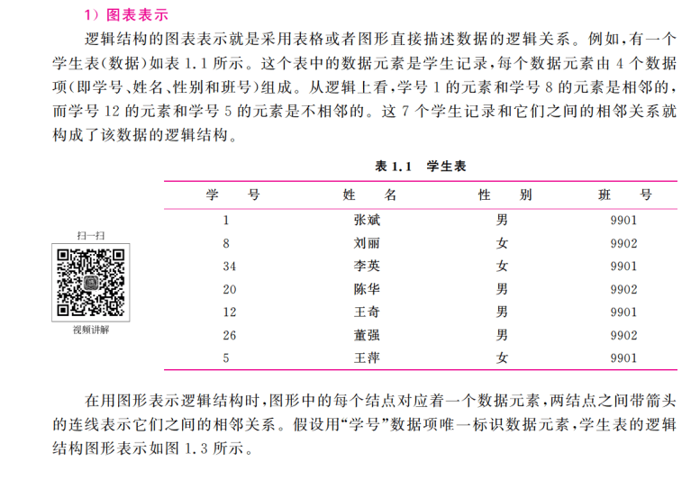

  - **二元组表示（主要的）**

    **B = （D , R）**

    > B——数据结构
    > **D——数据元素的集合**
    > **R——D上二元关系的集合**
    >
    > **用<>表示的是从左到右顺序不可更改**
    >
    > **()表示连上即可，可以颠倒过来**

    - 线性结构二元组表示

      ```
      学生表=（D,R）
      D={100,101,102,103}
      R={r}
      r={<100,101>,<101,102>,<102,103>}
      ```

    - 树的二元组表示

      ```
      B1 = （D，R）
      D = {a，b，c，d，e，f，g，h，i，j}
      R = {r}
      r = { <a，b>，<a，c>，<a，d>，<b，e>，<c，f>，<c，g>，<d，h>，<d，i>，<d，j> }
      ```

    - 无向图的二元组表示

      ```
      B2 = （D，R）
      D = {a，b，c，d，e}
      R = {r}
      r = { (a，b)， (a，c)， (b，c)， (c，d)， (c，e)， (d，e) }
      ```

      > 一个关系

    - 有向图的二元组表示

      ```
      B3 = （D，R）
      D = {48，25，64，57，82，36，75}
      R = {r1 ， r2}
      
      r1 = {<48，25>，<48，64>，<64，57>，<64，82>，<25，36>，<82，75>}
      
      r2 = {<25，36>，<36，48>，<48，57>，<57，64>，<64，57>，<75，82>}
      ```

      > 两个关系

    - 矩阵的二元组表示

      ```
      B = {D,R}
      D = {2,6,3,1,8,12,7,4,5,10,9,11}
      R = {r1 ,r2} （r1表示行关系,r2表示列关系）
      
      r1 = {<2,6>,<6,3>,<3,1>,<8,12>,<12,7>,<7,14>,<5,10>,<10,9>,<9,11>}（行关系）
      
      r2 = {<2,8>,<8,5>,<6,12>,<12,10>,<3,7>,<7,9>,<1,4>,<4,11>}（列关系）
      ```

      > 特点：有两个关系

    > 设某数据结构的二元组形式表示为  A=(D  ,  R)  ,  D={01  ,  02  ,  03  ,  04  ,  05  ,  06  ,  07  ,  08  ,  09}  ,  R={r}  ,  r={<01  ,  02>  ,  <01  ,  03>  ,  <01  ,  04>  ,  <02  ,  05>  ,  <02  ,  06>  ,  <03  ,  07>  ,  <03  ,  08>  ,  <03  ,  09>}  ,则数据结构A是（）  。
    >
    > 1. 线性结构
    > 2. 树型结构
    > 3. 物理结构
    > 4. 图型结构

### 存储（物理）结构

1. **顺序存储结构**

  顺序存储结果是借助元素在存储器中的位置来表示数据元素之间的逻辑关系的，通常借助程序设计语言的数组类型来描述。**顺序存储结构要求所有的元素依次存放在一片连续的存储空间中**

  **第n个数据的存储地址**为：第一个数据的起始地址 +（n-1）* 数据类型大小

  > 逻辑上相邻的结点存储在物理位置上也相邻的连续存储单元
  >
  > 可以存储线性结构与非线性结构

2. **链式存储结构**

  **链式存储结构无须占用一整块存储空间**。为了表示结点之间的关系，需要给每个结点附加指针字段，用于存放后继元素的存储地址。所以通常借助程序设计语言的指针类型来描述

  > 可以存储线性结构与非线性结构

3. **索引存储结构**

  > 如分块查找

4. **散列（哈希）存储 结构**

  > 如哈希查找

### 数据运算

- 数据运算是指对数据实施的操作，如：插入删除等

  > 运算定义是运算功能的描述，是抽象的，是基于逻辑结构的。运算实现是程序员完成运算的实现算法，是具体的，是基于存储结构的

### 数据类型与抽象数据类型

- **数据类型是一组性质相同的值的集合和定义在此集合上的一组操作的总称**，是某种程序设计语言中已实现的数据结构。**例如，整型变量它的值集为整数的某区间，定义在其上的操作为加减乘除**

- **抽象数据类型**（Abstract Data Type，**ADT**）指的是用户进行软件系统设计时从问题的**数学模型中抽象出来的逻辑数据结构**上的运算，而**不考虑**计算机的具体存储结构和运算的**具体实现**算法。

  **ABT一般指用户定义的、表示应用问题的数学模型，以及定义在这个模型上的一组操作的总称，具体包含3个部分：数据对象、数据对象上关系的集合以及对数据对象基本操作的集合**

  > 也就是对于某些问题，只需根据数学相关知识想出对应的思路，而实现不实现的了不管

- 抽象数据类型的两个重要特征

  1. **数据抽象**，是指用ADT描述程序处理的实体时强调的是其本质的特征、其所能完成的功能以及它和外部用户的接口（即外界使用它的方法）
  2. **数据封装**，是指将实体的外部特性和其内部实现细节分离，并且对外部用户隐藏其内部实现细节。

  > 从数据结构的角度看，一个求解问题可以通过抽象数据类型来描述，也就是说，抽象数据类型对一个求解问题从逻辑上进行了准确的定义，所以**抽象数据类型由数据逻辑结构和运算定义两部分组成**。抽象意味着一个抽象数据类型可能有多种实现方式

## 算法

**对操作的描述。即要求计算机进行操作的步骤**，也就是算法，算法用于**解决“做什么”和“怎么做”问题**

算法是**对特定问题求解步骤**的**一种描述**，他是指令的**有限序列**

> 用我的话来说就是：解决问题的一种思想或描述

> **算法是为了解决某类问题而规定的一个有限长的操作序列。一个算法必须满足以下五个特效**

### 算法5大特性

- **输入**（零/多)

- **输出**（至少一个）

- **确定性：算法的每一个步骤都具有确定的含义，不会出现二义性**

- **有穷性：任意一个算法在执行有穷个计算步骤后必须终止**

- **可行性：算法的每一步必须是可行的**

  > 口诀：**输入输出确定有穷可行**

### 算法的描述方式

1. 自然语言

2. 伪代码

3. 传统的流程图

   |    符号    |    名称     |         含义         |
   | :--------: | :---------: | :------------------: |
   |    椭圆    |   起止符    |   算法的开始和结束   |
   | 平行四边形 | 输入/输出框 |    输入/输出操作     |
   |    矩形    |   处理框    | 对框内的内容进行处理 |
   |    菱形    |   判断框    | 对框内的条件进行判断 |
   |    箭头    |   流程线    |    表示流程的方向    |

4. N-S图

5. 计算机语言

### 算法的评价标准

- **正确性**：在合理的数据输入下，能够在有限的运行时间内得到正确的结果

- **可读性**

- 健壮性：输入数据非法时，好的算法能适当的做出正确反映进行处理，而不会产生一下莫名其妙的输出结果

- **高效率与低存储量需求**：**时间复杂度和空间复杂度是衡量算法的两个主要指标**

  > 高效可读健壮的正确性
  >
  > 可行性对应可使用性
  >
  > 确定性对于正确性

## 算法分析

### 时间复杂度

> 有事后统计法、事前估算法

**算法效率分析的目的是看算法实际是否可行，并在同一个问题存在多个算法时，可进行时间和空间性能上的比较，以便从中挑选出较优算法**

**衡量算法效率的方法主要有两类：事后统计法和事前分析估算法**

**不考虑计算机的软硬件等环境影响，影响算法时间代价的最主要因素是问题规模**

**设每条语句执行一次所需的时间均为单位时间，则一个算法的执行时间可用该算法中所有语句频度之和来度量**

**算法的时间复杂度不仅与问题的规模有关，还与问题的其他因素有关**

- 算法的问题规模为n

- 常数阶：即不带问题规模n的时间复杂度

  - 如：10000次=T（1）

- > **O(1) < O(log2 n) < O(n) < O(nlog2 n) < O(n^2) <O(n^3) < O(2^n) < O(n!)**
  >
  > 在算法中，我们主要考察最坏与平均的时间复杂度情况：
  >
  > 1. 最坏情况时间复杂度（Worse-case Time Complexity）：这是一种保守的估计，表示最不利情况下的时间消耗，这**对于关键任务和高稳定性系统至关重要**。选择算法时，我们通常会考虑最坏情况的时间复杂度，以保证即使在最不利的情况下，算法的性能也能符合预期。
  > 2. 平均情况时间复杂度（Average-case Time Complexity）：平均时间复杂度描述的是在所有输入中随机抽取一个，算法可能的平均运行时间。这对于**评估算法的整体效率**十分有用。

### 空间复杂度

**只需分析算法在实现时所需要的辅助空间就可以**

> **若算法执行所需要的辅助空间相对于输入数据量而言是个常数，则称这个算法为原地工作**，辅助空间为O（1）

- S（n）=O（n）来表示

# 线性表

**有n（n>=0）个数据特性相同的元素构成的有序序列称为线性表。线性表中元素的个数n定义为线性表的长度，n=0时称为空表**

> 无论是线性表的顺序存储还是链式存储，其元素可以是任意数据类型，包括简单的整数、字符，也可以是复杂的如结构体、类的实例等

## 基本概念

**线性表是一个具有相同特性的数据元素的有限序列。**

> 一致性（相同特性）：所有元素属于同一数据类型。
>
> 有穷性：数据元素个数是有限的。
>
> 序列：数据元素由逻辑序号唯一确定。一个线性表中可以有相同值的元素。**一个线性表中所有元素之间的相对位置是线性的**
>
> 线性表的入和出的操作都要考虑元素是否满|空

- 非空**线性表的特点**
  1. 存在唯一一个被称为“第一个”的数据元素
  2. 存在唯一一个被称为“最后一个”的数据元素
  3. 除第一个数据元素之外，结构中的每个数据元素均只有一个前驱
  4. 除最后一个数据元素之外，结构中的每个数据元素均只有一个后继

## 顺序表

**顺序表指的是用一组地址连续的存储单元存储线性表的数据元素**，该表示也称为**顺序映像**。**用顺序存储结构的线性表称为顺序表，其特点是逻辑上相邻的数据元素，其物理次序也是相邻的**

> **有随机存取的特点，所以称为随机存取结构**

按逻辑顺序依次存储到存储器中一片连续的存储空间中。

- 定义

  ```c
  typedef struct 
  {  
     //ElemType data[MaxSize];
      ElemType *data  //存储空间的基地址
     int length;
  } SqList;    	//顺序表类型  
  ```

  > 说明：注意逻辑位序和物理位序相差1。

- 各算法实现：

  > **插⼊数据要判满，删除数据要判空**
  >
  > 插⼊删除有可能移动数据
  >
  > **顺序表中插入一个元素平均移动n/2次，删除一个元素平均移动(n-1)/2，两者的时间复杂度都是O（n）**

  ```c
  //1.建立顺序表
  void CreateList(SqList * &L，ElemType a[]，int n){ 
     L=(SqList *)malloc(sizeof(SqList));
     for(int i=0;i<n;i++)
         L->data[i]=a[i];
     L->length=n;
  }
  ```

  ```c
  //2.初始化线性表
  void InitList(SqList *&L){  
     L=(SqList *)malloc(sizeof(SqList));
  　　　　//分配存放线性表的顺序表空间
     L->length=0;
  }
  ```

  ```c
  //3.销毁
  void DestroyList(SqList *&L){
      free(L);
  }   
  ```

  ```c
  //4.判断空
  bool ListEmpty(SqList *L){
     return(L->length==0);
  }
  ```

  ```c
  //5.长度
  int ListLength(SqList *L){
       return(L->length);
  }
  ```

  ```c
  //6.输出
  void DispList(SqList *L){  
     int i;
     if (ListEmpty(L)) 
         return;
     for (i=0;i<L->length;i++)
        printf("%c"，L->data[i]);
     printf("\n");
  } 
  ```

  ```c
  //7.根据位序访问值
  bool GetElem(SqList *L，int i，ElemType &e){     
     if (i<1 || i>L->length)  //i是位序，所以最小是1，最大是length
         return false;
     e=L->data[i-1];
     return true;
  }  
  ```

  ```c
  //8.按元素值查找位序
  int LocateElem(SqList *L，ElemType e){  
     for(int i=0;i<L->length;i++)
         if(e==L->data[i])
             return i+1;
      return 0;
  }
  ```

  ```c
  //9.插入数据
  bool  ListInsert(SqList *&L，int i，ElemType e)
  {  int j;
     if (i<1 || i>L->length+1)
        return false;		//参数错误时返回false
     i--;				//将顺序表逻辑序号转化为物理序号
     for (j=L->length;j>i;j--)	//将data[i..n]元素后移一个位置
  	  L->data[j]=L->data[j-1];
     L->data[i]=e;		//插入元素e
     L->length++;		//顺序表长度增1
     return true;		//成功插入返回true
  }
  ```

  > **数据元素的逻辑值会发生变化**

  ```c
  //10.删除数据
  bool ListDelete(SqList *&L，int i，ElemType &e)
  {  int j;
     if (i<1 || i>L->length)	　	//参数错误时返回false
        return false;
     i--;					//将顺序表逻辑序号转化为物理序号
     e=L->data[i];
     for (j=i;j<L->length-1;j++)  	//将data[i..n-1]元素前移
  	L->data[j]=L->data[j+1];
     L->length--;			//顺序表长度减1
     return true;			//成功删除返回true
  }
  ```

  > **数据元素的逻辑值会发生变化**

## 链表

n个结点链接成一个链表即为线性表的链式存储结构。

- 线性表的链式存储结构**特点：用一组任意的存储单元存储线性表的数据元素，这组存储单元可以是连续的，也可以是不连续的**
- **链表的存取都要从头指针开始**，**顺链而行**，所以可称之为**顺序存取结构**

> 每个物理结点增加一个指向后继结点的指针域为单链表。
>
> 每个物理结点增加一个指向后继结点的指针域和一个指向前驱结点的指针域为双链表。
>
> 链表的存储是无序的，但是链表的查找还是得用顺序查找，叫做**顺序存取**
>
> 链表是**依靠指针来反映线性逻辑关系的**

- **首元结点、头结点和头指针的区分（重点）：**

  1. **首元结点指的是存储第一个数据元素的结点**

  2. **头结点：指首元结点的前一个结点，其指针域指向首元结点。头指针数据域可以存储于相同的数据元素信息，也可以不存储任何信息，一般是不存储任何信息或者说存储的信息对我们正常来讲用不上**

  3. **头指针：如果有头结点就指向头结点；没有就指向首元结点；若空表且没有头结点，则L=NULL；空表有头结点，则L->next=NULL**

     

  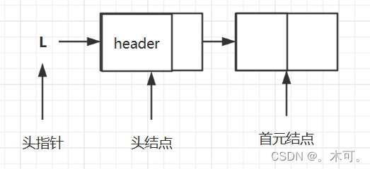

  > **增加头结点的优点：**
  >
  > 1. 由于第一个结点的位置被存放在头结点的指针域中，所以**链表在第一个位置的操作和在表其他位置上的操作一致，无需进行特殊处理。**‘
  > 2. 无论链表是否为空，其头指针是指向头结点的非空指针（空表中头结点的指针域为空），因此**空表和非空表的处理也就统一了**。带头结点的单链表L的判空条件为：L->next==NULL。
  >
  > **综上所述：头结点的引入统一了插入和删除操作对于在起始端和在其他位置的代码。**

### 单链表

> **单链表是由头指针唯一确定的**

- 单链表的考察（存储密度）

  **存储密度=数据占用的空间/结点总占用空间**

- 定义

  ```c
  typedef int ElemTyptypedef struct snode{e;
  typedef struct LNode{
  	ElemType data;
  	struct LNode * next;
  }LinkNode; //LNode强调的是结点，LinkNode强调的是链表
  ```

- 初始化

  ```c
  void initlist(LinkNode *&L){
  	L=(LinkNode *)malloc(sizeof(LinkNode));
  	L->next=NULL;
  }
  ```

- 初始化+创建

  > 创建有头插法和尾插法
  >
  > 头插法可以同于链表的逆置。逆序
  >
  > 尾插法正序

  ```c
  //1.头插法
  void createlisthead(LinkNode *&L,ElemType a[],int n){
  	LinkNode *s;  //先创建单结点，在分别为链表L和每次新建的新结点分配空间
  	//大小分别是链表的大小和结点的大小
  	L=(LinkNode *)malloc(sizeof(LinkNode));
  	L->next=NULL;
  	for(int i=0;i<n;i++){
  		s=(LinkNode *)malloc(sizeof(LNode));
  		s->data=a[i];
  		s->next=L->next;
  		L->next=s;
  	}
  }
  //2.尾插法
  void createlisttail(LinkNode *&L,ElemType a[],int n){
  	LinkNode *s,*r;  //尾指针
  	L=(LinkNode *)malloc(sizeof(LinkNode));
  	L->next=NULL;
  	r=L;
  	for(int i=0;i<n;i++){
  		s=(LinkNode *)malloc(sizeof(LNode));
  		s->data=a[i];
  		r->next=s;
  		r=s;
  	}
  	r->next=NULL;
  }
  ```

- 销毁链表

  ```c
  void destroylist(LinkNode *&L){
  	//销毁在于连头指针也要销毁
  	LinkNode *pre=L,*p=L->next;
  	while(p!=NULL){
  		free(pre);
  		pre=p;
  		p=p->next;
  	}
  	free(pre);
  }
  ```

- 判空

  ```c
  bool listempty(LinkNode *L){
  	return(L->next==NULL);
  }
  ```

- 输出

  ```c
  void displist(LinkNode *L){
  	LinkNode *p=L;
  	while(p->next!=NULL){
  		printf("%d,",p->next->data);
  		p=p->next;
  	}
  	printf("\n");
  }
  ```

- 求长度

  ```c
  int listlength(LinkNode *L){
  	int n=0;
  	LinkNode *p=L;
  	while(p->next!=NULL){
  		n++;
  		p=p->next;
  	}
  	return n;
  }
  ```

- 求第i个数据的值

  ```c
  bool getelem(LinkNode *L,int i,ElemType &e){
  	LinkNode *p=L->next;
  	if(i<=0)
  		return false;
  	for(int j=1;j<i;j++){
  		if(p==NULL)
  			return false;
  		p=p->next;
  	}
  	e=p->data;
  	return true;
  }
  //或者是（自写）
  bool getelem2(LinkNode *L,int i,ElemType &e){
  	LinkNode *p=L->next;
      int j=0;
  	if(i<=0)
  		return false;
  	while(p){
          j++;
  		if(j==i){
              e=p->data;
              return true;
          }
  		p=p->next;
  	}
  	return false;
  }
  ```

- 按元素值查找位置

  ```c
  int locatelist(LinkNode *L,ElemType e){
  	int i=1;
  	LinkNode *p=L->next;
  	if(p==NULL)
  		return false;
  	while(p->next!=NULL && e!=p->data){
  		i++;p=p->next;
  	}
  	if(e==p->data)
  		return i;
  	else 
  		return false;
  }
  ```

- 后插

  ```c
  bool insertlist(LinkNode *&L,int n,ElemType e){
  	LinkNode *p=L,*s;
  	int i;
  	if(n<1||n>listlength(L))
  		return false;
  	for(i=1;i<n && p->next!=NULL;i++){
  		p=p->next;
  	}
  	if(p->next==NULL)
  		return false;
  	else{
  		s=(LinkNode *)malloc(sizeof(LinkNode));
  		s->data=e;
  		s->next=p->next;
  		p->next=s;
  		return true;
  	}
  }
  //自写
  bool insertlist(LinkNode *&L,int n,ElemType e){
  	LinkNode *p=L->next,*pre=L,*s;
  	int i=0;
  	if(n<1||n>listlength(L))
  		return false;
  	while(p){
          i++;
          if(i==n){
          	s=(LinkNode *)malloc(sizeof(LinkNode));
              s->data=e;
              s->next=p;
              pre->next=s;
              return true;
          }
  		pre=p;
          p=p->next;
  	}
      return false;
  }
  ```

- 删除第i个位置的结点

  ```c
  bool deletelist(LinkNode *&L,int n,ElemType &e){
  	LinkNode *p=L,*q;//p是前指针，q是后指针，要free的
  	int i=0;
  	if(n<1)
  		return false;
  	while(i<n-1 && p->next!=NULL){
  		i++;
  		p=p->next;
  	}
  	if(p==NULL)
  		return false;
  	else{
  		q=p->next;
  		if(q==NULL)
  			return false;
  		e=q->data;
  		p->next=q->next;
  		free(q);
  		return true;
  	}
  }
  //自写
  bool deletelist(LinkNode *&L,int n,ElemType &e){
  	LinkNode *p=L->next,*pre=L;//p是前指针，q是后指针，要free的
  	int i=0;
  	if(n<1 || !p)
  		return false;
  	while(p){
          i++;
          if(i==n){
              e=p->data;
              pre->next=p->next;
              free(p);
              return true;
          }
          pre=p;
  		p=p->next;
  	}
      return false;
  }
  ```

### 双链表

- **插入结点步骤**(在p的结点后插入s)

  1. s->next=p->next
  2. p->next->prior=s
  3. s->prior=p
  4. p->next=s

  > **操作4必须在1和2后面，其他任意**

- **删除结点步骤**（删除p的后继结点q）

  1. p->next=q->next
  2. p->next->prior=p
  3. free(q)

- **链表算法**

> 与单链表大同小异，下面只写有区别的

- 定义

  ```c
  typedef int ElemType;
  typedef struct LNode{
  	ElemType data;
  	struct LNode * next,*prior;
  }LinkNode; 
  ```

- 创建

  > 创建有头插法和尾插法
  >
  > **头插法等同于链表的逆置。逆序**
  >
  > 尾插法正序

  ```c
  //1.头插法
  void createlist(LinkNode *&L,ElemType a[],int n){
  	LinkNode *s;
  	L=(LinkNode *)malloc(sizeof(LinkNode));
  	L->prior=L->next=NULL;
  	for(int i=0;i<n;i++){
  		s=(LinkNode *)malloc(sizeof(LNode));
  		s->data=a[i];
  		s->next=L->next;
  		if(L->next!=NULL)
  			L->next->prior=s;
  		s->prior=L;
  		L->next=s;
  	}
  }
  //2.尾插法
  void createlist2(LinkNode *L,ElemType a[],int n){
  	LinkNode *s,*r;
  	L=(LinkNode *)malloc(sizeof(LinkNode));
  	r=L;
  	for(int i=0;i<n;i++){
  		s=(LinkNode *)malloc(sizeof(LinkNode));
  		s->data=a[i];
  		r->next=s;
  		s->prior=r;
  		r=s;
  	}
  	r->next=NULL;
  }
  ```

- 初始化

  ```c
  void initlist(LinkNode *&L){
  	L=(LinkNode *)malloc(sizeof(LinkNode));
  	L->next=NULL;
  	L->prior=NULL;
  }
  ```

- 判空

  ```c
  bool listempty(LinkNode *L){
  	return(L->next==NULL && L->prior==NULL);
  }
  ```

### 循环链表

#### 单循环链表

**将单链表的最后一个结点的指针域指向头结点（即尾结点r->next=L，L指向头结点，因此r->next=head），使整个链表形参一个环，这种首尾相接的链表就称为循环链表**

> 从任意一个结点出发都可以找到其他结点

#### 双循环链表

**头结点的prior还要指向尾结点。当表空时头结点的next和prior都为L**

### 静态链表


### 线性表应用（刷题）

#### 顺序表必刷

- [[合并两个有序数组](https://leetcode.cn/problems/merge-sorted-array/)](https://leetcode.cn/problems/kth-node-from-end-of-list-lcci/)

  **O（m*n）**

  ```c
  void merge(int* nums1, int nums1Size, int m, int* nums2, int nums2Size, int n) {
      for (int i = 0; i != n; ++i) {
          nums1[m + i] = nums2[i];
      }
      int t;
      for(int j=0;j<n+m;j++){
          for(int i=0;i<n+m-1;i++){
          if(nums1[i+1]<nums1[i]){
              t=nums1[i];
              nums1[i]=nums1[i+1];
              nums1[i+1]=t;
          }
      }
      }
  }
  ```

- [排序数组](https://leetcode.cn/problems/sort-an-array/)

  ```c
  int* sortArray(int* nums, int numsSize, int* returnSize) {
      *returnSize = numsSize;
      int t;
      bool flag;
      for(int i=0;i<numsSize;i++){
          flag=false;
          for(int j=0;j<numsSize-1;j++){
              if(nums[j]>nums[j+1]){
                  t=nums[j];
                  nums[j]=nums[j+1];
                  nums[j+1]=t;
                  flag=true;  //如果有交换则退出
              }
          }
          //如果没交换表示已排好，退出
          if(!flag)
              break;
      }
      return nums;
  }
  ```

- [二分查找](https://leetcode.cn/problems/binary-search/)

  ```c
  int search(int* nums, int numsSize, int target) {
      int front=0,rear=numsSize-1,mid;
      // 思路：先取一个中间数，如果小则范围边0-中间，大则中间-大
      while(front<=rear){
          mid=(front+rear)/2;
          if(target<nums[mid])
              rear=mid-1;
          else if(target>nums[mid])
              front=mid+1;
          else
              return mid;
      }
      return -1;
  }
  ```

- [反转字符串](https://leetcode.cn/problems/reverse-string/)

  ```c
  void reverseString(char* s, int sSize) {
      int j,i=sSize-1;
      char c;
      for(j=0;j<sSize/2;j++){
          c=s[j];
          s[j]=s[i];
          s[i--]=c;
      }
  }
  ```

#### 链表必刷

- [返回倒数第 k 个结点](https://leetcode.cn/problems/kth-node-from-end-of-list-lcci/)

  ```c
  /**定义类型
   * struct ListNode {
   *     int val;
   *     struct ListNode *next;
   * };
   */
  //方法2.用双指针
  int kthToLast(struct ListNode* head, int k){
      //他这里的head是首结点
      if(head->next==NULL)  //当只有一个元素的时候，更快，且更省空间
          return head->val;
      struct ListNode *p=head,*pre=p;
      for(int i=0;i<k;i++){
          p=p->next;
      }
      while(p){
          p=p->next;
          pre=pre->next;
      }
      return pre->val;
  }
  ```

- [合并两个有序链表](https://leetcode.cn/problems/merge-two-sorted-lists/)

  ```c
  struct ListNode* mergeTwoLists(struct ListNode* list1, struct ListNode* list2) {
      if(!list1)
          return list2;
      else if(!list2)
          return list1;
      struct ListNode *list3=(struct ListNode *)malloc(sizeof(struct ListNode));
      // list3->next=NULL;   //malloc开辟了空间后，自动创建头结点，因此也就不用自己初始化了
      struct ListNode *l1=list1,*l2=list2,*p,*r=list3;
      while(l1&&l2){
          if(l1->val<l2->val){
              p=l1;
              l1=l1->next;
          }
          else{
              p=l2;
              l2=l2->next;
          }
          r->next=p;
          r=p;
      }
      if(l1){
          r->next=l1;
      }
      else if(l2){
          r->next=l2;
      }
      return list3->next;   //不能返回list3，会包括头指针进去
  }
  ```

- 反转链表

  ```c
  struct ListNode* reverseList(struct ListNode* head) {
      struct ListNode *p=head,*q=NULL,*next;
      while(p){
          next=p->next;
          p->next=q;
          q=p;  //第一次这里执行的时候，q就是拿到了头结点，所以最后返回的是q
          p=next;
      }
      return q;
  }
  ```

## 有序表

> **注意区分顺序表和有序表的概念：有序表要求数据是有序存放的，顺序表没有这个要求**
>
> 很显然，有序表是线性表的一个子集。
>
> 有序表也可以用顺序存储实现或链式存储实现

- 以顺序表存储有序表

  ```c
  void ListInsert(SqList *&L，ElemType e)
  {  int i=0，j;
     while (i<L->length && L->data[i]<e)
        i++;				//查找值为e的元素
     for (j=ListLength(L);j>i;j--)	//将data[i..n]后移一个位置
        L->data[j]=L->data[j-1]; 
     L->data[i]=e;
     L->length++;			//有序顺序表长度增1
  }
  ```

- 以单链表存储有序表

  ```c
  void ListInsert(LinkNode *&L，ElemType e)
  {  LinkNode *pre=L，*p;
  
     while (pre->next!=NULL && pre->next->data<e)
  	pre=pre->next; 	//查找插入结点的前驱结点pre
  
     p=(LinkNode *)malloc(sizeof(LinkNode));
     p->data=e;			//创建存放e的数据结点p
     p->next=pre->next;		//在pre结点之后插入p结点
     pre->next=p;
  }
  ```

- **重点应用：二路归并**

  - 顺序

    **O(n*m)**

    ```c
    void UnionList(SqList *LA，SqList *LB，SqList *&LC)
    {  int i=0，j=0，k=0;	 //i、j分别为LA、LB的下标，k为LC中元素个数
       LC=(SqList *)malloc(sizeof(SqList)); 	//建立有序顺序表LC
       while (i<LA->length && j<LB->length)
       {  if (LA->data[i]<LB->data[j])
          {  LC->data[k]=LA->data[i];
    	  i++;k++;
          }
          else	       //LA->data[i]>LB->data[j]
          {  LC->data[k]=LB->data[j];
    	  j++;k++;
          }
      }   
         while (i<LA->length)	//LA尚未扫描完，将其余元素插入LC中
         {	LC->data[k]=LA->data[i];
    	i++;k++;
         }
         while (j<LB->length)	//LB尚未扫描完，将其余元素插入LC中
         {	LC->data[k]=LB->data[j];
    	j++;k++;
         }
         LC->length=k;
    }
    ```

  - 链式

    ```c
    void UnionList1(LinkNode *LA，LinkNode *LB，LinkNode *&LC)
    {  LinkNode *pa=LA->next，*pb=LB->next，*r，*s;
       LC=(LinkNode *)malloc(sizeof(LinkNode));	//创建LC的头结点
       r=LC;					//r始终指向LC的尾结点
       while (pa!=NULL && pb!=NULL)
       {  if (pa->data<pb->data)
          {  s=(LinkNode *)malloc(sizeof(LinkNode));  //复制结点
    	  s->data=pa->data;
    	  r->next=s;r=s;			//采用尾插法将s插入到LC中
    	  pa=pa->next;
          }
          else
          {  s=(LinkNode *)malloc(sizeof(LinkNode));   //复制结点
    	  s->data=pb->data;
    	  r->next=s;r=s;			//采用尾插法将s插入到LC中
    	  pb=pb->next;
          }
       }
       while (pa!=NULL)
       {  s=(LinkNode *)malloc(sizeof(LinkNode));    //复制结点
          s->data=pa->data;
          r->next=s;r=s;			//采用尾插法将s插入到LC中
          pa=pa->next;
       }
       while (pb!=NULL)
       {  s=(LinkNode *)malloc(sizeof(LinkNode));    //复制结点
          s->data=pb->data;
          r->next=s;r=s;			//采用尾插法将s插入到LC中
          pb=pb->next;
       }
       r->next=NULL			//尾结点的next域置空
    }
    ```

# 栈与队列

> 栈和队列是操作受限制的线性表

## 栈

**栈（stack）是限定尽在表尾进行插入和删除操作的线性表。表尾称为栈顶（top），表头称为栈底**（bottom）。**不含元素的空表称为空栈**

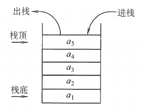

> **LIFO**
>
> - **线性表和栈易混淆点**
>   1. **表头表尾指的是线性表的表头表尾，其中表头==栈的栈底，表尾==栈的栈顶**
>   2. **栈顶栈底是指栈的栈顶栈底**

### 顺序栈

> 演示：[Array Stack Visualization (usfca.edu)](https://www.cs.usfca.edu/~galles/visualization/StackArray.html)

- 定义：

  ```c
  typedef struct{ 
      Elemtype data[Maxsize]; 
      int top;
  //    int base;   //小红书里的定义栈底
  }SqStack;
  ```

  - **栈空（初始化）：s->top==-1|0**

  - **栈满：s->top==Maxsize-1**

  - 进栈：指针**先加**1；另一种是先放数据再动指针（用于下个数据的存放）

  - 出栈：**先取**出来，指针**再减**1


  > **栈非空时，top始终指向栈顶元素的上一个位置**
  >
  > 注意看题目需求条件，栈空也可以从top==0开始，然后入栈就是后指针，出栈就是先指针
  >
  > n个元素的合法出栈序列个数**（卡特兰数）：**
  >
  > **Cn 2n/(n+1)      ==         An 2n/(n! * (n+1))**
  >
  > 例如n=4时，=8*7*6*5/(4! * 5)=14

- 各算法实现

  ```c
  void initlist(SqStack *&s){
  	s=(SqStack *)malloc(sizeof(SqStack));
  	//因为传入的是指针型s所以要用->的方式访问
  	s->top=-1;  //顺序栈初始化栈顶-1
  }
  void destroylist(SqStack *&s){
  //对于用顺序存储实现的即用数组实现的结构释放空间都是直接释放整个，不用逐一释放
  	free(s);
  }
  bool Stackempty(SqStack *s){
  	return (s->top==-1);
  }
  //进栈
  bool push(SqStack *&s,Elemtype e){
  	if(s->top==Maxsize-1)
  	//栈满
  		return false;
  	//入栈操作：先加后放
  	s->top++;
  	s->data[s->top]=e;
  	//上面两句等价于s->data[++s->top]=e;
  	return true;
  }
  //出栈
  bool pop(SqStack *&s,Elemtype &e){
  	if(s->top==-1){ 
  	//栈空
  		return false;
  	}
  	//出栈顺序：先出后减
  	e=s->data[s->top];
  	s->top--;
  	//等价于e=s->data[s->top--];
  	return true;
  }
  bool gettop(SqStack *s,Elemtype &e){
  	//栈空则取不出
  	if(s->top==-1)
  		return false;
  	e=s->data[s->top];
  	return true;
  }
  void displist(SqStack *s){
  	while(s->top!=-1){
  		printf("%d,",s->data[s->top--]);
  	}
  }
  ```

  > 因为入栈与出栈不需要移动表中元素，因此入栈出栈**时间复杂度都是O（1）**

### 顺序共享栈


> 是为了节省普通顺序栈中浪费的空间

- 定义：

  ```c
  typedef struct{ 
      Elemtype data[Maxsize]; 
      int top,top2; //top是左边下标从0开始的栈，top2是右边下标从Maxsize开始的栈 
  }SqStack;
  ```

  - 栈空（初始化）：栈1空为top1==-1；栈2空为top2==Maxsize

  - 栈满：**top1==top2-1**

  - 进栈：先动指针

  - 出栈：先取出来，再动指针

- 算法的实现：多了一个变量用来判断是对哪个栈进行操作，了解即可

### 链栈

**链栈的栈顶指针s是指向栈顶结点的，也就是线性表的表尾元素。插入操作相当于每次都在栈顶指针和栈顶结点（首元结点）间插入新结点**

- **栈顶结点（首元结点）：第一个有数据的栈的结点**
- 栈底结点：类似线性表的表尾结点，其next指针==NULL
- **栈顶指针：带头结点就指向头结点；不带头结点则指向栈顶结点的指针如s，空则为NULL**

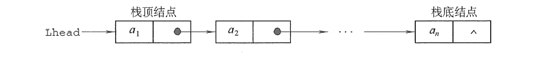

> [Linked List Stack Visualization (usfca.edu)](https://www.cs.usfca.edu/~galles/visualization/StackLL.html)
>
> **用于不知道栈最大容量的情况下**
>
> **栈底存在时，栈底->next==NULL**

- 定义：

  ```c
  typedef struct linknode{ 
      Elemtype data; 
      struct linknode *next; 
  }LinkStNode;
  ```

  - **栈空（初始化）：s==NULL|s->next=\=NULL**

  - 栈满：不会栈满

  - 进栈：新建结点**头插法**

  - 出栈：**取出第一个值**后删除结点

    > p=head->next;e=p->data;head->next=p->next;free(p);

- 各算法的实现

  > **s表示的是不带头结点的栈顶指针，L是带头结点的栈顶指针，两者的操作各不相同**
  >
  > **显然以链表的头部作为栈顶是最方便的，而且没必要像单链表那样为了操作方便附加一个头结点。**

  **不用头结点的方式：**

  ```c
  // 初始化
  void InitStack(LinkStack &S) {
      // 此为不带头结点的栈，与单链表相似，初始将栈顶指针指向NULL即可
      S = NULL;
  }
  // 判空
  bool Empty(LinkStack S) {
      // 栈为空的条件即栈顶指针指向NULL
      if(S == NULL) {
          return true;
      }
      return false;
  }
  // 入栈操作
  // 由于栈只能从一端操作，所以每次都应该是从栈顶入栈
  bool Push(LinkStack &S, int e) {
      // 申请分配空间
      LSNode *p = (LSNode*)malloc(sizeof(LSNode));
      // 内存分配失败的情况
      if(s == NULL) {
          return false;
      }
      p->data = e;
      // 由于每次都是从栈顶指针处插入，所以无需特殊处理
      // 令s指向S之前指向的地址
      p->next = S;
      // 使头指针指向p
      S = p;
      return true;
  }
  // 出栈操作
  // 类似于单链表的删除操作，不过只能在栈顶进行出栈
  bool Pop(LinkStack &S, int &e) {
      // 如果是空栈，则不可进行出栈操作
      if(S == NULL) {
          return false;
      }
      // 出栈结点即为栈顶指针指向的结点
      // 将出栈结点值赋给e
      e = S->data;
      // 临时结点，用于之后释放空间
      LSNode* p = S;
      // 使头指针指向下一个结点
      S = S->next;
      // 释放空间
      free(p);
      return true;
  }
  // 获取栈顶元素
  bool GetTop(LinkStack S, int &e) {
      // 栈为空的情况
      if(S == NULL) {
          return false;
      }
      e = S->data;
      return true;
  }
  // 输出栈中所有元素
  // 由于栈只能从一端进行操作，所以想要输出所有元素，就必须要将所有元素弹出并输出
  void PrintStack(LinkStack S) {
      if(Empty(S)) {
          printf("the stack is empty!");
      }
      while(!Empty(S)) {
          int x;
          Pop(S, x);
          printf("pop:%d\n", x);
      }
  }
  ```

  **用头结点的方式**

  ```c
  void initlist(LinkStNode *&L){
  	L=(LinkStNode *)malloc(sizeof(LinkStNode));
  	L->next=NULL;
  }
  void destroylist(LinkStNode *&L){
  	linknode *p=L->next,*q=L;
  	//销毁链表并不需要使头指针一直指向删除后的剩下的结点
  	while(p!=NULL){  //p为NULL时，q为尾结点
  		free(q);
  		q=p;  //指向删除结点的下一个结点
  		p=p->next;
  	}
  	free(q);  //一个个释放结点
  }
  bool Stackempty(LinkStNode *L){
  	return (L->next==NULL);
  }
  //因为链栈不会满，所以不用判定是否满了，所以用void
  void push(LinkStNode *&L,Elemtype e){
  	LinkStNode *p=(LinkStNode *)malloc(sizeof(linknode));
  	p->data=e;
  	p->next=L->next;
  	L->next=p;
  }
  bool pop(LinkStNode *&L,Elemtype &e){
  	if(L->next==NULL)
  		return false;
  	linknode *p=L->next;
  	e=p->data;
  	L->next=p->next;
  	free(p);
  	return true;
  }
  bool gettop(LinkStNode *&L,Elemtype &e){
  	if(L->next==NULL)
  		return false;
  	e=L->next->data;
  	return true;
  }
  
  void displist(LinkStNode *L){
  	linknode *p=L->next;
  	while(p!=NULL){
  		printf("%d,",p->data);
  		p=p->next;
  	}
  }
  ```

## 栈的应用

> - **括号匹配**
> - **表达式求值**
> - **递归**：**所谓递归，是指若在一个函数、过程或数据结构定义的内部又直接（或间接）出现定义本身的应用，则称它们是递归的，或者是递归定义的。**
>
> - 求解迷宫
> - **（二）进制转换**
> - c语言中临时变量
> - 汉诺塔问题
> - 八皇后问题

- 判断字符串是否为对称串

  ```c
  bool symmetry(char str[]){
  	Elemtype e; //用来接收退栈的值来与字符串第一位开始比较
  	//什么时候需要自己定义结构指针？
  	//当题目没给你结构体指针时你需要自行定义并初始化结构
  	//或者是你需要自行把数据插进去时，就可以采用
  	
  	SqStack *s;  //定义顺序栈指针
  	initlist(s);
  	for(int i=0;str[i]!='\0';i++){
  		//先遍历一次字符串，将全部插入栈中
  		push(s,str[i]);
  	}
  	for(int i=0;str[i]!='\0';i++){
  		pop(s,e);
  		if(str[i]!=e){
  			//题目没要求销毁栈，但是判断已经完成，该栈无用了，故可以销毁掉
  			destroylist(s);  
  			return false;
  		}
  	}
  	destroylist(s);
  	return true;
  }
  ```

- 检查圆括号是否配对

  ```c
  bool check(char str[]){
  	int i=0;Elemtype e;
  	SqStack *s;  //定义顺序栈指针
  	initlist(s);
  	if(str[i]=='\0')
  		return false;
  	
  	while(str[i]!='\0'){
  		if(str[i]=='(')
  			push(s,'(');
  		else if(str[i]==')'){
  			gettop(s,e);
  			if(e=='('){
  				pop(s,e);
  				e='\0';  //用完e临时变量后清空
  			}
  			else
  				return false;
  		}
  		i++;
  	}
  	if(Stackempty(s)==1)
  		return true;
  	else
  		return false;
  }
  ```

- 表达式求值

  - 前缀表达式==先序遍历

  - **中缀表达式（加括号）==中序遍历**

  - 后缀表达式==后序遍历

    > 前缀表达式也叫波兰表达式，后缀表达式也叫逆波兰表达式
    >
    > **转换规则：转换后的运算数的相对位置不能变，但是运算符号可以改变位置，意味着一个中缀表达式可能有多个后缀表达式或前缀表达式。但如果按相同运算符等级从左到右则转换的结果唯一**
    >
    > 转化成后缀表达式后的运算符的从左到右的顺序就是原本中缀表达式中运算符的执行顺序
    >
    > 前缀：运算符在中缀表达式的操作数的前面；后缀：运算符在中缀表达式的操作数的后面；也就是遵循就近原则
    >
    > **如中缀：1+2*3**
    >
    > - **前缀：+1*2 3**
    > - **后缀：1 2 3 * +**

  - 核心算法：

    ```c
    void trans(char *exp,char postexp[]){
    	char e;
    	SqStack * Optr;
    	initlist(Optr);
    	int i=0;
    	while(*exp!='\0')
    	{
    		switch(*exp)
    		{
    			case '(':
    				push(Optr,'(');
    				exp++;  //字符串加1表示下一个字符的地址，即下一个字符
    				break;
    			case ')':
    				pop(Optr,e);
    				while(e!='(')
    				{
    					postexp[i++]=e;
    					pop(Optr,e);
    				}
    				exp++;
    				break;
    			case '+':
    			case '-':
    				while(!Stackempty(Optr))
    				{
    					gettop(Optr,e);
    					if(e!='(')
    					{
    						postexp[i++]=e;
    						pop(Optr,e);
    					}
    					else
    						break;
    				}
    				push(Optr,*exp);
    				exp++;
    				break;
    			case '*':
    			case '/':
    				while(!Stackempty(Optr))
    				{
    					gettop(Optr,e);
    					if(e=='*'||e=='/')
    					{
    						postexp[i++]=e;
    						pop(Optr,e);
    					}
    					else
    						break;
    				}
    				push(Optr,*exp);
    				exp++; 
    				break;
    			default:
    				while(*exp>='0'&&*exp<='9')
    				{
    					postexp[i++]=*exp;
    					exp++;
    				}
    				postexp[i++]='#';
    		}
    	}
    	while(!Stackempty(Optr))
    	{
    		pop(Optr,e);
    		postexp[i++]=e;
    	}
    	postexp[i]='\0';
    	destroylist(Optr);
    }
    ```

    > 后缀表达式是从左到右入栈
    >
    > 前缀表达式是从右到左入栈

## 队列

队列（queue）是一种**先进先出**（FIFO）的线性表，它**只允许在表的一端（表尾或队尾）进行插入，而在另一端（表头或队头）删除元素。**

**由于队列的修改是按先进先出的规则进行的，所以队列又叫先进先出表。**最早进入队列的元素最早离开。在队列中，**允许插入的一端称为队尾（rear），允许删除的一端称为队头（front）。**

> **FIFO**，**尾进头出**，运算受限的顺序表

### 顺序队

> [Array Queue Visualization (usfca.edu)](https://www.cs.usfca.edu/~galles/visualization/QueueArray.html)

- 定义：

  ```c
  typedef struct{ 
      elemtype data[Maxsize]; 
      int rear,front;  //头指针和尾指针的下标 
  }SqQueue;
  ```

  - 初始化：q->rear==q->front**==-1|0**

  - **队空：q->front==q->rear**

    > **不一定==-1，也可以是0**

  - 队满：q->rear==Maxsize-1

  - **入队：++rear**

  - **出队：++front**


  > 如果题目要求初始化从0开始，那么入队出队都是后指针
  >
  > 注：**front始终是首结点的前一个位置**
  >
  > 队的所有入队出队都是先动下标（指针）后放（拿）数据
  >
  > 有n个空间的队列最多只能执行n次入队，有n个空间的循环队列，最多只能执行n-1次入队

- 算法实现

  ```c
  void initQueue(SqQueue *&q){
  	q=(SqQueue *)malloc(sizeof(SqQueue));
  	q->rear=q->front=-1;
  }
  void destroyQueue(SqQueue *&q){
  	free(q);
  }
  bool emptyQueue(SqQueue *q){
  	return q->front==q->rear;
  }
  bool enQueue(SqQueue *&q,elemtype e){
  	//先判断是否队满
  	if(q->rear==Maxsize-1)
  		return false;
  	q->rear++;
  	q->data[q->rear]=e;
  	//等价于q->data[++q->rear]=e
  	return true;
  }
  bool deQueue(SqQueue *&q,elemtype &e){
  	//先判断队是否为空
  	if(q->rear==q->front)
  		return false;
  	e=q->data[++q->front];
  //注意区别：顺序队入队出队都是先动指针后动元素
  //而栈是入栈先动指针，出栈先动元素
  	//q->front++;
  	//e=q->data[q->front];
  	return true;
  }
  void dispQueue(SqQueue *q){
  	while(q->rear!=q->front){
  		q->front++; 
  		printf("%d,",q->data[q->front]);
  	}
  }
  ```

  > 因为入与出操作都不需要移动表中元素，因此入和出的**时间复杂度都是O（1）**

### 顺序循环（环形）队

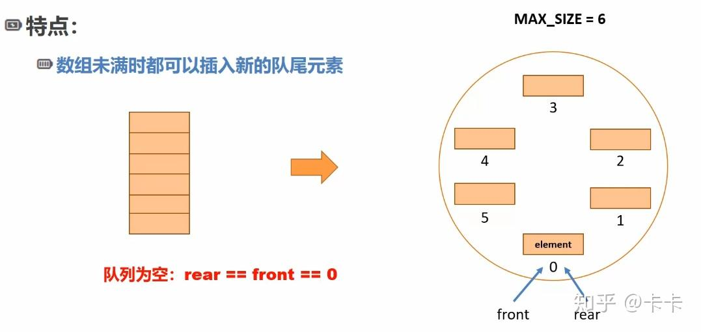

> 避免空间浪费
>
> **循环队，那一定就是顺序存储的队，且该队的操作要取余（除了rear）**

- 定义：

  - **初始化：q->front=q->rear=0**

  - **队空：q->rear==q->front**

    > 那么初始化状态也算做队空
    >
    > **但是队空不一定是0位置**

  - **队满：(q->rear+1)%Maxsize==q->front**

    > **若队尾指针正好在队头指针的后一位，则队满**
    >
    > **浪费掉一个空间，用来区分队空与队满**
    >
    > 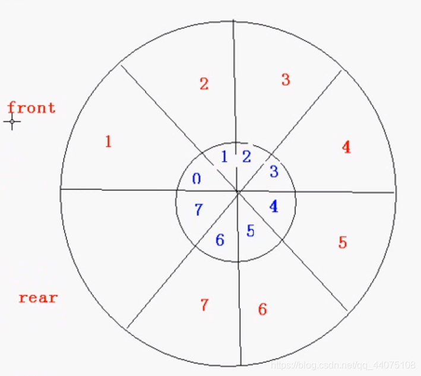
    >
    > 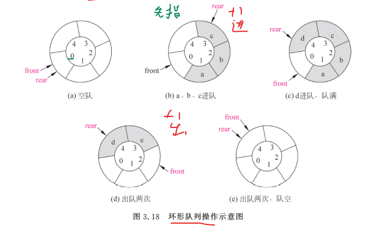

  - **入队：q->rear=(q->rear+1)%Maxsize**

  - **出队：front=(front+1)%Maxsize**

- 在尾指针头指针和元素个数中仅有两个的情况

  - **元素个数：count=(rear-front+Maxsize)%Maxsize**

  - **队头位置：front=(rear-count+Maxsize)%Maxsize**

  - **队尾位置：rear=(front+count)**

    > 注：front始终是首结点的前一个位置
    >
    > **只有加号+，没有减号-，则与Maxsize无关，不用Maxsize**


  - 代码：

    ```c
    bool enQueue(SqQueue *&q,elemtype e){
    	//先判断是否队满
    	if((q->rear+1)%Maxsize==q->front)
    		return false;
    	q->rear=(q->rear+1)%Maxsize;
    	q->data[q->rear]=e;
    	return true;
    }
    bool deQueue(SqQueue *&q,elemtype &e){
    	//先判断队是否为空
    	if(q->rear==q->front)
    		return false;
    //注意区别：顺序队入队出队都是先动指针后动元素
    //而栈是入栈先动指针，出栈先动元素
    	q->front=(q->front+1)%Maxsize;
    	e=q->data[q->front];
    	return true;
    }
    ```

### 链队

**链队是指采用链式存储结构实现的队列**

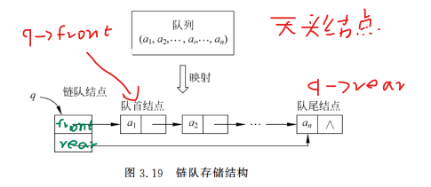

- 定义：

  ```c
  //定义单链表的结构 
  typedef struct qnode{ 
      elemtype data; 
      struct qnode *next; 
  }Datanode;  //表示单链表结点 
  //定义链队的结构 
  typedef struct{ 
      Datanode *front; Datanode *rear; 
  }LinkquNode;  //表示链队结点
  ```

  - 初始化：**q->front**==q->rear==**NULL**

  - 队空：**q->rear==NULL 或 q->front==NULL**

  - 队满：不存在

  - 入队：分配结点，尾插入链表中（链表为空要特殊处理），动尾指针

  - 出队：动头指针（只有一个元素要特殊处理），拿出数据，释放结点空间

  - 判断**链队只有一个结点：q->front==q->rear!=NULL**


  > 注：若用无头结点的单链表实现，且此时front指向首结点，默认是头结点
  >
  > 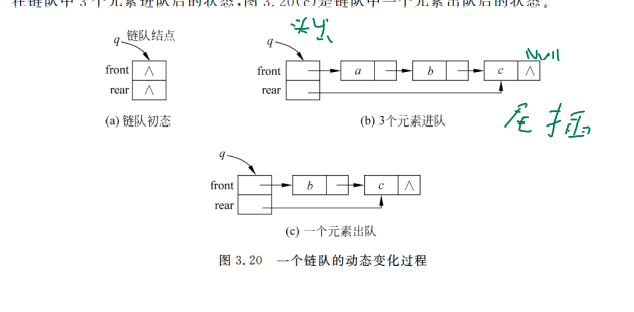

- 代码：

  ```c
  //链队的实现就是：入队用尾插法插入单链表表尾
  //出队就是把头结点的后一位拿掉并释放空间，并使头结点指向头结点后两位
  
  //数据操作：初始化、销毁、判断空、进队、出队
  void initqueue(LinkquNode *&q){
  	q=(LinkquNode *)malloc(sizeof(LinkquNode));
  	q->rear=q->front=NULL;
  }
  bool emptyqueue(LinkquNode *q){
  	return q->rear==NULL;//q->front也行
  }
  void enqueue(LinkquNode *&q,elemtype e){
  	Datanode *p;
  	p=(Datanode *)malloc(sizeof(Datanode));
  	p->data=e;
  	p->next=NULL;
  	if(q->rear==NULL)  //链表为空要特殊处理
  		q->front=q->rear=p;
  	else{
  		q->rear->next=p;
  		q->rear=p;
  	}
  }
  bool dequeue(LinkquNode *&q,elemtype &e){
  	Datanode *p=q->front;
  	if(p==NULL)
  		return false;
  	if(q->front==q->rear)  //当队列仅有一个数据结点时
  		q->front=q->rear=NULL;
  	else  //当正常情况下
  		q->front=p->next;
  	e=p->data;
  	free(p);
  	return true;
  }
  void destroyqueue(LinkquNode *&q){
  	//这里定义的是单链表中的单个结点，这样才能有data和next
  	Datanode *pre=q->front,*p; //pre指向队首结点
  	while(pre!=NULL){
  		p=pre;
  		pre=pre->next;
  		free(p);
  	}
  	free(q);
  }
  void dispqueue(LinkquNode *q){
  	Datanode *p=q->front;
  	while(p!=NULL){
  		printf("%d,",p->data);
  		p=p->next;
  	}
  }
  ```

## 队列的应用

> - 求解报数问题
> - 求解迷宫问题
> - 层次遍历
> - 计算机系统的应用
> - **缓冲区**
> - 页面替换算法

## 栈与队列的区别

|              | 栈                        | 队列              |
| ------------ | ------------------------- | ----------------- |
| 主要区别     | 仅关心top，完全不用管栈底 | 即有rear也有front |
| **入操作先** | **指针**                  | **rear动**        |
| **出操作先** | **数据**                  | **front动**       |

# 串、数组和广义表

## 串

## 基本概念

**串是由零个或多个字符组成的有限序列。零个字符的串称为空串，其长度为0，不包含任何字符。**

**子串：串中任意连续字符组成的子序列，空串是任意串的子串，任意串是其自身的子串**

> **有n个字符的串S中的子串个数：（n + 1）* n / 2 + 1** 
>
> 1表示的是本身，因为自己本身也是个子串
>
> **空格串不是空串，由一个或多个空格组成的串称为空格串**

**主串：包含子串的串**

子串在主串中首字符对应主串中的序号称为**该子串在主串中的序号（或位置**，**不是下标，最低是1**）

## 串的存储结构

### 顺序串

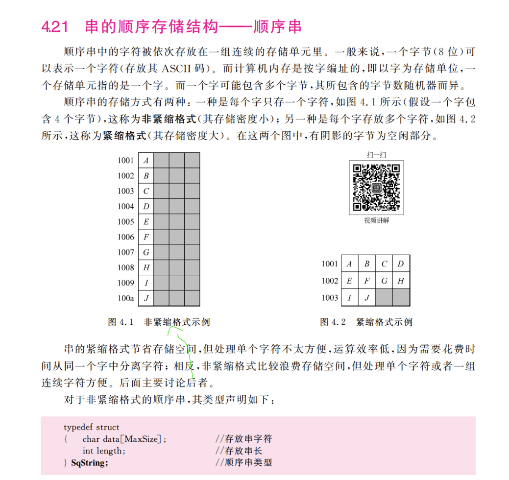

```c 
//定义
typedef struct{
    char data[MaxSize];
    int length;
}SqString;
```

### 链串

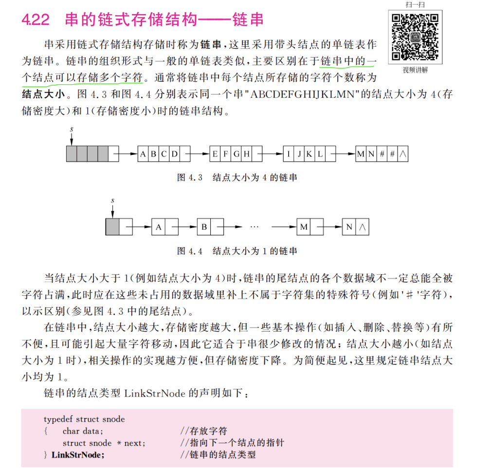

```c
//定义
typedef struct snode{
    char data;
    struct snode *next;
}LinkStrNode;
```

### 串的模式匹配

也叫做**串匹配**或**子串定位运算**。是指匹配到的**第一个子串**

在串匹配中，通常称**主串s为目标串**，**子串t为模式串**。模式匹配成功是指在目标串s中找到了一个模式串t；不成功则表示目标串s中不存在模式串t

#### 暴力BF算法

Brute-Force，也叫**简单模式匹配**

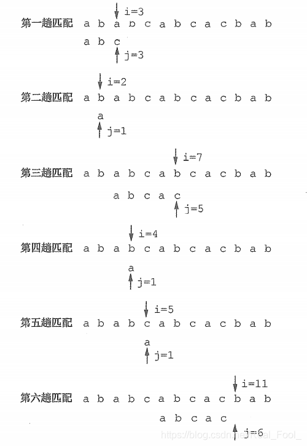

```c
int Index(SString S, SString T){
	int i = 1, j = 1;
	while(i <= S.length && j <= T.length){
		if(S.ch[i] == T.ch[j]){
			++i; ++j;	//继续比较后继字符
		}else{
			//指针后退重新开始匹配
			i = i-j+2;
			j = 1;
		}
	}
	if(j > T.length){
		return i - T.length;
	}else{
		return 0;
	}
}
```

最坏时间复杂度为**O(nm)**，其中**n和m分别为主串和模式串的长度**。

#### KMP算法

在上面的简单匹配中，每趟匹配失败都是模式后移一位再从头开始比较。而某趟已匹配相等的字符序列是模式的某个前缀，这种频繁的重复比较相当于模式串在不断地进行自我比较，这就是其低效率的根源。
因此，可以从分析模式本身的结构着手，如果已匹配相等的前缀序列中有某个后缀正好是模式的前缀，那么就可以将模式向后滑动到与这些相等字符对齐的位置，主串i指针无须回溯，并继续从该位置开始进行比较。而模式向后滑动位数的计算仅与模式本身的结构有关，与主串无关。

**KMP算法的特点就是：仅仅后移模式串，比较指针不回溯。很是牛掰。**

> **O(n+m)**

```c
void get_nextval(String T, int *nextval){
	int i = 1, j = 0;
	nextval[1] = 0;
	while (i < T.length){
		if(j==0 || T.ch[i]==T.ch[j]){	//ch[i]表示后缀的单个字符，ch[j]表示前缀的单个字符
			++i; ++j;

			if(T.ch[i] != T.ch[j]){	//若当前字符与前缀字符不同
				nextval[i] = j;	//则当前的j为nextval在i位置的值
			}else{
				//如果与前缀字符相同
				//则将前缀字符的nextval值给nextval在i位置上的值
				nextval[i] = nextval[j];
			}
		}else{
			j = nextval[j];	//否则令j = next[j]，j值回溯，循环继续
		}
	}
}
int Index_KMP(String S, String T){
	int i=1, j=1;
	int next[255];	//定义next数组
	get_next(T, next);	//得到next数组
	while(i<=S.length && j<=T.length){
		if(j==0 || S.ch[i] == T.ch[j]){	//字符相等则继续
			++i; ++j;
		}else{
			j = next[j];	//模式串向右移动，i不变
		}
	}
	if(j>T.length){
		return i-T.length;	//匹配成功
	}else{
		return 0;
	}
}

```

## 数组

### 存储结构和求址方式

1. **行优先**

   **loc(a ij)=loc(a 00)+[i*j+j]\*d**

2. **列优先**

   **loc(a ij)=loc(a 00)+[j*m+i]\*d**

#### 矩阵的地址求法

> 源自邻接矩阵是顺序存储形式，所以是以a[n]\[m]的方式表示的

​	矩阵中是**按行优先的顺序存储的**。也就是说，二维数组的第一行的所有元素会先于第二行的所有元素被存储，第二行的所有元素会先于第三行的所有元素被存储，以此类推。

​	给定一个 m x n 的二维数组 a，其首元素（即 a[0]\[0]）的基地址是 BASE，那么元素 a[i][j] 的地址可以通过以下公式计算：

```c
Address of a[i][j] = BASE + ((i * n) + j) * size
```

> - i * n : 这是前 i 行元素的总数量。
> - j : 是第 i 行中，a[i][j] 前面的元素数量。
> - (i * n) + j : 这是 a[i][j] 元素在二维数组中的位置（从 0 开始计数）。
> - ((i * n) + j) * size ：由于每个元素可能会占用多于一个字节的空间（如 int 类型通常会占用4个字节），我们需要将元素在数组中的位置乘以它所占用的空间大小，来得到相对于 BASE 的偏移量。

### 矩阵的压缩存储

在高阶矩阵中有许多值相同的元素或者是零元素，**为了节省存储空间，对这类矩阵采用多个值相同的元素只分配一个存储空间、零元素不存储的存储策略，称为矩阵的压缩存储**

#### 对称矩阵

> 用一维数组存储

**元素总数：n(n+1)/2**

> **子串个数是还要＋1**

**a ij**进行对称矩阵压缩后对应的是**第几个位序的元素：i(i-1)/2+j**

**对应的下标：i(i-1)/2+j-1**

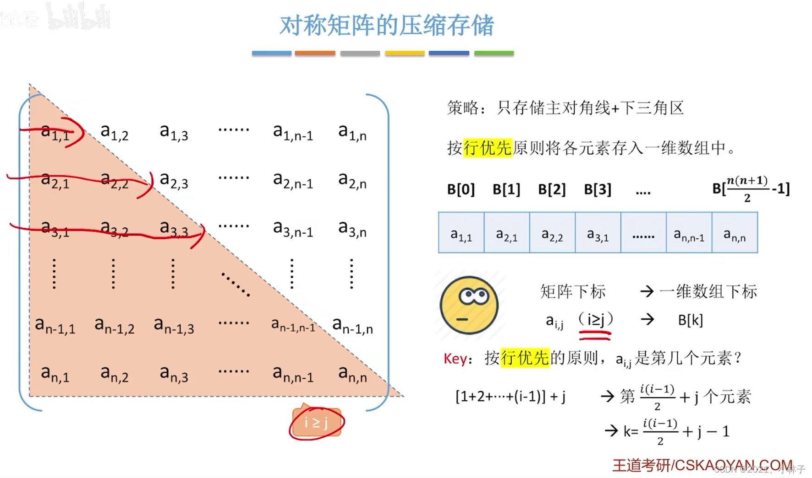

#### 三角矩阵

> 用一维数组存储

1. 下三角矩阵：除了主对角线和下三角区，其余的元素都相同，为常数C，**C统一放在最后一个位置**

   **k计算同上**

   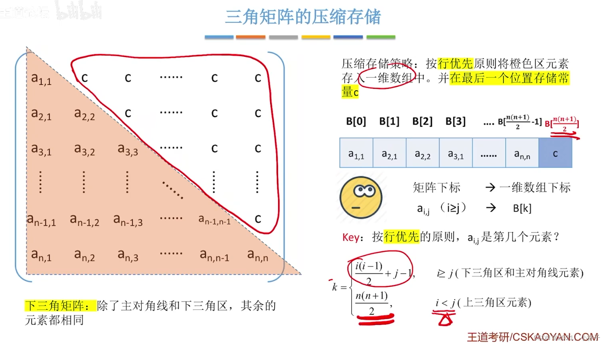

2. 上三角矩阵：除了主对角线和上三角区，其余的元素都相同，为常数C，**C统一放在最后一个位置**

   **k=(i-1)(2n-i+2)/2+(j-1)**

   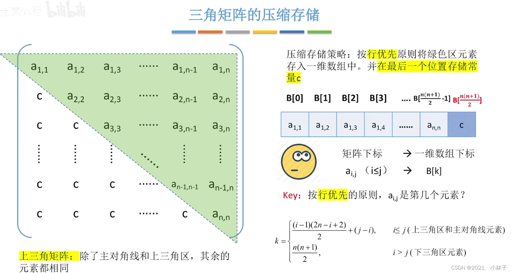

#### 稀疏矩阵

> 用一维数组存储或者十字链存储

**稀疏矩阵会失去随机存取功能。只存储非零元素**

1. **三元组表--顺序存储**

   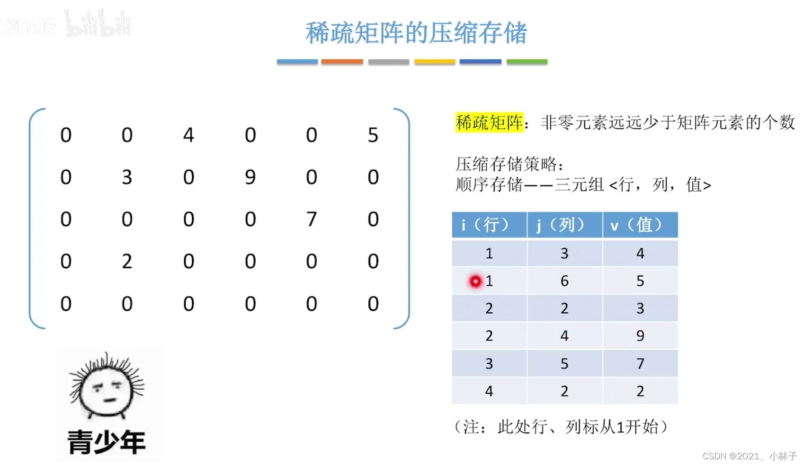

2. **十字链表法--链式存储**

   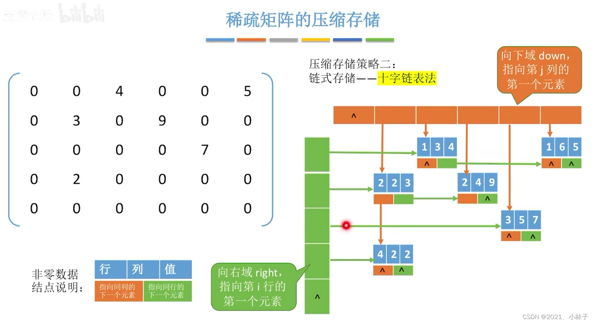

## 广义表

### 定义

广义表，**又称列表**，也是一种线性存储结构，既可以存储不可再分的元素，也可以存储广义表。

**广义表是n个元素a1,a2...an组成的有序序列**，记作：LS = (a1,a2,…,an)，其中，LS 代表广义表的名称，an 表示广义表存储的数据，广义表中**每个 ai 既可以代表单个元素，也可以代表另一个广义表。**

> 广义表中**存储的单个元素称为 "原子"**，而**存储的广义表称为 "子表"。**
>
> **书写时用大写来表示广义表，小写字母表示原子**
>
> **a1为LS表头，其余元素组成的广义表称为表尾（注：表尾一定是一个广义表）**
>
> **广义表也是线性表**

### 广义表表示

例如 ：广义表 LS = {1,{1,2,3}}，则此广义表的构成 ：广义表 LS 存储了一个原子 1 和子表 {1,2,3}。
广义表存储数据的一些常用形式：

1. A = ()：A 表示一个广义表，只不过表是空的。
2. B = (e)：广义表 B 中只有一个原子 e。
3. C = (a,(b,c,d)) ：广义表 C 中有两个元素，原子 a 和子表 (b,c,d)。
4. D = (A,B,C)：广义表 D 中存有 3 个子表，分别是A、B和C。这种表示方式等同于 D = ((),(e),(b,c,d)) 。
5. E = (a,E)：广义表 E 中有两个元素，原子 a 和它本身。这是一个递归广义表，等同于：E = (a,(a,(a,…)))。

> 1. **广义表是一个多层次的结构**。
> 2. 广义表可为其他广义表所共享
> 3. **广义表可以是一个递归的表，即广义表也可以是其本身的一个子表**

### 广义表深度和长度

1. **广义表的长度**，指的是**`广义表中所包含的数据元素的个数`**。

   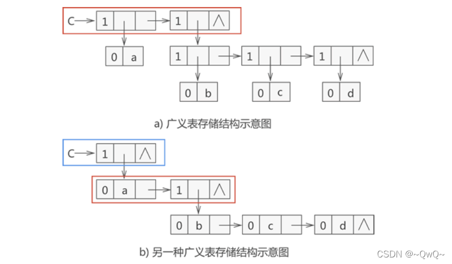

2. **广义表的深度**，可以**通过观察该表中所包含括号的层数间接得到**

   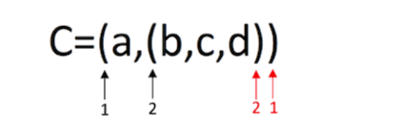

### 广义表存储表示

1. 存储结构一如下示意图所示：表示**原子的结点由两部分构成**，分别是 tag 标记位和原子的值，表示**子表的结点由三部分构成**，分别是 tag 标记位、hp 指针和 tp 指针。
   tag 标记位用于区分此结点是原子还是子表，通常**原子的 tag 值为 0，子表的 tag 值为 1**；
   子表结点中的 hp 指针用于连接本子表中存储的原子或子表；
   tp 指针用于连接广义表中下一个原子或子表。

   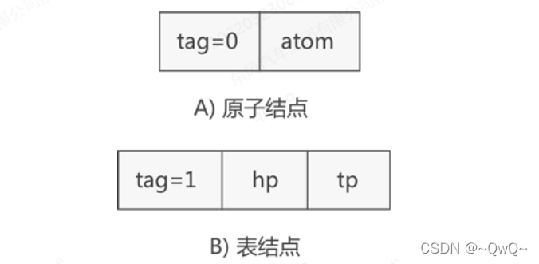

   ```c
   typedef struct GNode{
       int tag;         // 标志域, 0表示原子, 1表示子表
       union{
           char atom;   //  原子结点的值域
           struct{
               struct GNode * hp, *tp;
           }ptr;   // 子表结点的指针域, hp指向表头, tp指向表尾
       }subNode;
   }GLNode, *Glist;
   ```

   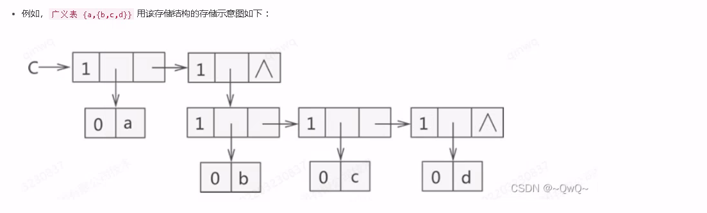

2. 另一种存储结构的`原子的结点也由三部分构成`，分别是 ： `tag 标记位、原子值和 tp 指针构成`；表示子表的结点由三部分构成，分别是 ： `tag 标记位、hp 指针和 tp 指针`，示意图如下：

   ```c
   typedef struct GNode {
       int tag;                // 标志域, 0表示原子, 1表示子表
       union {
           int atom;          // 原子结点的值域
           struct GNode* hp;  // 子表结点的指针域, hp指向表头
       }subNode;
       struct GNode* tp;     // 这里的tp相当于链表的next指针, 用于指向下一个数据元素
   }GLNode, *Glist;
   
   ```

   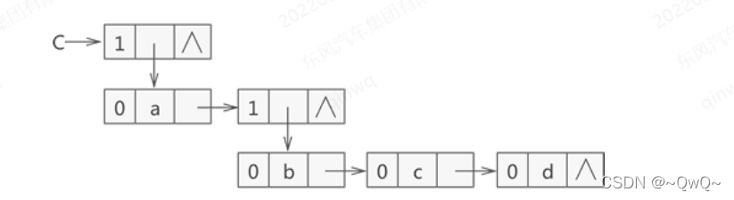

### 广义表图形表示

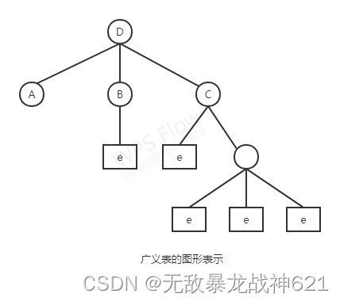

> **其中，圆表示广义表，矩形表示原子元素**
>
> 可以在线的末端加上箭头

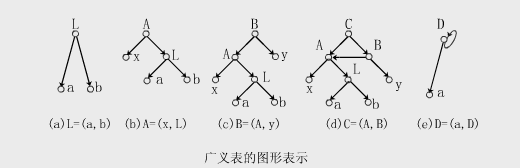

### 广义表的运算

1. **取表头GetHead(LS)：取出非空广义表的第一个元素，可以是一个原子，也可以是一个子表**
2. **取表尾GetTail（LS）：取出除了表头外的元素构成的广义表。表尾一定是一个广义表，即取表尾操作一定会取出来一个带（）的广义表**

# 树与二叉树

树结构是一种重要的非线性数据结构，**树是以分支关系定义的层次结构**

- 通用概念

> 树是⼀个递归概念（有且仅有⼀个根结点，其余结点互不相交，每个集合本⾝⼜是⼀棵树）
>
> 要掌握树的树形表示法和**括号表示法**
>
> **路径长度：是通过的结点数-1**
>
> **树的度：树中结点最大的度称为树的度**

- 树的表示方法

  - 树形表示法（主要的）

  - 文氏图表示法

  - 凹入表示法

  - 括号表示法（代码）

    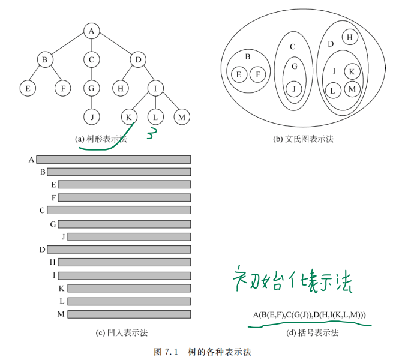

## 树和森林

### 树的定义

**树是n（n>=0）个结点的有限集合**。当n = 0时，称为空树。在任意一棵非空树T中应满足：

1. **有且仅有一个特定的称为根的结点。**
2. **当n>1时，除根结点以外的其余结点可分为m（m>0）个互不相交的有限集T1,T2,…,Tm，其中每个集合本身又是一棵树，并且称为根的子树。**

### 树的基本术语


1. 结点：树中的一个独立单元

2. **结点的度：结点拥有的子树称为结点的度**

3. **树的度：树内各结点度的最大值**

4. **叶子：度为0的结点称为叶子结点或终端结点**

5. **非终端结点**：度不为0的结点称为非终端结点或者分支结点

6. **双亲和孩子：结点的子树的根称为该结点的孩子，相应的，该结点称为孩子的双亲或父亲**

7. 考虑结点K。根A到结点K的唯一路径上的任意结点,称为结点K的祖先。如结点**B是结点K的祖先,而结点K是结点B的子孙**。路径上最接近结点K的结点**E称为K的双亲（父亲）,而K为结点E的孩子**。根A是树中唯一没有双亲的结点。有**相同双亲的结点称为兄弟**,如结点K和结点L有相同的双亲E,即K和L为兄弟。

8. 树中**一个结点的孩子个数称为该结点的度**,**树中结点的最大度数称为树的度**。如结点B的度为2,结点D的度为3,树的度为3。

9. **度大于0的结点称为分支结点**(又称非终端结点);**度为0(没有子女结点)的结点称为叶子结点(又称终端结点)**。在分支结点中**,每个结点的分支数就是该结点的度。**

   > 叶子结点不能叫做分支结点，同理，度不为0的结点不能叫做终端结点

10. **层次：结点的层次从树根开始定义,根结点为第1层,它的子结点为第2层,以此类推**。双亲在同一层的结点互为堂兄弟,图中结点G与E,F,H,I,J互为堂兄弟。

11. **结点的深度**是**从根结点开始自顶向下逐层累加的**。指的是从**根结点到该结点的路径上边的数量**。在树中，**根结点的深度是1，每个子结点的深度是其父结点深度加1。**

    > 有的地方也可以表示根结点是0

12. 结点的**高度**是**从该结点到最远的叶子结点开始自底向上逐层累加的**。**树的高度(或深度)是树中结点的最大层数**。图中树的高度为4。

13. **树的高度和深度：从根结点到最远叶子结点的高度**

14. **有序树和无序树**。树中结点的各子树**从左到右是有次序的,不能互换**,称该树为有序树,否则称为无序树。假设图为有序树,若将子结点位置互换,则变成一棵不同的树。

    > **显然，二叉树是一个有序树**

15. **路径和路径长度**。树中两个结点之间的路径是由这两个结点之间所经过的结点序列构成的,而路径长度是路径上所经过的边的个数。

16. 注意:由于树中的分支是有向的,即从双亲指向孩子,所以树中的路径是从上向下的,同一双亲的**两个孩子之间不存在路径**。

17. **森林。森林是m (m≥0)棵互不相交的树的集合，也可以说子树的集合就是森林**。森林的概念与树的概念十分相近，因为只要把树的根结点删去就成了森林。反之，只要给m棵独立的树加上一个结点，并把这m棵树作为该结点的子树，则森林就变成了树。

### 树的性质（重点）

1. **树总结点数=度之和+1=分支结点总和+1**

   > **度之和=分支结点度数=0\*n0+1\*n1+2\*n2...**

2. **m次树的第i层最多有m^(i-1)个结点**

3. **高度为h的m次树的总结点最多为(m^h-1)/(m-1)**

   > **一定要记得高度h的总结点个数还有除数的**

4. **具有n个结点的m次树的最小高度为logm(n*(m-1)+1)  （上取整）**

### 树的遍历

1. **先根遍历**

   > =森林的先根遍历=**树转换成的二叉树的先序遍历**
   >
   > 这里的**意思是先转换成对应的树**|二叉树在进行遍历的序列相同

2. **后根遍历**

   > =森林的后根遍历=**树转换成的二叉树的中序遍历**

3. **层次遍历**

   > **=图的广度优先遍历**

### 树的存储结构

1. **双亲存储**

   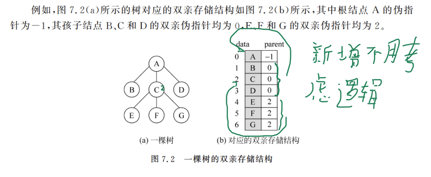

   ```c
   typedef struct{
   	elemtype data;  //结点的值
   	int parent;  //双亲的层序位置编号；若没有双亲则值为-1
   }ptree[Maxsize];  //为双亲存储结构类型
   ```

   > **适合求树的根和双亲，求孩子不方便**

2. **孩子链存储**

   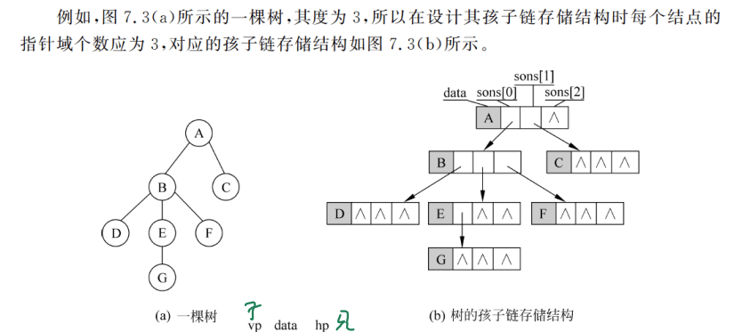

   ```c
   typedef struct node{
   	elemtype data;
   	struct node *sons[Maxsons];  //指向孩子结点，括号表示树的度
   }TSonNode;
   ```

   > **空域：指针个数-分支个数=n*m-(n-1)**

   - 设计一个求树t高度的递归算法：

     ```c
     int treeheight(TSonNode * t){
     	TSonNode *p;
     	int i,h,maxh=0;
     	if(t==NULL)
     		return 0;
     	for(i=0;i<Maxsons;i++){    //p指向t的第i+1个孩子结点
     		p=t->sons[i];
     		if(p!=NULL){
     			h=treeheight(p);  //求对应子树的高度
     			if(maxh<h)
     				maxh=h;
     		}
     	}
     	return (maxh+1);  //返回树的高度
     }
     ```

3. **孩子兄弟链存储**

   **又称二叉树表示法或二叉链表表示法：左孩子右兄弟**

   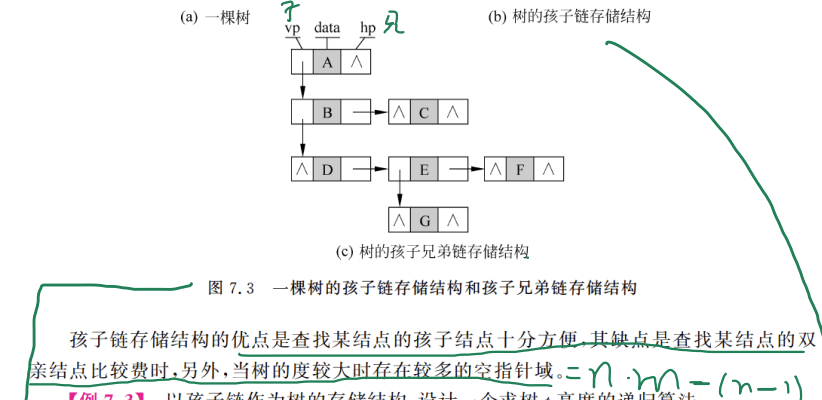

   ```c
   typedef struct tnode{
   	elemtype data;
   	struct tnode *hp;  //指向兄弟
   	struct tnode *vp;  //指向孩子结点
   }TsbNode;
   ```

   > **最重要，用于实现树与二叉树的互相转换**
   >
   > **左孩子右兄弟**
   >
   > **空域：指针个数-分支个数=2n-(n-1)=n+1**
   >
   > 👆因为一个结点就两个指针，相当于孩子链中m次树为2的情况

   - 设计一个求树t高度的递归算法：

     ```c
     int treeheight2(TsbNode *t){
     	TsbNode *p;
     	int h,maxh=0;
     	if(t==NULL)
     		return 0;
     	p=t->vp;   //p指向第1个孩子结点
     	while(p!=NULL){
     		h=treeheight2(p);
     		if(maxh<h)
     			maxh=h;
     		p=p->hp;  //继续处理其他兄弟，即其他子树
     	}
     	return(maxh+1);
     }
     ```

## 二叉树

### 二叉树定义

**二叉树是n（n>=0）个结点的有限集合**。当n = 0时，称为空树。在任意一棵非空树T中应满足：

1. **有且仅有一个特定的称为根的结点。**
2. **当n>1时，除根结点以外的其余结点可分为两个互不相交的左子树T1和右子树T2，且T1和T2又都是一个二叉树**

> **树和二叉树的主要区别**
>
> 1. **二叉树每个结点最多两个子树**
> 2. **二叉树的子树又左右之分，其次序不能任意颠倒。所以二叉树也是有序树**

### （完全）二叉树的性质

1. **满二叉树的定义：**

   **在一棵二叉树中，所有分支结点都存在左子树和右子树，并且所有叶子结点都在同一层上的树称之为满二叉树**

   特点：叶子结点都在最后一层上；只有度为0和度为2的结点

2. **完全二叉树的定义：**

   **在一棵二叉树中，除了最后一层外，每一层都被完全填满，并且最后一层的节点尽可能地靠左排列的二叉树，同时，叶子结点只能出现在最后两层的树称之为完全二叉树**。

> **完全二叉树要求叶子结点仅有可能在最后两层出现，且只能没有右孩子而有左孩子，不能没有左孩子而有右孩子**

1. **n0=n2+1**
2. **n2=n0-1**
3. **n=2n2+1=2n0-1**
4. **.i层最多有2^(i-1)个结点**
5. **深度为k的⼆叉树⾄多有2^k - 1个结点**
6. **具有n个结点的完全⼆叉树的深度为log2(n)向下取整+1**
7. **n为奇数时，n1=0；n为偶数时，n1=1（因为n0+n2为奇数）**
8. 如果对⼀棵有n个结点的完全⼆叉树，可以通过⽗结点求⼦⼥结点，也可以通过⼦⼥结点 求⽗结点，不过**要注意，根结点的编号是从0开始还是从1开始**。下面记层序编号为i
   - **若i<=n/2，则i为分支结点，否则i无左孩子；若i>n/2=(n-1)/2，则i无右孩子**
   - **若i有左孩子，则左孩子编号是2i，右孩子为2i+1**

### 二叉树遍历

**遍历二叉树是指按某条搜索路径访问树中每个结点，使得每个结点均被访问一次，而且仅被访问一次**

> **访问表示对结点做各种处理**，包括**输出**结点信息，**修改，运算**等
>
> **遍历的实质是对二叉树进行线性化的过程，即遍历的结果是将非线性结构的树中的结点排成一个线性序列**

1. **先序（前缀表达式|波兰式）**

   > **第一个是根结点**。若有左右子树，则第二个是左子树根结点，第三个是右子树根结点

   - 递归算法：

     ```c
     void preOrder(btNode *b){
     	if(b!=NULL){  //等价于if（b）
     		printf("%c",b->data);  //访问结点
     		preOrder(b->lchild);  //递归左子树
     		preOrder(b->rchild);  //递归右子树
     	}
     }
     ```

2. **中序（中缀表达式（要加括号））**

   > 若有左右子树，则**根结点在中间**，左右子树在两边；当左子树或右子树为空时，根结点可能在开头或者末尾

   递归算法：

   ```c
   void inOrder(btNode *b){
   	if(b!=NULL){
   		inOrder(b->lchild);  //递归左子树
   		printf("%c",b->data);  //访问结点
   		inOrder(b->rchild);  //递归右子树
   	}
   }
   ```

3. **后序（后缀表达式|逆波兰式）**

   > **最后一个是根结点**

   递归算法：

   ```c
   void postOrder(btNode *b){
   	if(b!=NULL){	
   		postOrder(b->lchild);  //递归左子树
   		postOrder(b->rchild);  //递归右子树
   		printf("%c",b->data);  //访问结点
   	}
   }
   ```

   > **先序中序后序非递归遍历需要用到临时栈，因为递归就是运用了栈的**

4. **层次遍历**

   > 非递归
   >
   > **借助（环形）队列**

5. **二叉树遍历算法的应用**

   1. 根据**先序遍历建立二叉链表**

      ```c
      // 通过先序遍历顺序创建二叉树
      void CreateBiTree(BiTree *T) {
          char ch;
          scanf(" %c", &ch); // 注意这里的空格，用于吸收之前的换行符
          
          if (ch == '#') { // '#' 表示空节点
              *T = NULL;
          } else {
              *T = (BiTNode *)malloc(sizeof(BiTNode)); // 分配内存给新节点
              (*T)->data = ch; // 设置节点数据
              (*T)->lchild = (*T)->rchild = NULL; // 初始化左右孩子为NULL
      
              // 递归创建左子树
              CreateBiTree(&(*T)->lchild);
              // 递归创建右子树
              CreateBiTree(&(*T)->rchild);
          }
      }
      ```

   2. **后序遍历来计算二叉树的最大深度**

      ```c
      // 计算二叉树的深度
      int TreeDepth(BiTree T) {
          if (T == NULL) { // 如果是空树，则深度为0
              return 0;
          } else {
              int leftDepth = TreeDepth(T->lchild); // 递归获取左子树的深度
              int rightDepth = TreeDepth(T->rchild); // 递归获取右子树的深度
      
              // 返回左右子树深度较大者加1（根节点）
              if (leftDepth > rightDepth) {
                  return leftDepth + 1;
              } else {
                  return rightDepth + 1;
              }
          }
      }
      ```

      > 使用后序遍历的原因，当然也可以用前序中序
      >
      > - **自底向上**：后序遍历首先访问左子树，然后是右子树，最后访问根节点。这使得在每次返回到上层时，都能得到左右子树的深度信息，便于直接计算当前节点为根的子树的最大深度。
      > - **递归简洁**：由于可以直接获取子树的深度并比较，因此递归代码相对简洁易懂。

### 二叉树和树和森林的转换

> 只用知道以下四种情况，树和森林间的转换就是增加一个根或删去一个根

1. **二叉树转树**

   > **二叉树中孩子左兄弟右**：孩子在左边，兄弟在右边

<<<<<<< HEAD
   
=======
   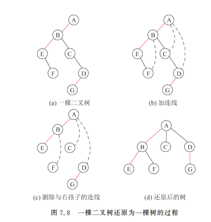
>>>>>>> origin/master

   > 规则：
   >
   > 1. 二叉树的左孩子是树中该结点（该左孩子的双亲）的最左孩子（第一个孩子）
   > 2. 二叉树的右孩子是树中该结点（该右孩子的双亲）的一个兄弟
   >
   > 要求：**根结点必须无右孩子，否则就是转成森林了**
   >
   > 方法：
   >
   > 1. 将所有有右孩子的线逆时针转45°
   > 2. 去掉兄弟之间的线，并连上各自的双亲

2. **二叉树转森林**

   > 孩子左兄弟右，并且**根兄弟要切断**

<<<<<<< HEAD
   
=======
   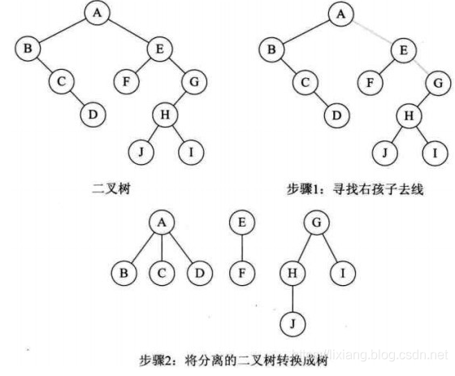
>>>>>>> origin/master

   > 规则：
   >
   > 1. 二叉树的左孩子是树中该结点（该左孩子的双亲）的最左孩子（第一个孩子）
   > 2. 二叉树的右孩子是树中该结点（该右孩子的双亲）的一个兄弟
   >
   > 要求：**根结点一定要有右子树，否则就是树了**
   >
   > 方法：
   >
   > 1. 将所有有右孩子的线逆时针转45°
   > 2. 去掉兄弟之间的线，并连上各自的双亲

3. **树转二叉树**

   > 第一棵子树（如果有的话）作为左孩子，下一个兄弟（如果有的话）作为右孩子
   >
   > **第一棵子树作为左孩子，下一个兄弟作为右孩子**

<<<<<<< HEAD
   
=======
   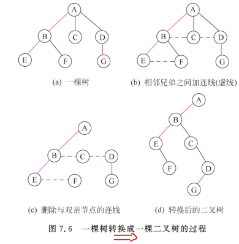
>>>>>>> origin/master

   > 方法：
   >
   > 1. 兄弟结点之间连接条虚线，并把所有的非最左结点（右结点）的线删去
   > 2. 将兄弟的线顺时针转45°

4. **森林转二叉树**

<<<<<<< HEAD
   
=======
   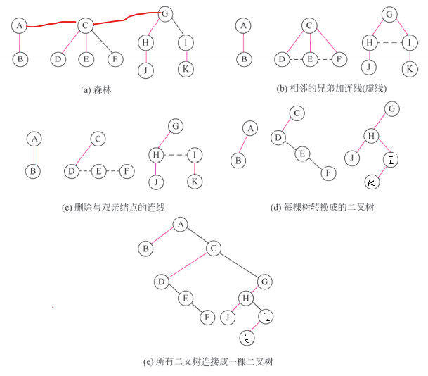
>>>>>>> origin/master

   >方法：
   >
   >1. 兄弟结点**（根结点）之间连接条虚线**，并把所有的非最左结点（右结点）的线删去
   >2. 将兄弟的线顺时针转45°

### 二叉树的存储结构

1. **顺序存储结构**

   **按照层次的顺序排在数组中（没有0），若空则用"#"占位（也需要存去数组里）**

   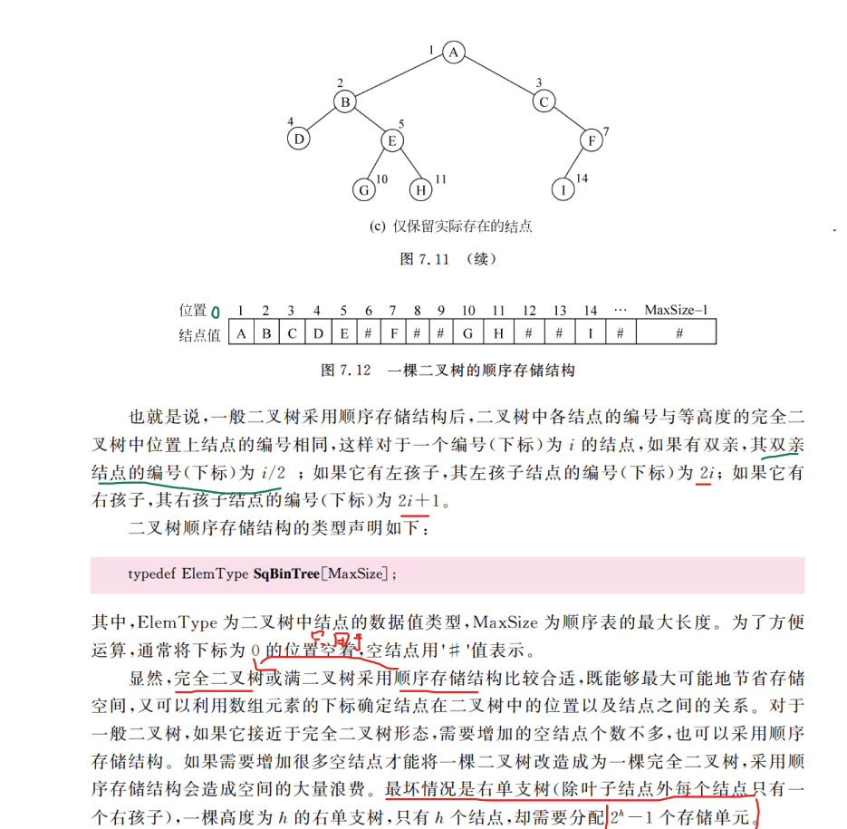

   ```c
   typedef char elemtype;
   //课本上二叉树的顺序存储定义如下
   typedef elemtype sqBinTree[Maxsize];
   ---------------------------------------------
   //王道上二叉树的顺序存储定义如下
   struct TreeNode{
   	elemtype value;
   	bool isempty;  //结点是否为空
   };
   TreeNode t[Maxsize];  //定义一个长度为Maxsize的数组t，按照从上至下、从左至右的顺序依次存储完全二叉树中的各个结点
   ```

   > **适合完全二叉树或满二叉树，一般二叉树容易浪费，适合链式存储结构**

2. **二叉链表（链式存储结构|孩子链存储结构）**

   **指针域分别指向左孩子和右孩子**

   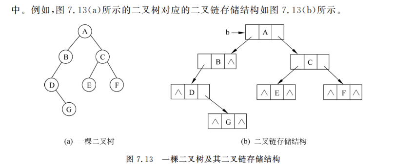

   ```c
   typedef char elemtype;
   //二叉链表存储定义及各操作的实现
   typedef struct node{
   	elemtype data;
   	struct node *lchild;
   	struct node *rchild;
   }btNode;
   ```

   > **n个结点的二叉链表中有n+1个空域**

3. **三叉链表**

   ```c
   typedef char elemtype;
   //二叉链表存储定义及各操作的实现
   typedef struct node{
   	elemtype data;
   	struct node *lchild;
   	struct node *rchild;
       struct node *parent;
   }btNode;
   ```

   > **3n-(n-1)=2n+1个空域**

### 二叉树的构造

1. **先序遍历序列+中序遍历序列画出二叉树**

   用先序第一个确认根的位置，在中序中找到根，左边是左子树，右边是右子树，继续递归确认

2. **后序遍历序列+中序遍历序列画出二叉树**

   用后序最后一个确认根的位置，在中序中找到根，左边是左子树，右边是右子树，继续递归确认

3. **层次遍历序列+中序遍历序列画出二叉树**

   用层次第一个确认根的位置，在中序中找到根，左边是左子树，右边是右子树，继续递归确认

## 线索二叉树

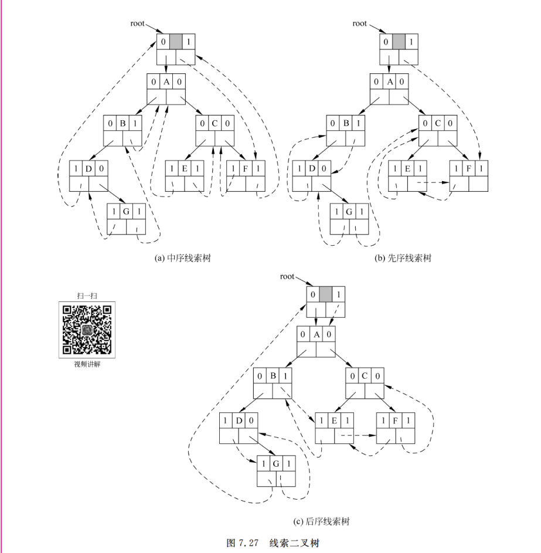

> 实现表示左右孩子，虚线表示前驱后继
>
> **在二叉链表的基础上**充分**利用**二叉链表的**空域丰富该结构**：
>
> - **左空则指向其前驱**
> - **右空则指向其后继**
> - **0表孩子，1表前后。因此叶子结点都是1**
>
> 该线索链表**适合需要经常查找结点在所遍历线性序列中的前驱和后继**

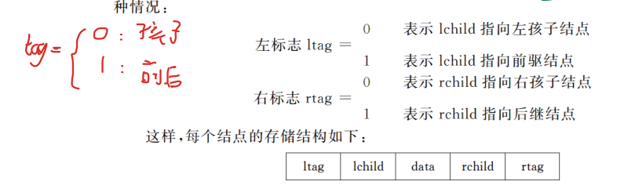

以上述这种节点构成的二叉链表叫做**线索链表**，其中**指向前驱后继的指针叫做线索**。**二叉树带上线索指针则称为线索二叉树**。**对二叉树进行某种遍历使其变为线索二叉树的过程叫做线索化**

> 线索化的过程是在遍历中检查当前结点的左、右指针域是否为空，如果为空，将他们改为指向前驱结点或后继结点的线索

```c
// 定义线索二叉树节点结构
typedef struct BiThrNode {
    int data; // 数据域
    struct BiThrNode *lchild, *rchild; // 左右孩子指针
    int ltag,rtag; // 线索标记
} BiThrNode, *BiThrTree;

// 中序线索化
void InThreaded(BiThrTree p, BiThrTree *pre) {
    if (p) {
        // 递归线索化左子树
        InThreaded(p->lchild, pre);

        // 处理当前节点
        if (p->lchild == NULL) {
            p->lchild = *pre; // 左孩子为空，设置为前驱
            p->ltag = 1; // 设置左标志位
        }
        if (*pre != NULL && (*pre)->rchild == NULL) {
            (*pre)->rchild = p; // 前驱的右孩子为空，设置为后继
            (*pre)->rtag = 1; // 设置右标志位
        }
        *pre = p; // 更新前驱指针

        // 递归线索化右子树
        InThreaded(p->rchild, pre);
    }
}

// 中序遍历并线索化
void InOrderTheadBTree(BiThrTree *Thrt, BiThrTree T) {
    // 创建头结点
    *Thrt = (BiThrNode *)malloc(sizeof(BiThrNode));
    (*Thrt)->ltag = 0; // 头结点的左标志位
    (*Thrt)->rtag = 1; // 头结点的右标志位
    (*Thrt)->rchild = *Thrt; // 指向自身形成闭环

    if (T == NULL) {
        (*Thrt)->lchild = *Thrt; // 如果二叉树为空，指向自身
    } else {
        (*Thrt)->lchild = T; // 头结点的左孩子指向二叉树根节点
        BiThrTree pre = *Thrt; // 初始化前驱指针
        InThreaded(T, &pre); // 中序线索化
        pre->rchild = *Thrt; // 最后一个节点的右孩子指向头结点
        pre->rtag = 1; // 设置右标志位
        (*Thrt)->rchild = pre; // 头结点的右孩子指向上一个节点
    }
}


// 遍历中序线索二叉树
void InOrderTraverse(BiThrTree Thrt) {
    BiThrTree p = Thrt->lchild; // 从根节点开始
    while (p != Thrt) {
        // 找到最左边的节点
        while (p->ltag == 0) {
            p = p->lchild;
        }
        printf("%d ", p->data); // 访问节点

        // 沿着右线索找到下一个节点
        while (p->rtag == 1 && p->rchild != Thrt) {
            p = p->rchild;
            printf("%d ", p->data); // 访问节点
        }

        // 转到右子树
        p = p->rchild;
    }
}
```


## 二叉排序树

**二叉排序树（Binary Sort Tree）又称二叉查找树**，它是一种排序和查找都很有用的二叉树

> 简单版，[详细见树表查找篇](#tree)
>
> 方便搜索的一种树
>
> **左子树放小的，右子树放大的**

**二叉排序树性质：**

1、就是若它的左子树不空，则左子树上所有节点的值均小于它的根节点的值；
2、若它的右子树不空，则右子树上所有节点的值均大于其根节点的值。  
3、左右子树也分别为二叉排序树

- 据二叉排序树的定义，**左子树结点值 < 根结点值 < 右子树结**

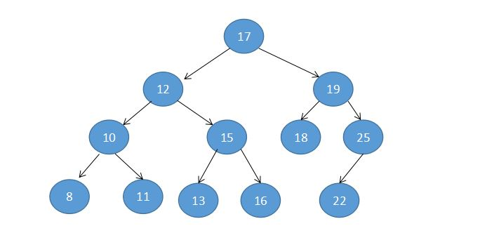

> **对⼆叉树进⾏中序遍历，将得到从小到大的递增有序排序序列**
>
> ⼆叉搜索树最⼤的功劳在于：规定了结点的位置，因此针对BST可以有效实现查找、插 ⼊、删除，**让树形结构可以进⾏动态调整**
>
> **具有n个内部结点的二叉排序树，其外部结点个数为n+1**
>
> 平均执行时间或者ASL=**O（log2（n））**
>
> 二叉排序树中的查找路径是原来二叉排序树的一部分，也一定构成一棵二叉排序树。

- **n个关键字构成的不同二叉排序树有多少棵？**

  答：需要用到卡特兰数，就是出栈序列个数那个：**C(n，2n)/(n+1)**

  如4个关键字，则有14棵树

- 算法

  1. 插入

     ​	需保证插入后，仍然满足排序树需求。用到了递归，当子树为空时就会插入，如果在左边就递归左边插入，在右边就递归右边插入。

     插入操作是以查找操作为基础的。新插入的节点一定是一个新添加的叶子结点，并且是查找不成功时查找路径上访问的最后一个节点的左孩子或右孩子

     ```c
     bool insertBst(bstNode *&bt,keytype k){
     	if(!bt){
     		bt=(bstNode *)malloc(sizeof(bstNode));
     		bt->key=k;
     		bt->lchild=bt->rchild=NULL;
     	}
     	else if(k==bt->key)  //不能存在关键字相同的结点
     		return false;
     	else if(k<bt->key)
     		return insertBst(bt->lchild,k);
     	else
     		return insertBst(bt->rchild,k);
     }
     ```

  2. 创建

     ```c
     bstNode * createBst(keytype a[],int n){
     	//返回树的根结点
     	bstNode *bt=NULL;
     	int i=0;
     	while(i<n){
     		insertBst(bt,a[i]);
     		i++;
     	}
     	return bt;
     }
     ```

## 平衡二叉树

> 要求左右子树的高度差最多是1

**特征：**

1. **左子树右子树的深度之差绝对值不超过1**
2. **左子树和右子树也是平衡二叉树**

二叉树上节点的平衡因子（Balance Factor BF）：定义为该节点左子树和右子树的深度之差，则平衡二叉树的所有节点的平衡因子只能是-1、0和1

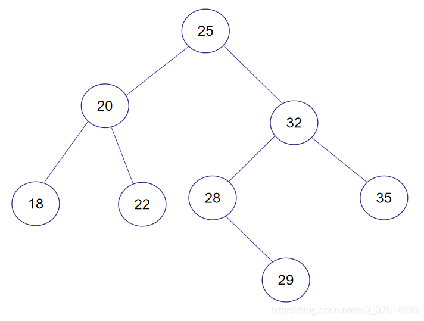

## 堆

大根堆或小根堆

<<<<<<< HEAD

=======
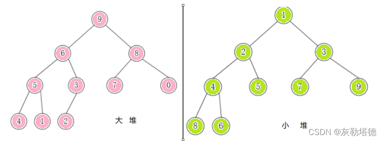
>>>>>>> origin/master

> **堆是一颗完全二叉树，采用数组顺序存储**，有大小堆之分
>
> 堆**又叫优先级队列**
>
> 优先级队列是完全⼆叉树 + 堆的规则（⼤⼩根堆）

## 哈夫曼树

**又称最优二叉树，是一类带权路径最短的二叉树**

### 基本概念

1. **路径**：从树中一个节点到另一个节点之间的分支构成这**两个节点之间的路径**

2. **路径长度**：路径上的**经过的分支数目称作路径长度**

3. **树的路径长度**：从**树根到每一个叶子节点的路径长度之和**，记作：TL

   > 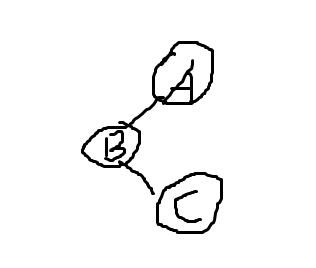
   >
   > 如图，该树的路径长度TL=2

4. **权**：**将树中结点赋给一个有着某种含义的数值（也可以是边），则这个数值称为结点权（边权）**。如果**一棵树上的节点上带有权值，则对应的就是带权树的概念**

5. **带权路径长度**：从**某节点到根节点之间的路径长度和节点上权的乘积**

6. **树的带权路径长度**：**树中所有叶子结点的带权路径长度之和**，记作**WPL(Weighted Path Length)=$\displaystyle\sum_{k=1}^n w_kl_k$**

   > w表示每个节点的带权值，**l表示该节点到根节点的路径长度**

7. **哈夫曼树**：最优树（带权路径长度最短的树）。同理，有[最优二叉树](https://so.csdn.net/so/search?q=最优二叉树&spm=1001.2101.3001.7020)，最优三叉树之称等等

> **一个n个叶子结点的哈夫曼树共有2n-1个节点**
>
> **１满二叉树不一定是哈夫曼树**．
>
> **２哈夫曼树中权越大的叶子离根越近．**
>
> **３具有相同带权结点的哈夫曼树不惟一．**
>
> **4 哈夫曼树中没有度为1的节点，因此哈夫曼树节点数永远是奇数**
>
> **5 哈夫曼树不一定是完全二叉树**

### 哈夫曼树的构造（重点）：

- （１）根据n个给定的权值构成n棵二叉树的森林，森林中每一棵树只有一个带权的根结点（**构造森林全是根**）
- （２）在森林中，选取两棵根结点的权值最小的树作为左右子树，构造一棵新的二叉树，且设置新的二叉树的根结点的权值为其左右子树上根结点的权值之和．（**选用两小造新树**）

- （３）在森林中删除这两棵树，同时将新得到的二叉树加入到森林中．（**删除两小添新人**）

- （４）重复（２）和（３），直到森林中只有一棵树为止，这棵树即为哈夫曼树．（**重复２，３剩单根**）

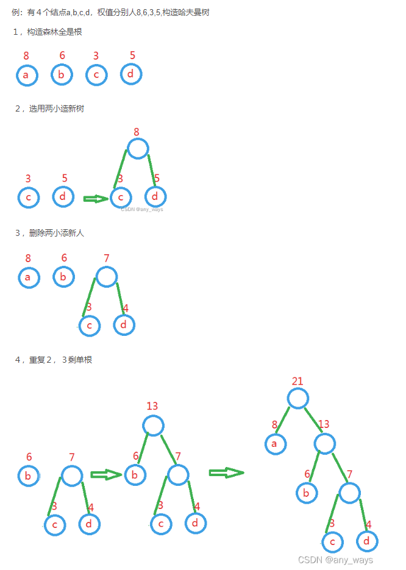

> 因此需要结合n-1次

**带权路径计算（重点）：**

1. **找出所有叶子结点**
2. **计算各个叶子结点的路径长度\*叶子结点的权值**
3. **将2式相加，有几个叶子结点就有几项**

> **哈夫曼树共有2n0-1=2n2+1个结点，且没有度为1的结点**
>
> 分支结点n-1=2n0-2
>
> huffman树是带权路径**WPL（Weighed Path Length**）最⼩的树，也称最优树。当哈夫曼树的度大于2时，就运用到了**外存中的排序**，叫**最佳归并树**（最优三叉树往上）

### 哈夫曼编码（最优前缀编码）

huffman编码，也叫做**前缀编码，最优前缀编码**

**对一个具有n个叶子的哈夫曼树来说，若对树中的每个左分支赋予0，右分支赋予1，则从根到每个叶子的路径上，各分支的赋值分别构成一个二进制串，该二进制串就称为哈夫曼编码**

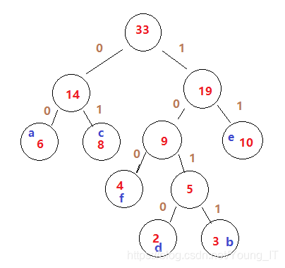

> huffman树的**左树编码为0，右树编码为1（左小右大）**，则每⼀个叶⼦结点将得到唯⼀的编码，即为 
>
> 所谓前缀编码就是指，任何一个编码都不是另一个编码的前缀
>
> **哈夫曼树的字符个数=叶子结点个数**
>
> **哈夫曼树的字符长度+1=哈夫曼树的最大高度**
>
> **注意区分字符长度和字符个数！注意区分字符长度和字符个数！注意区分字符长度和字符个数！**

### 应用

- 哈夫曼树的**应用就是压缩存储空间**

## 并查集

> 对两个集合的合并、查找操作
>
> 并查集采用双亲存储实现

# 图

## 图的基本概念

**图（Graph）G由顶点集V(G)或Vertex(G)和边集E(G)构成。**

> **图不可以为空，至少要有一个顶点**，顶点集非空，**只有边是可以空的**

1. 图的表示

   1. 无向图：

   **若图G中的每条边都是没有方向的，则称G是无向图。在无向图中(x,y)和(y,x)是同一条边。顶点用一对圆括号括起来**

   e={(1,2),(1,3),(1,0),(2,3),(3,0),(2,4)}

   1. 有向图：

   **若图G中的每条边都是有方向的，则称G是有向图。在有向图中，顶点对<x,y>是有序的，他称为从顶点x到顶点y的一条有向边。因此，<x,y>和<y,x>不是同一条边**

   e={<1,2>,<1,3>,<0,1>,<2,3>,<0,3>}

  > 无向图用()表示，可以颠倒顺序。无向图边成为边
  >
  > 有向图用<>表示，从左指向右，表示左边的出边是右边，不可颠倒。有向图边成为弧
  >
  > 有向图中所有顶点的入度之和等于所有顶点的出度之和。

2. **边与度的关系**

  **边数e=n个顶点的度之和 / 2**

  > 即：n个顶点的度之和为边数的两倍
  >
  > **在任何无向图或有向图中，所有结点的度数之和等于边数的两倍**
  >
  > **所有顶点的入度之和等于所有顶点的出度之和，等于边数**

3. **完全图（顶点n与边e的关系）**

  > 完全图指的是所有的顶点均和其他顶点有边（不仅仅是连通而已，是直接边）。有向图则要同时存在方向相反的两条弧

  - **无向完全图**中，每两个顶点之间都存在着一条边，**此时边数最多**，称为无向完全图， 最多有***e=n*(*n*-1)/2条边**。

    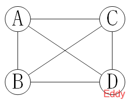

    > **对于含有n个顶点的无向图，若具有n(n-1)/2条边，则称为无向完全图**

  - **有向完全图**中，每两个顶点之间都存在着方向相反的两条边，**此时边数最多**，称为有向完全图，最多有***e=n*(*n*-1)条边。**

    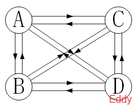

    > **对于含有n个顶点的有向图，若具有n(n-1)条边，则称为有向完全图**

4. **稠密图与稀疏图**
   1. **稠密图：有很多条边或弧（如e>=nlog2n,n为顶点个数)的图称为稠密图**。接近完全图，边多
   2. **稀疏图：有很少条边或弧（如e<nlog2n,n为顶点个数)的图称为稀疏图**
5. **子图**

  假设有两个图G=(V,E),G2=(V2,E2),**如果V2包含于V且E2包含于V2，则称G2为G的子图**

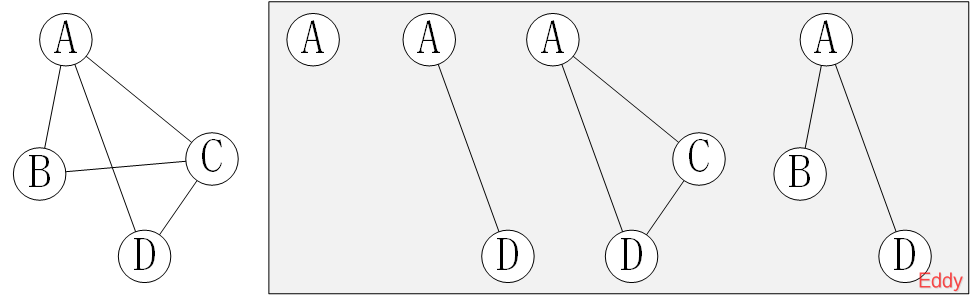

6. **权和网**

   1. 实际应用中，每条边可以标上具有某种含义的数值，这个数值称为该边上的权

   2. 这种带权的图通常称为网，也称带权图

      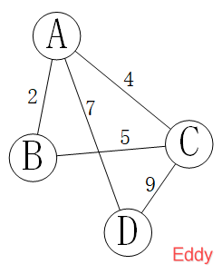

7. **度、入度和出度**

   1. **度：顶点V的度是指和v相关联的边的条数。顶点的度TD(v)=ID(v)+OD(v)**
   2. **入度是以顶点v为终点的弧的数目，记为ID(v)**
   3. **出度是以顶点v为起点的弧的树木，记为OD(v)**

8. **路径和路径长度**：从一个顶点到另一个顶点的路径是一个顶点路径；**路径长度就是一条路径上经过的边或弧的数量**

9. 简单路径、简单回路或者说简单环

  **顶点不重复出现的路径**称为简单路径。除第一个顶点和最后一个顶点外，其余**顶点不重复出现的回路**称为简单回路或简单环。

10. **连通、连通图、连通分量**

    1. **无向**图：从顶点v到顶点w有路径存在，则称v和w是连通的。若图G中**任意两个顶点都是连通的**，则称图G为**连通图**，否则称为非连通图

       - 无向图G中的**极大连通子图**称为G的**连通分量**。显然，**任何连通图的连通分量只有一个，即本身**，而非连通图有多个连通分量。下图为非连通图，图中有两个极大连通子图

         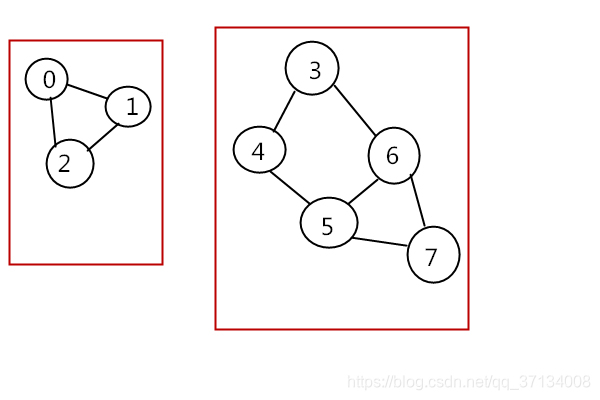

       > 如果只有一个顶点（没有边），那么此时该顶点也叫做连通分量
       >
       > 对于无向图，边的**取值范围为0到n(n-1)/2**, 如果图有n(n-1)/2条边，则该无向图称⽆向完全图
       >
       > **一个有n个顶点的图，最少有1个连通分量,最多又n个连通分量**
       >
       > **e条边的非连通图的顶点最少=连通图的顶点+1 即：边数e*=n*(n-1) /2   即：求出e条边所构成的完全图n后＋1=e条边的非连通图的顶点最少个数**
       >
       > n个顶点的非连通图的边数最多是n-2（自推）

    2. **有向**图：从顶点v到顶点w和从顶点w到项点v 之间都有路径,则称这两个顶点是**强连通**的。若图中**任何一对顶点都是强连通**的，则称此图为**强连通图**

       - 有向图G中的**极大强连通子图**称为G的**强连通分量**。强连通图只有一个强连通分量，即本身。非强连通图有多个强连通分量。

       > 对于有向图，边的**取值范围为0到n(n-1)**, 如果图有n(n-1)条边，则称向图称为有向完全图，在有向完全图中任意两个顶点之间都存在⽅向相反的两条弧

       - **不连通：在（极大）连通分量上多＋一个顶点**

       - **n个顶点的强连通图（有向图）至少有n条边**

       > 形成了环


11. **连通图的生成树（极小连通子图）**

   **n个顶点的无向连通图的最少边数n-1条边**，就是**生成树**，也是一个**极小连通子图**

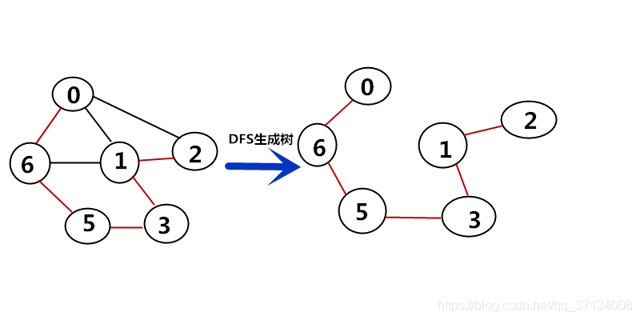

   > 若再＋一条边，形成n个顶点n条边，则一定有环
   >
   > 那么显然：
   >
   > 1. 生成树，n-1条边
   > 2. 非连通图：<n-1条边
   > 3. **n-1条边的图不一定是生成树**

   > **拿分笔记**
   >
   > 1. 一个有n个顶点的图有小于n-1条边，则是非连通图
   > 2. 如果多余n-1条边，则一定有环
   > 3. **n-1条边的图不一定是生成树**

12. 有向树和生成森林
    1. **有⼀个顶点的⼊度为0、其余顶点的⼊度均为1的有向图，称为有向树**
    2. 一个有向图的生成森林是有若干颗有向树组成的，含有图中全部结点，但只有足以构成若干颗不相交的有向树的弧


## 图的存储结构

### 邻接矩阵

> 图没有顺序存储，如果硬要说的话，可以把领接矩阵比作顺序存储

#### 概念

领接矩阵是表示顶点之间相邻关系的矩阵

> **对角线都是0或无穷**
>
> **无向图的领接矩阵关于对角线对称，因此顶点为n阶矩阵的n，边为主对角线以上的1的个数；有向图不对称**
>
> **需要会根据图画出邻接矩阵**
>
> 连通的话是权值（若是不带权的图，则**默认是1**）
>
> 0或无穷表示不连通

<<<<<<< HEAD

=======
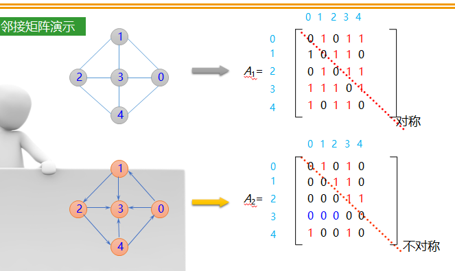
>>>>>>> origin/master

> 一个图的邻接矩阵**表示是唯一的**。
>
> 特别**适合**于**稠密图**的存储。
>
> **邻接矩阵的存储空间和时间复杂度都为O(*n*2)**

> **拿分笔记**
>
> 1. 在使用领接矩阵表示图时，在**不带权的图中，0表示两个点之间不连通，1 表示两点连通**
> 2. 在**带权图中，若两点不连通，则通常用∞来表示，两点连通则直接在领接矩阵中相应位置上标注权值即可**

#### 类型定义

除了存储领接矩阵的二维数组外，还要用一个一维数组来存储顶点信息

```c
#define  MAXV  <最大顶点个数>	
#define INF 9999999999
typedef char InfoType;
typedef struct   //定义每个顶点内部存放的结构
{  int no;			//顶点编号
   InfoType info;		//顶点其他信息
} VertexType;
typedef struct  		//以邻接矩阵存储的图的定义
{  int edges[MAXV][MAXV]; 	//邻接矩阵
   int n，e;  			//顶点数，边数
   VertexType vexs[MAXV];	//存放顶点信息
}  MatGraph;
```

#### 领接矩阵的优缺点

- 优点
  1. 便于**判断两个顶点是否有边**（连通）
  2. **便于计算各个顶点的度。对于无向图，领接矩阵第i行元素之和就是顶点i的度；对于有向图，第i行元素之和就是顶点i的出度，第i列元素之和就是顶点i的入度**。因此顶点i的度=第i行和第i列的元素之和
- 缺点
  1. **不便于增加和删除顶点**
  2. **不便于统计边的数目**，需要扫描所有元素才能统计完毕，时间复杂度为O(n^2）
  3. 空间复杂度高，不适合稀疏图。无向图可以进行压缩存储

### 邻接表

#### 概念

**邻接表是图的一种链式存储结构，由两部分组成：表头结点表和边结点表**

1. **表头结点表：包括数据域和链域**
2. **边表：包括邻接点域、数据域和链域**；邻接点域指与定点vi邻接的点在图中的位置

> 采用的是**顺序存储＋链式存**储的方式实现
>
> 用一个数组作为头结点表示每个顶点，然后每个数组内部都有个指针，指向连接的结点
>
> 边结点表算的是出度
>
> **需要会根据图画出邻接表，不关于主对角线对称，顶点为n阶矩阵的n，边数为邻接表中1的个数**
>
> **邻接表表示不唯一**

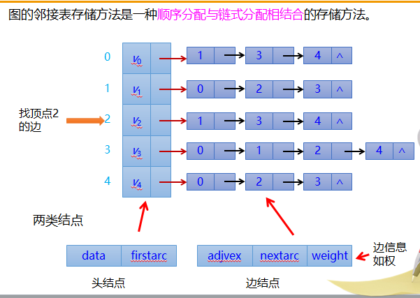

> 邻接表表示不唯一。
>
> 特别适合于稀疏图存储。   
>
> 邻接表的存储空间为**O(*n*+*e*)**

#### 类型定义

> **时间复杂度：O(n+e)**

```c
typedef struct ANode    //边结点类型的定义
{  int adjvex;			//该边的终点编号
   struct ANode *nextarc;	//指向下一条边的指针
   InfoType weight;		//该边的权值等信息
}  ArcNode;

typedef struct Vnode     //表头结点类型的定义
{  Vertex data;		//顶点信息
   ArcNode *firstarc;		//指向第一条边
}  VNode;

typedef struct   //邻接表的实现
{  VNode adjlist[MAXV];	//用表头结点类型创建数组
   int n，e;			//图中顶点数n和边数e
} AdjGraph;
```

- 创建图

  ```c
  void CreateAdj(AdjGraph *&G，int A[MAXV][MAXV]，int n，int e) 
  //创建图的邻接表
  {  int i， j;
     ArcNode *p;
     G=(AdjGraph *)malloc(sizeof(AdjGraph));
     for (i=0;i<n;i++)	     //给邻接表中所有头结点的指针域置初值
        G->adjlist[i].firstarc=NULL;
     for (i=0;i<n;i++)		   		//检查邻接矩阵中每个元素
       for (j=n-1;j>=0;j--)
  		if (A[i][j]!=0 && A[i][j]!=INF)	     	//存在一条边
  		{  p=(ArcNode *)malloc(sizeof(ArcNode));	//创建一个结点p
             p->adjvex=j;			     	//存放邻接点
             p->weight=A[i][j];		 	     	//存放权
             p->nextarc=G->adjlist[i].firstarc; //采用头插法插入结点p
             G->adjlist[i].firstarc=p;
  		}
     G->n=n; G->e=e;
  }
  ```

- 输出图

  ```c
  void DispAdj(AdjGraph *G)	//输出邻接表G
  {  int i;
     ArcNode *p;
     for (i=0;i<G->n;i++)
     {  p=G->adjlist[i].firstarc;
        printf("%3d: "，i);
        while (p!=NULL)
        {  printf("%3d[%d]→"，p->adjvex，p->weight);
  	  p=p->nextarc;
        }
        printf("∧\n");
     }
  }
  ```

#### 邻接表的优缺点

- 优点
  1. 便于增加和删除结点
  2. 便于统计边的数目
  3. **空间效率高。适合稀疏图**
- 缺点
  1. 不利于判断顶点之间是否有边
  2. 不利于计算各个有向图顶点的度

#### 逆邻接表

> **区别**
>
> **邻接表**：反映的是**顶点出度**的情况。
>
> **逆邻接表**：反映的是顶点的**入度**情况。

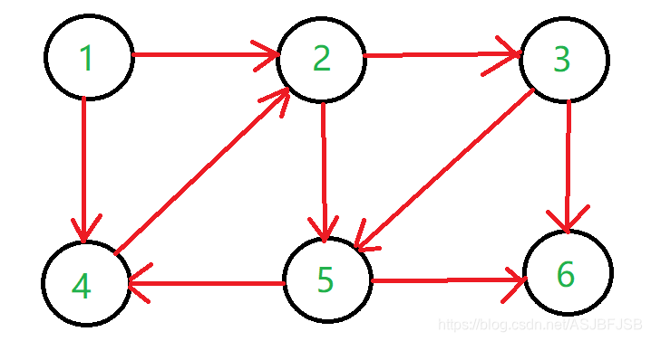

邻接表：

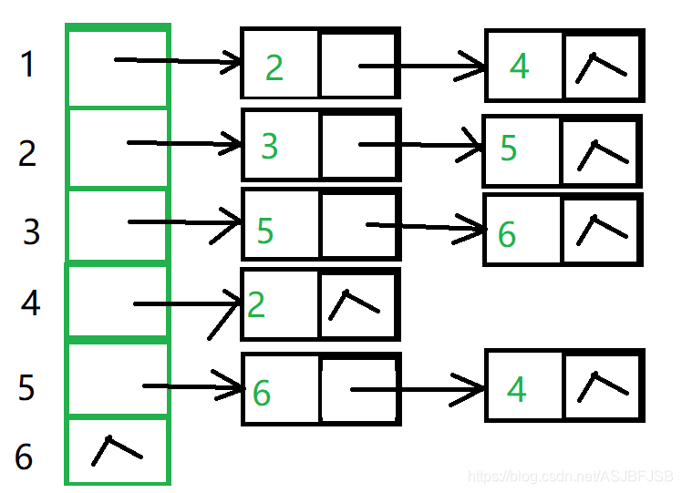

逆邻接表：

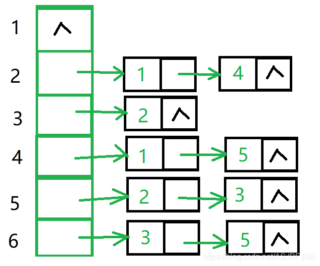

### 十字链表

> 对于**有向图**的另一种存储结构，它是**邻接表和逆邻接表的结合（出度加入度）**。
>
> 十字链表中，对应于有向图中每一条弧都有一个结点，对于每个顶点也有一个结点

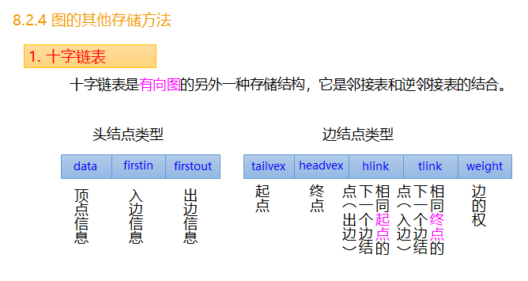

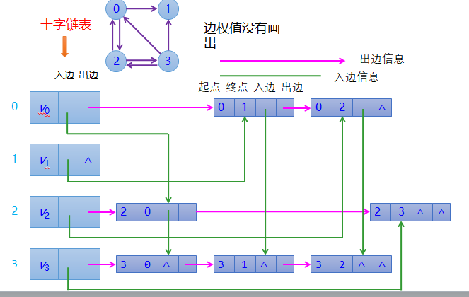

### 邻接多重表

> 邻接多重表是**无向图**的另外一种存储结构，与十字链表类似。
>
> **十字链表和邻接多重表都是邻接表即链式存储结构的扩展，而顺序存储结构只有邻接矩阵**
>
> 与无向图的邻接表相比，对图的**边的操作（标记或删除）更便利。**

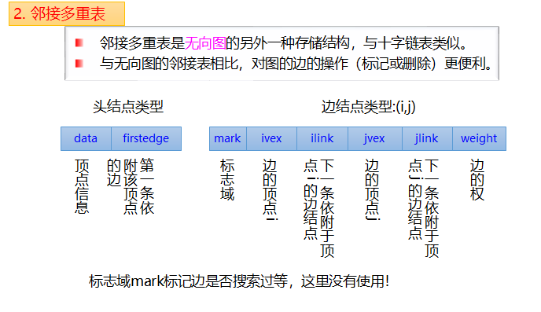

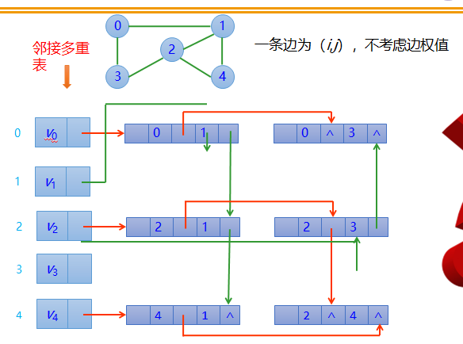

## 图的遍历

图的遍历是指**从图中某一定点出发，按照某种搜索方法沿着图中的边对图中的所有顶点访问一次**且仅访问一次

> **拿分笔记**
>
> **根据搜索路径的方向，通常有两种遍历图的方法：深度优先搜索和广度优先搜索**
>
> 注意区分树的层次遍历、先根遍历、后根遍历
>
> 二叉树的先中后序遍历

### 深度优先遍历DFS

Depth First Search

**深度优先遍历类似于树的先序遍历，是树的先序遍历的推广**

> **优先遍历从某个结点出发的有最深层次的结点，层次必须递增，若到底则回到第二层的其他结点继续深度遍历**
>
> **邻接表求遍历序列：看到一条可以走（没有走过)路径就直接走下去，没有道路时回退 **

#### 算法

```c
void DFS(AdjGraph *G，int v)  //邻接表实现，实现主要都是用邻接表
{  ArcNode *p; int w;
   visited[v]=1; 		//置已访问标记
   printf("%d  "，v); 		//输出被访问顶点的编号
   p=G->adjlist[v].firstarc; 	//p指向顶点v的第一条边的边头结点
   while (p!=NULL) 
   {  w=p->adjvex;
      if (visited[w]==0) 
         DFS(G，w);   		//若w顶点未访问，递归访问它
      p=p->nextarc; 　		//p指向顶点v的下一条边的边头结点
   }
}
```

> 深度优先遍历的过程体现出后进先出的特点：用**栈或递归**方式实现。
>
> 如何确定一个顶点是否访问过? 设置一个visited[] 全局数组， visited[*i*]=0表示顶点*i*没有访问； visited[*i*]=1表示顶点*i*已经访问过。
>
> 深度优先遍历的**时间复杂度为O(*n*+*e*)。图遍历的空间复杂度和时间复杂度取决于图所用的存储结构**

#### 深度优先生成树

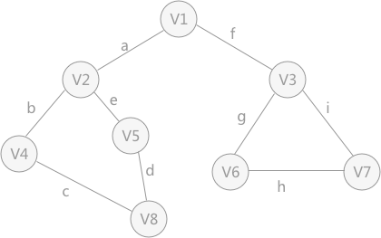

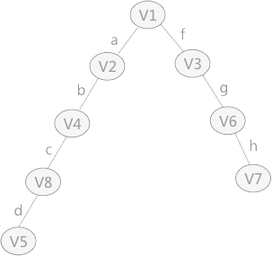


#### 遍历次序（重要）

要点：

- **若有多条路，先选权值小的那条路**

- **掌握由一个图写出深度优先遍历序列**

  如下图，若从2出发，下一步可以选1或者6，但要先去小的，所以先去1；然后以1为出发点可以去2（去过）或者5，访问5，5没有可以访问的了；然后回到2，这次从6开始，去3，然后3又可以去4，再去7，8，遍历完成。

- **掌握由一个邻接表写出深度优先遍历序列（重点）**

  **邻接表**写出深度优先遍历序列的要点在于**要看邻接表里的**，因为邻接表里多条路，**并不一定是选权值最小的**

  如下图，若从2出发，下一步选1，然后跳到1的那一行，2被访问了，那就去5；跳5那一行，没东西了，返回2那一行；访问下一个6，6的行可以选3（没被选中过）...以此类推，**被选过的就要跳过去**

  > 秘诀：**访问一个，就到它的行去接着访问别的，若没有，则一步步向上返回**

<<<<<<< HEAD

=======
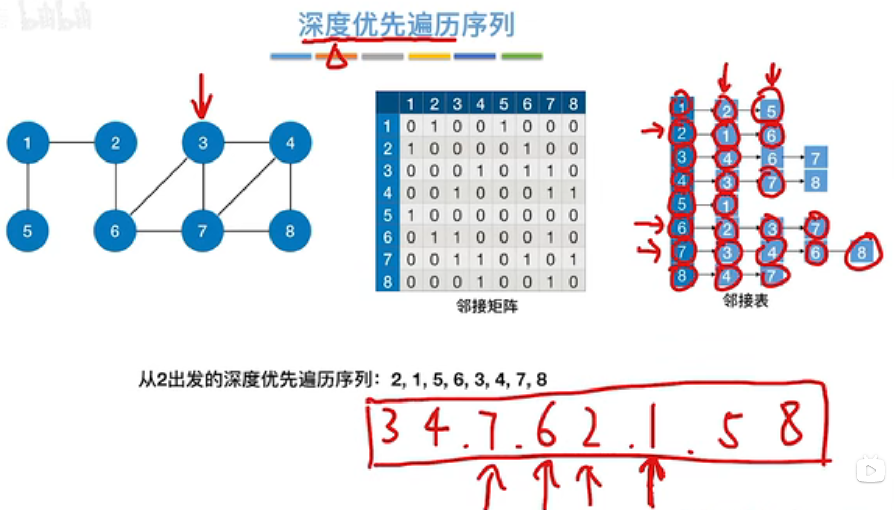
>>>>>>> origin/master

### 广度优先遍历BFS

Breadth First Search

**广度优先搜索遍历类似于树按层次遍历的过程**

#### 算法

> **广度优先搜索遍历的特点是：进可能先进行横向搜索**
>
> 类似于层次遍历，距离起始结点近的先访问完，再访问离更远的
>
> **要会从邻接表的图来写出遍历序列**
>
> **邻接表求遍历序列：考虑每一条可以走（没有走过)的路径，尝试走每条道路**

```c
void BFS(AdjGraph *G，int v)
{  int w， i;
   ArcNode *p;
   SqQueue *qu;			//定义环形队列指针
   InitQueue(qu);			//初始化队列
   int visited[MAXV];        		//定义顶点访问标记数组
   for (i=0;i<G->n;i++) 
     visited[i]=0;	  		//访问标记数组初始化
   printf("%2d"，v); 			//输出被访问顶点的编号
   visited[v]=1;             		//置已访问标记
   enQueue(qu，v);
   while (!QueueEmpty(qu))       		//队不空循环
   {  deQueue(qu，w);				//出队一个顶点w
      p=G->adjlist[w].firstarc; 		//指向w的第一个邻接点
      while (p!=NULL)				//查找w的所有邻接点
      {  if (visited[p->adjvex]==0)		//若当前邻接点未被访问    
         {  printf("%2d"，p->adjvex);		//访问该邻接点
            visited[p->adjvex]=1;		//置已访问标记
            enQueue(qu，p->adjvex);		//该顶点进队
         }
         p=p->nextarc;              		//找下一个邻接点
      }
    }
    printf("\n");
}
```

> 广度优先搜索遍历体现先进先出的特点，用**队列**实现。
>
> 对于连通图，调用一次DFS或BFS，能够访问到图中的所有顶点
>
> 无向非连通图：调用一次DFS或BFS，只能访问到初始点所在连通分量中的所有顶点，不可能访问到其他连通分量中的顶点。
>
> **所以非连通图，需要调用连通分量个数次的DFS或BFS才能遍历所有结点**

#### 广度优先生成树


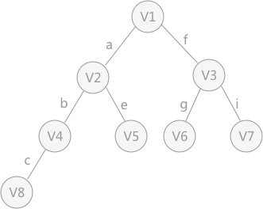


#### 遍历次序（重要）

要点：

- **若有多条路，先选权值小的那条路**

- **掌握由一个图写出广度优先遍历序列**

  如下图，若从2出发，下一步可以选1或者6，但要先去小的，所以先去1，再去6；然后以1或6为出发点可以去3、5或者7，访问5（因为上一级1比较小），然后3、7；然后以5、3、7为起点访问其他的，遍历完成。

- **掌握由一个邻接表写出广度优先遍历序列（重点）**

  **邻接表**写出深度优先遍历序列的要点在于**要看邻接表里的**，因为邻接表里多条路，**并不一定是选权值最小的**

  如下图，若从2出发，下一步将该层全访问完1、6，然后跳到1的那一行，访问改行，2被访问了，那就去5，第二行的1访问完毕；之后回到2行，访问6，还是一样，跳过去，访问一行先，然后再往里深入...以此类推，**被选过的就要跳过去**

<<<<<<< HEAD

=======

>>>>>>> origin/master

> 秘诀：先把一层的都访问遍，再挨个往里钻

## 最小生成树

> 从4-8都属于图的应用
>
> 可以先数一下有多少个顶点，因此边数为定点数-1

### 生成树概念

**连通图G的子图如果是一颗包含G所有顶点的树，则该子图称为G的生成树**

一个连通图的生成树是一个**极小连通子图**，它含有图中全部n个顶点和构成一棵树的**(n-1)**条边。　

**生成树是图用某种遍历方式所形成的，所以每个结点只会被访问一次，不能重复走，但必须每个结点都走完**

> 可以看出生产树的概念是针对无向图而言的，而无向图中连通的最低要求就是要有n-1条边，所以说生成树是极小连通子图
>
> 注意：连通分量是极大联通子图，一个极大一个极小，注意区分　
>
> 由广度优先遍历得到的生成树称为广度优先生成树。
>
> 由深度优先遍历得到的生成树称为深度优先生成树。
>
> **生成树是可以没有权值的，极小生成树必须要有权值**
>
> 边数=顶点数-1
>
> **树的生成树不唯一，从不同的顶点出发遍历，可以得到不同的生成树，各边代价之和唯一**

### 最小生成树（MST）概念

**在一个连通网的所有生成树中，各边代价之和最小的那颗生成树称为该连通网的最小代价生成树，简称为最小生成树**

普利姆算法和克鲁斯卡尔算法是两个利用MST性质构造最小生成树的算法

### 普里姆（Prim）算法

> **选择最近的点，后连接边**
>
> **要求：不能形成回路**（本质：不能重复访问结点）
>
> 找挨着最近的点连起来，并将连起来的点加入集合中，之后按照集合里周围单位1 的范围进行查找

- 步骤：

  （1）初始化U={v}。v到其他顶点的所有边为候选边；

  （2）重复以下步骤n-1次，使得其他n-1个顶点被加入到U中：

   ①从候选边中挑选权值最小的边输出，设该边在V-U中的顶点是k，将k加入U中；

   ②考察当前V-U中的所有顶点j，修改候选边：若(j，k)的权值小于原来和顶点k关联的候选边，则用(k，j)取代后者作为候选边。

<<<<<<< HEAD

=======
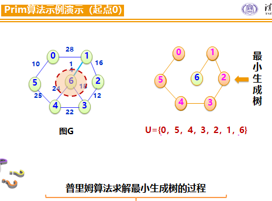
>>>>>>> origin/master

- 算法

  ```c
  #define INF 32767		//INF表示∞
  void  Prim(MatGraph g，int v)
  {  int lowcost[MAXV];
     int min;
     int closest[MAXV]，i，j，k;
     for (i=0;i<g.n;i++)	//给lowcost[]和closest[]置初值
     {	lowcost[i]=g.edges[v][i];
  	closest[i]=v;
     }
    for (i=1;i<g.n;i++)	  	//输出(n-1)条边
    {  min=INF;
       for (j=0;j<g.n;j++) 	//在(V-U)中找出离U最近的顶点k
  	if (lowcost[j]!=0 && lowcost[j]<min)
  	{  min=lowcost[j];
  	   k=j;			//k记录最近顶点编号
  	}
       printf(" 边(%d，%d)权为:%d\n"，closest[k]，k，min);
       lowcost[k]=0;		//标记k已经加入U
      for (j=0;j<g.n;j++)  //修改数组lowcost和closest
       if (lowcost[j]!=0 && g.edges[k][j]<lowcost[j])
       {  lowcost[j]=g.edges[k][j];
          closest[j]=k;
       }
     }
  }
  ```

  > Prim()算法中有两重for循环，所以时间复杂度为**O(n2)，与网中边数无关，因此适用于求稠密网的最小生成树** 

### 克鲁斯卡尔（Kruskal)

> **选择最小的边，后画点**
>
> **要求：不能回路**
>
> 找边最小的一条，然后将两个点连起来，如果这两点已经连通了，则不要这条边，去找另外小的一条

- 步骤：

  （1）置U的初值等于V（即包含有G中的全部顶点），TE的初值为空集（即图T中每一个顶点都构成一个连通分量）。

  （2）将图G中的边按权值从小到大的顺序依次选取：

    Œ 若选取的边未使生成树T形成回路，则加入TE；

     否则舍弃，直到TE中包含(n-1)条边为止。

<<<<<<< HEAD
  
=======
  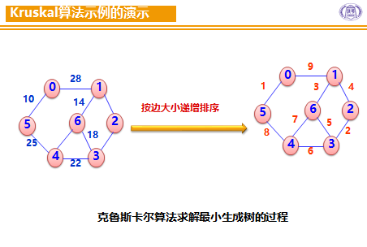
>>>>>>> origin/master

- 算法：

  ```c
  //用邻接矩阵来实现
  typedef struct 
  {  int u;     	//边的起始顶点
     int v;     	//边的终止顶点
     int w;   	//边的权值
  } Edge; 
  Edge E[MAXV];
  void Kruskal(MatGraph g)
  {  int i，j，u1，v1，sn1，sn2，k;
     int vset[MAXV];
     Edge E[MaxSize];		//存放所有边
     k=0;				//E数组的下标从0开始计
     for (i=0;i<g.n;i++)	//由g产生的边集E
       for (j=0;j<g.n;j++)
          if (g.edges[i][j]!=0 && g.edges[i][j]!=INF)
  	 {  E[k].u=i;  E[k].v=j;  E[k].w=g.edges[i][j];
  	    k++;
  	 }
     InsertSort(E，g.e);		//用直接插入排序对E数组按权值递增排序
     for (i=0;i<g.n;i++) 	//初始化辅助数组
  	vset[i]=i;
    k=1;				//k表示当前构造生成树的第几条边
    j=0;				//E中边的下标，初值为0
    while (k<g.n)		//生成的边数小于n时循环
    { 
       u1=E[j].u;v1=E[j].v;	//取一条边的头尾顶点
       sn1=vset[u1];
       sn2=vset[v1];		//分别得到两个顶点所属的集合编号
       if (sn1!=sn2)  		//两顶点属于不同的集合
       {  printf("  (%d，%d):%d\n"，u1，v1，E[j].w);
          k++;		   	//生成边数增1
          for (i=0;i<g.n;i++)  	//两个集合统一编号
             if (vset[i]==sn2) 	//集合编号为sn2的改为sn1
  		vset[i]=sn1
       }
       j++;			//扫描下一条边
    }
  }
  
  ```

  > Kruskal算法的时间复杂度为**O(elog2e)，克鲁斯卡尔算法更适合于求稀疏网的最小生成树**
  >
  > **改进：堆排序、并查集**

  

## 最短路径

在带权有向网中，习惯上称**路径上的第一个顶点为源点，最后一个顶点为终点**。

主要有两种最常见的最短路径问题：一种是求从某个源点到其余各顶点的最短路径，另一种是求每一对顶点之间的最短路径（调用n次迪杰斯特拉或者用佛洛依德）

> **最小生成树**和**最短路径**区别：
>
> 1. **最小生成树**：**连通图**的**最短路径**。
> 2. **最短路径：两任意结点之间**（可以非邻接）的**最短路径**。

### 迪杰斯特拉（Dijkstra）求单源最短路径

迪杰斯特拉算法就是**按路径长度递增的次序产生最短路径**

> 类似线代里的矩阵求最短路径
>
> 优点：**效率较高**，[时间复杂度](https://so.csdn.net/so/search?q=时间复杂度&spm=1001.2101.3001.7020)为**O(n^2)**。
>
> 缺点：只能求**一个顶点**到**所有顶点**的**最短路径**。 （**单源最短路径**）

<<<<<<< HEAD

=======
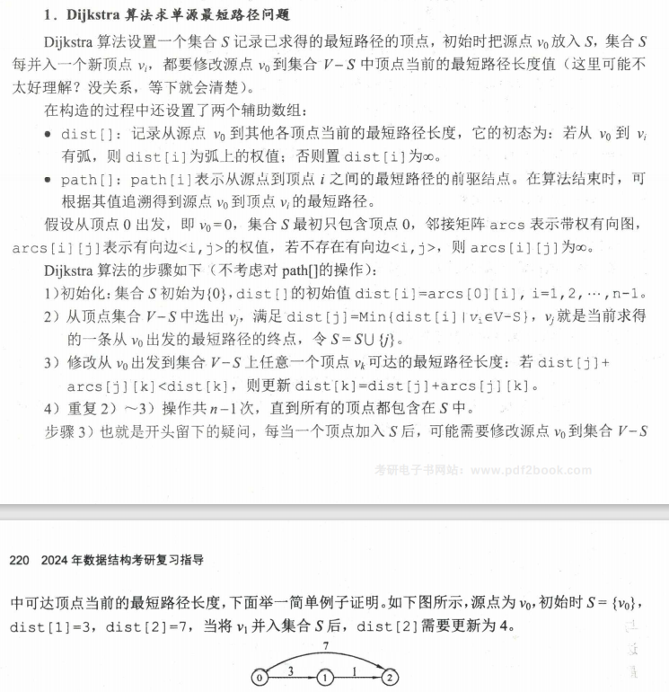
>>>>>>> origin/master

#### 图片步骤1

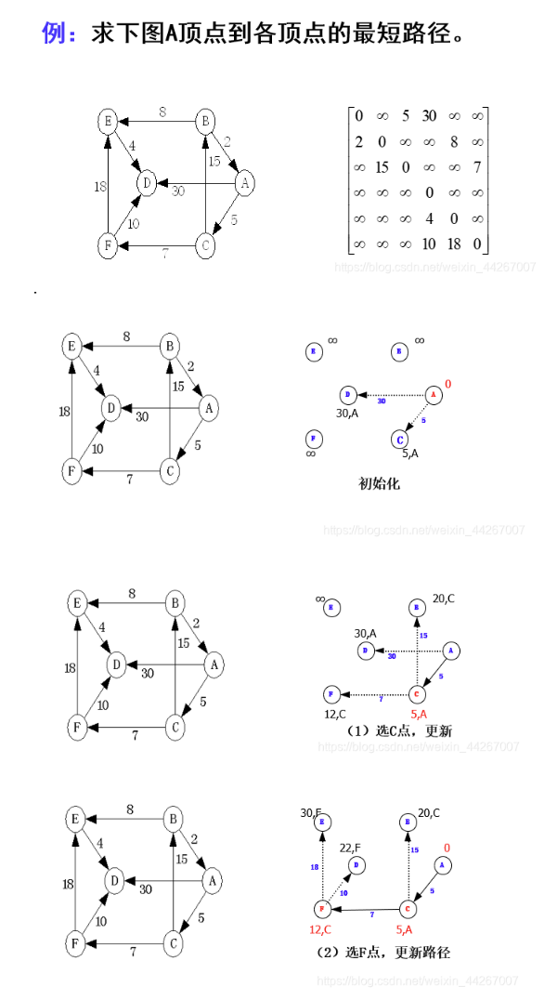

<<<<<<< HEAD

=======
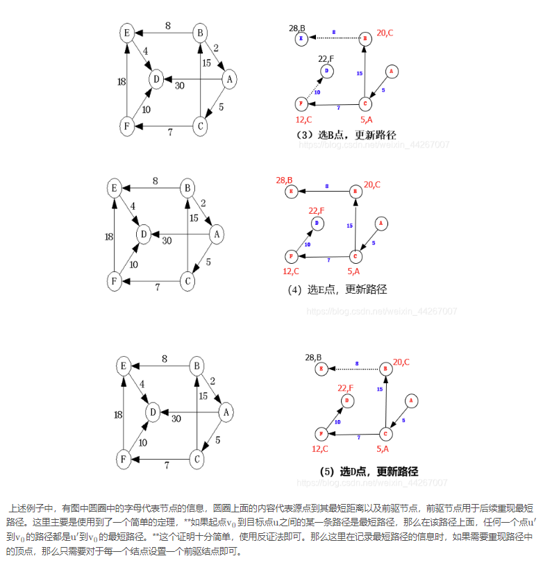
>>>>>>> origin/master

#### 图片步骤2

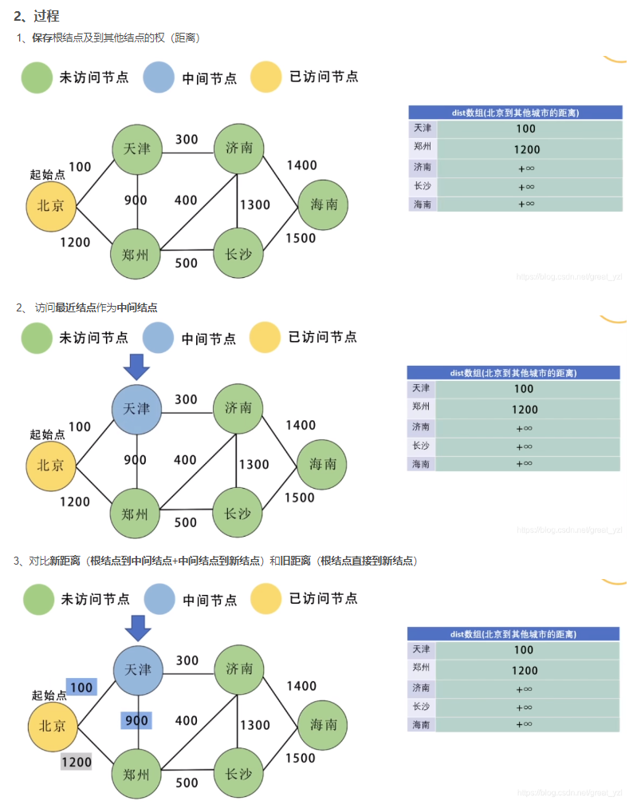

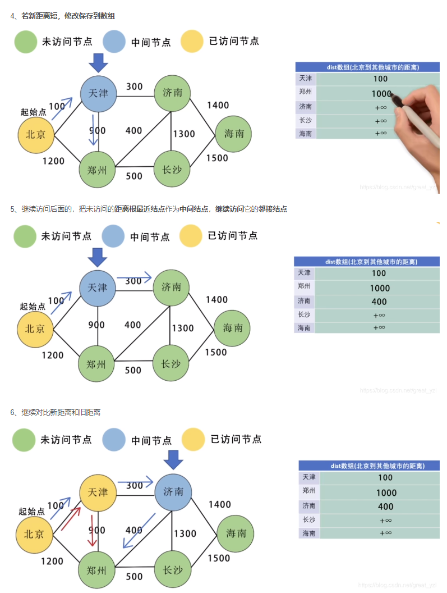

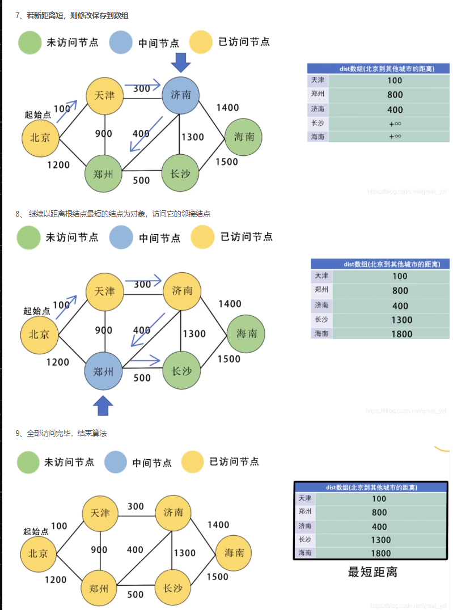

#### 图片步骤3

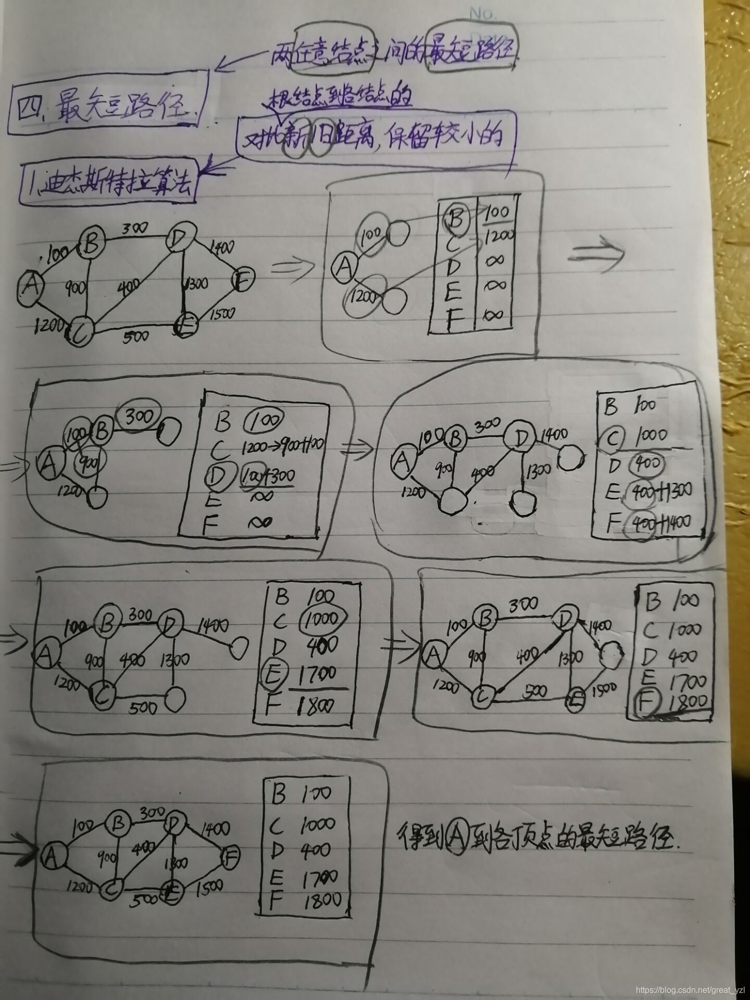

#### 算法

```c
//迪杰斯特拉(Dijkstra)算法
/*测试案例
ABCDEFGHI
B 1 C 5
A 1 C 3 D 7 E 5
A 5 B 3 E 1 F 7
B 7 E 2 G 3
B 5 C 1 F 3 H 9 G 6 D 2
C 7 E 3 H 5
D 3 E 6 H 2 I 7
F 5 E 9 G 2 I 4
G 7 H 4
*/
#define _CRT_SECURE_NO_WARNINGS
#include<stdio.h>
 
#define MAXSIZE 20
#define MAX 65535					//代表无穷大
int length = 0;							//顶点个数
int root = 0;								//根顶点
int rootDist[MAXSIZE];				//根顶点（记录根到其他顶点的距离）
bool visit[MAXSIZE];				//记录各结点是否访问
 
 
//图（顶点和权）
typedef struct
{
	char vertex[MAXSIZE];
	int weight[MAXSIZE][MAXSIZE];			//权可以代替边（自身为0，相连有值，不相连无穷大）
}Graph;
Graph G;
 
 
//输入顶点
void InputVertex()
{
	int i;
	char ch;
	printf("请输入图的顶点：\n");
	scanf("%c", &ch);
	for (i = 0; i < MAXSIZE && ch != '\n'; i++)
	{
		G.vertex[i] = ch;
		scanf("%c", &ch);
	}
	length = i;
}
 
//图权重初始化
void GraphWeightInit()
{
	int i, j;
	for (i = 0; i < length; i++)
	{
		for (j = 0; j < length; j++)
		{
			if (i == j)							//指向自己
				G.weight[i][j] = 0;
			else
				G.weight[i][j] = MAX;	//无穷大
		}
	}
}
 
//根据数据查找图顶点下标
int FindIndex(char ch)
{
	int i;
	for (i = 0; i < length; i++)
	{
		if (G.vertex[i] == ch)
			return i;
	}
	return -1;
}
 
//创建图
void CreateGraph()
{
	int i, j, index, weight;
	char ch;
	for (i = 0; i < length; i++)
	{
		printf("请输入%c的邻接顶点及权重（空格分隔，换行结束）：\n", G.vertex[i]);
		scanf("%c", &ch);
		while (ch != '\n')
		{
			while (ch == ' ')				//为空格
			{
				scanf("%c", &ch);			//输入字符
				continue;
			}
			index = FindIndex(ch);
			scanf("%d", &weight);		//输入权重
			while (weight == 32)		//32为空格的ASCII码
			{
				scanf("%d", &weight);
				continue;
			}
			G.weight[i][index] = weight;	//存入权重
			scanf("%c", &ch);				//(下一轮)输入字符
		}
	}
}
 
//根结点初始化
void Init()
{
	int i;
	printf("请输入根结点：\t");
	scanf("%d", &root);
	for (i = 0; i < length; i++)
	{
		rootDist[i] = G.weight[root][i];		//把0作为根，初始化
		visit[i] = false;								//未访问
	}
}
 
//取最小（在未访问的结点中）
int GetMinInVisit()
{
	int i, min = 0;
	for (i = 0; i < length; i++)
	{
		//未访问
		if (!visit[i])
		{
			//找到最小下标（不能是自身）
			if (rootDist[min] > rootDist[i] || rootDist[min] == 0)
			{
				min = i;
			}
		}
	}
	return min;
}
 
//检查是否访问完毕
bool IsNull()
{
	bool flag = true;
	for (int i = 0; i < length; i++)
	{
		if (!visit[i])				//还有未访问的
			flag = false;
	}
	return flag;
}
 
//迪杰斯特拉(Dikstra)算法（生成根到其他顶点的最短路径）
void Dijkstra(int index)
{
	int i;
	visit[index] = true;						//标记访问
	printf("%c %d\t", G.vertex[index], rootDist[index]);
 
	//遍历中间结点的邻接结点，对比新旧距离
	for (i = 0; i < length; i++)
	{
		//若 旧距离 > 新距离（改变新距离覆盖旧距离）
		if (rootDist[i] > (rootDist[index] + G.weight[index][i]))
		{
			rootDist[i] = rootDist[index] + G.weight[index][i];
		}
	}
 
	//退出判断
	if (IsNull())
		return;
	index = GetMinInVisit();				//取出最小邻接结点，作为中间结点
	Dijkstra(index);								//递归调用Dijkstra()
}
 
//输出测试
void Print()
{
	for (int i = 0; i < length; i++)
	{
		printf("\n%c结点邻接结点：\t", G.vertex[i]);
		for (int j = 0; j < length; j++)
		{
			if (G.weight[i][j] != 0 && G.weight[i][j] != MAX)		//有邻接结点
			{
				printf("%c %d\t", G.vertex[j], G.weight[i][j]);
			}
		}
	}
}
 
int main()
{
	InputVertex();				//输入顶点
	GraphWeightInit();		    //图权重初始化
	CreateGraph();				//创建图
	Init();						//初始化
	Dijkstra(root);				//迪杰斯特拉算法（先以根结点为中间结点遍历）（生成根到其他顶点的最短路径）
	//Print();					//测试输出
	return 0;
}
```


### 弗洛伊德（Floyd）求各顶点之间最短路径问题

> 优点：求**所有顶点**到**所有顶点**的**最短路径**。（**多源最短路**）
>
> 缺点：**效率较低**，时间复杂度为**O(n^3)**。 

<<<<<<< HEAD

=======
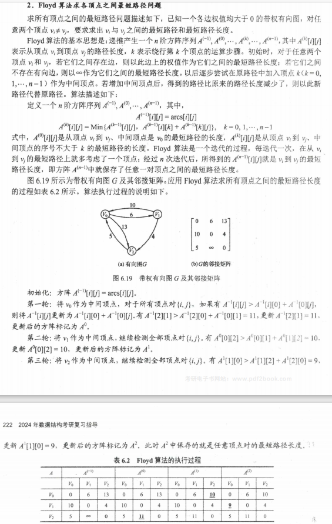
>>>>>>> origin/master

#### 图片步骤1

**基本思想：不断找点进行中转，比较中转前后的最小距离**。

原理：

**最优子结构**：图结构中一个显而易见的定理：**最短路径的子路径仍然是最短路径** ,这个定理显而易见，比如一条**从a到e的最短路径a->b->c->d->e 那么 a->b->c 一定是a到c的最短路径，c->d->e一定是c到e的最短路径**，反过来，**（原理）如果一条最短路必须要经过点k，那么i->k的最短路径+k->j的最短路径一定是i->j 经过k的最短路径**，因此，最优子结构可以保证。

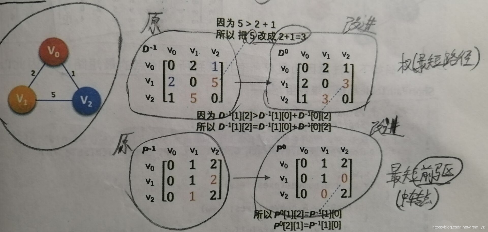

> （左边矩阵是改进前的，右边矩阵是改进后的。）
>
> 弗洛伊德算法定义了两个二维矩阵：
>
> D矩阵存放最小权(最短路径)，P矩阵存放最短前驱(中转点)
>
> 1、矩阵D记录顶点间的最小路径
> 例如D[1][2]= 3，说明顶点1 到 2 的最短路径为3；
> 2、矩阵P记录顶点间最小路径中的中转点
> 例如P[1][2]= 0 说明，1 到 2的最短路径轨迹为：1 -> 0 -> 2。
> 它通过3重循环，medium为中转点，begin为起点，end为终点，循环比较D[begin][end] 和 D[begin][medium] + D[medium][end] 之间的最小值，如果(D[begin][medium] + D[medium][end] )为更小值，则把(D[begin][medium] + D[medium][end] )覆盖保存在(D[begin][end])中。

#### 图片步骤2


#### 代码

```c
//弗洛伊德(Floyd)算法
/*测试案例
ABCDEFGHI
B 1 C 5
A 1 C 3 D 7 E 5
A 5 B 3 E 1 F 7
B 7 E 2 G 3
B 5 C 1 F 3 H 9 G 6 D 2
C 7 E 3 H 5
D 3 E 6 H 2 I 7
F 5 E 9 G 2 I 4
G 7 H 4
*/
#define _CRT_SECURE_NO_WARNINGS
#include<stdio.h>
 
#define MAXSIZE 20
#define MAX 65535							//代表无穷大
int length = 0;									//顶点个数
int D[MAXSIZE][MAXSIZE];		//存放顶点之间的权
int P[MAXSIZE][MAXSIZE];		//存放顶点之间的前驱（中间结点）
 
//图（顶点和权）
typedef struct
{
	char vertex[MAXSIZE];
	int weight[MAXSIZE][MAXSIZE];			//权可以代替边（自身为0，相连有值，不相连无穷大）
}Graph;
Graph G;
 
 
//输入顶点
void InputVertex()
{
	int i;
	char ch;
	printf("请输入图的顶点：\n");
	scanf("%c", &ch);
	for (i = 0; i < MAXSIZE && ch != '\n'; i++)
	{
		G.vertex[i] = ch;
		scanf("%c", &ch);
	}
	length = i;
}
 
//图权重初始化
void GraphWeightInit()
{
	int i, j;
	for (i = 0; i < length; i++)
	{
		for (j = 0; j < length; j++)
		{
			if (i == j)							//指向自己
				G.weight[i][j] = 0;
			else
				G.weight[i][j] = MAX;	//无穷大
		}
	}
}
 
//根据数据查找图顶点下标
int FindIndex(char ch)
{
	int i;
	for (i = 0; i < length; i++)
	{
		if (G.vertex[i] == ch)
			return i;
	}
	return -1;
}
 
//创建图
void CreateGraph()
{
	int i, j, index, weight;
	char ch;
	for (i = 0; i < length; i++)
	{
		printf("请输入%c的邻接顶点及权重（空格分隔，换行结束）：\n", G.vertex[i]);
		scanf("%c", &ch);
		while (ch != '\n')
		{
			while (ch == ' ')				//为空格
			{
				scanf("%c", &ch);			//输入字符
				continue;
			}
			index = FindIndex(ch);
			scanf("%d", &weight);		//输入权重
			while (weight == 32)		//32为空格的ASCII码
			{
				scanf("%d", &weight);
				continue;
			}
			G.weight[i][index] = weight;	//存入权重
			scanf("%c", &ch);				//(下一轮)输入字符
		}
	}
}
 
//弗洛伊德算法
void Floyd()
{
	int medium, begin, end;
	//初始化矩阵
	for (int i = 0; i < length; i++)
		for (int j = 0; j < length; j++)
		{
			D[i][j] = G.weight[i][j];
			P[i][j] = j;
		}
 
	//开始正式修改（最短路径及前驱）
	for (medium = 0; medium < length; medium++)	//中间结点
		for (begin = 0; begin < length; begin++)			//前驱结点
			for (end = 0; end < length; end++)				//后继结点
			{
				//经过中间结点路径更小，则1、需要覆盖掉原来的路径；2、替换掉前驱（中间结点）
				if (D[begin][end] > (D[begin][medium] + D[medium][end]))
				{
					D[begin][end] = D[begin][medium] + D[medium][end];		//覆盖路径（只达标的话，只要这一句就够了）
					P[begin][end] = P[begin][medium];										//更新前驱（中间结点）
					//不能直接赋值medium：跨越结点之间的追溯，存放的是最近前驱，需要一个一个往后追溯
				}
			}
}
 
//测试矩阵输出
void PrintArray()
{
	//遍历输出
	printf("遍历输出D矩阵（最短路径）：\n");
	for (int i = 0; i < length; i++)
	{
		printf("\n");
		for (int j = 0; j < length; j++)
		{
			printf("%3d", D[i][j]);
		}
	}
	printf("\n遍历输出P矩阵（前驱）：\n");
	for (int i = 0; i < length; i++)
	{
		printf("\n");
		for (int j = 0; j < length; j++)
		{
			printf("%3d", P[i][j]);
		}
	}
}
 
//遍历弗洛伊德算法
//确定begin -> end：从最近的前驱开始，一点一点往后追溯
void Traverse_Floyd()
{
	int medium = 0;
	for (int begin = 0; begin < length; begin++)
	{
		for (int end = 0; end < length; end++)
		{
			printf("\n%c", G.vertex[begin]);
			medium = P[begin][end];						//开始追溯（此为最近的前驱）
			while (medium != end)							//未追溯到尾
			{
				printf("->%c", G.vertex[medium]);		//打印中间结点
				medium = P[medium][end];				//向后追溯
			}
		}
	}
}
 
//输出测试
void Print()
{
	for (int i = 0; i < length; i++)
	{
		printf("\n%c结点邻接结点：\t", G.vertex[i]);
		for (int j = 0; j < length; j++)
		{
			if (G.weight[i][j] != 0 && G.weight[i][j] != MAX)		//有邻接结点
			{
				printf("%c %d\t", G.vertex[j], G.weight[i][j]);
			}
		}
	}
}
 
int main()
{
	InputVertex();			//输入顶点

	GraphWeightInit();		//图权重初始化
 
	CreateGraph();			//创建图
 
	Floyd();				//弗洛伊德算法（生成最短路径）
    
	Traverse_Floyd();		//遍历弗洛伊德算法
	//PrintArray();			//测试弗洛伊德矩阵输出
	//Print();				//测试输出
 
	return 0;
}
```


## 有向无环图DAG描述表达式（节省空间）

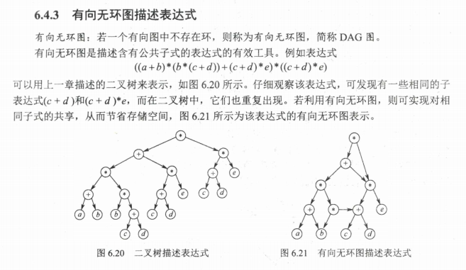

## 拓扑排序

### 概念

**拓扑排序（Topological Sorting）是一个有向无环图（DAG, Directed Acyclic Graph）**的所有顶点的线性序列。且该序列必须满足下面两个条件：

1. **每个顶点出现且只出现一次**。
2. 若存在一条从顶点 A 到顶点 B 的路径，那么在序列中顶点 A 出现在顶点 B 的前面。

**有向无环图（DAG）才有拓扑排序**，非DAG图没有拓扑排序一说。


### 拓扑排序（DAG图中）

一个 DAG 图，那么**如何写出它的拓扑排序呢**？这里说一种比较常用的方法：

1. **从 有向图 中选择一个 没有前驱的顶点（若有多个，可选最小的）并输出**
2. **从图中删除该顶点和所有以它为起点的有向边。**
3. **重复 1 和 2 直到不存在无前驱的顶点为止**
4. **若此时输出的顶点数小于有向图中的顶点数，则说明有向图中存在环，否则输出的顶点序列即为一个拓扑序列**

<<<<<<< HEAD

=======

>>>>>>> origin/master

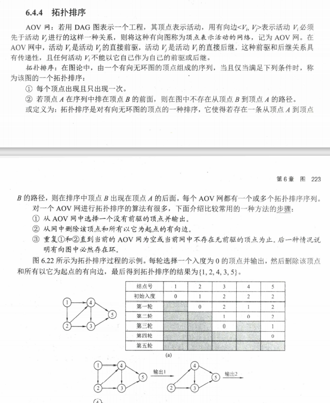

### 拓扑排序应用

通常**用来“排序”具有依赖关系的任务**。

比如，如果用一个DAG图来表示一个工程，其中每个顶点表示工程中的一个任务，用有向边表示在做任务 B 之前必须先完成任务 A。故在这个工程中，任意两个任务要么具有确定的先后关系，要么是没有关系，绝对不存在互相矛盾的关系（即环路）。

### AOV网

日常生活中，一项大的工程可以看作是由若干个子工程组成的集合，这些子工程之间必定存在一定的先后顺序，即某些子工程必须在其他的一些子工程完成后才能开始。

我们用有向图来表现子工程之间的先后关系，子工程之间的先后关系为有向边，这种有向图称为**顶点活动网络（用顶点表示活动）**，即 **AOV 网 (Activity On Vertex Network)**。**一个 AOV 网必定是一个有向无环图，即不带有回路。与 DAG 不同的是，AOV 的活动都表示在边上**。（上面的例图即为一个 AOV 网）**若网中所有顶点都在它的拓扑有序序列中，则该AOE网一定不存在环**

在 AOV 网中，顶点表示活动，弧表示活动间的优先关系。AOV 网中不应该出现环，这样就能够找到一个顶点序列，使得每个顶点代表的活动的前驱活动都排在该顶点的前面，这样的序列称为拓扑序列（一个 AOV 网的拓扑序列不是唯一的），由 AOV 网构造拓扑序列的过程称为拓扑排序。因此，拓扑排序也可以解释为将 AOV 网中所有活动排成一个序列，使得每个活动的前驱活动都排在该活动的前面（一个 AOV 网中的拓扑排序也不是唯一的）。

- 前驱活动：有向边起点的活动称为终点的前驱活动（只有当一个活动的前驱全部都完成后，这个活动才能进行）。
- 后继活动：有向边终点的活动称为起点的后继活动。

检测 AOV 网中是否带环的方式是构造拓扑序列，看是否包含所有顶点。

## 关键路径

### 概念

- 开始顶点（源点）：仅有一个入度为0的顶点
- 结束顶点（汇点）：仅有一个出度为0的顶点
- 关键路径：具有最大路径长度的路径
- 关键活动：关键路径上的活动
- 最短时间：关键路径的长度

### 几个变量

- **1.事件vn的最早发生时间Ve（n）**

  **通过从源点开始，找出每条到达汇点的每条路径，最后取最大值max**

- **2.事件Vn的最迟发生事件Vl（n）**

  **通过汇点逆向回去源点，最后取出最小值min**

- **3.活动Ai的最早发生时间e（i）**

  **=Ve（n）**

- 活动Ai的最迟发生时间l（i）

  l=Vl-权值c

- c路径长

  Ai的权长

- 活动的差额d（i）

  d=l-Ve

### 关键路径计算

> - **d=0  ==  Vl-c-Ve=0  ==  逆序-权长-正序=0**

### AOE网

与 AOV 网对应的是 **AOE 网（Activity On Edge Network)** 即边表示活动的网。AOE 网是一个带权的有向无环图，其中，顶点表示事件，弧表示活动持续的时间。通常，AOE 网可以用来估算工程的完成时间。AOE 网应该是无环的，且存在唯一入度为零的起始顶点（源点），以及唯一出度为零的完成顶点（汇点）。

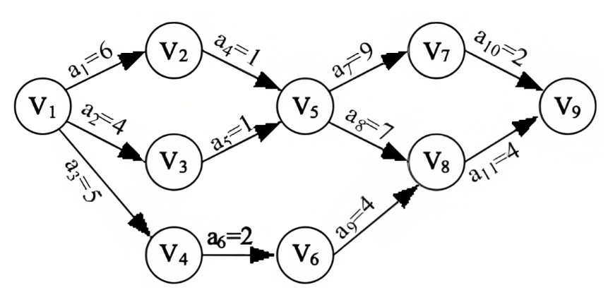

AOE 网中的有些活动是可以并行进行的，所以完成整个工程的最短时间是从开始点到完成点的最长活动路径长度（这里所说的路径长度是指路径上各活动的持续时间之和，即弧的权值之和，不是路径上弧的数目）。因为一项工程需要完成所有工程内的活动，所以最长的活动路径也是关键路径，它决定工程完成的总时间。

### AOE 网的相关基本概念

- 活动：AOE 网中，弧表示活动。弧的权值表示活动持续的时间，活动在其前驱事件（即该弧的起点）被触发后开始。
- 事件：AOE 网中，顶点表示事件，事件在它的所有前驱活动（即指向该边的弧）全部完成被触发。
- 事件（顶点） 的最早发生时间：该事件最早可能的发生时间，记为 ，它决定了以该顶点开始的活动的最早发生时间，显然源点的的最早发生时间为 0，因为事件发生需要其所有前驱活动全部完成，所以它等于初始点到该顶点的路径长度的最大值，写成递推：，其中  表示 j 到 i 的边的权值（即 j 到 i 的活动的持续时间）， 表示 i 的所有前驱事件的集合。
- 事件（顶点） 的最迟发生时间：在不推迟整个工期的前提下，该事件最晚能容忍的发生时间，记为 ，它决定了所有以该状态结束的活动的最迟发生时间，它等于事件的所有后继活动的最迟开始时间的最小值，即 ，其中  表示 i 到 j 的边的权值（即 i 到 j 的活动的持续时间）， 表示 i 的所有后驱事件的集合。
- 活动（弧） 的最早开始时间：该活动最早可能的发生时间，记为 ，显然，它等于其前驱事件的最早发生时间，即 。
- 活动（弧） 的最迟开始时间：在不推迟整个工期的前提下，活动开始最晚能容忍的时间，记为 ，它等于其后继事件的最迟发生时间 - 该事件的持续时间（权值），即 ，其中  表示 u 到 v 的边的权值（即 u 到 v 的活动的持续时间）。
- 关键路径：AOE 网中从源点到汇点的最长路径的长度。
- 关键活动：即关键路径上的活动，它的最早开始时间和最迟开始时间相等。

# 查找

<<<<<<< HEAD

=======
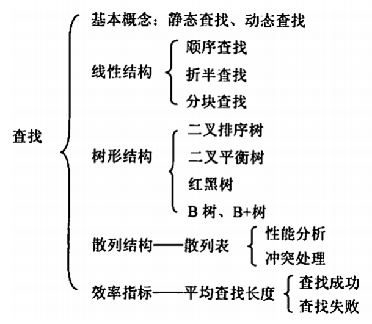
>>>>>>> origin/master

> 本节是⼀个重要的专题，也是拉开分数的地⽅，掌握好本章的内容是能够考⾼分的 
>
> - 掌握数组顺序查找：顺序查找、折半查找 
> - 掌握树形结构查找：BST、AVL、RB、B、B+ (重点) 
> - 掌握字典查找：hashTable 
> - ⼀定要会分析平均查找⻓度（这是考试的重点和难点）

## 概念

### 动态、静态、内、外查找

1. 动态查找：查找同时修改（插入、删除）
2. 静态查找：只查找不修改
3. 内查找：旨在内存进行
4. 外查找：需要访问外存

### 平均查找长度ASL（重点）

**平均查找长度- Age Search Length，这是衡量查找算法效率的重要指标**

<<<<<<< HEAD

=======
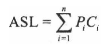
>>>>>>> origin/master

> n是表的⻓度，pi是查找第i个数据元素的概率，如果概率相等，则pi=1/n, ci是找到第i个数据 元素所需⽐较的次数。
>
> **asl越小，效率越高**

## 线性表查找

### 顺序查找

> **顺序查找既适用于线性表的顺序存储结构，也适用于线性表的链式存储结构**
>
> 1. **顺序查找优点：算法简单，且对表的结构无任何要求，既适用于顺序结构，也适用于链式结构，无论结点之间是否按关键字有序排序，她都同样适用**
> 2. **顺序查找缺点：查找效率低，因此，当数据元素较多时不宜采用顺序查找**
>
> 从头到尾或从尾到头

```c
typedef int keytype;
typedef char infotype;
typedef struct{
	keytype key;  //这是查找的关键字
	infotype data;
}rectype;
//顺序查找1
int seqSearch(rectype r[],int n,keytype k){
	int i=0;
	for(;i<n;i++)
		if(r[i].key==k)   //这里因为用的是结构体所以是.key来访问值
			return i+1;
	return 0;
}
//顺序查找2（添加了一个哨兵）
//好处：不需要对下标和边界特殊处理；缺点：表的长度需要多一个
int seqSearch2(rectype r[],int n,keytype k){
	int i=n;
	r[0].key=k;
	for(;i>0;i--)
		if(r[i].key==k)   //这里因为用的是结构体所以是.key来访问值
			break;
	return i;
}
```

> **查找成功的平均查找长度为(n+1)/2，既查找成功的ASL次数约为表长的一半**
>
> 也可以链式，只是不够顺序好

<<<<<<< HEAD

=======
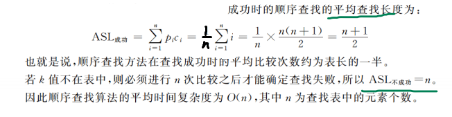
>>>>>>> origin/master

### 折半（二分）查找

> **折半查找要求**
>
> 1. **线性表必须采取顺序存储结构**
> 2. **表中数据元素按关键字有序排序**

- **折半查找基本思想**
  1. **首先确定该区间的中点位置 mid=[(low+high)/2]向下取整**
  2. **将待查的k值与R[mid].key比较，若相等则查找成功并返回此位置mid，否则需要重新确定新的查找区间**
  3. **若R[mid].key>k，新的查找区间为左子表R[1...mid-1]**
  4. **若R[mid].key<k，新的查找区间为右子表R[mid+1..n]**

```c
//二分查找（升序）
int binSearch(rectype r[],int n ,keytype k){
	int low=0,high=n-1,mid;
	while(low<=high){
		mid=(low+high)/2;  //相当于向下取整
		if(k==r[mid].key)
			return mid+1;  //逻辑序号序号加1；也可以low=1，high=n，此时mid不用+1
		if (k<r[mid].key)
			high=mid-1;
		else
			low=mid+1;
	}
	return 0;  //如果while没有ruturn则没找到，返回0
}
```

> **ASL=log2(n+1)-1**
>
> **折半查找优点：比较次数少，查找效率高**
>
> **折半查找缺点：对表结构要求高，只能用于顺序存储的有序表。查找前需要排序**，而排序本身是一种耗时的算法。同时为了保持顺序表的有序性，**对有序表进行插入和删除时，平均比较和移动表中一半元素，这也是一种费时的操作。因此，折半查找不适用于数据元素经常变动的线性表**

- 二叉树描述折半查找

  此时叫**判定树或比较树**，显然，判定树是一颗平衡二叉排序树（AVL）

  > 平衡二叉树证明：当元素个数为偶数时，mid可以选择上取整和下取整。选上取整则右子树始终比左子树多1或0个；选下取整则左子树始终比右子树多1或0个，因此构成了平衡二叉树
  >
  > **失败结点个数为元素个数+1，因为n个结点相当于分成了n+1个区间，用数学的直线划分区间来理解**
  >
  > **需要会手动画出判定树、比较树**
  >
  > 如下图：
  >
<<<<<<< HEAD
  > 

- 判定树，比较树


=======
  > 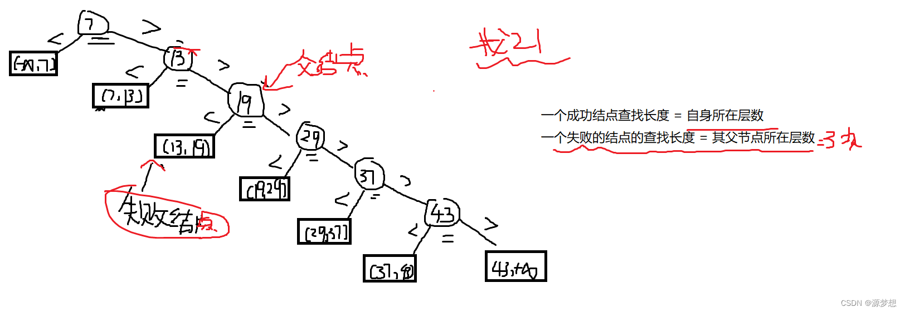

- 判定树，比较树


>>>>>>> origin/master

> 新增的叶子结点叫做外部结点，用于计算**失败的平均查找长度**，计算方式：**（（到达外部结点经过的边数）*该层个数）累计求和/外部结点个数**
>
> 判定树里存在的结点叫做内部结点，用于计算**成功的平均查找长度，计算方式**：**（第i层*第i层的内部结点个数）累计求和/内部结点个数**
>
> **折半查找的最大查找次数=判定树的最大高度=log2n（下取整）+1 | log2（n+1）（上取整）**
>
> 折半查找的时间复杂度 为：**O(log2n)**

<<<<<<< HEAD

=======

>>>>>>> origin/master

### 分块（索引）查找

- 概念

  1. 分块查找又称**索引顺序查找**，它吸取了顺序查找和折半查找各自的优点，既有动态结构，又 适于快速查找。 

  2. 分块查找的基本思想：将查找表分为若干子块。块内的元素可以无序，但块间的元素是有序 的，即第一个块中的最大关键字小于第二个块中的所有记录的关键字，第二个块中的最大关键字 小于第三个块中的所有记录的关键字，以此类推。再建立一个索引表，索引表中的每个元素含有 各块的最大关键字和各块中的第一个元素的地址，索引表按关键字有序排列。 **即将n个数据的表分成b块，每一块再分成s列**

  3. 分块查找的过程分为两步：**第一步**是在索引表中确定待查记录所在的块，可以顺序查找或折半查找索引表；**第二步**是在块内顺序查找（只能）。

<<<<<<< HEAD
     
=======
     
>>>>>>> origin/master

     > **索引查找最好的情况都至少需要查找两次**
     >
     > **如果线性表既要快速查找又经常动态变化，则可采用分块查找**
     >
     > 算法实现不需要掌握

- 平均查找长度

  1. 顺序查找

<<<<<<< HEAD
     
=======
     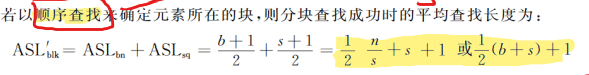
>>>>>>> origin/master

     > **但s=根号n时，ASL取极小值根号n+1**
     >
     > 例题：对于10000个元素的文件，用分块查找，最佳的元素个数s是100个，总的块数b=100，ASL=101

  2. 折半查找

     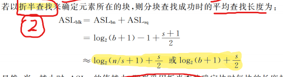

     > 当s越小时，ASL值越小

  > **分块查找的缺点就是增加一个索引表的存储空间和增加建立的时间**
  >
  > 如果分块查找采用链式存储，则可以实现动态搜索表

### 散列（哈希）查找 - HashTable

#### 概念

1. 哈希表

   通过哈希函数，**直接对关键字进⾏映射访问的查找方法就叫做散列查找法（杂凑法、散列法）**

   **它通过对元素的关键字值进行某种运算，直接求出元素的地址，即使用关键字到地址的直接转换方法，而不需要反复比较**

   散列函数可能会把两个或两个以上的不同关键字映射到同一地址，称这种情况为**冲突**，这些 发生碰撞的不同关键字称为**同义词**。一方面，设计得好的散列函数应尽量减少这样的冲突；另一 方面，由于这样的冲突总是不可避免的，所以还要设计好处理冲突的方法。

   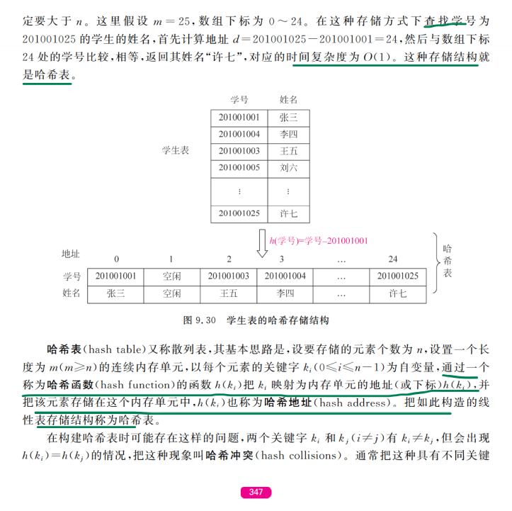

2. **散列表**

   **散列表是一个有限连续的地址空间，用以存储按散列函数计算得到相应散列地址的数据记录**。通常散列表的存储空间是一个一维数组，散列地址是数组的下标

3. **散列函数和散列地址**

   建立一个确定的关系H，**使得存储位置p=H（key关键字），称这个对应关系H为散列函数，p为散列地址**

4. **冲突和同义词**

   **对不同的关键字可能得到同一个散列地址，这种现象称为冲突。具有相同函数值的关键字对散列函数来说称作同义词**

5. hashTable需要解决的两个问题

   1. 映射函数 --- **hash函数** (除留余数法)
   2. **冲突解决** --- （开放地址法、链地址法）

6. **影响哈希表查找的因素：**

   1. **散列函数的装填因子**：已存入的元素数n与哈希地址空间大小m的比值，即**a=n/m**；**越小，冲突可能性越小**
   2. 所采用的**散列（哈希）函数**
   3. 出现哈希**冲突时采取的解决办法**
   4. 存入的元素特性（如连续的一串、奇数、偶数...）

#### 哈希函数的构造方法

##### 直接定址法

以关键字k本身加上某个常量c作为哈希地址：**h(k)=k+c**

如：*h*(学号) = 学号-201001001

> **适用于关键字分布的连续**，否则将造成大量浪费

##### 除留余数法

用**关键字k除以某个不大于哈希表长度m的最大素数p**所得的余数作为哈希地址

**h(k)=k % p  (p<=m)**

> **这个方法的关键在于选取适当的p，一般情况下，可以选p为小于表长的最大质数**
>
> p一般用的是最靠近m的素数

##### 数字分析法

> **适用于：事先必须明确知道所有关键字每一位上各种数字的分布情况**


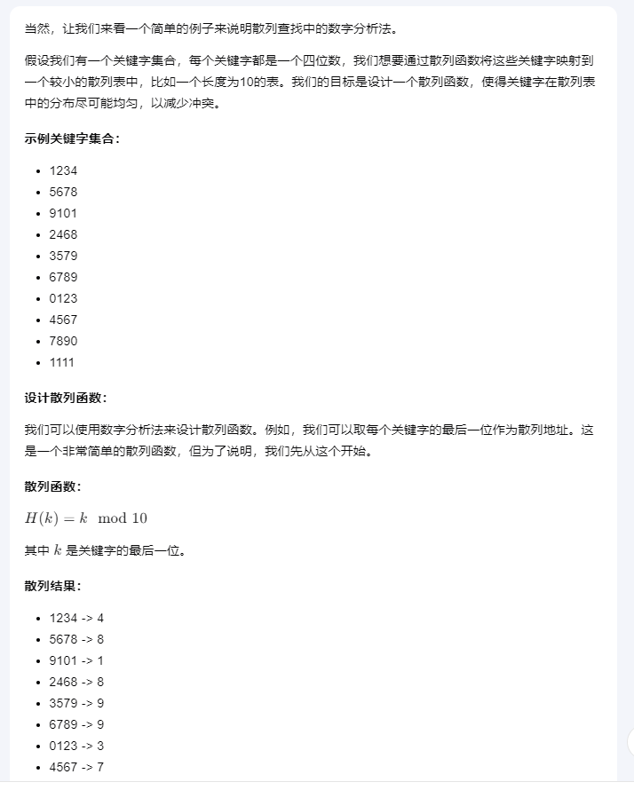

##### 平方取中法

> **适用于：无法事先了解关键字的所有情况，或难于直接从关键字中找到取值较分散的几位**

​	**取关键字的平方值的中间几位作为散列地址**。具体取多少位要视实际情 况而定。这种方法得到的散列地址与关键字的每位都有关系，因此使得散列地址分布比较均匀， 适用于关键字的每位取值都不够均匀或均小于散列地址所需的位数。 

​	在不同的情况下，不同的散列函数具有不同的性能，因此不能笼统地说哪种散列函数最好。 在实际选择中，采用何种构造散列函数的方法取决于关键字集合的情况，但目标是尽量降低产生 冲突的可能性。

##### 折叠法

> **这种方法特别适合于散列地址的位数较少，而关键字位数较多的情况，不需要事先知道关键字的分布，且难于直接从关键字中找到取值较分散的几位**

**散列函数的折叠法是一种将关键字分割并叠加求和以生成散列地址的方法。**以下是折叠法的基本步骤：

1. 将关键字从左到右分割成位数相等的几部分。如果最后一部分的位数不够，可以短一些。
2. 将这几部分的数值叠加求和（进位可舍去可不舍）。
3. 根据散列表的长度，取叠加和的后几位作为散列地址。

例如，假设关键字是9876543210，散列表的长度为3位，我们可以将关键字分为四组：987、654、321、0。然后将这些数字相加：987 + 654 + 321 + 0 = 1962。接着，取这个和的后3位数字962作为散列地址。

如果直接折叠不能保证分布的均匀性，可以尝试从一端向另一端来回折叠后对齐相加。例如，将987和321反转，再与654和0相加，得到789 + 654 + 123 + 0 = 1566，此时散列地址为566。

折叠法的优点是简单易行，不需要复杂的数学运算，且适合处理位数较多的关键字。然而，它的缺点是可能需要多次尝试不同的折叠方式以找到分布均匀的散列地址。此外，折叠法在处理某些类型的关键字时，可能不如其他方法（如除留余数法）有效。

#### 哈希冲突的解决办法

处理冲突的方法与散列表本身的组织形式有关

##### 开放定址法（主流）

1. 线性探测法

   **di=(d0+i) mod m   **

   > **i=1,2,3...m-1**

   **只能往后去找，一次往后一位**，如果到末尾就从头开始

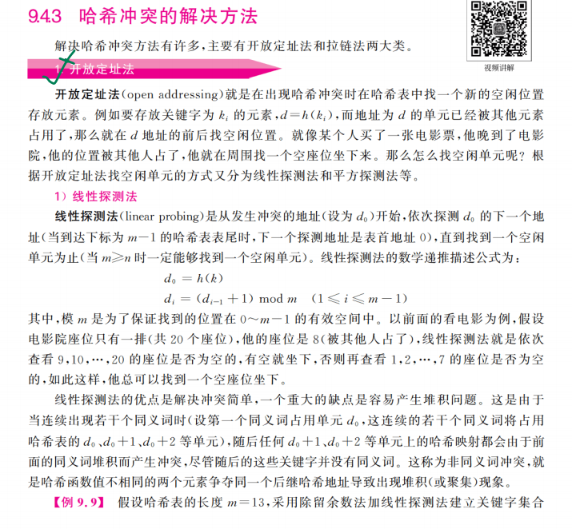

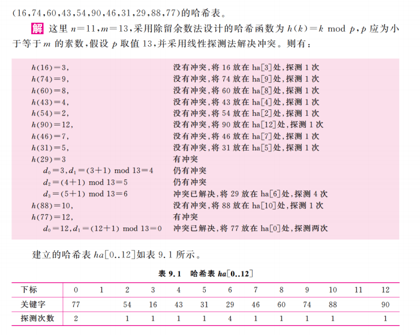

2. 平方（二元）探测法

   **di=(d0 +|- i^2) mod m    （1<=i<=m/2）**

   > **i=1^2,-1^2,2^2,-2^2...,k^2,-k^2**

   **往前或往后去找，迈的步子越来越大（按平方算）**

   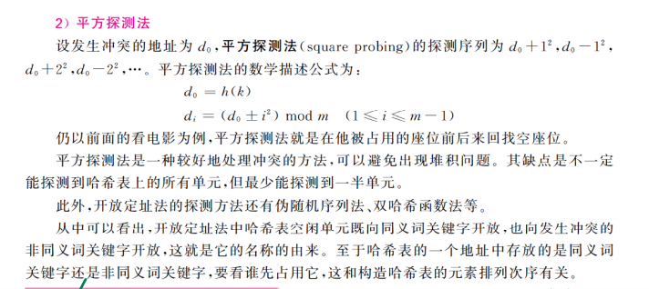

3. 伪随机探测法

   **i=伪随机数序列**

   > 散列表中的**“堆积现象”**通常指的是当多个关键字通过散列函数映射到散列表的相邻位置时，这些关键字在处理冲突时会聚集在一起，导致散列表的某些区域变得过于拥挤，而其他区域则相对空闲。这种现象会降低散列表的查找效率，因为它增加了冲突的可能性和查找时间。
   >
   > **“二次聚集”**是堆积现象的一种特殊情况，它发生在使用线性探测法处理冲突时。当表中的连续几个位置已经被占用时，新的关键字在散列到这些位置时会产生冲突，然后按照线性探测法的规则寻找下一个空位。如果下一个空位恰好被另一个散列到相同位置的关键字占用，那么这两个关键字就会争夺同一个后续的散列地址，这种现象就被称为“二次聚集”。二次聚集会导致散列表的某些位置变得更加拥挤，而其他位置则保持空闲，从而降低了散列表的整体性能。

> **三种方法对比**
>
> | 开放地址法分类 | 优点                               | 缺点                     |
> | -------------- | ---------------------------------- | ------------------------ |
> | 线性探测法     | 散列表未满总能找到一个无冲突的地址 | 会产生“二次聚集”现象     |
> | 二次探测法     | 可以减少“二次聚集”现象             | 不一定能找到不冲突的地址 |
> | 伪随机探测法   |                                    |                          |

```c
#include <stdio.h>
#include <stdlib.h>

#define TABLE_SIZE 13

/* 散列函数 */
unsigned int hashFunction(unsigned int key) {
    return key % TABLE_SIZE;
}

/* 线性探测插入 */
int insert(unsigned int key, int table[]) {
    unsigned int index = hashFunction(key);
    int i;
    
    for (i = 0; i < TABLE_SIZE; i++) {
        if (table[index] == 0) { // 找到空槽位
            table[index] = key;
            return 1;
        }
        index = (index + 1) % TABLE_SIZE; // 探测下一个位置
    }
    
    return 0; // 表满，无法插入
}

/* 线性探测查找 */
int search(unsigned int key, int table[]) {
    unsigned int index = hashFunction(key);
    int i;
    
    for (i = 0; i < TABLE_SIZE; i++) {
        if (table[index] == key) {
            return 1; // 找到关键字
        }
        if (table[index] == 0) { // 找到空槽位，表示未找到关键字
            return 0;
        }
        index = (index + 1) % TABLE_SIZE; // 探测下一个位置
    }
    
    return 0; // 表满，无法找到关键字
}

int main() {
    int hashTable[TABLE_SIZE] = {0}; // 初始化哈希表
    unsigned int keys[] = {16, 74, 60, 43, 54, 90, 46, 31, 29, 88, 77};
    int n = sizeof(keys) / sizeof(keys[0]);
    int i;

    // 插入关键字
    for (i = 0; i < n; i++) {
        if (!insert(keys[i], hashTable)) {
            printf("无法插入关键字 %u，哈希表已满。\n", keys[i]);
        }
    }

    // 查找关键字
    unsigned int searchKey = 77;
    if (search(searchKey, hashTable)) {
        printf("关键字 %u 存在于哈希表中。\n", searchKey);
    } else {
        printf("关键字 %u 不存在于哈希表中。\n", searchKey);
    }

    return 0;
}
```


##### 拉链（链地址）法

**拉链法就是把所有的冲突同义词用单链表连起来，称为同义词链表，哈希表的地址对应的是单链表的首结点**

**链地址法的结点空间是动态申请的，无需事先确定表的容量，因此更适用于表长不知道的情况。同时链地址法容易实现插入和删除操作**

<<<<<<< HEAD

=======
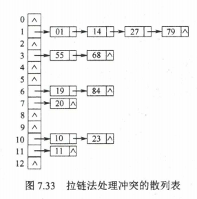
>>>>>>> origin/master

#### 开放地址法画出哈希表

​	假设哈希表长度*m*=13，采用除留余数法哈希函数建立如下关键字集合的哈希表： 

   (16，74，60，43，54，90，46，31，29，88，77)。 

并采用线性探查法解决冲突。

|     **下标**     | **0**  | **1** | **2**  | **3**  | **4**  | **5**  | **6**  | **7**  | **8**  | **9**  | **10** | **11** | **12** |
| :--------------: | :----: | :---: | ------ | :----: | :----: | :----: | :----: | :----: | :----: | :----: | :----: | :----: | :----: |
|      **k**       | **77** |       | **54** | **16** | **43** | **31** | **29** | **46** | **60** | **74** | **88** |        | **90** |
| **成功探查次数** | **2**  |       | **1**  | **1**  | **1**  | **1**  | **4**  | **1**  | **1**  | **1**  | **1**  |        | **1**  |
|   失败探查次数   | **2**  | **1** | **10** | **9**  | **8**  | **7**  | **6**  | **5**  | **4**  | **3**  | **2**  | **1**  | **3**  |

1. **查找成功的平均查找长度：**

   **ASL<sub>succ</sub>=Σ<sub>i=1</sub><sup>n</sup> C<sub>i</sub> / n**

   如上图ASL=15/11=1.36

2. **查找失败的平均查找长度：**

   **ASL<sub>unsucc</sub>=Σ<sub>i=1</sub><sup>r</sup> C<sub>i</sub> / r**

   如上图ASL=62/13=4.77

#### 拉链法画出哈希表

- **查找成功asl计算**

<<<<<<< HEAD
  

- **查找失败asl计算**

  
=======
  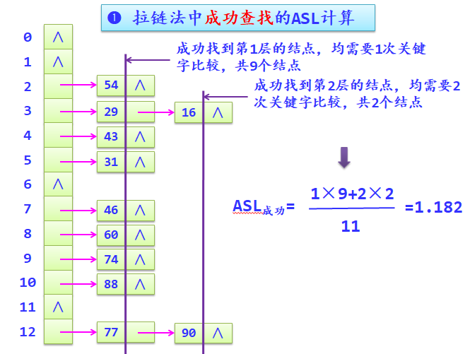

- **查找失败asl计算**

  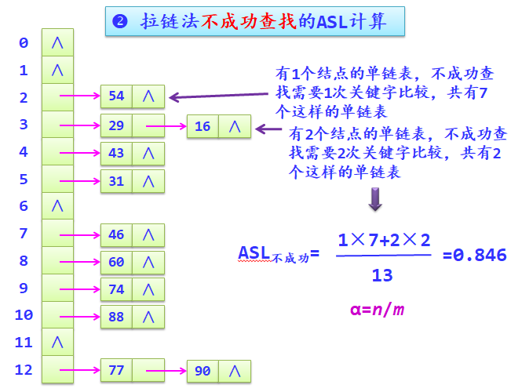
>>>>>>> origin/master

  

## 树表查找

### 二叉排序树BST    <a name="tree"></a>

- 据二叉排序树的定义，**左子树结点值 < 根结点值 < 右子树结**

> **对⼆叉树进⾏中序遍历，将得到从小到大的排序顺序**
>
> ⼆叉搜索树最⼤的功劳在于：规定了结点的位置，因此针对BST可以有效实现查找、插 ⼊、删除，**让树形结构可以进⾏动态调整**
>
> **具有n个内部结点的二叉排序树，其外部结点个数为n+1**
>
> 平均执行时间或者ASL=**O（log2（n））**
>
> 二叉排序树中的查找路径是原来二叉排序树的一部分，也一定构成一棵二叉排序树。

- n个关键字构成的不同二叉排序树有多少棵？

  答：需要用到卡特兰数，就是出栈序列个数那个：C(n，2n)/(n+1)

  如4个关键字，则有14棵树

- 算法

  1. 类型定义

     ```c
     typedef int keytype;
     typedef char infotype;
     typedef struct node{
     	keytype key;
     	infotype data;
     	struct node *lchild,*rchild;
     }bstNode;
     ```

  2. 插入

     ​	需保证插入后，仍然满足排序树需求。用到了递归，当子树为空时就会插入，如果在左边就递归左边插入，在右边就递归右边插入

     ```c
     bool insertBst(bstNode *&bt,keytype k){
     	if(!bt){
     		bt=(bstNode *)malloc(sizeof(bstNode));
     		bt->key=k;
     		bt->lchild=bt->rchild=NULL;
     	}
     	else if(k==bt->key)  //不能存在关键字相同的结点
     		return false;
     	else if(k<bt->key)
     		return insertBst(bt->lchild,k);
     	else
     		return insertBst(bt->rchild,k);
     }
     ```

  3. 创建

     ```c
     bstNode * createBst(keytype a[],int n){
     	//返回树的根结点
     	bstNode *bt=NULL;
     	int i=0;
     	while(i<n){
     		insertBst(bt,a[i]);
     		i++;
     	}
     	return bt;
     }
     ```

  4. 查找（非递归）

     ```c
     bstNode *searchBst(bstNode *bt,keytype k){
     	while(!bt && bt->key==k){
     		if(k<bt->key)
     			bt=bt->lchild;
     		else
     			bt=bt->rchild;
     	}
         return bt;
     }
     ```

  5. 查找（递归）

     ```c
     bstNode *searchBst2(bstNode *bt,keytype k){
     	if(!bt && bt->key==k)
     		return bt;
     	if(k<bt->key)
     		return searchBst2(bt->lchild,k);
     	else
     		return searchBst2(bt->rchild,k);
     }
     ```

  6. 删除

     算法思想

     1. 考虑p是叶子：**直接删**
     2. 考虑p只有左子树：**左子树代替**
     3. 考虑p只有右子树：**右子树代替**
     4. 考虑p同时有左右子树：**拿左子树最大或者右子树最小的**

     ```c
     //删除二叉排序树的结点算法
     //函数声明
     bool deleteBst(bstNode *&bt,keytype k);
     void Delete(bstNode *&p);
     void deleteboth(bstNode *p,bstNode *&r);
     //函数定义
     bool deleteBst(bstNode *&bt,keytype k){
     	if(!bt)
     		return false;
     	else{
     		if(bt->key>k)
     			return deleteBst(bt->lchild,k);
     		else if(bt->key<k)
     			return deleteBst(bt->rchild,k);
     		else{   //找到了要删除的结点
     			Delete(bt);
     			return true;
     		}
     	}
     }
     void Delete(bstNode *&p){  //排序树中删除结点p（总和）
     	bstNode *q;
     	if(p->rchild==NULL){  //没有右子树，用左孩子替代
     		q=p;
     		p=p->lchild;
     		free(q);
     	}
     	else if(p->lchild==NULL){  //没有左子树，用右孩子替代
     		q=p;
     		p=p->rchild;
     		free(q);
     	}
     	else 
     		deleteboth(p,p->lchild); //左右子树都有的删除函数
     		//这里是沿用了左子树的最大作为根替换
     }
     void deleteboth(bstNode *p,bstNode *&r){ //左右子树都有的删除算法
     	bstNode *q;
     	if(r->rchild!=NULL)  //递归找左子树中的最右下结点（最大）
     		deleteboth(p,r->rchild);
     	else{ //找到了最大结点或者没有右子树则是当前结点r最大
     		p->key=r->key;
     		p->data=r->data;
     		q=r;
     		r=r->rchild;  //用左孩子替代
     		free(q);
     	}
     }
     ```

  7. 输出

     ```c
     //递归输出排序树（中序）
     void dispBst(bstNode *bt){
     	if(bt){
     		dispBst(bt->lchild);
     		printf("%d,",bt->key);
     		dispBst(bt->rchild);
     	}
     }
     ```

### 平衡二叉树AVL

定义结点**左子树与右子树的高度差为该结点的平衡因子**，则平衡 二叉树结点的**平衡因子**的值只可能是**-1、1或0**

#### 插入结点

> 插入结点可能导致平衡二叉树不平衡，因此每次调整的对象都是最小不平衡子树，即以插入路径上离插入结点最近的平衡因 子的绝对值大于1的结点作为根的子树

1. LL插入（**右旋**+移右叶到左）

   1. **将最小不平衡子树的左孩子移到根**
   2. **将原本的根移到新根的右孩子**
   3. **将新根原本的右孩子移到原根的左孩子**

   > 在最小不平衡子树的左子树的左分支插入结点，使平衡二叉树不平衡

2. RR插入（**左旋**+移左叶到右）

   1. **将最小不平衡子树的右孩子移到根**
   2. **将原本的根移到新根的左孩子**
   3. **将新根原本的的左孩子移到原根的右孩子替换**

   > 在最小不平衡子树的右子树的右分支插入结点，使平衡二叉树不平衡
   >
   > LL和RR是对称的

<<<<<<< HEAD
   
=======
   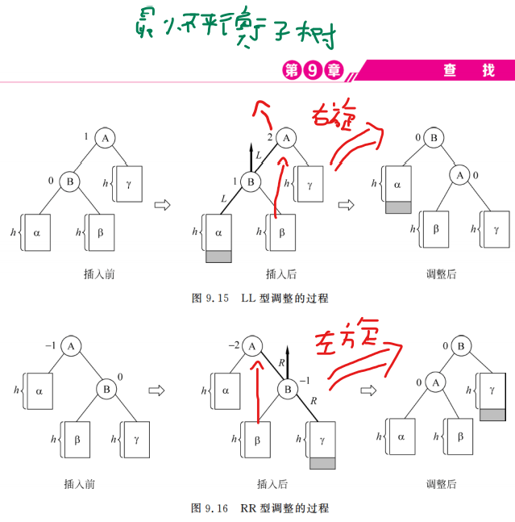
>>>>>>> origin/master

3. LR插入(**左旋**+移左叶到右+**右旋**+移右叶到左)

   1. **将最小不平衡子树的左孩子的右孩子移到根**
   2. **将原根的左孩子移到新根的左孩子**
   3. **将原根移到新根的右孩子**
   4. **将新根原本的左孩子移到新根的左孩子的右分支**
   5. **将新根原本的右孩子移到原根的左分支**

<<<<<<< HEAD
   
=======
   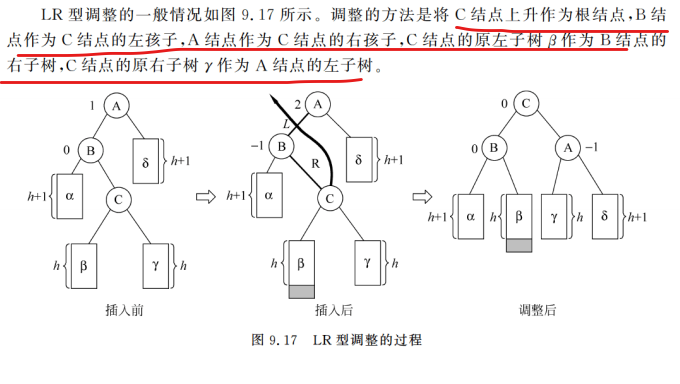
>>>>>>> origin/master

   > 在最小不平衡子树的左子树的右分支插入结点，使平衡二叉树不平衡

4. RL插入(**右旋**+移右叶到左+**左旋**+移左叶到右)

   1. **将最小不平衡子树的右孩子的左孩子移到根**
   2. **将原根的右孩子移到新根的右孩子**
   3. **将原根移到新根的左孩子**
   4. **将新根原本的左孩子移到新根的左孩子的右分支**
   5. **将新根原本的右孩子移到新根的右孩子的左分支**

<<<<<<< HEAD
   
=======
   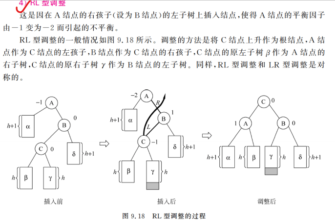
>>>>>>> origin/master

   > 在最小不平衡子树的右子树的左分支插入结点，使平衡二叉树不平衡

   > **以上四种方式记忆：看第二的字母，左就右旋，右就左旋；然后看第一个字母，如果相同则结束，不相同则相反的操作**

#### 删除结点（了解）

1. 删除结点（同二叉排序树一样）
2. 一路向上找到最小不平衡子树
3. 找出最小不平衡子树下高度最高的儿子和孙子
4. 根据孙子的位置，左右旋（LL、RR、LR、RL）
5. 如果调整完，上面的出现不平衡现象，继续执行2

### 红黑树（RBT）

> 红黑树首先是二叉排序树
>
> AVL是比BST多了个平衡因子，而RBT是比BST多了红黑的颜色

| 操作 | BST    | AVL            | Red-Black Tree(RBT) |
| ---- | ------ | -------------- | ------------------- |
| 查   | O（n） | O（log2（n）） | O（log2（n））      |
| 插   | O（n） | O（log2（n）） | O（log2（n））      |
| 删   | O（n） | O（log2（n）） | O（log2（n））      |

> 平衡二叉树：适用于以查为主、很少插入、删除
>
> 红黑树：适合频繁插入、删除、实用性更强

#### 定义

​	为了保持AVL树的平衡性，插入和删除操作后，非常频繁地调整全树整体拓扑结构，代价 较大。为此在AVL树的平衡标准上进一步放宽条件，引入了红黑树的结构。

 一棵红黑树是满足如下红黑性质的二叉排序树：

- ①**每个结点或是红色，或是黑色的。** 
- **②根结点是黑色的。** 
- **③ 叶结点（虚构的外部结点、NULL结点）都是黑色的。**
- **④ 不存在两个相邻的红结点（即红结点的父结点和孩子结点均是黑色的）。**
- ⑤ **对每个结点，从该结点到任意一个叶结点的简单路径上，所含黑结点的数量相同.** 

​	与折半查找树和B树类似，为了便于对红黑树的实现和理解，引入了 n+1个外部叶结点

<<<<<<< HEAD

=======
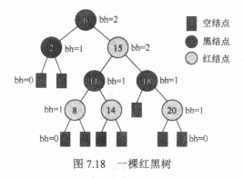
>>>>>>> origin/master

#### 性质

​	从某结点出发（不含该结点）到达一个叶结点的任意一个简单路径上的黑结点总数称为该结 点的**黑高（记为bh）,黑高的概念是由性质⑤确定的。根结点的黑高称为红黑树的黑高**

1. 从根到叶结点的最长路径不大于最短路径的2倍
2. 有n个内部结点的红黑树的高度h<=21og2（n + l）

#### 插入

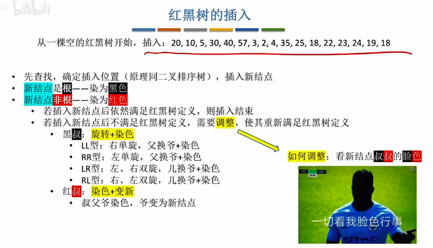

### B树

​	所谓m阶B树是所有结点的平衡因子均等于（完全平衡）。

的m路平衡查找树。

 一棵成阶B树或为空树，或为满足如下特性的巾叉树: 

- 树中每个结点至多有m棵子树，即至多含有m-1个关键字。 

- 若根结点不是叶结点，则至少有两棵子树。 

- 除根结点外的所有非叶结点至少有「m/2棵子树]，即至少含有「m/2]-1个关键字。 

- 所有非叶结点的结构如下：

  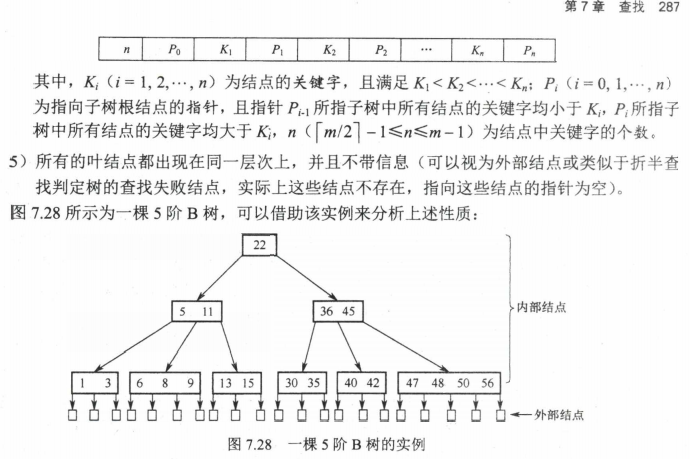

### B+树

​	B+树是应数据库所需而出现的一种B树的变形树。 

一棵m阶的B+树需满足下列条件: 

- 1）每个分支结点最多有所棵子树（孩子结点）。

- 2）非叶根结点至少有两棵子树，其他每个分支结点至少有「m/2】棵子树。 

- 3）结点的子树个数与关键字个数相等。

- 4）所有叶结点包含全部关键字及指向相应记录的指针，叶结点中将关键字按大小顺序排列， 并且相邻叶结点按大小顺序相互链接起来。 

- 5）所有分支结点（可视为索引的索引）中仅包含它的各个子结点（即下一级的索引块）中 关键字的最大值及指向其子结点的指针。

  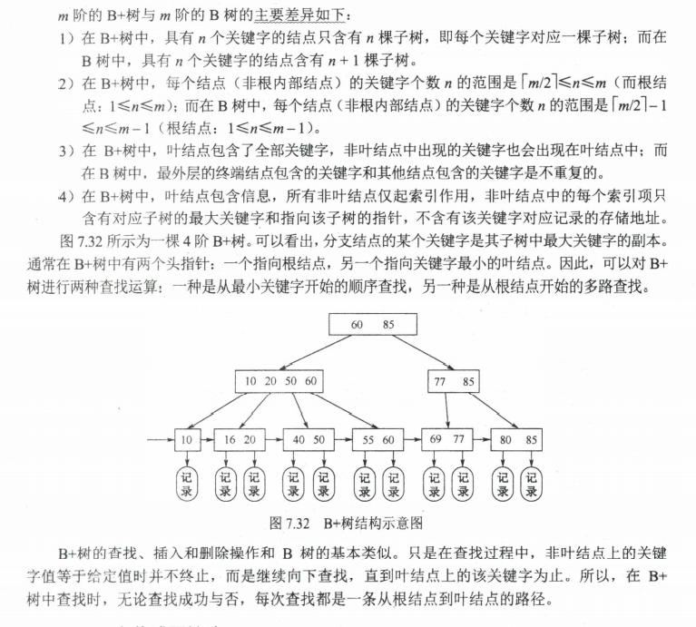

> B树与B+树的主要差异：
>
> |                               | m阶B树                                           | m阶B+树                            |
> | ----------------------------- | ------------------------------------------------ | ---------------------------------- |
> | n个关键字的结点含有的子树数量 | n+1                                              | n                                  |
> | 每个结点的关键字n的范围       | (m/2)上取整-1<=n<=m-1                            | (m/2)上取整<=n<=m                  |
> | 叶结点                        | 终端结点包含的关键字和其他结点的关键字是不重复的 | 非叶结点的关键字也会出现在叶结点中 |
> | 所有非叶结点                  | 每个关键字对于一个记录的存储地址                 | 起到索引的作业                     |
>
> B+树的应用：关系型数据库如mysql的索引

### B*树


# 排序

排序是按关键字的非递增或非递减顺序对一组记录重新进行排序的操作

> 排序可视化网站：
>
> [Comparison Sorting Visualization (usfca.edu)](https://www.cs.usfca.edu/~galles/visualization/ComparisonSort.html)

- 排序的稳定性

  - 相同关键字的元素，排序后，这些相同的关键字的元素位置没有发生改变，就称这种**排序方法是稳定**的。
  - 相同关键字的元素，排序后，这些相同的关键字的元素位置发生了改变，就称这种**排序方法是不稳定**的。

  **排序算法的稳定性是针对所有记录而言的，在待排序的所有记录中，只要有一组关键字的序列不满足稳定性要求，那么该排序方法就是不稳定的**

- 内排序和外排序

  外排序会相对较慢

  **内部排序的过程是一个逐步扩大记录的有序序列长度的过程**

- **待排序记录的存储方式**

  1. 顺序表：记录之间的**次序关系由存储位置决定**，实现排序需要移动记录
  2. 链表：记录之间的**次序关系由指针决定**，实现排序不需要移动记录，只用修改指针即可
  3. 地址排序：待排序记录本身存储在一组地址连续的存储单元内，同时另设一个指示各个记录存储位置的地址向量，在排序过程中不移动记录本身，**而移动地址向量中的这些记录的“地址”**，在排序结束之后按照地址向量中的值调整记录的存储位置


## 插入排序

> **每次将一个待排序的元素按其关键字大小插入到已经排好序的一组记录中的适当位置，直至所有待排序记录全部插入完成**

### 直接插入排序（增量法）

**基本操作是将一条记录插入到已排好序的有序表中，从而得到一个新的、记录数量增1的有序表**

思想：左边分为有序区，右边分为无序区，初始化i=1，每次将一个新的元素插入到有序区的合适位置


```c
//直接插入排序,我的
void insertSort(rectype R[],int n){
	int i=1,temp,k;
	for(;i<n;i++){   //若是0或1个则不执行
		if(R[i-1].key>R[i].key){
			temp=R[i].key;  
			//将前面大于的往后移
			k=i-1;    //升序的前一项
            for(;k>=0;k--){
                if (temp<R[k]);
                	R[k+1]=R[k];
                else
                    break;   //不需要排序
            }
			R[k+1].key=temp;
		}
	}
}
//课本
void insertSort2(rectype R[],int n){
	int i=1,temp,k;
	for(;i<n;i++){   //若是0或1个则不执行
		if(R[i-1].key>R[i].key){
			temp=R[i].key;  
			//将前面大于的往后移
			k=i-1;    //升序的前一项
			do{
				R[k+1]=R[k];  
				k--;
			}
			while(R[k].key>temp && k>=0);
			R[k+1].key=temp;
		}
	}
}
```

> **特点**
>
> 1. **稳定排序**
> 2. **算法简便且容易实现**
> 3. **适用于链式存储结构**
> 4. 更适合于初始记录基本有序的情况，当初始记录无序，n较大时，该算法时间复杂度较高，不宜采用
>
> **时间：O（n^2）**
>
> **空间：O（1）**

### 折半插入排序

直接插入排序是用顺序比较去找插入的位置，这边是采用折半查找去找插入的位置，再移动元素插入

```c
//折半插入，减少比较次数，但是移动次数还是一样的
void binInsertSort(rectype R[],int n){
	int i,temp,k,low,high,mid;
	for(i=1;i<n;i++){   //若是0或1个则不执行
		if(R[i-1].key>R[i].key){
			temp=R[i].key;  
			//将前面大于的往后移
			low=0;high=i-1;
			while(low<=high){
				mid=(low+high)/2;
				if(temp<R[mid].key)
					high=mid-1;
				else
					low=mid+1;
			}
			for(k=i-1;k>=high+1;k--)  								// high+1==low
				R[k+1]=R[k];
			R[high+1].key=temp;
		}
	}
}
```


> 仅减少了查找位置（比较）次数
>
> 时间：O（n^2）
>
> 空间：O（1）

### 希尔排序（Shell Sort）

**又叫“缩小增量排序”**

​	**实际上是一种分组插入方法。**

**希尔排序对记录的分组，不是简单地“逐段分割“，而是将相隔某个”增量“的记录分成一组**

​	思想：取一个小于n的整合d1作为第一个增量，把表的全部元素分成d1个组，将所有距离为d1的倍数的元素放在同一个组中，对这一个组进行插入排序；然后取第二个增量d2，继续；直到d=1之后，最所有的元素再进行一次插入排序，算法完毕。

> **思路就是：从局部的一点点有序（看起来）到最后的完全有序**

<<<<<<< HEAD

=======
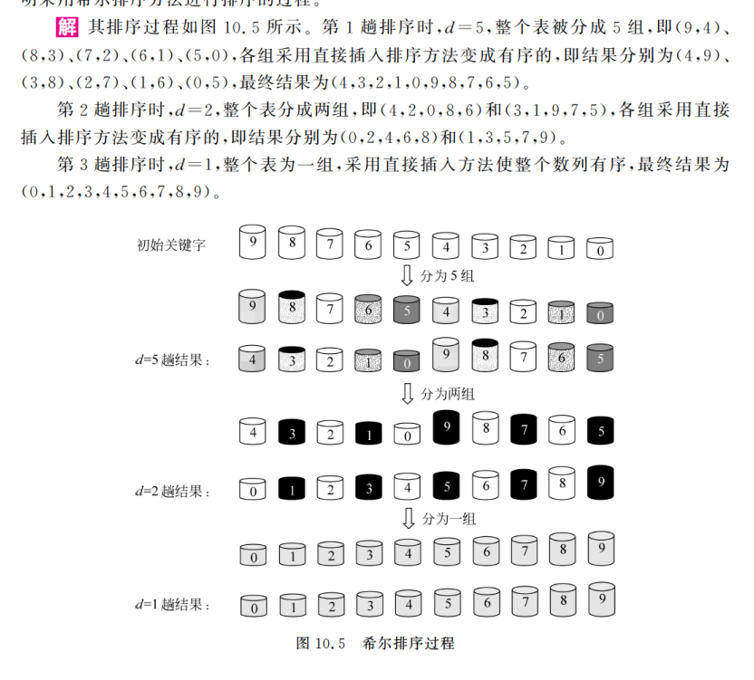
>>>>>>> origin/master

```c
//希尔排序（牺牲了0的下标）
void shellSort(rectype R[],int n){
	int d,j,i;
	for(d=n/2;d>=1;d/=2){  //d表示的是两个数据之间的距离
		for(i=d+1;i<=n;i++){  //下标0不放数据，从1开始放，这里i=d+1就类似插入排序中i=1一样，放到第二个数上
			R[0].key=R[i].key;  //不是用的哨兵，0是暂存数据区	
			j=i-d;  //j就是第一个数
			for(;j>0 && R[j].key>R[i].key;j-=d)
				R[j+d].key=R[j].key;
			R[j+d].key=R[0].key;
		}
	}
}
//希尔排序（课本）
void shellSort2(rectype R[],int n){
	int d,j,i,temp;  //用了临时变量，而不用0下标的位置暂存，但这里第一个数据还是放的1位置
	for(d=n/2;d>=1;d/=2){
		for(i=d;i<n;i++){
			temp=R[i].key;  
			j=i-d;
			for(;j>=0 && R[j].key>R[i].key;j-=d)
				R[j+d].key=R[j].key;
			R[j+d].key=temp;
		}
	}
}
```

> d1一般取n/2...然后n/4...以此类推
>
> **d表示的是两个数据之间的距离，也表示分成几组，比如说d=1就是整个表分成一组就是表示整个表**
>
> 也称为减少增量的排序方法
>
> **平均时间复杂度：O（n^1.3）**
>
> **时间复杂度：O（nlog2n)-O(n^2)**
>
> 空间O（1）
>
> **仅用于顺序表，不能用链表**
>
> **不稳定的**
>
> > 哈希（散列）存储结构、哈希查找、希尔排序、哈希函数容易搞混，注意区分：哈希是查找的，希尔是插入排序的
>
> **特点**
>
> 1. 记录跳跃式地移动导致排序方法是不稳定的
> 2. **只能用于线性结构，不能用于链式结构**
> 3. **增量序列可以有各种取法，但应该使增序序列中的值没有除1之外的公因子，并且最后一个增量值必须等于1**
> 4. **适合初始记录无序、n较大时的情况**

## 交换排序

> **基本思想：两两比较待排序记录的关键字，一旦发现两个记录不满足次序要求时则进行交换，直至整个序列全部满足要求为止**

### 冒泡排序

**它通过两两比较相邻记录的关键字，如果发生逆序，则进行交换，从而使关键字小的记录逐渐上漂“左移”，或者使关键字大的记录逐渐向下“坠”（右移）**


```c
void swap(int &x,int &y){
	int temp=x;x=y;y=temp;
}
//冒泡排序（从后往前.每次最小放前面）
void bubbleSort(rectype R[],int n){
	int i,j,flag=1;
	for(i=0;i<n;i++){  
		for(j=n-1;j>i;j--){
			if(R[j].key<R[j-1].key){
				swap(R[j].key,R[j-1].key);
				flag=0;
			}
		}
		if(flag)
			break;
	}
}
//冒泡排序（从前往后.每次最大放后面）
void bubbleSort2(rectype R[],int n){
	int i,j,flag=1;
	for(i=n-1;i>=0;i--){  //每次将最小的放前面
		for(j=0;j<i;++j){
			if(R[j].key>R[j+1].key){
				swap(R[j].key,R[j+1].key);
				flag=0;
			}
		}
		if(flag)
			break;
	}
}
```

> **特点**
>
> 1. **稳定排序**
> 2. 可以采用链表实现
> 3. 移动记录次数较多，算法平均时间性能比直接插入差。当初始记录无序，n较大时，不宜采用
>
> **平均情况下，冒泡排序关键字的比较次数为n^2/4**
>
> **记录移动次数为3n^2/4**
>
> **时间复杂度为O（n^2）**
>
> 空间复杂度O（1）

### 快速排序

**是由冒泡排序改进而来的。快速排序方法中的一次交换可能消除多个逆序**

- 基本思想：

  在待排序内的n个元素中任取一个元素（一般就是第一个元素）作为基准，把该元素放入适当位置后，数据序列被此元素划分成两部分，所有小的放前面，大的放后面，并把该元素排在这两部分的中间（称为该元素的归位），这个过程称为一趟快速排序（不完全＝一趟划分）。之后再对左右划分出来的进行快速排序，实际上就是一个递归

  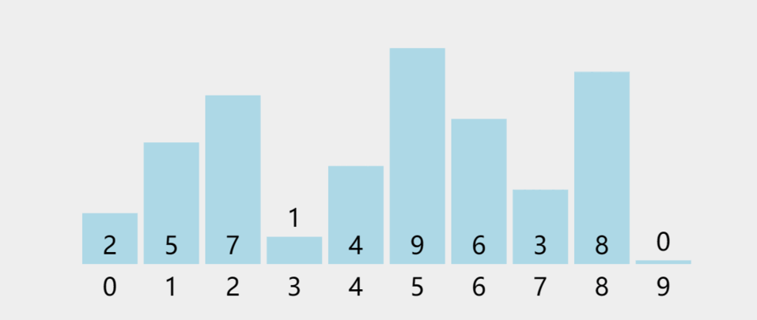

  > **注意快排代码：这里是low<high为的是找到low=high的点进行插入；而二分查找是low<=high是为了找到low=high+1的low点进行插入，注意区分**

  ```c
  //快速排序（王）
  int partition(rectype r[],int low,int high){
  	int pivot=r[low].key;   //pivot是基准、枢轴的意思，这里每次让第一个元素作为基准
  	while(low<high){   //找出low=high的枢轴位置
          //从high先还是low先都是一样的，这边是以high先走
  		while(low<high && r[high].key>=pivot)//找出比基准小的high
  			high--;
  		r[low].key=r[high].key;  //比枢轴小的值移到枢轴左边
  		while(low<high && r[low].key<=pivot)//比low基准大时不成立
  			low++;  
  		r[high].key=r[low].key;  //比枢轴大的值移到枢轴右边
  	}
  	r[low].key=pivot; //结束循环表示，low=high，此处就是枢轴的位置，这里也可以用high
  	return low;  //返回枢轴的下标
  }
  void quickSort(rectype r[],int low,int high){
  	if(low<high){    //递归退出的条件
  		int pivot=partition(r,low,high);  //这是枢轴的下标，进行划分
  		quickSort(r,low,pivot-1);  //对枢轴左侧快速排序
  		quickSort(r,pivot+1,high);  //对枢轴右侧快速排序
  	}
  }
  ```

> **特点**
>
> 1. **不稳定的**
> 2. 适用于顺序结构
> 3. **适用于初始记录无序，记录较多的情况**
>
> 
>
> 代码（**快速排序是递归的**）：重要
>
> **空间复杂度：最好O（log2n）；最坏O（n）**。其中**n为递归层数**。
>
> **时间：O（nlog2n)**
>
> **最坏O（n^2）**
>
> > 与希尔排序O（n*log2（n））的比较：当n>2.5时，快排优势，小于时，希尔优势
>
> 优化：每次选的枢轴尽量可以划分均匀的两部分
>
> 1. 选头、中、尾三个数据元素，选中间值作为枢轴元素
> 2. 随机选一个元素作为枢轴元素
>
> ```c
> //快速排序（优化）--选择mid作为基准
> void quickSort2(rectype r[],int low,int high){
> 	int mid,pivot;
> 	mid=(low+high)/2;
> 	if(low<high){
> 		if(mid!=low)//若基准不是区间中的第一个元素，将其与第一个元素交换
> 			swap(r[mid].key,r[low].key); //可能是懒得搞了，把基准放去low的位置，统一操作 
> 		pivot=partition(r,low,high);
> 		quickSort2(r,low,pivot-1);
> 		quickSort2(r,pivot+1,high);
> 	}
> }
> ```

## 选择排序

> **每一趟从待排序元素中选出关键字最小（最大）的元素，放在子表最后，直至完成**

### 简单选择（直接选择）排序

> 分为有序区与无序区，有点类似冒泡

```c
//简单排序（王）
void swap(int &a,int &b){
	int temp=a;
	a=b;
	b=temp;
}
void eazySort(rectype r[],int n){
	int k,min;
	for(int i=0;i<n-1;i++){
		min=i;
		for(k=i+1;k<n;k++)
			if(r[k].key<r[min].key)
				min=k;
		if(min!=i)  //表示不是原地交换
			swap(r[min].key,r[i].key);
	}
}
```

> **特点**
>
> 1. 不稳定
> 2. 可用于链式存储结构
> 3. 移动记录次数较少，当每一块记录占用的空间较多时，此方法比直接插入排序快
>
> **O(n^2)**

### 堆排序

**堆排序是一种树形选择排序方法**

> **特点**
>
> 1. 不稳定排序
> 2. 只能用于顺序结构，不能用于链式结构
> 3. **最坏时间复杂度是O（nlog2n），当记录较多时较为高效。空间复杂度为O（1）**
>
> 堆是一颗完全二叉树，采用数组顺序存储，有大小根堆之分
>
> 堆**又叫优先级队列**
>
> **树中所有非终端结点的值均不大于（或均不小于）其左、右孩子结点的值**
>
> 优先级队列是完全⼆叉树 + 堆的规则（⼤⼩根堆）
>
> 左孩子2i，右孩子2i+1
>
> 父结点i/2(下取整)

- 实现大根堆的算法（下标从1开始）

  ```c
  //大根堆排序
  //筛选函数，选出最大的上浮，小元素下坠
  void sift(rectype r[],int i,int len){ 
  	//left是左孩子,i是根，len是多少个数据
  	r[0]=r[i];   //将0腾出，暂存数据
  	for(int left=2*i;left<=len;left*=2){
  		if(left<len && r[left].key<r[left+1].key)  //选出左右孩子最大的一个
  			left++;  //右孩子更大，将left指向右孩子
  		if(r[0].key<r[left].key){  //左孩子比根大
  			r[i]=r[left];  //将左孩子挪到根上
  			i=left;
  		}
  		else  //根比左右孩子都大
  			break;
  	}
  	r[i]=r[0];
  }
  //建立大根堆的方式：从最后一个分支结点开始，大的上浮，小的筛下去
  void createHeap(rectype r[],int n){
  	for(int i=n/2;i>=1;i--)
  		sift(r,i,n);
  }
  ```

- 实现对大根堆排序的算法

  ```c
  //堆排序的建立，每次根（最大的）和最后一个元素交换，这样每次选出最大的放末尾，就形成了升序
  void heapSort(rectype r[],int n){
  	createHeap(r,n);
  	for(int i=n;i>=2;i--){  //进行n-1躺堆排序，每一趟堆中元素个数减1
  		swap(r[1].key,r[i].key);  //将最后一个元素和根交换
  		sift(r,1,i-1);
  	}
  }
  ```

> **大根堆进行堆排序后产生的是降序序列，小根堆进行堆排序后产生的是升序序列**
>
> - 小根堆只需改动sift即可
>
>   ```c
>    void sift2(rectype r[],int i,int len){ 
>   	r[0]=r[i];   
>   ```
>
>  	for(int j=2*i;j<=len;j*=2){
>  		if(j<len && r[j].key>r[j+1].key)  //如果右孩子更小
>  			j++;   //也就只需改动两个if的大于小于号即可
>  		if(r[0].key>r[j].key){  
>  			r[i]=r[j];  
>  			i=j;
>  		}
>  		else 
>  			break;
>  	}
>  	r[i]=r[0];
>
>   }
>
>   ```
> 
>   ```

- 下标从0开始的大根堆排序

  ```c
   void sift3(int* nums,int i,int len){
  	 int temp=nums[i];  //nums[0]=nums[i]
  	 for(int child=i*2+1;child<len;child=i*2+1){  //child=i*2;child<=len;chile*=2)
  	     if(child<len-1 && nums[child]<nums[child+1])  //child<len
  	        child++;
  	    if(temp>nums[child])  //nums[0]>=nums[left]
  	        break;
  	    else{
              nums[i]=nums[child];
              i=child;
          }
  	 }
  	 nums[i]=temp;  //=nums[0]
  }
  void heapsort(int* nums,int n){
       for(int i=n/2-1;i>=0;i--)  //i=n/2,i>=1
          sift3(nums,i,n);
      for(int i=n-1;i>=1;i--){  //i=n;i>=2
          int temp=nums[0];   //0都是1
          nums[0]=nums[i];
          nums[i]=temp;
          sift3(nums,0,i);  //sift3(nums,1,i-1)
      }
   }
  ```

- 堆中插入新元素：对于小根堆，新元素放到表尾，与其父结点比较，小则一路上升，直至无法上升为止

- 堆中删除元素：被删除的元素用堆底元素替代，让该元素不断下坠

  > 只有一个孩子下坠：只用对比一次关键字
  >
  > 两个孩子下坠：对比两次关键字

> **运用“筛选法”对序列进行堆排序输出排序序列**
>
> 1. **输出根节点，同时删除**
> 2. **将堆最后一个元素替换根的位置，进行堆的调整**
> 3. 重复1-2直至空堆

## 归并排序

​	**归并排序是多次将两个或两个以上的有序表合成一个新的有序表的过程**。一般内排序都是用的二路归并排序，即二路归并；而外排序才是k路归并排序

- 算法思想

  将两个有序表放在同一个数组相邻的位置，并将他们放在一个暂时数组中，待合并后移回原数组去

- 递归实现（自顶向下）

  ```c
  //二路归并排序（递归式）
  void merge(rectype r[],int low,int mid,int high){
  	rectype* r1;  //辅助变量进行排序
  	int i=low,j=mid+1,k;  //i是第一段，j是第二段，k表示r的位置
  	r1=(rectype*)malloc((high-low+1)*sizeof(rectype)); //分配和r一样的空间
  	for(k=low;k<=high;k++)  //先将第一段和第二段都移去r1
  		r1[k].key=r[k].key;  
  	for(k=i;i<=mid&&j<=high;k++){
  		if(r1[i].key<=r1[j].key)
  			r[k].key=r1[i++].key;
  		else
  			r[k].key=r1[j++].key;
  	}
  	//当其中一段完了另一段没完时
  	while(i<=mid)
  		r[k++].key=r1[i++].key;
  	while(j<=high)
  		r[k++].key=r1[j++].key;
  	free(r1);
  }
  void mergeSort(rectype r[],int low,int high){
  	if(low<high){  //low=high表示就剩一个元素了？
  		int mid=(low+high)/2;  //中间划分，分别对两边递归的归并排序
  		mergeSort(r,low,mid);
  		mergeSort(r,mid+1,high);
  		merge(r,low,mid,high);  //再对上面两个归并
  	}
  }
  ```

- 非递归式，自底向上（不重要）

  ```c
  //非递归式
  void MergePass(rectype R[],int length,int n)	//对整个数序进行一趟归并
  {
  	int i;
  	for (i=0;i+2*length-1<n;i=i+2*length) 	//归并length长的两相邻子表
  		merge(R,i,i+length-1,i+2*length-1);
  	if (i+length-1<n-1)                		//余下两个子表,后者长度小于length
  		merge(R,i,i+length-1,n-1);  		//归并这两个子表
  }
  void MergeSort(rectype R[],int n)			//自底向上的二路归并算法
  {
  	int length;
  	for (length=1;length<n;length=2*length)//进行log2n趟归并
  		MergePass(R,length,n);
  }
  ```

> **特点**
>
> 1. **稳定排序**
> 2. 可用于链式结构，且不需要附加存储空间，但递归实现时人需要开辟相应的递归工作栈
>
> **时间：O（nlog2n）**
>
> **空间：O（n），因为需要和待排序记录个数相等的辅助存储空间**

## 基数排序

基数排序是一种不需要进行关键字比较的，借助于多关键字排序的思想对单关键字排序的方法

​	一般元素R【i】的关键字有**d位数字（或字符）组成**，其中每一位的值都在0-r的范围内，r要取最大的值，**其中r成为基数（index）**

​	基数排序有两种，即最低位优先（least significant digit first，**LSD**）和最高位优先（most significant digit first，MSD）

- 分配：开始时，把Q，Q·····Q各个队列置成空队列，然后依次考查线性表中的每一个元素aj（j＝0，1，···，n—1），如果元素aj的关键字k｝＝k，就把元素a，插入到Q，队列中。
- 收集：将Q，Q1，···，Q—1各个队列中的元素依次首尾相接，得到新的元素序列，从而组成新的线性表。

> 例如对整数序列递增排序，由于个位数的重要性低于十位数，十位数的重要性低于百位数，一般越重要的位越放在后面排序，个位数属于最低位，所以对整数序列递增排序时应该采用最低位优先排序方法。
>
> 算法不考
>
> **时间：O（d（n+r））**
>
> **空间：O（r）**
>
> **稳定**
>
> 擅长处理：
>
> - 关键字可以方便地拆分位d组，且d较小
> - r较小
> - 元素个数n较大

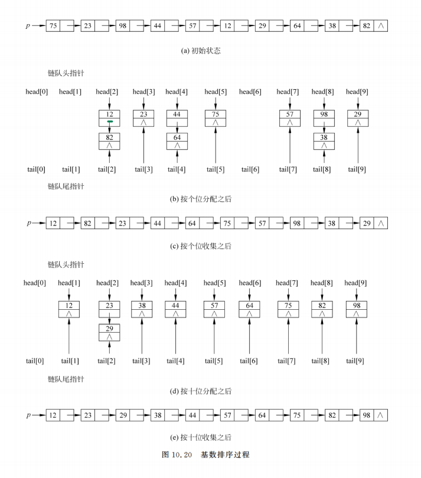

> 按个位收集之后，形成了个位的升序序列
>
> 按十位手机之后形成了十位的升序序列，如果十位相同，则按个位的升序序列，得到最终的排序结果

## 各排序的比较

| 排序方法     | 平均时间复杂度              | 空间                 | 稳定性   |
| ------------ | --------------------------- | -------------------- | -------- |
| **直接插入** | O（n^2）                    | O（1）               | 稳定     |
| 折半插入     | O（n^2）                    | O（1）               | 稳定     |
| **希尔**     | **O（n^1.3)**               | O（1）               | 不稳定   |
| 冒泡         | O（n^2）                    | O（1）               | 稳定     |
| **快速**     | **O（nlog2n）最坏O（n^2）** | O（log2n）最坏O（n） | 不稳定   |
| 简单选择     | O（n^2）                    | O（1）               | 不稳定   |
| **堆**       | **O（nlog2n）**             | O（1）               | 不稳定   |
| **二路归并** | **O（nlog2n）**             | O（n）               | 稳定     |
| 基数         | O（d（n+r））               | O（r）               | **稳定** |

> **稳定的优先选：直插、冒泡、归并**
>
> **不稳定的优先选：快速、希尔、堆**

【例10.9】设线性表中每个元素有两个数据项k1和k2，现对线性表按以下规则进行排序：先看数据项k1，k1值小的在前，大的在后；在k1值相同的情况下再看k2，k2值小的在前，大的在后。满足这种要求的排序方法是：

（1）先按k1值进行直接插入排序，再按k2值进行简单选择排序。

（2）先按k2值进行直接插入排序，再按k1值进行简单选择排序。（3）先按k1值进行简单选择排序，再按k2值进行直接插入排序。（4）先按k2值进行简单选择排序，再按k1值进行直接插入排序。

> 解这里是按两个关键字排序，**越重要的关键字越在后面排序，所以应先按k2值排序再按k1值排序**。因为他要使k1稳定，所有最后一步操作应该是稳定的排序

- 灵活采取排序
  - （1）**若n较小（如n≤50），可采用直接插入**或简单选择排序。一般地，这两种排序方法中，直接插入排序较好，但简单选择排序移动的元素数少于直接插入排序。
  - （2）若文件初始状态**基本有序（指正序），则选用直接插入或冒泡排序为宜。**
  - （3）若**n较大**，应采用时间复杂度为O（nlog2n）的排序方法，例如**快速排序、堆排序或二路归并**排序。快速排序是目前基于比较的内排序中被认为是较好的方法，当待排序的关键字是随机分布时，快速排序的平均时间最少；但堆排序所需的辅助空间少于快速排序，并且不会出现快速排序可能出现的最坏情况。这两种排序都是不稳定的，若要求排序稳定，则可选用二路归并排序。
  - （4）若需要将两个有序表合并成一个新的有序表，最好用二路归并排序方法。
  - （5）基数排序可能在O（n）时间内完成对n个元素的排序。但遗憾的是，基数排序只适用于像字符串和整数这类有明显结构特征的关键字，而当关键字的取值范围属于某个无穷集合（例如实数型关键字）时无法使用基数排序，这时只有借助于“比较”的方法来排序。由此可知，若n很大，元素的关键字位数较少且可以分解时采用基数排序较好。

